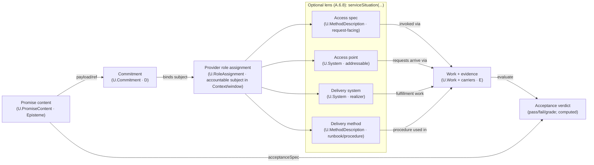

  **A.1 Holonic Foundation** (role/mereology split), **A.7 Strict Distinction** (role ≠ behaviour; episteme ≠ carrier), **A.14 Advanced Mereology** (no roles in holarchies).  
* **Specialises / Coordinates with:**
  **A.13 Agential Role & Agency Spectrum** (behavioural roles over systems; graded agency), **A.15 Role–Method–Work Alignment** (bindsMethod / isExecutionOf discipline). 
* **Constrains / Used by B‑cluster:**
  **B.1 Universal Algebra of Aggregation (Γ)** (keep order/time in Γ\_ctx/Γ\_time; keep provenance in Γ\_epist), **B.2 Meta‑Holon Transition** (promotion when supervision/closure appears), **B.3 Trust & Assurance** (evidence & congruence).  
* **Interlocks with E‑cluster (governance & language):**
  **E.10 Lexical Discipline** (registers, tier disambiguation, local aliases like “Transformer”), **E.5.1 DevOps Lexical Firewall** (ban tooling tokens in Core patterns). 
* **Reinforces:**
  **A.10 Evidence Graph Referring** (external transformer; SCR/RSCR), **A.12 External Transformer Principle** (agent externalisation). 

### A.2:End
  
## A.2.1 - U.RoleAssignment: Contextual Role Assignment

> **Type:** Definitional (D)
> **Status:** Stable
> **Normativity:** Normative

*with `Role Performance View`, `U.RoleStateGraph (RSG)`, and `Role Characterisation Space (RCS)` hooks*

**Builds on:** A.1 **Holonic Foundation**, A.1.1 **`U.BoundedContext`**, A.2 **Role Taxonomy**.  
**Coordinates with:** A.13 **Agential Role & Agency Spectrum**, A.15 **Role–Method–Work Alignment**, E.10.D1 **D.CTX (Context discipline)**, E.10.D2 **Strict Distinction**.  
**Lexical discipline.** *Context* ≡ `U.BoundedContext` (E.10.D1). *Appointment* is **colloquial only**; the canonical term in this specification is **Role Assignment** (see **CC‑LX‑1**).

**Mint vs reuse.** This pattern defines `U.RoleAssignment` and `U.RoleEnactment` and introduces the labels `Role Characterisation Space (RCS)` and `Role State Graph (RSG)` as intensional facets recorded in `RoleDescription` / `RoleSpec`. It reuses existing kernel terms (`U.Holon`, `U.System`, `U.Episteme`, `U.BoundedContext`, `U.Work`, `U.Method`) without changing their meanings.

### A.2.1:1 - Problem frame

**Intent.** Provide one, universal, **context‑local** way to say *who is being what, where (and when)* without altering what the thing **is**. The same grammar works for people, machines, software, teams, and **also** for knowledge artefacts (epistemes) when they hold **statuses** rather than perform actions.

**Scope.**

* Defines **`U.RoleAssignment`** (binding a **holder** holon to a **role** inside a **bounded context**, optionally within a **time window**).
* Separates that binding from **`U.RoleEnactment`** (the run‑time fact that a piece of **Work** was performed under that assignment).
* Names the **Role Characterisation Space (RCS)** and the **Role State Graph (RSG)** as **intensional** facets of a Role (recorded in its `RoleDescription`, upgraded to `RoleSpec` only after tests exist).
* Declares **eligibility** constraints so Roles apply to the right holon kinds, **without badge‑of‑badge chains** like “TransformerRole is assigned to be AgentRole”. If your Context wants taxonomic inheritance between role names, express it with in‑Context role algebra (`≤`), not via chained assignments.
* Declares **eligibility** constraints so Roles apply to the right holon kinds, **without badge‑of‑badge chains** like “TransformerRole is assigned to be AgentRole”. If a Context intends taxonomic inheritance between role names, that relation is expressed in‑Context via role algebra (`≤`), not via chained assignments.

**Non‑goals.** No storage models, no workflows, no org charts. This is a **thinking Standard**; all semantics are notation‑free.


### A.2.1:2 - Problem

1. **Type explosion.** Baking transient function into rigid types (“CoolingPump”, “AuditDeveloper”) violates parsimony and makes change brittle.
2. **Context drift.** Labels like *Operator*, *Process Owner*, *Standard* slide in meaning across teams/years when not tied to a **Context**.
3. **Actor vagueness.** Work logs state that things happened but not **who, in what capacity**, under which **local rules**.
4. **Category leaks.** Documents “do” tasks; deontic statuses are treated like run‑time states; capabilities are confused with permissions.
5. **Role chains.** Attempting “System ↦ TransformerRole ↦ AgentRole” hides intent and smuggles taxonomy into the data plane.


### A.2.1:3 - Forces

| Force                            | Resolution in this pattern                                                                                                        |
| -------------------------------- | --------------------------------------------------------------------------------------------------------------------------------- |
| **Universality vs locality**     | One mechanism (`U.RoleAssignment`), but every meaning is **context‑local** (Context); cross‑context sameness only via **Bridge** (F.9). |
| **Stability vs change**          | **Identity of holder** stable; **assignments** come/go via windows; **enactments** are punctual facts attached to Work.           |
| **Clarity vs brevity**           | Full definition + the mnemonic shorthand `Holder#Role:Context@Window`.                                                            |
| **Behavior vs status**           | **Only systems enact behavior**; epistemes **hold statuses**. Keep role taxonomies explicit; never chain assignments.             |
| **Specification vs description** | Role **RCS/RSG** are recorded in **RoleDescription**; upgrade to **RoleSpec** only after a test harness exists (E.10.D2).         |


### A.2.1:4 - Solution

#### A.2.1:4.1 - Canonical definition (notation‑free)

**`U.RoleAssignment`** is a **context-local assignment:

```
RoleAssignment ::=
  〈holder: U.Holon,
   role: U.Role,
   context: U.BoundedContext,
   window?: U.Window,
   justification?: U.Episteme,
   provenance?: U.Method〉
```

**Admissibility constraints (concept‑level; non‑deontic).**

* **Invariant RA‑1 (Locality).** `role ∈ Roles(context)`. The role’s meaning is exactly the one recorded in that Context’s RoleDescription/RoleSpec.
* **Invariant RA‑2 (No role‑of‑role).** `holder : U.Holon` and `holder ∉ {U.Role, U.RoleAssignment}`. (Roles/assignments are never holders.)
* **Invariant RA‑3 (Eligibility by role kind).**
  * **Behavioural roles** (agential/transformer/observer/speech and their refinements): `holder` is a `U.System`. Only systems can enact Methods and produce Work.
  * **Status roles** (epistemic‑status / normative‑status / service‑governance): `holder` is a `U.Episteme`. Epistemes never enact Work; they gate and justify.
  * Context refinements may tighten eligibility (e.g., “Approver must be human”) but are restrictions of the System/Episteme split (they do not weaken it).
* **Invariant RA‑4 (Window discipline).** If `window` is present, enactments occur within it. If `window` is absent, interpret the assignment as open‑ended **from an assignment time that is still traceable** (e.g., via an issuing `U.RoleAssigning` SpeechAct Work or other evidence).
* **Invariant RA‑5 (Separation).** A RoleAssignment confers **the capacity/authorization to act** (or the status to be recognised), but it is **not behaviour** (no Work implied), **not capability** (intrinsic ability lives elsewhere), and **not structure** (it does not participate in BoM / part‑of structure).

**Governance metadata (optional but first‑class when present).**

* `justification` carries *why* the assignment is valid in this Context (policy, standard, evidence Episteme).
* `provenance` carries *how* the assignment was issued or verified (method reference; may link to a `U.RoleAssigning` work step in the evidence graph).

**Didactic read.** Think **badge** (*who wears which mask, where, when*). The rules for the mask live **in the room** (Context).

**Two assignment modes.**
A RoleAssignment can be:
(a) Authoritative — issued by an authority or policy in the Context (often via a `U.RoleAssigning` SpeechAct Work); it can open a Green‑Gate for steps that require explicit authorization.
(b) Observational — an evidence‑backed classification that the holder occupies a Role in this Context (e.g., “Moon as SatelliteRole:IAU_2006”). Observational assignments never by themselves open operational Green‑Gates; they can gate decisions and analysis.

#### A.2.1:4.2 - Role Enactment (distinct from the assignment)

**`U.RoleEnactment`** captures the *run‑time* fact that **a specific piece of Work** was performed under **a specific Role Assignment**:

```
RoleEnactment ::= 〈work: U.Work, by: U.RoleAssignment〉
```

**Admissibility constraints (concept‑level; non‑deontic).**

* **Invariant RE‑1 (Actor reality).** `by.holder : U.System`. (Epistemes never enact Work.)
* **Invariant RE‑2 (Temporal fit).** `work.window` overlaps `by.window` (or `by.window` is open and contains `work.window`).
* **Invariant RE‑3 (Method gate).** For the `MethodStep` realised by `work`, `by.role` satisfies the step’s `requiredRoles` in that **same Context** (directly or via `≤` specialization inside the Context).
* **Invariant RE‑4 (Traceability shape).** `U.Work` records cite the performer as `performedBy = some U.RoleAssignment`. `U.RoleEnactment` is the conceptual (or derived) association `〈work, work.performedBy〉`; if a system persists it explicitly, it is 1:1 with Work.

*Reading:* **Assignments authorize; enactments happen.** That single sentence prevents months of muddled logs.

Role Enactment is the occurrence of `U.Work` performed by a `holder` while a valid `U.RoleAssignment` for the required Role is in an enactable state of its RoleStateGraph (A.2.5) within the same Context. Enactment is generic: it includes operational work (e.g., actuation) and communicative work (speech acts such as approvals).

#### A.2.1:4.3 - Role Characterisation Space (RCS) & Role State Graph (RSG)

These are **intensional facets** of a **Role**, not containers “inside” the Role. They are **recorded in** the **RoleDescription** (or **RoleSpec** once harnessed), per E.10.D2.

* **RCS (Role Characterisation Space).** A set of named characteristics that parameterise how the Role is understood in a Context (e.g., *AgencyLevel ∈ {None, Assisted, Delegated, Autonomous}*; *SafetyCriticality ∈ {SC0…SC3}*).
* **RSG (Role State Graph).** A directed graph of **named states** (nodes) and **admissible transitions** (edges) for the Role **within the Context** (e.g., *{Eligible → Authorized → Active → Suspended → Revoked}*).

  * Each **state** has a **Conformance Checklist** (set of observable cues) supporting **Evaluations** (“X ∈ *Authorized*@context in W”).
  * RSG governs **role state transitions**, independent of any Work instance.

**Discipline.** Prefer the phrasing *“Role is **characterised by** RCS/RSG recorded in RoleDescription”*; avoid “Role **contains** its states.”


#### A.2.1:4.4 - Shorthand & reading

The canonical compact form used in prose and diagrams is:

```
Holder#Role:Context@Window
```

Examples:

* `PLC_17#Transformer:PipelineOps@2025‑04‑01..2025‑06‑30`
* `ISO_26262v2018#NormativeStandard:AutoSafetyCase` *(status role on an Episteme; no enactment)*

*The shorthand is didactic; the semantics are those of §§4.1–4.3.*


#### A.2.1:4.5 - No role chains (use algebra, not badge‑of‑badge)

Chained assignments are ill‑formed for encoding taxonomy (see **Invariant RA‑2** and **CC‑ELIG‑3**). Chaining hides intent and defeats validation.

Taxonomic inheritance between role names is declared explicitly in the Context’s role algebra. For example, if (per A.13) your Context treats every transformer as a kind of agent, state:

* `TransformerRole ≤ AgentialRole` *(in that Context’s role algebra)*

When a MethodStep requires two independent roles, express the conjunction where it belongs:

* the **MethodStep** requires both roles; the holder **wears two badges**, not a badge‑of‑a‑badge.

#### A.2.1:4.6 - Eligibility across holon kinds (normative matrix)

A Role’s **family** constrains **who can wear its badge**. Eligibility is part of **didactic hygiene** and prevents chains like “Transformer → Agent”.

##### A.2.1:4.6.1 - Holder kinds (recap)

* **`U.System`** — any acting holon (person, device, software service, team, organization, socio‑technical unit).
* **`U.Episteme`** — any knowledge unit (document, dataset, model, standard, Standard).
* **`U.Holon`** — supertype; only **Systems** enact Work; **Epistemes** can only hold **status** roles.

##### A.2.1:4.6.2 - Role‑kind × holder matrix

| Role kind (examples)                                                     | May be held by `U.System` | May be held by `U.Episteme` | Notes (eligibility refinements live in Context)                                                                                |
| ------------------------------------------------------------------------ | :-----------------------: | :-------------------------: | ------------------------------------------------------------------------------------------------------------------------------ |
| **Agential** (e.g., *Agent*, *Decision‑Maker*, *Approver*)               |           **✓**           |              ✗              | Requires an RCS characteristic such as *AgencyLevel*; RSG should expose *Authorized/Active* states.                            |
| **Transformer/Constructor** (e.g., *Welder*, *ETL‑Runner*)               |           **✓**           |              ✗              | Performs Methods; produces Work; often requires *Capability* evidence.                                                         |
| **Observer/Measurer** (e.g., *Observer*, *Monitor*)                      |           **✓**           |              ✗              | Produces `U.Observation`; may be passive (probe) or active (test rig).                                                         |
| **Communicator/Speech** (e.g., *Authorizer*, *Notifier*)                 |           **✓**           |              ✗              | A behavioural role; produces `U.Work` typed as SpeechAct.                                                                      |
| **Service‑Governance** (e.g., *ServiceOffering*, *SLO‑ClauseCarrier*)    |             ✗             |            **✓**            | **Episteme** (catalog entry, policy). If a System “offers”, the *offer* is a SpeechAct; the *offering* is an Episteme.         |
| **Epistemic‑Status** (e.g., *Evidence*, *Definition*, *AxiomaticCore*)   |             ✗             |            **✓**            | Status roles for knowledge; never enact Work.                                                                                  |
| **Normative‑Status / Deontic** (e.g., *Requirement*, *Standard*)         |             ✗             |            **✓**            | Source of obligations; Work is checked **against** them, not enacted by them.                                                  |

**Invariant — RA‑3 (eligibility)** *(restated)*: RoleAssignments are ill‑formed if they violate this matrix. A Context may **tighten** (e.g., “Approver must be human”), never loosen.

**Conformance checks (easy to remember).**

* **CC‑ELIG‑1.** If `role.family ∈ {Agential, Transformer, Observer, Speech}`, then `holder : U.System`.
* **CC‑ELIG‑2.** If `role.family ∈ {Epistemic‑Status, Normative‑Status, Service‑Governance}`, then `holder : U.Episteme`.
* **CC‑ELIG‑3.** No “role of a role”: `role` is bound to a **holder**, not to another role or assignment.


#### A.2.1:4.7 - Role algebra within a single Context (meaning relations)

Role algebra 

The in‑Context role algebra relates **role types** inside **one** `U.BoundedContext`. It is **not** mereology. Its operators (`≤`, `⊥`, `⊗`) is specified normatively in **A.2.7 `U.RoleAlgebra`**.

A.2.1 relies on it for (i) `requiredRoles` substitution checks (`≤`), (ii) separation‑of‑duties validation (`⊥`), and (iii) conjunctive bundles (`⊗`), but does not restate the operator semantics here.

#### A.2.1:4.8 - Time & state transition calculus (windows, RSG, enactability)

**Assignments authorize**, **enactments happen** — in time. RSG governs the **role’s** state transitions; `window` governs the **binding’s** validity.

##### A.2.1:4.8.1 - Windows and overlap

* **Window form:** `@t_start..t_end` (ends may be open).
* **RE‑2 (temporal fit)** *(restated)*: `work.window` lies within (or overlaps appropriately with) `assignment.window`.
* **Handover pattern:** Close `A#Role@..t` and open `B#Role@t..` — history is preserved by closing windows rather than deletion.
* **(Conformance hook.)** See **CC‑WIN‑1**: preserve history by closing windows rather than erasing RoleAssignments.

##### A.2.1:4.8.2 - RSG gating of enactment

Each Role’s **RoleDescription/RoleSpec** defines an **RSG** with named states; some states are **enactable**.

* **Delegation.** Normative author‑facing requirements for `U.RoleStateGraph` structure (including enactability marking and per‑state checklists) and the shape of `StateAssertion` evidence are defined in **A.2.5**; A.2.1 only relies on the resulting enactment gate.
* **Invariant RE‑5 (RSG gate).** A `U.RoleEnactment` is valid **iff** at enactment time the `U.RoleAssignment` can be supported by a **valid StateAssertion** that the holder is in an **enactable** state of the Role’s RSG **in this Context**.
* **(A.2.5 hook.)** The Role’s `U.RoleStateGraph` (A.2.5) identifies enactable states and attaches a Conformance Checklist to each state; checklist verdicts can be recorded as `StateAssertion`s (see SCR‑A2.5‑S02/S03).
* **Example.** *SurgeonRole* states: *Eligible → Authorized → Active → Suspended → Revoked*. Only **Active** is enactable. A pre‑op checklist produces `StateAssertion(SurgeonRole, Active)`.

**Practical reading.** *Badge valid* (window) ∧ *state is right* (RSG) ⇒ you may act.

##### A.2.1:4.8.3 - Suspensions, revocations, probation

* **Suspend:** transition to a **non‑enactable** state (e.g., *Suspended*). Keep the assignment’s window open; enactment is blocked by **RE‑5**.
* **Revoke:** either (a) close the window, or (b) transition to *Revoked* (non‑enactable).
* **Probation:** a dedicated RSG state with limited enactability (e.g., only under supervision, modelled as an extra required role on Method steps).
* **Discipline (A.2.5).** RSG transitions are explicit; no implicit “back to Active”.

##### A.2.1:4.8.4 - Typical temporal patterns (didactic)

* **Shift rotation.** `A#Role@08:00..16:00`, `B#Role@16:00..24:00` — clean handover, no `⊥` issues.
* **Shadowing.** `Trainee#Role@..` + `Mentor#SupervisorRole@..`; Method steps require **both** roles.
* **Emergency bundle.** `SoloOperator := Incision ⊗ Hemostasis ⊗ Suturing`; activate only under declared emergency (Context‑level policy).

#### A.2.1:4.9 - Integration with A.15 (Role–Method–Work alignment)

> **One line.** A `U.MethodDescription` names the roles it needs; a `U.Work` cites the concrete `U.RoleAssignment` that enacted the step; the RSG state + window gates that enactment.

##### A.2.1:4.9.1 - Design‑time Standard (inside `U.MethodDescription`)

For every **MethodStep**:

* **`requiredRoles`** — a list of `U.Role` **from the same Context as the step**.
  *Example.* In `Hospital.OR_2025`, step “Make incision” has `requires: [IncisionOperatorRole]`.
* Role algebra in‑Context applies: if the Context defines `IncisionOperatorRole ≤ SurgeonRole`, then `requires: [SurgeonRole]` also admits holders of `IncisionOperatorRole`.
* **Separation of concerns.** Capability checks (does the holder *can*?) belong to `U.Capability` and resource limits; **authorization** belongs to `U.RoleAssignment` + RSG.

##### A.2.1:4.9.2 - Run‑time check (inside `U.Work`)

A `U.Work` record provides (or allows derivation of) the fields needed to satisfy **CC‑ENACT‑1..3**:

* **`performedBy` =** a concrete **`U.RoleAssignment`** (not just a person/system name).
* **Window gate.** The Work timestamp falls inside the assignment’s `@Window`.
* **State gate.** At that timestamp, an **enactable** state for the assignment is proven by a **`StateAssertion`** (the checklist verdict for a named RSG state).
* **Role algebra gate.** The assignment’s `role` is either one of `requiredRoles` or a **specialization (`≤`)** thereof; bundles (`⊗`) expand to conjunctions; incompatibilities (`⊥`) forbid overlaps on the same holder.

##### A.2.1:4.9.3 - Evaluation & acceptance (link to services & deontics)

* **Observation.** The Work produces `U.Observation`(s).
* **Evaluation.** A `U.Evaluation` compares Observations with **AcceptanceClause**(s) referenced by a **promise content clause** (`U.PromiseContent`) or a **RequirementRole**.
* **SoD hook.** If the step or evaluation demands independence (e.g., “not performed by its reviewer”), enforce via `⊥` between `PerformerRole` and `ReviewerRole` **in the same Context**.

##### A.2.1:4.9.4 - Planning & scheduling (design‑time “who will enact”)

* **`U.WorkPlan`** (aka “WorkDescription” in prose) binds forthcoming steps to **candidate RoleAssignments** and time windows.
* **Checks before the fact.** Validate windows (no gaps/overlaps where disallowed), enforce `⊥`, ensure expected RSG state will be **enactable** at scheduled time (or flag a pre‑flight checklist).

> **Didactic cue.** Think **“Step asks for badges; Run cites a badge; Badge must be valid & green.”**
> (Badge = RoleAssignment; valid = window; green = RSG state with a fresh StateAssertion.)

#### A.2.1:4.10 - Cross‑Context bridges in practice (with CL penalties)

Cross‑Context role substitution is **Bridge‑only** and is specified in **F.9** (with CL/waiver regimes) and **B.3** (CL‑penalty routing).

A.2.1’s only rule is *no substitution by label*: any “`Role_B@B` satisfies `Role_A@A`” claim used for checking or enactment **MUST** cite an explicit Bridge (direction, CL, loss notes) and **MUST NOT** override in‑Context `≤`, `⊥`, or `⊗`.

#### A.2.1:4.11 - Everyday pattern snippets (didactic moves)

> **Use these micro‑moves to think and speak cleanly; no tooling required.**

1. **“Who can do this step?”**
   On a `MethodStep`, write `requires: [RoleX]`. In your head, expand: “Any `performedBy` whose `role ≤ RoleX`, with a **valid window** and **enactable RSG state**.”
   *Example:* `requires: [SurgeonRole]` and `IncisionOperatorRole ≤ SurgeonRole` ⇒ `Dr.Kim#IncisionOperatorRole:Hospital.OR_2025` is admissible **iff** Active.

2. **Handover without history loss.**
   Close one window, open another. Never delete.
   `Alex#IncidentCommander:SRE_Prod@08:00..12:00`
   `Riya#IncidentCommander:SRE_Prod@12:00..20:00`

3. **Independence by construction (SoD).**
   Declare `Developer ⊥ IndependentAuditor`. Then it’s **impossible** (by validation) to have overlapping windows on one holder for both roles.

4. **Supervision as bundle.**
   Model apprenticeship by requiring `Trainee ⊗ Supervisor` on sensitive steps, or by RSG state **Probation** that flips `enactable` only if `SupervisorRole` is also present.

5. **Same badge name in two Contexts.**
   `LeadEngineer:ProjectPhoenix` ≠ `LeadEngineer:DivisionR&D`. If you must relate, create a **Bridge** with CL & loss notes; never rely on the name.

6. **Documents don’t act; they frame.**
   Replace “the SOP executed X” with: `SOP_v4#RequirementRole:SafetyCase` and a `SpeechAct` “approve run” by `QA_Officer#AuthorizerRole:Plant_2025`.

7. **Window + state ⇒ permission.**
   Quick mental check: *badge valid?* (window) ∧ *state OK?* (RSG) ⇒ **go**; else **no‑go**.

8. **Communicative enactment (approval)**
`CAB_Chair#ApproverRole:ChangeControl@2026-05-01T10:05` performs a SpeechAct Work “Approve Change-4711”. Effect: moves ApproverRole’s RSG state from Authorized?→Approved and
   opens the Green‑Gate for the operational step “Deploy Change-4711” (performed by a different RoleAssignment).

### A.2.1:5 - Archetypal Grounding (three disparate arenas)

**Goal.** Show that the same assignment **`Holder#Role:Context@Window`**, plus **RCS** (Role-Characterisation Space) and **RSG** (Role-State Graph), works uniformly for **operational systems**, **software/service operations**, and **knowledge governance**.

Natural systems note. Spontaneous physical phenomena (e.g., Moon orbiting Earth) are modeled as `U.Dynamics`, not as `U.Work`. An observational RoleAssignment like `Moon#SatelliteRole:IAU_2006` is valid classification but does not imply enactment of a method.

#### A.2.1:5.1 - Industrial operations (welding cell)

**Role (family).** `WelderRole` *(Transformer)*
\**RCS (illustrative characteristics).*

* `ProcessClass ∈ {MIG, TIG, Spot}`
* `QualifiedMaterial ∈ {Al, SS, Ti, …}`
* `MaxCurrentAmp ∈ ℝ⁺`
* `SafetyProfile ∈ {Standard, HotWork, ConfinedSpace}`

**RSG (named states).**
`Unqualified → Qualified → Authorized → Active → Suspended → Revoked`
(*enactable*: **Active** only)

**Assignments.**

* `Robot_SN789#WelderRole:AssemblyLine_2025@2025‑02‑01..open`
* `Robot_SN790#WelderRole:AssemblyLine_2025@2025‑02‑01..open`

**StateAssertions (via checklists).**

* `StateAssertion(WelderRole, Qualified, AssemblyLine_2025, @2025‑02‑01..2026‑02‑01)` — training & test weld coupons.
* `StateAssertion(WelderRole, Active, AssemblyLine_2025, @2025‑03‑01..open)` — daily pre‑shift checks + gas/torch inspection.

**Enactment (gated by RSG).**
A `U.Work` entry `W#Seam134` is valid only if `performedBy = Robot_SN789#WelderRole:AssemblyLine_2025` and an **Active** `StateAssertion` covers the timestamp. If the torch‑health checklist fails, RSG transitions `Active → Suspended`; further seams are blocked by **RE‑5**.


#### A.2.1:5.2 - Software & cloud operations (continuous delivery / SRE)

**Roles (families).**

* `DeployerRole` *(Transformer)* — authorises execution of deployment Methods.
* `IncidentCommanderRole` *(Agential/Speech)* — directs response and issues SpeechActs (declares incident states).

**RCS (illustrative).**

* `DeployerRole`: `Env ∈ {staging, prod}`, `ChangeWindow`, `RollbackAuthority ∈ {self, peer, CAB}`.
* `IncidentCommanderRole`: `OnCallTier ∈ {L1,L2,L3}`, `ServiceScope`, `PageDuty ∈ {primary, secondary}`.

**RSGs (named states).**

* `DeployerRole`: `Eligible → Authorized → Active → Suspended` (*enactable*: **Active**).
* `IncidentCommanderRole`: `OnCall → Engaged → Handover → Rest` (*enactable*: **Engaged**).

**Assignments.**

* `sCG‑Spec_ci_bot#DeployerRole:CD_Pipeline_v7@2025‑04‑01..open`
* `Alex#IncidentCommanderRole:SRE_Prod@2025‑04‑10T08:00..2025‑04‑10T20:00`

**StateAssertions (via checklists).**

* `DeployerRole/Active`: completed change ticket, green pre‑deploy tests, peer‑review check mark.
* `IncidentCommanderRole/Engaged`: accepted page, situational brief read, comms‑channel opened.

**Enactment.**

* A deployment `Work` is valid only with `performedBy: sCG‑Spec_ci_bot#DeployerRole:CD_Pipeline_v7` **and** `Active` state asserted for the moment of start.
* Declaring `Incident SEV‑1` is a **SpeechAct Work** performed by `Alex#IncidentCommanderRole:SRE_Prod` in **Engaged** state; it changes deontic conditions (e.g., elevates `RollbackAuthority`).


#### A.2.1:5.3 - Knowledge governance (standards & requirements)

**Roles (families).**

* `NormativeStandardRole` *(Normative‑Status Episteme)* — a document that is *the* standard **in this Context**.
* `RequirementRole` *(Deontic‑Status Episteme)* — a statement that **binds** behaviour in this Context.

**RCS (illustrative).**

* `NormativeStandardRole`: `Scope`, `Edition`, `ApplicabilityWindow`.
* `RequirementRole`: `BindingClass ∈ {shall, should, may}`, `TargetRole`, `AcceptanceClauseRef`.

**RSGs (named states).**

* `NormativeStandardRole`: `Proposed → Adopted → Effective → Superseded` (*enactable*: N/A — Episteme roles are **non‑enactable**; they gate others).
* `RequirementRole`: `Draft → Approved → Effective → Retired` (non‑enactable).

**Assignments.**

* `ISO_26262_ed2.pdf#NormativeStandardRole:AutoSafetyCase_2025@2025‑01‑01..open`
* `REQ‑BRAKE‑001.md#RequirementRole:AutoSafetyCase_2025@2025‑03‑05..open`

**Effects (gating, not acting).**

* A system’s **Work** (e.g., HIL test run) is **evaluated** against clauses referenced by `RequirementRole`.
* An **Approval SpeechAct** (by a CAB chair who is a `U.System`) may transition `RequirementRole: Draft → Approved`. The Episteme does not “act”; **Systems** act, **Epistemes** hold status.

### A.2.1:6 - Bias-Annotation

Lenses tested: **Arch**, **Onto/Epist**, **Socio‑tech**, **Prag**, **Did**. Scope: **Kernel** (A‑cluster).

* **Architecture bias (Arch):** treating roles/assignments as structural parts can smuggle function into mereology and break holarchies.  
  *Mitigation:* keep roles out of BoM/structure trees; close windows instead of deleting history.

* **Onto/Epist bias (Onto/Epist):** anthropomorphising epistemes collapses evidence into agency (“the SOP approved”).  
  *Mitigation:* only Systems enact Work; Epistemes may justify, constrain, and gate; enforce RE‑1 and CC‑SD‑2.

* **Socio‑technical bias (Socio‑tech):** role eligibility rules can silently encode exclusion, power asymmetries, or discrimination (e.g., “Approver must be X” with no rationale).  
  *Mitigation:* keep eligibility refinements explicit in the Context, recorded as Episteme policy, and review them under D.2/D.* ethics patterns; prefer capability/competence evidence over demographic proxies.

* **Pragmatic bias (Prag):** over‑localising role labels can fragment reuse and create naming drift.  
  *Mitigation:* require explicit `:Context` binding and explicit Bridges with CL/loss notes instead of silent equivalence.

* **Didactic bias (Did):** metaphors (“badge”, “mask”, “green gate”) may be misread as informal or security‑only.  
  *Mitigation:* bind obligations to the Conformance Checklist; keep metaphors as mnemonic only.

### A.2.1:7 - Conformance Checklist (normative)

#### A.2.1:7.1 - SCR (compact, memorable)

> **Pass these and your RoleAssignments are sound.**

**Anchoring & locality**

1. **CC‑CTX‑1.** A conformant model/record **MUST** ensure that every RoleAssignment’s `role` names a role defined in the same `U.BoundedContext` as that assignment.
2. **CC‑CTX‑2.** Authors and validators **MUST NOT** assume cross‑Context equivalence by label; any cross‑Context relation used for substitution or checking **MUST** be represented only in **Bridges** (F.9).

**Eligibility & families**
3\. **CC‑ELIG‑1.** Validators **MUST** reject any RoleAssignment record where `role.family ∈ {Agential, Transformer, Observer, Speech}` but `holder :̸ U.System`.
4\. **CC‑ELIG‑2.** Validators **MUST** reject any RoleAssignment record where `role.family ∈ {Epistemic‑Status, Normative‑Status, Service‑Governance}` but `holder :̸ U.Episteme`.
5\. **CC‑ELIG‑3.** Validators **MUST** reject any RoleAssignment record whose `holder ∈ {U.Role, U.RoleAssignment}` (no badge‑of‑badge chains).

**Role algebra (in‑Context)**
See **A.2.7 `U.RoleAlgebra`** (CC‑ALG‑1, 2, 3).

**Time & gating**
9\. **CC‑WIN‑1.** Record‑keeping systems and models **MUST NOT** delete historic RoleAssignment records; they close windows instead. If `window` is absent, the record **MUST** retain a traceable assignment start time (e.g., via a `U.RoleAssigning` SpeechAct Work or other evidence).
10\. **CC‑ENACT‑1.** Conformant Work records **MUST** cite `performedBy = some U.RoleAssignment`; validators **MUST** be able to check that the Work interval fits the assignment window (or that an open‑ended window contains it).
11\. **CC‑ENACT‑2.** At the Work time, validators **MUST** be able to (a) locate/derive a **StateAssertion** supporting an **enactable** RSG state for the cited assignment, and (b) verify that the assignment’s `role` satisfies the executed MethodStep’s `requiredRoles` in that **same Context** (directly or via `≤`; `⊗` expands to conjunctions).
12\. **CC‑ENACT‑3.** Runtime gates and validators **MUST** block enactment while the assignment lacks a supporting **StateAssertion** for an enactable state (e.g., during **Suspended**).

**Strict distinction & category hygiene**
13\. **CC‑SD‑1.** Models and tools **MUST NOT** place Roles into BoM/structure trees; roles do not participate in mereology.
14\. **CC‑SD‑2.** Models and tools **MUST NOT** treat Epistemes as Work actors; validators **MUST** enforce **RE‑1** (`by.holder : U.System`).

**Lexical hygiene**
15\. **CC‑LX‑1.** Authors **MUST NOT** use *appointment* as a synonym for *Role Assignment* in normative clauses.

**Traceability**
16\. **CC‑TRC‑1.** From any `U.Work`, reviewers **MUST** be able to trace **performedBy → RoleAssignment → Role → (RCS,RSG) → Context** and retrieve supporting **StateAssertion** evidence.

#### A.2.1:7.2 - RSCR (regression harness)

> **Run these mental “diff checks” whenever you change roles, contexts, or states.**

**RSG & gating**

* **RSCR‑RSG‑E01.** After editing an RSG, verify that each enactable state still has a live **Conformance Checklist** and that historic **StateAssertions** remain interpretable (no silent renames).
* **RSCR‑RSG‑E02.** If a state flips *enactable⇄non‑enactable*, re‑evaluate pending or recurring `U.Work` plans (no hidden authorisations).

**SoD & windows**

* **RSCR‑SOD‑E01.** On adding `⊥` constraints, scan for overlapping assignments that newly violate SoD; schedule revocations or rescheduling.
* **RSCR‑SOD‑E02.** On removing `⊥`, confirm that governance rationale is recorded elsewhere (policy change Episteme).

**Context churn**

* **RSCR‑CTX‑E01.** When a Context edition updates, freeze prior RoleAssignments; create **new** assignments in the new Context rather than mutating old ones.
* **RSCR‑CTX‑E02.** Bridges referencing affected roles are reviewed for CL/loss adjustments.

**Eligibility drift**

* **RSCR‑ELIG‑E01.** If a role family changes (e.g., reclassifying *Offerer* from behavioral to status), audit all assignments for holder‑type violations.

**Trace continuity**

* **RSCR‑TRC‑E01.** Spot‑check that `U.Work → RoleAssignment → StateAssertion` chains still resolve after refactors.
* **RSCR‑TRC‑E02.** Randomly sample old incidents/runs to ensure reproducible authorisation verdicts.

**Name stability**

* **RSCR‑NAME‑E01.** If a role label changes, maintain the **role identity**; treat renamed labels as aliases inside the same Context rather than minting a new role unless RCS/RSG changed materially.

### A.2.1:8 - Common Anti-Patterns and How to Avoid Them

| #      | Anti‑pattern          | Symptom                                    | Why it’s harmful                   | FPF fix (conceptual move)                                         |
| ------ | --------------------- | ------------------------------------------ | ---------------------------------- | ----------------------------------------------------------------- |
| **A1** | **Global role label** | “Alice is Lead Engineer” (nowhere)         | Meaning drifts; untestable         | Always anchor to Context: `Alice#LeadEngineer:ProjectPhoenix`      |
| **A2** | **Role as part**      | BoM lists “Cooling Function”               | Category error (structure vs role) | Keep BoM structural; model `Pump#Cooling:ThermalMgmt`              |
| **A3** | **Document acts**     | “The SOP closed the ticket”                | Epistemes don’t enact Work         | Give the doc a status role; make a System enact the step           |
| **A4** | **Role chains**       | “Transformer assigned to be Agent”         | Hides taxonomy; defeats checks     | Use role algebra (`≤`) and/or require both roles on the Method step |
| **A5** | **Hidden state**      | Acting while *Authorized? Active?* unclear | Safety & audit gaps                | Use RSG with StateAssertions gating enactment                      |
| **A6** | **Edition blur**      | Context “ITIL” with no version             | Sense slippage                     | Context card must carry edition (E.10.D1/F.1)                      |
| **A7** | **Bridge‑by‑name**    | Equating roles across Contexts by label    | Cross‑context drift                | Use F.9 Bridge with CL & loss notes                                |
 
### A.2.1:9 - Consequences

**Benefits**

1. **No type explosion.** Structure stays stable; function lives in RoleAssignments with small, local lattices.
2. **Traceable authority.** Every `U.Work` has a clean chain: **performedBy → RoleAssignment → Role → (RCS,RSG) → Context**.
3. **Safe heterogeneity.** Different Contexts can use the same badge name differently; conflicts are dissolved by locality and explicit Bridges.
4. **Didactic economy.** One mental form — `Holder#Role:Context@Window` — covers factories, clouds, labs, and libraries.
5. **Strong SoD.** Incompatibilities (`⊥`) and bundles (`⊗`) are first‑class; audits become mechanical.
6. **Assurance‑ready.** RSG + StateAssertions convert checklists into **explicit gates**; CL penalties quantify Cross‑context risk.
7. **Temporal honesty.** Windows encode the ebb and flow of assignments without history loss.

**Costs / discipline required**

1. **RoleDescription work.** Each Context needs a minimal RoleDescription (name, RCS, RSG, checklists).
2. **Bridge authorship.** Cross‑context work requires explicit Bridges with CL & loss notes.
3. **Vocabulary hygiene.** Teams must stop using context‑less role labels.

#### A.2.1:9.1 - Teaching distillation (60‑second recap)

> “Give every action a badge with a Context. The badge is a `U.RoleAssignment`: `Holder#Role:Context@Window`.
> The badge is valid in time (window) and green in state (RSG + StateAssertion).
> A Method step names the badges it needs; a Work cites the exact badge that enacted it.
> If a badge comes from another Context, cross with a Bridge and respect its CL penalty.
> Keep SoD with `⊥`, reuse expertise with `≤`, and require combos with `⊗`.
> Documents don’t act — they hold status roles; only systems enact Work.
> With this, factories, clouds, and knowledge all speak the same, small grammar.”

#### A.2.1:9.2 - So what? Adoption test (1 minute)

If a team claims to “use A.2.1”, a random audit sample should pass all of these in minutes:

1. **Badge locality:** every role label is always read as `Role:Context` (or explicitly bridged), never as a global name.
2. **Work attribution:** each sampled `U.Work` cites a concrete `performedBy = U.RoleAssignment`, not just a person/system string.
3. **Window + state gate:** at the Work time, the assignment window fits and an enactable RSG `StateAssertion` exists (or the run is correctly blocked/exceptioned).
4. **No badge‑of‑badge:** no assignment ever binds a `U.Role` or `U.RoleAssignment` as its holder.
5. **Status hygiene:** no Episteme (Standard/Requirement/Evidence) is ever an actor of Work; it only gates/justifies/evaluates.

### A.2.1:10 - Rationale

* **Strict Distinction (A.7).** Keeps **identity** (Holon) separate from **assignment** (RoleAssignment), **behaviour** (Method/Work), and **knowledge** (Episteme).
* **Ontological Parsimony (A.11).** One universal binding, three tiny in‑Context relations (`≤, ⊥, ⊗`), no global role types.
* **Universal core (A.8).** The same mechanism works across systems (machines, software, teams) and epistemes (standards, requirements), demonstrated in §5.
* **Lexical discipline (E.10.D1 & E.10.D2).** Roles are **context‑local**; descriptions (RCS, RSG) are **descriptions of intensional roles**, not the roles themselves.
* **Assurance posture.** Windows + RSG + StateAssertions make authorisation explicit and reviewable; Bridges + CL make cross‑Context reuse explicit and risk‑graded (B.3).

### A.2.1:11 - SoTA-Echoing (notes)

| Topic this pattern leans on | Post‑2015 anchor (example) | How A.2.1 uses it | Status |
| --- | --- | --- | --- |
| Context‑local meaning boundaries | Vernon (2016) *DDD Distilled*; Newman (2021) *Building Microservices* | `role ∈ Roles(context)`; no equivalence by label; cross‑Context reuse via Bridges | Adopt/Adapt |
| Roles as context‑dependent (anti‑rigid) types | Guizzardi et al. (2018–2022) work on roles in OntoUML/UFO | Separates holder identity from contextual function; prevents type explosion | Adopt |
| Separation of duties & traceable responsibility | NIST SP 800‑53 Rev. 5 (2020); ISO/IEC 27001:2022 | `⊥` incompatibilities; auditable windows; reviewer independence hooks | Adopt |
| Continuous authorisation / policy enforcement | NIST SP 800‑207 (2020) Zero Trust Architecture | Window + RSG state as explicit gates; “green gate” as a checkable condition | Adapt |
| Checklist‑based state progression | OMG Essence 1.2 (2019) | RSG states with explicit checklists and StateAssertions | Adapt |
| Requirements/standards as first‑class normative artefacts | ISO/IEC/IEEE 29148:2018; ISO 26262:2018 | Epistemes hold Normative‑Status/Requirement roles; Systems act; Work is evaluated against them | Adopt |

### A.2.1:12 - Relations

**Builds on / depends on**

* **A.1 Holonic Foundation** — `U.Holon` (holders).
* **A.1.1 `U.BoundedContext`** — the Context of meaning.
* **A.2 Role Taxonomy** — role kinds for Systems vs Epistemes; context‑local naming.
* **A.2.7 `U.RoleAlgebra`** — in‑Context `≤/⊥/⊗` relations used for substitution, SoD, and bundles.
* **E.10.D1 (D.CTX)** & **E.10.D2 (Strict Distinction of intensional vs description)** — locality & description discipline.

**Enables / instantiated by**

* **A.15 Role–Method–Work Alignment** — step gating, performer linking, evaluation hooks.
* **B.1 Γ‑algebra** — constructors/observers are simply roles enacted by systems.
* **B.3 Trust & Assurance Calculus** — CL penalties on Bridges; evidence from StateAssertions.
* **D.2 Multi‑Scale Ethics** — duties attach to roles; SoD encoded via `⊥`.
* **F‑cluster (Unification Method)** — Context definitions (F.1–F.4) and Bridges (F.9) consumed here.

**Interacts with**

* **C.\* Patterns** (Sys‑CAL, KD‑CAL, Method‑CAL, CHR‑CAL) — enactment hooks, measurement via Observations.
* **Service & Deontics (Part D/E)** — obligations and acceptance evaluated against role‑gated Work.

### A.2.1:End


## A.2.2 — U.Capability

### A.2.2:1 - Context (plain‑language motivation)

In real projects we must answer two different questions:

* **“Can this system do X?”** — this is about an **ability** inherent to the system.
* **“Is this system assigned to do X here and now?”** — this is about an **assignment** (a **Role assignment**) inside a bounded context.

Teams frequently blur the two, and then further mix them with **how** the work is done (the **Method**) and **what actually happened** (the **Work**). `U.Capability` isolates **ability as a first‑class concept** so that you can plan realistically, staff responsibly, and audit cleanly.

### A.2.2:2 - Problem (what goes wrong without this concept)

1. **Permission ≠ ability.** A Role assignment authorizes execution in a context; it does **not** prove the system can meet the required **WorkScope** and **WorkMeasures**.
2. **Recipe ≠ ability.** A Method says *how* to do something; it does not guarantee that *this* holder can meet the target outcomes under the required constraints.
3. **Execution log ≠ ability.** A past Work record does not, by itself, establish a stable ability; conditions may have been favorable or unique.
4. **Cross‑team confusion.** Enterprise terms like “capability”, “service”, and the old “function” are used interchangeably; planning, staffing, and assurance become fragile.


### A.2.2:3 - Forces (what we must balance)

| Force                                   | Tension we resolve                                                                                                                   |
| --------------------------------------- | ------------------------------------------------------------------------------------------------------------------------------------ |
| **Stability vs. change**                | Ability is a relatively stable property of a system, yet it evolves with upgrades, wear, calibration, and environment.               |
| **Universality vs. domain‑specificity** | One universal notion must serve robots, teams, and software services, while letting each domain keep its own performance vocabulary. |
| **Evidence vs. simplicity**             | We want an ability claim to be evidence‑backed, but the core idea must stay simple enough for planning conversations.                |
| **Local conditions vs. reusability**    | Ability depends on conditions (inputs, environment); still, the concept must be reusable across contexts via explicit scoping.       |


### A.2.2:4 - Solution — define the ability explicitly

#### A.2.2:4.1 Definition
**`U.Capability`** is a **dispositional property of a `U.System`** that states its **ability to produce a class of outcomes** (i.e., execute a class of Work) **within a declared `U.WorkScope` (conditions/assumptions) and meeting stated `U.WorkMeasures`**. It is **not** an assignment (Role), **not** a recipe (Method), and **not** an execution (Work).

> **One-liner to remember:** *Capability = “can do (within its **WorkScope** and measures)”*, independent of *“is assigned now”* or *“did do at time t”*.

**Capability declaration (summary).** A capability SHALL declare, as **separate** items:
* **`U.WorkScope`** (*Work scope*) — the set of `U.ContextSlice` under which the capability can deliver the intended `U.Work` (see **A.2.6 §6.4**);
* **`U.WorkMeasures`** — measurable targets with units evaluated on a **JobSlice** (R‑lane facet);
* **`U.QualificationWindow`** — the time policy that governs operational admissibility at **`Γ_time`** (R‑lane facet).
**Note.** This separation supersedes the legacy “envelope + measures + validity interval” bundle. **Work scope is the set of conditions (USM), not a Characteristic; measures are CHR‑characteristics; capability packages both.**

**Reminder (measurement & scope).** *WorkScope* is a **set‑valued USM object** (membership, set algebra) and **not** a CHR Characteristic; *WorkMeasures* are **CHR Characteristics** with declared scales/units. **Admission checks these separately** (see § 10.3 WG‑2/WG‑3).

#### A.2.2:4.2 Conceptual descriptors (not a data schema)

When you describe a capability in a model or a review, anchor it by answering these five didactic prompts:

1. **Holder:** *Whose ability is this?* → a specific `U.System`.
2. **Context:** *In which bounded context were the measures established?* → `U.BoundedContext` (strongly recommended for clarity and comparability).
3. **Task family:** *Ability to do **what kind** of work?* → reference the relevant **MethodDescription**(s) or method family the system can execute.
4. **WorkScope:** *Under what conditions?* → inputs/resources/environment assumptions (e.g., voltage, pressure, ambient, tool head).
5. **Performance measures:** *With what bounds?* → CHR‑style measures (throughput, precision, latency, reliability, MTBF…) with ranges/targets.

Optional descriptors that improve trust without adding bureaucracy:

* **QualificationWindow:** calibration/qualification window for the stated **WorkScope** (abilities drift).
* **Evidence:** links to test reports, certifications, prior Work summaries (as **Episteme**).
* **Degradation/upgrade notes:** known change points that affect the **WorkScope**.

> **Didactic guardrail:** Capabilities are stated in **positive, measurable terms** (“can weld seam type W at ±0.2 mm up to 12/min at 18 °C–30 °C”). Avoid role words (“welder”) or recipe detail (step flows) here.

#### A.2.2:4.3 Shorthand for everyday speech

To keep discussions terse yet precise, teams often write:

* **“S#17 can \<MethodDescription / task family> @ \<WorkScope> → \<measures>.”**
* Or as a bullet in a capability table scoped to a context, e.g., *AssemblyLine\_2025 Capability Sheet*.

This is not a formal notation—just a consistent way to keep the five prompts in view.

### A.2.2:5 - Clear distinctions (litmus tests managers can apply)

| If you are talking about…                  | Use                     | Litmus test                                                                                  |
| ------------------------------------------ | ----------------------- | -------------------------------------------------------------------------------------------- |
| **assignment** (who is being what, where) | **Role → Role assignment** | Can you reassign to another holder without changing the system’s composition? If yes → Role. |
| **Ability** (can do within bounds)         | **Capability**          | Would you still say “can do” even if not currently assigned? If yes → Capability.           |
| **Recipe** (how‑to)                        | **Method / MethodDescription** | Has inputs/outputs and steps but no date/time.                                               |
| **Execution** (what happened)              | **Work**                | Has a start/end, consumed resources, left a log.                                             |
| **External promise**                       | **Promise content (service promise clause)** | Framed as “we provide/guarantee to others.”                                                  |
| **Law/model of change**                    | **Dynamics**            | Describes state evolution, not an ability of one system.                                     |

**Two useful corollaries**

* A step in a Method may **require** a Role; **optionally** it may also stipulate a **capability threshold** (e.g., precision ≤ 0.2 mm). assignment and ability are checked separately.
* A promise content clause depends on **having** the needed capabilities **and** being **assigned/committed** to deliver under the clause’s context (bind as `U.Commitment` when it is an obligation).


### A.2.2:6 - Archetypal grounding (parallel structural and organizational examples)

#### A.2.2:6.1 Physical system on a line (structural example)

* **Holder:** `RobotArm_A` (`U.System`).
* **Task family:** seam welding per `Weld_MIG_v3` **MethodDescription**.
* **WorkScope:** workpiece steel grades S235–S355; ambient 18–30 °C; argon mix 92–95 %; torch T‑MIG‑07.
* **Measures:** bead width 6.0 mm ± 0.2 mm; throughput ≤ 12 seams/min; defect rate < 0.5 %.
* **Context:** `AssemblyLine_2025`.
* **Readable claim:** *RobotArm\_A can execute Weld\_MIG\_v3 within the stated **WorkScope** at the stated measures (AssemblyLine\_2025).*
* **What this is not:** It is **not** “the welder”—that is a **Role assignment** when assigned on a shift. It is **not** the weld recipe— that is the **MethodDescription**.

#### A.2.2:6.2 Software service in operations (structural, cyber-physical)

* **Holder:** `PlannerService_v4` (deployed system).
* **Task family:** job‑shop schedule generation per `JS_Schedule_v4` MethodDescription.
* **WorkScope:** 50–500 jobs; 5–40 machines; hard deadlines only; network latency ≤ 20 ms.
* **Measures:** schedule completion within 0.95 of theoretical optimum (benchmark set), 98 % on‑time delivery in simulation.
* **Context:** `PlantScheduling_2025`.
* **Use:** Steps that “require ScheduleGeneration capability ≥ 0.90 optimality” will only pass if the holder’s capability meets or exceeds that bound.

#### A.2.2:6.3 Organizational unit (enterprise sense)

* **Holder:** `FinanceDept` (`U.System` as OrgUnit).
* **Task family:** period close per `CloseBooks_v3` MethodDescription.
* **WorkScope:** IFRS; ERP v12; 8 legal entities; staffing ≥ 6 FTE; cut‑off rules X.
* **Measures:** close in ≤ 5 business days; adjustment error rate < 0.2 %.
* **Context:** `OperatingModel_2025`.
* **Distinction:** This is **ability**; the **service promise clause** “Provide month‑end close” is the external promise derived from this ability once formally offered.


### A.2.2:7 - Bias‑Annotation (as in cluster‑E patterns)

* **Lenses tested:** `Arch`, `Prag`, `Did`, `Epist`.
* **Scope declaration:** Universal; holder constrained to `U.System`.
* **Rationale:** Gives the kernel a clean, reusable **ability concept** so Role (assignment), Method (recipe), Work (execution), and promise content (external promise clause) do not collapse into each other. Keeps planning talk truthful and checkable without introducing governance machinery here. **`U.Capability`** is a **dispositional property of a `U.System`** that states its **ability to produce a class of outcomes** (i.e., execute a class of Work) **within a declared `U.WorkScope` (conditions/assumptions) and meeting stated `U.WorkMeasures`**.

### A.2.2:8 - Conformance Checklist (normative)

**CC‑A2.2‑1 (Holder type).**
A capability **belongs to** a **`U.System`** (physical, cyber, socio‑technical, or organizational). Capabilities are **not** assigned to `U.Episteme`.

**CC‑A2.2‑2 (Separation of concerns).**
A capability is **not** a Role, **not** a Method/MethodDescription, **not** a Work, and **not** a promise content clause (`U.PromiseContent`). Models **SHALL NOT** use capability declarations to stand in for assignments, recipes, executions, or promises.

**CC‑A2.2‑3 (WorkScope required for operational use).**
When a capability is used to qualify a step or to support planning, its statement **MUST** name a **WorkScope** (conditions/assumptions) and **WorkMeasures** (targets/ranges). **Guards that admit Work MUST test** that the **holder’s WorkScope covers the step’s JobSlice** (i.e., `WorkScope ⊇ JobSlice`) **and that WorkMeasures meet the step’s thresholds, with an explicit `Γ_time` window bound**. Without a WorkScope and measures, a capability is advisory and **SHALL NOT** be used for step admission or assurance claims.

**CC‑A2.2‑4 (Context anchor).**
Capability statements that drive operational decisions **MUST** be anchored to a **`U.BoundedContext`** (the “Context” whose vocabulary and test norms apply).

**CC‑A2.2‑5 (QualificationWindow).**
When capabilities are used operationally (e.g., to gate Work), the statement **MUST** carry a **QualificationWindow** (calibration window, software version window, etc.) and the guard **MUST name the `Γ_time` window** used for the check. Outside the QualificationWindow, the claim is not admissible for gating.

**CC‑A2.2‑6 (Past work remains past).**
Updates to a capability statement **SHALL NOT** retroactively invalidate already recorded Work. Past Work is judged against the capability declaration that was valid **at the time of execution**.

**CC‑A2.2‑7 (Threshold checks are orthogonal to roles).**
A step that requires both a Role and a capability threshold admits a Work only if **both** are satisfied: (i) the performer’s **Role assignment** is active in the step window; (ii) the **holder’s capability** meets or exceeds the threshold **with `WorkScope ⊇ JobSlice` and within the **QualificationWindow** at the named **`Γ_time`**.**

**CC‑A2.2‑8 (Derived capabilities).**
If a capability is claimed for a **composite system** (assembled by Γ), the claim **MUST** be stated as a property of that composite holder (not of its parts) with clear dependency notes (e.g., “valid while Subsystem B meets X”). Details of derivation belong to the context’s methodology, not to this definition.

**CC‑A2.2‑9 (No capability for epistemes).**
Algorithms, standards, and documents provide **evidence** or **recipes**; they **do not** “have capability.” Only systems do.

**CC-A2.2-10 (`Γ_time` selector in guards).**
Scope-sensitive guards (including Method–Work gates) **MUST** include an explicit **`Γ_time`** selector indicating the window *W* over which **ScopeCoverage** and **WorkMeasures** are evaluated.

### A.2.2:9 - Capability thresholds on steps (how A.15 uses this concept)

A step in a **Method** may define **required roles** (assignment) and **capability thresholds** (ability). A Work passes the gate if:

1. **assignment check:** the Work’s `performedBy` points to a valid **Role assignment** that covers the step window and satisfies the role relation (including specialization `≤` inside the context).
2. **Ability check:** the **holder** of that Role assignment has a **capability** whose **WorkScope covers the step’s JobSlice** (i.e., declared superset) and whose **WorkMeasures** meet the step’s threshold(s) within `Γ_time(W)` and while the capability’s **QualificationWindow** includes *W*.

**Idioms managers can reuse (plain text):**

* *“S1 requires `IncisionOperatorRole` and Precision ≤ 0.2 mm (OR\_2025 norms) **in window W**.”*
* *“S2 requires `PlannerRole`, **WorkScope ⊇ JobSlice\[W]**, and Optimality ≥ 0.90 on `JS_Schedule_v4`.”*

**What to avoid:**

* Putting “Precision ≤ 0.2 mm” into the Role name. Keep thresholds attached to the **step**; keep **ability** on the **holder**.


### A.2.2:10 - Time and change (calibration, drift, upgrades)

Capabilities are **stable but not static**. Three simple practices keep reasoning honest:

* **Qualification windows.** Abilities drift. Put a **QualificationWindow** on the statement (e.g., “valid for software v4.2; recalibration due 2025-09-30”).
* **Change points.** Note upgrades/downgrades that affect the WorkScope or measures.
* **Snapshot at execution.** When Work is recorded, it is implicitly tied to the **then‑current** capability statement; later edits do not rewrite history (see CC‑A2.2‑6).

**Manager’s rule of thumb:** if you would reschedule a job after a tool change, the capability statement needs a new window.


### A.2.2:11 - Composition and Γ (how assembled systems “can do”)

Γ builds a **new holder** (a composite system). Its capability is not the algebraic sum of parts; it is an **ability of the whole** under its own WorkScope.

* **Express at the whole.** “Cell\_3 can place 12 PCB/min with ±0.1 mm” — that is a capability of **Cell\_3**, not of the pick‑and‑place head alone.
* **State dependencies.** “Valid while Feeder\_A delivers reels at ≥ X; vision subsystem calibrated ≤ 72 h ago.”
* **Constructor vs. transformer.** The **ConstructorRole** builds the composite (Γ); the resulting **TransformerRole** may later act on products. Capability belongs to the holder relevant to the action (builder’s ability vs operator’s ability).


### A.2.2:12 - Interaction with Service Promise Clauses (external promise content)

A **service promise clause** (a `U.PromiseContent`) is a consumer‑facing **external promise statement**. It relies on capability but is not identical to it.

> **Note.** The bare head noun *service* is polysemic; in normative prose it is treated as an **always‑unpack** token. Use A.6.8 (RPR‑SERV) to name the intended facet (promise clause vs endpoint vs work vs commitment).

* **From capability to service promise clause.** You normally **derive** a service promise clause by taking a capability and **fixing** the promise outward (e.g., “We guarantee close ≤ 5 days”).
* **From service promise clause back to capability.** If the promise raises the bar (e.g., tighter SLA), the underlying capability must meet or exceed it under the promise clause’s context.
* **Staffing.** Delivering on a service promise clause still requires **Role assignments**; capability alone does not authorize action.

**Memory aid:** Capability = *can do*; service promise clause = *promise to others that we will do*.


### A.2.2:13 - Interaction with Dynamics (laws vs. abilities)

* **Dynamics** describe **how states evolve** (models, laws, trajectories).
* **Capability** says **what this system can achieve** within an WorkScope.
* Dynamics often serve as **evidence** or **explanatory models** for capability but are **not** the capability itself.

**Physics example:** an “isothermal process” (process here as transformation) is a **Work** instance whose path is explained by a **Dynamics** episteme; a lab rig’s ability to run that path repeatably is its **capability**.

### A.2.2:14 - Anti‑patterns (and the right move)

* **Role‑as‑capability.** “Welder role ensures ±0.2 mm.” → Keep **role** as assignment; put **precision** in a **capability** on the holder; put the **threshold** on the **step**.
* **Recipe‑as‑capability.** “We have the ‘Etch\_Al2O3’ capability.” → Recipe is **Method/MethodDescription**; ability is “can execute Etch\_Al2O3 within WorkScope E at measures M.”
* **Work‑as‑capability.** “We did it once, so we can.” → One Work log is not a stable ability; state envelope and measures if you want a capability claim.
* **Context‑less claims.** “This tool can machine titanium.” → Say **where and under what bounds** (context + WorkScope + measures).
* **Stuffing capabilities into BoM/PBS.** Structure lists **what it is**; capabilities belong to **what it can do** (the holder), not inside the parts list.
* **Service‑as‑capability.** “We have the Month‑end Close capability (promise).” → Promise is a **service promise clause** (`U.PromiseContent`); ability is internal, promise is external.


### A.2.2:15 - Migration notes (quick wins for existing texts)

1. **Underline WorkScopes.** For every “can do” sentence, add **conditions** and **measures**; otherwise treat it as background color, not a gate.
2. **Pull thresholds out of roles.** Move “≤ 0.2 mm”, “≥ 0.90 optimality” from role labels into **step requirements**; leave roles clean (assignments).
3. **Pin contexts.** Add the bounded context name to each capability table (“Capability Sheet — AssemblyLine\_2025”).
4. **Snapshot validity.** Add a “valid through” column (software version or calibration horizon).
5. **Separate recipe/execution.** Move flowcharts under **MethodDescription**, runs under **Work**; link the capability to the **holder** with references to those specs.


### A.2.2:16 - Consequences

| Benefits                                                                                           | Trade‑offs / mitigations                                                                                                      |
| -------------------------------------------------------------------------------------------------- | ----------------------------------------------------------------------------------------------------------------------------- |
| **Truthful planning.** Schedulers and managers can ask “can do?” independently of “assigned now?” | **Extra column in tables.** Adding scope/measures/valid‑through is a small burden that repays itself in fewer reschedules. |
| **Safer gating.** Steps gate on both role and ability; fewer silent failures.                      | **Two checks instead of one.** Keep the checklist simple: *badge + bounds*.                                                   |
| **Clear service design.** Services become explicit promises built on visible abilities.            | **Temptation to over‑promise.** Keep service SLOs within demonstrated capability measures.                                    |
| **Clean separation with Dynamics and PBS/SBS.** No more “process” or “function” soup.              | **Some retraining.** Use the litmus tables (from the lexical rules) during onboarding.                                        |


### A.2.2:17 - Relations

* **Builds on:** A.1 Holonic Foundation; A.1.1 `U.BoundedContext`; A.2 Role; A.2.1 `U.RoleAssignment`.
* **Coordinates with:** A.3 (Transformation & role masks); A.15 (Role–Method–Work Alignment).
* **Constrains:** Step design: thresholds belong on steps; BoM/PBS must stay structural.
* **Informs:** `U.PromiseContent` definitional pattern (external promises derive from capabilities); `U.Dynamics` definitional pattern (models used as evidence or predictors); Γ/aggregation (capability of composites is stated at the whole).
* **Lexical guards:** E.10.x **L‑FUNC** (do not call capability “function”); E.10.y **L‑PROC** (do not call capability “process”).


### A.2.2:18 - Didactic quick cards (reuse in specs and slides)

* **Capability = can do (within bounds).** assignment ≠ ability ≠ recipe ≠ execution ≠ promise.
* **Gate every critical step with two checks:** *badge (Role assignment)* + *bounds (Capability)*.
* **Write the Context on every claim:** context name, **WorkScope**, measures, **QualificationWindow/valid-through**.

### A.2.2:End

## A.2.3 - `U.PromiseContent` (Promise Content)

### A.2.3:1 - Context

Across domains the word **service** is used for many different things: a server or **provider**, an **API**, a **procedure**, a **run**, a **department**, even a **product bundle**. Such polysemy is productive in everyday speech but toxic in a normative model.

FPF therefore reserves **`U.PromiseContent`** for exactly one kernel meaning: **promise content** — a **promise content** (a consumer‑facing promise statement). Any other “service” sense MUST be modeled explicitly as `U.System`, `U.RoleAssignment`/principal, `U.MethodDescription`, or `U.Work` inside an appropriate `U.BoundedContext` and, in normative prose, MUST be written with an explicit **facet head phrase** per **A.6.8 (RPR‑SERV)**.

This keeps the kernel minimal while keeping the prose readable to non‑mathematicians: the canonical symbol is `U.PromiseContent`, and the head kind in normative text is always *promise content*.

**Modularity note.** A.2.3 defines only the promise‑content object (the **promise content**) and its direct links to roles, access specification, acceptance criteria, and work evidence. The multi‑facet “service situation” bundle that also names provider principals/systems/access points/commitments/acts is handled as a precision‑restoration lens in **A.6.8 (`serviceSituation(…)`)**. Contract‑talk unpacking (and routing of “contract / SLA / guarantee” language) is handled by **A.6.C**, which calls A.6.8 when service‑cluster tokens appear.

In the Role–Method–Work alignment, the **promise content** must say something **external‑facing** and **consumer‑oriented**, yet remain separate from *how* the provider does it (Method/MethodDescription) and *what actually happened* (Work).

> Intuition: the **consumer-facing promise clause** is what you advertise and are judged by (`U.PromiseContent`); **work** is what you do to keep that promise; **method/spec** is how you know what to do. (See A.6.8 for full “service” polysemy unpacking.)
> (Normative head-kind rewrite): a **promise content** is the promise clause you advertise and are judged by; **work** is what you do (and what can be evidenced) to satisfy that promise; **method/spec** is how you know what to do.

**Lexical note (L‑SERV / RPR‑SERV)**

The surface forms *service/service‑level/service use/service access* (and the adjacent cluster *service provider*, *server*) are **ambiguous** across domains. In the kernel, **`U.PromiseContent`** is reserved for promise content only and is written in prose as a **promise content**.

Normative prose therefore SHALL treat the bare head noun **service** as **always‑unpack** (PTG=Guarded): every head‑noun occurrence MUST be rewritten to a facet head phrase (promise content / service provider principal / service access point / service delivery system / …) or to the correct underlying FPF object (team, ticket, endpoint host, procedure, work item), per **A.6.8 (RPR‑SERV)**.

E.10’s lexical anchor **L‑SERV** SHOULD be implemented as “pointer + lint rule” to A.6.8: the short rule names the hazard, while A.6.8 provides the full rewrite recipe and the facet head phrase set.


### A.2.3:2 - Problem

Without a first‑class `U.PromiseContent`, models drift into five recurring errors:

1. **Provider = Service.** Calling the **system** or **team** “the service” collapses structure with promise.
2. **API = Service.** Treating an **interface/endpoint** as the service hides the consumer‑oriented promise (effect + acceptance).
3. **Process = Service.** Mapping a **procedure/Method** (or a WorkPlan) to “service” confuses recipe/schedule with the external commitment.
4. **Run = Service.** Logging **Work** as “a service” erases the Standard/promise layer and breaks SLA reasoning.
5. **Business ontology lock‑in.** Large domain schemes (e.g., “business service” stacks) are imported wholesale, losing FPF’s universality and comparability across contexts.


### A.2.3:3 - Forces

| Force                                       | Tension                                                                                                       |
| ------------------------------------------- | ------------------------------------------------------------------------------------------------------------- |
| **External promise vs internal capability** | Promise content must be consumer‑facing, while capability is provider‑internal.                               |
| **Specification vs execution**              | Promise content is a **specifiable** clause; value is **realised** only by runs of Work.                     |
| **Universality vs domain richness**         | One kernel meaning must cover IT, utilities, healthcare, public services—without absorbing domain taxonomies. |
| **Measurability vs privacy**                | Consumers need SLO/SLA and outcomes; providers want implementation freedom (Method autonomy).                 |
| **Stability vs evolution**                  | Services version and change without invalidating prior Work evidence.                                         |


### A.2.3:4 - Solution — The unified concept `U.PromiseContent`

**Definition (normative).**
Within a `U.BoundedContext`, a **`U.PromiseContent`** is an **externally oriented promise clause**: a context‑local statement of (i) a **promised external effect**, (ii) **eligibility + access** (how a consumer may request/use), and (iii) **acceptance criteria** (SLO/SLA‑like targets) by which fulfillment is judged.

`U.PromiseContent` is **promise content** (`U.Episteme`), not a deontic binding. One or more explicit **`U.Commitment`** objects (A.2.8) MAY reference a `U.PromiseContent` as payload to bind an accountable principal/role‑assignment; the clause itself does not “obligate” anyone until such a commitment is represented.

In normative prose, the head phrase for `U.PromiseContent` is **promise content** (or **service offering clause** / **service promise clause**) per A.6.8; the bare noun *service* is not a valid shorthand for this kernel object.

* **Type:** `U.Episteme` (a promise clause on a carrier).
* **Scope:** design‑time concept; judged at run‑time by evidence from `U.Work`.
* **Time stance:** design-time concept; judged at run-time by evidence from `U.Work`.
* **Orientation:** consumer‑facing (“what you can rely on”), as opposed to capability (“what we can do”).
* **Prose head (normative):** *promise content* (Tech) / *service offering clause* (Plain; *service promise clause* acceptable synonym). (Both twins retain an explicit **clause** head‑kind to avoid act/content ambiguity and to comply with A.6.8 headword governance.)

#### A.2.3:4.1 - Core structure (minimal fields)

```
U.PromiseContent {
  context        : U.BoundedContext,   // where the promise is meaningful
  purpose        : Text/Episteme,      // the externally observable effect/value
  providerRole   : U.Role,             // role kind that may provide it (not a person/system)
  consumerRole?  : U.Role,             // optional role kind allowed to consume
  claimScope?    : U.ClaimScope,       // where the promise holds (G) — operating conditions/populations/locales
  accessSpec?    : U.MethodDescription,       // service access spec: request-facing interface/eligibility; not an access point system
  acceptanceSpec : U.Episteme,         // targets: SLO / acceptance targets (quality/throughput/latency/accuracy…); evaluated over same evidence base as promisedOutcomeSpecRef (CC‑A2.3‑18)
  promisedOutcomeSpecRef : OutcomeSpecRef, // promised outcome (work, result, or both) in disambiguated spec form
  unitOfDelivery?: Episteme,           // how delivered units are counted/measured (unit + countingRule; see A.7:5.10)
  version?       : SemVer/Text,
  timespan?      : Interval
}
```

* `promisedOutcomeSpecRef` MUST point to a `U.OutcomeSpec` (A.7:5.10). It is the promise‑facing outcome template (work‑only / result‑only / composite), not a `U.Work` episode and not an extensional delivered object.
* `providerRole` and `consumerRole` are **role kinds**; the actual performers are **RoleAssignments** at run‑time.
* `acceptanceSpec` defines **what counts as fulfilled** (the test).
* `accessSpec` is **how to ask** (eligibility, protocol, counter, desk, API).
* **Internal delivery methods/runbooks are not part of the promise content.** Model them as `U.MethodDescription` and relate them to the clause via `serviceSituation(…)` (A.6.8) or explicit context relations; providers retain **Method autonomy**.

#### A.2.3:4.1.1 - Promised outcome spec (disambiguation: work vs post-work result)

`promisedOutcomeSpecRef` points to an `U.OutcomeSpec` episteme that makes explicit **what exactly is promised** — in *kind/spec* form — without collapsing it into either:

* the **promise content clause** itself (`U.PromiseContent`),
* the **delivery work** that happens at run‑time (`U.Work`), or
* the **resulting state/object** after the work.

This is a controlled **semantic precision restoration** for the everyday metonymy “outcome/service outcome”, which different communities use to mean (i) the work performed, (ii) the achieved result, or (iii) both.

**Terminology bridge (informative).**
In loose contract talk people say **promiseOutcomeSpec** (the description of what will be delivered) and **promiseOutcome** (what was actually delivered). Those surface forms are metonymic: sometimes they mean “the work performed”, sometimes “the post‑work result”, and sometimes the pair.

In FPF:

* **promiseOutcomeSpec** → `U.OutcomeSpec` (A.7:5.10), referenced via `promisedOutcomeSpecRef`.
* **promiseOutcome** → an **extensional delivered outcome instance**. It is not a single kernel object; it is the **run‑time reality** that satisfies the outcome spec, understood according to `U.OutcomeSpec.mode`:

  * `WorkOnly` → the **set of delivery `U.Work` episode(s)** that satisfy `workSpec` (and, if present, the promised `methodConstraintRef`).
  * `ResultOnly` → the **post‑work state of the described referent(s)** on the declared `statePlaneRef` that satisfies `resultSpec.postConditionRef` (regardless of how it was achieved).
  * `Composite` → the pair: **(delivery Work episode(s), post‑work state)**.

  FPF points to this extensional delivered outcome instance by citing: (i) the relevant `U.Work` occurrence(s) and (ii) their **Δ anchors** (affected referents + pre/post anchors) on the declared state‑plane (A.15.1:4.2 item 10). Evidence carriers/telemetry are **epistemic witnesses** used to justify those anchors and acceptance verdicts—they are not themselves the delivered outcome.

If a Context needs an explicit handle for the delivered instance (e.g., for bundling, invoicing, or dispute cases), it MAY introduce a local kind such as `OutcomeInstance` with separate slots for: `{workRefs, affectedEntityRefs, postStateAnchors, evidenceRefs}`. Such a local reification MUST keep **(a) the extensional delivered instance**, **(b) the evidence about it**, and **(c) the outcome spec** (`U.OutcomeSpec`) distinct.

A conforming `U.OutcomeSpec` uses the canonical shape from A.7:5.10.2:

```
U.OutcomeSpec ::= {
  mode: WorkOnly | ResultOnly | Composite,

  workSpec?: {
    methodConstraintRef?: MethodDescriptionRef,   // optional: method is part of the promise (not “implementation detail”)
    workPredicateRef: EpistemeRef                 // predicate on `U.Work` facts/evidence
  },

  resultSpec?: {
    describedEntityRef?: EntityRef,               // what thing’s post‑state matters (may be kind‑labelled)
    statePlaneRef?: StatePlaneRef,                // where the predicate lives (A.7:3 pins)
    postConditionRef: EpistemeRef                 // predicate on post‑state (or evidence about it)
  }
}
```

* `workSpec` corresponds to the **work‑as‑promised** facet: it states the consumer‑facing *kind* of work (optionally constraining method) and the work predicate (e.g., duration, method ban, safety bound).
* `resultSpec` corresponds to the **result‑as‑promised** facet: it states the post‑work entity/state kind and the postcondition predicate.
* **Counting is not part of `U.OutcomeSpec`.** Counting lives on `U.PromiseContent.unitOfDelivery` as the `countingRule` mini‑schema (A.7:5.10.3). Outcome specs say *what* counts as delivery; unit‑of‑delivery specs say *how much* to count and how to avoid double counting.

**Examples (informative):**

* “Work 5 minutes” → `mode=WorkOnly`; `workPredicateRef` states duration ≥ 5 min; `methodConstraintRef` may be omitted.
* “Dig a hole” → `mode=ResultOnly`; `postConditionRef` describes the hole’s target state; method choice remains provider‑autonomous.
* “Hairstyle in ≤ 20 min, must be haircut+styling (not a wig)” → `mode=Composite`; `workSpec` expresses time + method constraint; `resultSpec` expresses the target hairstyle state.

**Naming note (normative).**
The head noun **outcome** is intentionally broad. Do **not** replace it with **result** when referring to the combined promise payload. If a passage means the **post‑work entity/state only**, say **result** and bind it to `resultSpec`. If it means the **work episode(s) promised**, say **work as promised** and bind it to `workSpec`.

#### A.2.3:4.1.2 - Recommended `acceptanceSpec` mini‑schema *(informative, non‑kernel)*

`acceptanceSpec : U.Episteme` is intentionally open‑ended in Core. However, to keep acceptance **computable** (and to avoid the legacy “pass verdict separate from delivery” mistake), Contexts are encouraged to express `acceptanceSpec` as a small bundle of references:

```
AcceptanceSpec (recommended) ::= {
  targetOutcomeSpecRef?: OutcomeSpecRef,  // default: SC.promisedOutcomeSpecRef
  criteriaRefs: [EpistemeRef],            // each criterion evaluates the *delivery evidence base* (U.Work facts + Δ anchors + admissible Observations)
  verdictScale: Episteme/ScaleRef,        // pass/fail/graded; MUST state how “non‑delivery” is represented
  Γ_timePolicyRef?: EpistemeRef           // how Γ_time is selected (per‑Work, per calendar window, per batch, per population, …)
}
```

* **`targetOutcomeSpecRef`** makes explicit *which* promised outcome is being judged; if omitted, it is the containing promise content’s `promisedOutcomeSpecRef`.
* **`criteriaRefs`** are the acceptance criteria (SLO targets, quality gates, compliance predicates, etc.). Each criterion is an evaluation over the **same evidence base** used to establish delivery of the targeted `U.OutcomeSpec`: `U.Work` facts/evidence plus the relevant **Δ anchors** (affected referents + pre/post anchors) on the declared state‑plane, and any admissible `U.Observation` witnesses.
* **`verdictScale`** declares the decision scale (boolean, trichotomy, graded). It MUST define what happens when the outcome is **not delivered** (e.g., `fail`, `N/A`, `Inconclusive`, or a dedicated grade).
* **`Γ_timePolicyRef`** keeps windowing explicit and non‑retroactive (F.10/F.12): it states whether judgement is per Work episode, per reporting window, per population, etc.

This mini‑schema is a **recommendation only**: it is not a kernel object and may be flattened, encoded in a canonical SLO vocabulary, or carried in local contract artefacts. Its purpose is to keep acceptance **discussable, auditable, and bridge‑ready**.

#### A.2.3:4.2 - What `U.PromiseContent` is **not**

* **Not a provider:** use `System#ServiceProviderRole:Context` `U.RoleAssignment`.
* **Not a deontic commitment:** that is `U.Commitment` (A.2.8) referencing the promise content as payload.
* **Not an access point:** addressable “services/servers/desks/endpoints” are `U.System` (see A.6.8: *service access point* / *service delivery system*).
* **Not a method/recipe:** that is `U.Method/MethodDescription`.
* **Not a run/incident/ticket:** that is `U.Work`.
* **Not a schedule:** that is `U.WorkPlan`.
* **Not a capability:** capability is **provider‑intrinsic ability**; service is **outward promise**. A service may **require** certain capabilities, but it **is not** the capability.
* **Not a scope label:** do **not** use *applicability*, *envelope*, *generality*, or *validity* as **scope characteristics**; declare **Claim scope (G)** or **Work scope** explicitly where needed (A.2.6).

#### A.2.3:4.3 - Position in the enactment chain

* **Design‑time:**
  The context **declares Claim scope (G)** for acceptance (operating conditions, populations, locales) per A.2.6.
  The context may assert: `bindsCapability(ServiceProviderRole, Capability)`.
  Providers choose `Method/MethodDescription` to realise the promised effect described by the promise content.

* **Run‑time:**
  A **consumer** performs `Work` (e.g., a request/visit) — `performedBy: ConsumerRoleAssigning`.
  The **provider** performs `Work` to fulfil the promise content — `performedBy: ProviderRoleAssigning`.
  Delivered `Work` instances are evaluated against `acceptanceSpec`, **linked** to `promisedOutcomeSpecRef`, and **counted** via `unitOfDelivery`.
  SLA/SLO outcomes are therefore functions over **Work evidence**, not over the promise content object itself.
 
  (Terminology note: use `…RoleAssignment` consistently for the run‑time enactor relation; avoid the “RoleAssigning” variant unless it is a separately defined kind in the Context.)

> **Memory hook:** *Promise content promises, Method describes, Work proves.*

#### A.2.3:4.4 - Didactic card: The service delivery chain (clause → commitment → situation → work → acceptance)

> **Didactic (non‑normative).** This is a one‑screen “map” that stitches the modular pieces together:
> `U.PromiseContent` (A.2.3) → `U.Commitment` (A.2.8) → provider `U.RoleAssignment` (A.2.1) → *serviceSituation(...)* facet slots (A.6.8 lens) → `U.Work + carriers` (A.15) → acceptance verdict (A.2.3).
>  
> This is **not new ontology**. It is a reader‑safety diagram that prevents two common category errors:
> (i) treating `U.PromiseContent` as something addressable (“the service you call”), and
> (ii) treating `serviceSituation(...)` as semantics rather than a *binding lens* over already‑defined kinds.



**Reading guide (one breath).**
* The **promise content** is *what is promised* (promise content).
* The **commitment** is *who is bound* (deontic accountability) and it **references** the clause.
* The **provider role assignment** is the accountable subject *that can act* in a given Context/window.
* `serviceSituation(...)` (A.6.8) is a **facet‑binding lens** that names the common “service talk” participants (access spec / access point / delivery system / delivery method) **without** collapsing them into the clause.
* **Work + evidence** is what happened; the **acceptance verdict** is computed by applying the clause’s `acceptanceSpec` to work evidence (not by reading the clause, and not by “looking at the service” as a system).

**Litmus rule (addressability).**
If you can *call / connect to / visit / restart / scale* it, you are talking about a **service access point** (system facet), not the **promise content** (promise content).


### A.2.3:5 - Archetypal grounding (engineer‑manager friendly)

| Domain                    | **`U.PromiseContent` (promise)**                           | Provider & Consumer (as Roles)                                   | Access (how to ask)                  | Fulfilment (Work)                        | Typical acceptance targets                  |
| ------------------------- | --------------------------------------------------------- | ---------------------------------------------------------------- | ------------------------------------ | ---------------------------------------- | ------------------------------------------- |
| **Cloud/IT**              | “**Object Storage**: durable PUT/GET of blobs up to 5 TB” | `CloudTeam#ServiceProviderRole`, `BackupJob#ServiceConsumerRole` | `S3_API_Spec_vX` (`MethodDescription`)      | Each PUT/GET run; data durability checks | Availability ≥ 99.9%, durability 11×9       |
| **Manufacturing Utility** | “**Compressed air** at 8 bar in Zone B”                   | `Maintenance#Provider`, `LineB#Consumer`                         | Manifold access rules (`AccessSpec`) | Compressor cycles & delivery logs        | Pressure window, purity class, flow ceiling |
| **Public Service**        | “**Passport issuance** within 20 days”                    | `Agency#Issuer`, `Citizen#Applicant`                             | Portal/desk SOP (`AccessSpec`)       | Case handling runs                       | Lead time ≤ 20 days, defect ≤ 1%            |

**Key takeaway:** the **same kernel object** models S3, a plant utility, and a government service: a **promise with access and acceptance**. Everything else (APIs, compressors, clerks, workflows, tickets) is mapped via **Role/Method/Work**.


### A.2.3:6 - Mapping the common “service” picture to FPF (didactic bridge)

The popular service diagrams (provider ↔ access ↔ use ↔ capability/activity) map to FPF as follows:

* **Agent (as Service Provider)** → `System#ServiceProviderRole:Context` (`U.RoleAssignment`).
* **Service Level Objective (SLO)** / acceptance targets → `U.PromiseContent.acceptanceSpec` (+ optional `WorkPlan` for windows).
* **Service Level Agreement (SLA)** (binding obligation) → `U.Commitment` referencing the relevant `U.PromiseContent` (and, where needed, its acceptance/evidence specs); use **A.6.C Contract Bundle** when packaging “the SLA” as an artefact set.
* **SLA document / published terms** → `U.SpeechAct` (promise/offer act) + the clause carrier (`U.Episteme`), per A.2.9 + A.7.
* **Operating conditions / “where the promise holds”** → `claimScope : U.ClaimScope (G)` (or embedded in `acceptanceSpec`) per A.2.6.
* **Subject of service (“customer material”: asset/data/person/case whose state is changed)** → `promisedOutcomeSpecRef.resultSpec.describedEntityRef` (and the affected referents in delivery `U.Work.Δ`). “Ours vs theirs” (ownership/custody) is modeled as a **role/relationship inside the Context** (e.g., `OwnerRole:…`, `CustomerRole:…`, operated‑by/owned‑by), not as a Kernel‑global property.

* **Service Presence / Access** → `accessSpec : MethodDescription` (interface/eligibility); actual endpoints are **systems** playing interface roles.
* **Individual Service Use** → **consumer and provider `U.Work`** instances linked to the `U.PromiseContent` they fulfil.
* **Service‑Enabled Capability / Activity** → effects on the consumer side: either a **Capability** gained/used, or **Work** performed; do **not** reify as a new kernel type.

(Where a domain needs richer structures—catalogs, exposure layers, charging, entitlement—model them **in the domain context** and relate them to `U.PromiseContent` via `U.RoleAssignment` and alignment bridges.)

### A.2.3:7 - Conformance Checklist (normative)

**CC‑A2.3‑0 (Prose head phrase).**
In normative prose, an instance of `U.PromiseContent` SHALL be referred to as a **promise content** (or **service offering clause** / **service promise clause**) and SHALL NOT be referenced by the bare head noun *service*. Unqualified *service* usage (and the co‑moving cluster *service provider* / *server*) SHALL be unpacked per A.6.8 (RPR‑SERV).

**CC‑A2.3‑1 (Type).**
`U.PromiseContent` **IS** an `U.Episteme` (a consumer‑facing **promise content** on a carrier). It is **not** a `U.System`, **not** a `U.Method/MethodDescription`, **not** a `U.Work`, and **not** a `U.WorkPlan`.

**CC‑A2.3‑2 (Context).**
Every **promise content** **MUST** be declared **inside** a `U.BoundedContext`. Names and meaning are **local**; cross‑context reuse requires a Bridge (`U.Alignment`).

**CC‑A2.3‑3 (Role kinds, not people/systems).**
`providerRole` and (if used) `consumerRole` **MUST** be **role kinds** (see A.2). Actual performers at run‑time are `U.RoleAssignment`s.

**CC-A2.3-4 (Acceptance).**
`acceptanceSpec` **MUST** be present and **MUST** define how delivered `U.Work` is judged (pass/fail/graded) against declared targets (SLO‑style; any SLA deontics bind via `U.Commitment`), and **MUST** declare **Claim scope (G)** where relevant (operating conditions, populations, locales). Every verdict binds to an explicit **Γ_time** window.
If the acceptance criteria mention measurable characteristics (availability, latency, accuracy, cost, safety, …), each such characteristic MUST be introduced via the Characterization patterns (C.16 / C.25): an explicit `U.Characteristic` (with scale/unit and measurement procedure / evidence carrier), referenced by id rather than only by a bare KPI name.

**CC‑A2.3‑5 (Access).**
If consumers must request/obtain **service delivery work** through a request‑facing interface, `accessSpec` **MUST** reference the MethodDescription that defines eligibility and invocation rules (API/desk/SOP). If the **service access point** is ambient (e.g., compressed air on a manifold), `accessSpec` **MAY** be omitted, but the eligibility condition **MUST** be stated in the Context.

**CC‑A2.3‑6 (Unit of delivery + counting rule).**
If performance is counted/charged, `unitOfDelivery` **SHOULD** be declared (e.g., “request”, “kWh”, “case”).
When declared, `unitOfDelivery` **MUST** include a **countingRule** that maps accepted delivery work episodes (`W✓`) to unit counts (A.7:5.10). If omitted, the default is “1 unit per accepted delivery work episode”.

**CC‑A2.3‑7 (No actuals on Promise Content).**
Resource/time **actuals** and incident logs **MUST** attach to `U.Work` only (A.15.1). Promise contents carry no actuals.

**CC‑A2.3‑8 (Capability requirement).**
If the context requires provider abilities, it **MUST** express them as `bindsCapability(providerRole, Capability)` in the context, not by stuffing capabilities into the Service object.

**CC‑A2.3‑9 (Versioning & timespan).**
Promise contents **MAY** carry `version`/`timespan`. A `U.Work` that claims/fulfils a promise content **MUST** record which service‑clause version it used.

**CC‑A2.3‑10 (Lexical rule).**
Unqualified head‑noun uses of *service* (and the co‑moving cluster *service provider* / *server*) in normative prose **MUST** be disambiguated per **A.6.8 (RPR‑SERV)** and its lexical anchor **L‑SERV** (E.10). 

**CC‑A2.3‑11 (No mereology).**
Do **not** place a promise content clause in PBS/SBS or treat it as a part/component. Structural assemblies live in PBS/SBS; the promise clause is an episteme (A.2.3) and “service” talk must be facet‑unpacked (A.6.8).

**CC‑A2.3‑12 (Plan–run split).**
Windows and calendars belong to `U.WorkPlan` (A.15.2). Fulfilment evidence belongs to `U.Work` (A.15.1).

**CC-A2.3-13 (Scope lexicon & guards).**
Deprecated labels *applicability/envelope/generality/validity* **MUST NOT** appear as scope characteristics in guards or conformance blocks. Use **`U.ClaimScope (G)`** for epistemes and **`U.WorkScope`** for capabilities (A.2.6/A.2.2). Scope-sensitive guards **MUST** use **ScopeCoverage** with explicit **Γ_time** selectors.

**CC-A2.3-14 (Bridges & CL).**
Cross-context mappings via Bridges keep **F/G** stable; **CL** penalties apply to **R**. A mapping **MAY** recommend **narrowing** the mapped **Claim scope (G)** as best practice (A.2.6/B-line).


**CC-A2.3-15 (OutcomeSpec typing).**
`promisedOutcomeSpecRef` MUST resolve to `U.OutcomeSpec` (A.7:5.10). It MUST NOT be used to point at a concrete `U.Work` episode or at an extensional delivered object.

**CC-A2.3-16 (OutcomeSpec is explicit and mode‑complete).**
`promisedOutcomeSpecRef` MUST be present and MUST reference an `U.OutcomeSpec` that declares `mode ∈ {WorkOnly, ResultOnly, Composite}` and satisfies A.7:5.10 mode completeness:
* `WorkOnly` → `workSpec` present, `resultSpec` absent
* `ResultOnly` → `resultSpec` present, `workSpec` absent
* `Composite` → both `workSpec` and `resultSpec` present

**CC-A2.3-17 (OutcomeSpec ⇄ Work anchoring).**
For any `U.Work` that `claimsPromiseContent(-, SC)` (and especially for `fulfilsPromiseContent(-, SC)`), the Context MUST be able to derive an evidence link from that Work to `SC.promisedOutcomeSpecRef`:
* if `SC.promisedOutcomeSpecRef.workSpec` is present, the Work is compatible with `methodConstraintRef` (if present) and satisfies `workPredicateRef`;
* if `SC.promisedOutcomeSpecRef.resultSpec` is present, the Work’s outputs / affected referents / effect‑delta (and cited evidence carriers) satisfy `postConditionRef` on the referenced `statePlaneRef` (or its declared default plane).
(You MAY materialize this as `deliversPromisedOutcome(Work, OutcomeSpec)` per A.2.3:8.1 for auditability.)

**CC-A2.3-18 (AcceptanceSpec ⇄ OutcomeSpec binding).**
`acceptanceSpec` MUST be written as an evaluation over the same evidence base used to establish delivery of `SC.promisedOutcomeSpecRef`. In particular, a Work MUST NOT be judged “pass” for a promise content unless it also delivers the promised outcome spec (see `fulfilsPromiseContent` in A.2.3:8.1). If the Context uses multi‑grade verdicts, it MUST declare how “non‑delivery” is represented (fail, N/A, separate grade).

**CC-A2.3-19 (OutcomeSpec ↔ unitOfDelivery coherence).**
If `unitOfDelivery` is present, its `countingRule.selectorRef` MUST select only Work episodes that are eligible to satisfy `SC.promisedOutcomeSpecRef` (WorkOnly / ResultOnly / Composite) and MUST define how to avoid double counting (via an explicit `dedupeKeyRef` or a policy cited by id) when a single Work episode can satisfy multiple clauses/bundles. The selector MAY be “all fulfilments” (`fulfilsPromiseContent`) but MUST NOT count non‑delivering Work episodes.

**CC-A2.3-20 (Unit-of-delivery is computable from Work evidence).**
If `unitOfDelivery` is present, then it MUST declare how delivered units are computed from Work evidence (duration, quantity, cases, kWh, etc) per A.7:5.10.3. The default “1 unit per fulfilment Work” is permitted only when `unitOfDelivery` is a pure count of fulfilment episodes.

### A.2.3:8 - Evidence relations & operators (Promise content ⇄ Work)

To keep the promise → evidence path explicit:

#### A.2.3:8.1 - Core relations

* **`claimsPromiseContent(Work, PromiseContent)`** — the Work instance **intends** to fulfil the promise content (pre‑verdict).
* **`deliversPromisedOutcome(Work, OutcomeSpec)`** — the Work instance evidences delivery of the promised outcome spec (work facet and/or result facet); derived from Work’s I/O/Δ plus the `U.OutcomeSpec` (and MAY be asserted explicitly for auditability).
* **`acceptanceVerdict(Work, PromiseContent)`** → {`pass`, `fail`, `partial`, context‑specific grades} — computed by applying `acceptanceSpec` (with its declared **Γ_time** and claim scope) to the same Work facts/evidence used to establish delivery.
* **`fulfilsPromiseContent(Work, PromiseContent)`** — the Work instance both (i) **delivers** the promised outcome spec and (ii) **passes** the promise content’s `acceptanceSpec`.
* **`usesAccess(Work, MethodDescription)`** — consumer Work that invokes the service via its `accessSpec` (when applicable).

> **Invariant:** `fulfilsPromiseContent(W,SC)` ⇒ `claimsPromiseContent(W,SC)` and `deliversPromisedOutcome(W, SC.promisedOutcomeSpecRef)` and `acceptanceVerdict(W,SC)=pass`.
> **Invariant:** A Work can claim/fulfil **multiple** promise contents only if the context declares a counting policy (no silent double‑counting).

#### A.2.3:8.2 - Service‑clause performance operators

Let `W(SC, T)` be the set of Work that `claimsPromiseContent(-,SC)` within time window `T`. Let `W✓(SC, T)` be those with `fulfilsPromiseContent`.

* **Delivered units:** `delivered(SC, T)` is computed from the set `W✓(SC, T)` using `unitOfDelivery`’s **countingRule** (A.7:5.10). Default (when `unitOfDelivery` is absent): `delivered(SC, T) = |W✓(SC, T)|` (one unit per accepted delivery work).
* **Rejection rate:** `rejectRate(SC, T) = 1 − |W✓(SC,T)| / |W(SC,T)|` (declare handling of `partial`).
* **Lead time:** average/percentile of `duration(Work)` or of request→completion delta (declare definition).
* **Availability/Uptime:** computed from Work/telemetry events per the context’s definition (declare availability source).
* **Cost‑to‑serve:** sum of `Γ_work` over `W✓` per resource category (A.15.1).

All metrics are **functions of Work evidence**; the promise content object is never the bearer of actuals.
Aggregation across time uses `Γ_time` policies (union vs convex hull) chosen by the KPI owner.

### A.2.3:9 - Anti‑patterns (and the right move)

* **“The microservice **is** the service.”**
  Rewrite to facet‑explicit terms (A.6.8): the microservice is typically a **service delivery system** (`U.System`) and/or a **service access point** (`U.System`). Keep the **promise content** as a **promise content** in `U.PromiseContent`, and bind accountability via `U.Commitment` if needed.

* **“The API **is** the service.”**
  The API is typically a **service access spec** (`accessSpec : MethodDescription`) (and systems playing interface roles). The **promise content** is the promise content judged by `acceptanceSpec`.

* **“Our **process** is the service.”**
  Process/recipe is `U.Method/MethodDescription`; schedule is `U.WorkPlan`. The **promise content** is **what is promised to the consumer**.

* **“The **ticket** is the service.”**
  A ticket/case is `U.Work` (and perhaps a `WorkPlan` item). Evidence and outcomes sit on Work, not on the promise content.

* **“Attach cost to the service.”**
  Actual cost/time attach to `U.Work` only (A.15.1). Service metrics are computed **from** Work.

* **“Put service under BoM.”**
  Services are not structural parts. Keep PBS/SBS clean.

* **“Hard‑code people into the service.”**
  Name **role kinds** in the promise content (`U.PromiseContent`); run‑time performers are `U.RoleAssignment`s.


### A.2.3:10 - Migration notes (quick wins)

1. **Name the promises.** List 5–15 consumer‑facing promises your context lives by; reify each as `U.PromiseContent` with `acceptanceSpec` and, if needed, `accessSpec` and `unitOfDelivery`.
2. **Separate provider from promise content.** Keep systems/teams as `U.System`; make them providers via `…#ServiceProviderRole:Context`.
3. **Wire evidence.** Ensure every relevant `U.Work` has `claimsPromiseContent` (and `fulfilsPromiseContent` post‑verdict).
4. **Choose metrics.** For each Service/promise content, define 2–4 KPIs and the **exact** Work-based formulas (availability, lead-time, rejection rate, cost-to-serve), declare the **Claim scope (G)** and **Γ_time** policy used for each KPI, and—when KPIs are numeric/comparable—define the underlying `U.Characteristic` + measurement procedure/evidence (C.16/C.25) and pin `{UnitType, ScaleKind, ReferencePlane, EditionId}`.
   → For each **promise content**, define 2–4 KPIs and the exact Work-based formulas, with explicit `Γ_time`.
5. **Bridge domains.** If a business ontology already exists (“business/technical/internal service”), keep it in its own context and map to FPF Kinds via Bridges.
6. **Tidy language.** Apply **A.6.8 (RPR‑SERV)** / **L‑SERV**: ban unqualified “service” as a synonym for server/team/process/ticket in normative prose; map them explicitly.


### A.2.3:11 - Relations

* **Builds on:** A.1.1 `U.BoundedContext`; A.2 `U.Role`; A.2.1 `U.RoleAssignment`; A.2.2 `U.Capability`; **A.2.6 `U.Scope` / `U.ClaimScope (G)` / `U.WorkScope`**.
* **Coordinates with:** A.3.1 `U.Method`; A.3.2 `U.MethodDescription`; A.15.1 `U.Work`; A.15.2 `U.WorkPlan`; **A.6.8 (RPR‑SERV)** for normative prose unpacking of the service cluster; **B-line Bridges & CL (CL→R; may recommend ΔG narrowing)**.
* **Constrained by lexical rules:** **E.10 L‑SERV** (service disambiguation); also **L‑FUNC**, **L‑PROC**, **L‑SCHED**, **L‑ACT**.
* **Informs:** Reporting/assurance patterns (service KPIs, SLA dashboards); catalog/exposure patterns in domain contexts.


### A.2.3:12 - Didactic quick cards (engineer‑manager ready)

* **Promise content = Promise content.** *What we advertise and are judged by.*
* **Method/Spec = Recipe.** *How we usually do it (provider‑internal).*
* **Work = Evidence.** *What actually happened and consumed resources.*
* **Provider/Consumer = Roles.** *assignment via RoleAssigning at run‑time.*
* **Metrics from Work.** *Uptime, lead time, quality are computed from Work, not from the Service object.*
* **Keep PBS/SBS clean.** *Services are not parts; they are promises.*
  
### A.2.3:End

## A.2.4 - `U.EvidenceRole`

> *This pattern defines how a knowledge artefact (“episteme”) serves as **evidence** for a specific claim or theory **inside a bounded context**. It is a **non-behavioural** role enacted via `U.RoleAssignment`; the evidence-role assignment **must** declare the **target claim**, the **claim-scope**, and a **timespan of relevance**. Evidence is a classificatory status of an episteme; it is not an action and it is not an assignment of an actor.*

### A.2.4:1 - Context and intent

FPF separates **what exists** (holons and their kinds) from **what acts** (systems under roles performing work) and from **what is known** (epistemes carried on symbols). Roles are contextual masks that holons may wear; role meanings are **local to a `U.BoundedContext`**. In this setting, we need a kernel‑level way to say that *this* episteme **counts as evidence** about *that* claim, **here**, and **for this period**, without confusing evidence with services, methods, or work. 

**Intent.** Provide one uniform, discipline‑neutral role by which an episteme can be assigned as evidence, while keeping:

* **Agency** on systems performing `U.Work` (not on epistemes).
* **Promise** and Standardual language on `U.PromiseContent` (not on evidence).
* **Recipe** and eligibility on `U.Method` / `U.MethodDescription` (not on evidence).

### A.2.4:2 - Problem

1. **Anthropomorphising epistemes.** Models say “the paper proves…”, implicitly treating a document as an actor.
2. **Citation without scope.** Links exist but lack explicit **target claim**, **applicability scope**, and **time window**.
3. **Deductive versus empirical conflation.** A formal derivation and a lab dataset are both called “support” although their semantics and ageing differ.
4. **Staleness and drift.** Empirical evidence ages; without explicit validity windows, stale evidence keeps influencing conclusions.
5. **Cross‑context leakage.** Evidence is interpreted as “global,” skipping the bridge that is required to move meaning across contexts.

### A.2.4:3 - Forces

| Force                                     | Tension to resolve                                                                                |
| ----------------------------------------- | ------------------------------------------------------------------------------------------------- |
| **Universality versus domain practice**   | One role must cover proofs, datasets, replications, benchmarks, model fits, calibrations.         |
| **Static truth versus ageing confidence** | Axiomatic proofs are stable relative to a theory; empirical evidence decays and requires refresh. |
| **Local meaning versus reuse**            | Meaning is context‑local; reuse must pass through explicit bridges, not tacit “global truth.”     |
| **Clarity versus brevity**                | Kernel must stay expressive without importing domain governance or tooling procedures.            |

### A.2.4:4 - Solution — Term and definition

**Term.**
`U.EvidenceRole` — a **non-behavioural role** that a `U.Episteme` may play **inside a `U.BoundedContext`** to serve as **evidence** for a declared target claim (or theory/version).
The target claim, its applicability scope, polarity, weighting model, and other normative facets are **properties of the `U.EvidenceRole` definition itself** *within that bounded context*.

**How it is enacted.**
The role is enacted by a standard `U.RoleAssignment` that connects:

```
RoleAssigning {
  holder  : U.Episteme,        // the artefact: paper, proof, dataset, report…
  role    : U.EvidenceRole,    // a context-defined role with normative properties
  context : U.BoundedContext   // where the role definition is valid
  timespan?: Interval          // optional: relevance window for this specific assignment
}
```

The **normative properties** of the role (e.g., `claimRef`, `claimScope`, `polarity`, `weightModelRef`) are set in the **role’s definition** in the given `U.BoundedContext`, not in the evidence-role assignment.
`U.RoleAssignment` carries only the linkage between a concrete episteme and a role already defined and attributed in that context.

> **Non-behavioural guard.** The holder is an episteme; any actions that produced it are `U.Work` performed by systems. Evidence classifies an artefact’s evidential status; it does not itself enact behaviour.

**Minimal readable grammar (informative).**
`<Episteme>#<EvidenceRole>:<Context>` — where `<EvidenceRole>` in `<Context>` already normatively specifies `polarity Claim / Scope [weight]`.

**Examples.**

* In `Cardio_2026`, `ModelFitEvidenceRole` is defined with:
  `claim = β-blocker > placebo`, `claimScope = adults 40–65`, `polarity = supports`, `weightModelRef = KD:SupportMeasure`.
  Binding:
  `Trial-R3.csv#ModelFitEvidenceRole:Cardio_2026`.

* In `Theory_T`, `AxiomaticProofRole` is defined with:
  `claim = Theorem-12`, `claimScope = all x ∈ D`, `polarity = supports`.
  Binding:
  `Lemma-12.proof#AxiomaticProofRole:Theory_T`.


### A.2.4:5 - Role family and specialisations

`U.EvidenceRole` is a **role kind** refined by **specialisation** (no mereology of roles). The recommended, substrate‑neutral specialisations are:

**5.1 Axiomatic line (deductive inside a fixed theory)**

* **`AxiomaticProofRole`** — a proof that **entails** a target statement in a declared `U.TheoryVersion`.
* **`CounterexampleRole`** — a witness that **refutes** a universally quantified claim in the theory.
* **`DerivationRole`** — a lemma or intermediary derivation establishing a dependency in the proof spine.
* **`EquiconsistencyEvidenceRole`** — a metaproof establishing equiconsistency or relative strength, often used to **constrain** theory choice.

**Semantics.** In a fixed theory version, these roles are **boolean** and **non‑decaying**. If the axiom base or definitions change, the binding must be re‑issued for the new version; there is no silent carry‑over.

**5.2 Experimental line (empirical, inductive, and model‑selection)**

* **`ObservationEvidenceRole`** — raw or processed observations under a declared method.
* **`MeasurementEvidenceRole`** — calibrated measurements with an error model and traceability.
* **`ModelFitEvidenceRole`** — comparative fit or likelihood of data to competing models; supports one **over** another within the declared scope.
* **`ReplicationEvidenceRole`** — independent replication status (full, partial, failed).
* **`CalibrationEvidenceRole`** — evidence about the measurement chain (instrument validity), typically **constraining** claims.
* **`BenchmarkEvidenceRole`** — standardised tasks or suites producing comparable scores.

**Semantics.** Experimental roles require a **claim‑scope** and a **relevance timespan**. Their contribution to confidence is **graded** and may **decay**; the same artefact may carry multiple bindings for different claims or scopes (distinct role assignments).

> **Specialisation, not stacking.** Do not build chains like “transformer‑agent‑observer role.” A system enacts behavioural roles (e.g., `TransformerRole`) to **perform work**; an episteme enacts `U.EvidenceRole` to **classify** its evidential function. Keep enactment lines separate.

### A.2.4:6 - Clear distinctions (Strict Distinction, litmus tests)

| If you are talking about…               | Use in FPF                                                    | Why                                                                   |
| --------------------------------------- | ------------------------------------------------------------- | --------------------------------------------------------------------- |
| **Who acted and consumed resources**    | `U.System` with `U.RoleAssignment` performing `U.Work`           | Only systems act; work records resource deltas.                       |
| **What was promised to a consumer**     | `U.PromiseContent` (promise with access and acceptance)              | A promise is not evidence; it is judged from work.                    |
| **How work should be done or invoked**  | `U.Method` / `U.MethodDescription`                                   | Recipes and interfaces are not evidence.                              |
| **What counts as evidence for a claim** | `U.Episteme` holding `U.EvidenceRole` via `U.RoleAssignment`     | Evidence is a status of an artefact relative to a claim in a context. |
| **Moving meaning across contexts**      | An explicit bridge/alignment pattern in the receiving context | Role meanings are context‑local by design.                            |

### A.2.4:7 - Core invariants (concept level)

1. **Holder type.** `U.EvidenceRole` is held by a **`U.Episteme`** only; never by a system, work, method, or service.  # [M‑0]
2. **Context anchor.** Every evidence-role assignment **must** name a `U.BoundedContext`; meaning is local and does not propagate implicitly.
3. **Target claim.** Every evidence-role assignment **must** reference a resolvable claim or theory statement and declare **polarity** `{supports | refutes | constrains | neutral}`.
4. **Claim-scope.** Every evidence-role assignment **must** declare an applicability scope; for the axiomatic line this can be the theory’s domain.
5. **Timespan.** Every evidence-role assignment **must** declare a relevance interval. Axiomatic roles may be open-ended **for a fixed theory version**; experimental roles require finite or refreshable windows.  **Gating:** narrative only at **M-0**; explicit `timespan` & `decayClass` at **M-2**; version fence & `proofChecks` at **F-**.  # [M/F]
6. **Non-self-evidence.** The provenance of experimental evidence-role assignments **must** trace to external `U.Work` performed by systems under roles; an episteme cannot “evidence itself.”
7. **No mixing of stances.** Do not mix design‑time proof artefacts and run‑time traces in one provenance chain; relate them via separate bindings if needed.
8. **No role mereology.** Roles have **no parts**; refine by **specialisation** only. This prevents confusing “sub‑role” with “subsystem”.   **Profile note:** The constraint is universal (applies to **all profiles**).  # [all]

**Minimal readable grammar (informative).**  
`<Episteme>#<EvidenceRole>:<Context>` — where `<EvidenceRole>` is **defined inside `<Context>`** with normative facets (`claimRef`, `claimScope`, `polarity`, optional `weightModelRef`, decay policy).

**Examples (illustrative only):**

*Cardio (empirical line)*  
Role **definition** in `Cardio_2026`:  
`ModelFitEvidenceRole` with  
`claimRef = (β-blocker > placebo)`, `claimScope = adults 40–65`, `polarity = supports`, `weightModelRef = KD:SupportMeasure`.  
**Binding:**  
`Trial-R3.csv#ModelFitEvidenceRole:Cardio_2026`

*Graph theory (formal line)*  
Role **definition** in `GraphTheory`:  
`AxiomaticProofRole` with `claimRef = Theorem-12`, `claimScope = all finite DAG`, `polarity = supports` (entails), fenced to `TheoryVersion = 3.1`.  
**Binding:**  
`Lemma-12.proof#AxiomaticProofRole:GraphTheory`

### A.2.4:8 - Facets and semantics (normative)

This section deepens the definition of `U.EvidenceRole` by specifying **which normative facets** are attached to its definition within a `U.BoundedContext`, **how decay is handled**, **what provenance anchors are required**, and **how the role contributes to assurance computation**.

#### A.2.4:8.1 - Claim-scope schema

Every `U.EvidenceRole` definition **within a `U.BoundedContext`** **MUST** declare a claim-scope record. This record ties the role’s meaning to the exact target claim and its claim scope, and aligns with the typed-claim form used in B.3:

| Field           | Meaning                            | Norms                                                                                               |
| --------------- | ---------------------------------- | --------------------------------------------------------------------------------------------------- |
| `claimRef`      | Identifier of the supported claim  | MUST resolve within the context’s claim graph; dangling IDs forbidden.                              |
| `claimHost`     | The holon whose claim is supported | MAY be `U.System` or `U.Episteme`.                                                                  |
| `epistemicMode` | `formal` or `postulative`          | MUST be present; governs stability and decay rules.                                                 |
| `assuranceUse`  | `TA` / `VA` / `LA`                 | Declares whether the evidence functions as typing, verification, or validation input (B.3.3).       |
| `applicability` | Domain subset (envelope)           | Optional for formal proofs; REQUIRED for empirical evidence (units, constraints, parameter ranges). |
| `resultKind`    | Kind of content on the carrier     | Examples: theorem/proof obligation; dataset; calibration; model-fit result.                         |
| `notes`         | Additional context                 | Pointers to SCR/RSCR entries; congruence rationale; bridge IDs if imported from another context.    |

#### A.2.4:8.2 - Timespan and decay

Evidence is perishable unless proven otherwise.

* **Formal (axiomatic) roles** MAY have open-ended `timespan.to = null` **only** if fenced to a specific `U.TheoryVersion` and justified in `notes`.
* **Empirical roles** MUST have a finite or refreshable `timespan`. Decay parameters (half-life, renewal window) are set by the context policy and referenced in the role definition.

When the relevance window closes (`validUntil` reached), the evidence incurs **Epistemic Debt (ED)**. Per B.3.4, debt must trigger one of three managed actions:

1. **Refresh** — new work produces fresh evidence for the same claim and scope.
2. **Deprecate** — role is retired; claim support is reduced or removed.
3. **Waive** — explicit steward decision to accept the stale evidence temporarily.

#### A.2.4:8.3 - Provenance hooks

Each `U.EvidenceRole` **MUST** anchor into the **Evidence–Provenance DAG** (A.10):

* **Formal**: `verifiedBy` → proof artefact carrier(s), with optional `checkedBy` metadata for proof-checker runs.
* **Empirical**: `validatedBy` → data carriers from observed `U.Work` runs; `protocolRef` → `U.MethodDescription`; `fromWorkSet` → IDs of those runs.
* SCR/RSCR anchors (A.10) are mandatory for all carriers.

**No self-evidence rule**: the producing `U.Work` must have been performed by a system in an **external** role; an episteme cannot “prove itself” without independent generation.

#### A.2.4:8.4 - Contribution to assurance

A `U.EvidenceRole` classifies an artefact; its contribution to the target claim’s assurance tuple ⟨F, G, R⟩ is computed in B.3 using:

* **F (formality)** — lower-bounded by the least formal constituent in the provenance path.
* **G (ClaimScope)** — limited to the claim scope; unsupported regions are dropped (WLNK).
* **R (reliability)** — computed as:

```
R_eff := max(0, min_path( min_claimR(path) − Φ(CL_min(path)) ))
```

Here:

* `min_claimR(path)` is the smallest justified reliability along the path from the role to the claim in the context’s support graph.
* `CL_min(path)` is the lowest congruence level on that path.
* `Φ` is the penalty function defined by the context policy; it must be monotonic (lower CL → greater penalty).

If any element in the support chain is `postulative`, the aggregate `epistemicMode` is `postulative`.

**TA/VA/LA distinctions**:

* **TA (Typing assurance)** — primary effect is to improve `CL` on edges, reducing penalties in R computation.
* **VA (Verification assurance)** — primarily raises F and the logical component of R.
* **LA (Validation assurance)** — raises empirical R and constrains G to the validated envelope.

### A.2.4:9 - Worked examples

#### A.2.4:9.1 - Formal line — *Proof as evidence for a theorem*

**Role definition (in `GraphTheory`)**  
`AxiomaticProofRole`  
- `claimRef = Theorem-12` (“Every finite acyclic graph admits a topological ordering”),  
- `claimScope = all finite DAG`,  
- `polarity = supports` (entails),  
- `epistemicMode = formal`, `assuranceUse = VA`,  
- fenced to `TheoryVersion = 3.1` (open-ended relevance as long as that version stands).

**Role assignment(s)**  
`Lemma-12.proof#AxiomaticProofRole:GraphTheory`

**Provenance sketch**  
`verifiedBy → Carrier#Proof_p1` (machine-checked), `usedCarrier → Carrier#Def_graph`.

**Effect on assurance (informative)**  
High **F** (machine-checked proof), **G** = “finite DAG”, **R** from proof-obligation integrity; potential CL penalty if an ontology bridge is used.

##### A.2.4:9.2 - Empirical line — *Sensor calibration as evidence for an accuracy claim*

**Role definition (in `Cardio_2026`)**  
`ModelFitEvidenceRole`  
- `claimRef = “Sensor S achieves ±0.3 °C accuracy in [0,70] °C under lab conditions L”`,  
- `claimScope = temperature [0,70] °C; humidity 30–50%; environment L`,  
- `polarity = supports`,  
- `epistemicMode = postulative`, `assuranceUse = LA`,  
- `weightModelRef = KD:SupportMeasure`, `decayPolicy = annual recalibration`.

**Role assignment(s)**  
`Trial-R3.csv#ModelFitEvidenceRole:Cardio_2026`

**Provenance sketch**  
`validatedBy → Carrier#Dataset_calib_v5`, `protocolRef → MethodDescription#ThermoCalibration`, `fromWorkSet → {cal_run_0502, cal_run_0503}`.

**Effect on assurance (informative)**  
**F** from formalised procedure, **G** = measured envelope, **R** from replication and CL on unit mapping; **R** decays after the policy window unless refreshed.

### A.2.4:10 - Conformance checklist (normative)

**CC-ER-01 (Type & holder)**
`U.EvidenceRole` **MUST** be held by a `U.Episteme` via `U.RoleAssignment`. Systems, services, methods, or works **MUST NOT** hold this role.

**CC-ER-02 (Context)**
Every evidence-role assignment **MUST** name a `U.BoundedContext`. Role meanings are local and do not propagate without an explicit bridge.

**CC-ER-03 (Target claim)**
Every evidence-role assignment **MUST** reference a resolvable `claimRef@version` and declare `polarity ∈ {supports | refutes | constrains | neutral}`.

**CC-ER-04 (Claim-scope)**
Every evidence-role assignment **MUST** declare `claimScope`. For formal proofs this may be the theory’s domain; for empirical evidence it is mandatory to state population, environment, and parameter envelope.

**CC-ER-05 (Timespan)**
Every evidence-role assignment **MUST** carry a non-empty `timespan`. Formal line may have open-end **only** if fenced to a fixed theory version; empirical line must have a finite or refreshable end.

**CC-ER-06 (Provenance)**
Every evidence-role assignment **MUST** anchor into the EPV-DAG (A.10). For empirical line, `fromWorkSet` must point to external `U.Work`; self-evidence is prohibited.

**CC-ER-07 (Reproducibility)**
Empirical evidence-role assignments **MUST** state `reproducibility` ∈ {replicated-independent, replicated-internal, not-replicated, irreproducible}, with references where applicable.

**CC-ER-08 (Weight discipline)**
If `weight.score` is present, `weight.modelRef` **MUST** be named and all required inputs supplied.

**CC-ER-09 (Cross-context)**
Cross-context reuse **MUST** go via `U.Alignment` bridge; record `CL_min` on the path for assurance penalties.

**CC-ER-10 (Version fences)**
If the claim or episteme versions, create a new binding; do not mutate in place.

**CC-ER-11 (No role-of-role)**
Roles never hold roles; there is no chaining of behavioural sub-roles into non-behavioural ones.

**CC-ER-12 (Terminology)**
Use *specialisation* for role refinements; reserve *sub* for mereology of systems or artefacts only.

**CC-ER-13 (Lane declaration)**
Every binding **SHALL** declare `assuranceUse ∈ {TA | VA | LA}` and, for **empirical** (LA) bindings, expose `timespan/valid_until` and `decayPolicy` so that SCR can report lane‑separated contributions and freshness (B.3).

### A.2.4:11 - Anti-patterns and remedies

| Anti-pattern                | Symptom                                                | Remedy                                                                  |
| --------------------------- | ------------------------------------------------------ | ----------------------------------------------------------------------- |
| **Data speaks for itself**  | Binding with no `context` or `claimRef`.               | Anchor to context and explicit claim; set polarity and timespan.        |
| **Evidence = the work run** | Treating `U.Work` as the episteme.                     | Keep factual record on `U.Work`; create a report episteme to bind.      |
| **Attach to system**        | Holder is `U.System`.                                  | Holder must be an episteme; system may be `claimHost`, not role holder. |
| **Global evidence**         | Using one binding across contexts with no bridge.      | Create explicit `U.Alignment` bridge; declare loss policy.              |
| **Ad-hoc weight**           | Number assigned with no declared model.                | Use context-declared model; supply required inputs.                     |
| **Service proves itself**   | Service KPI logged as evidence.                        | KPIs come from `U.Work`; service evaluation can be bound as evidence.   |
| **Scope blur**              | Mixing design-time and run-time provenance in one EPV. | Split into separate bindings; relate via claim graph or bridge.         |


### A.2.4:12 - Operators (conceptual, tooling-agnostic)

These operators extend E.6.1 citation graph capabilities for evidence analysis inside a `U.BoundedContext`:

**12.1 Per-claim evidence**
`evidenceFor(claim, t?) → Set[EvidenceRoleAssigning]`
`counterEvidenceFor(claim, t?) → Set[EvidenceRoleAssigning]`
`weight(claim, t?, model?) → score`   # returns **ordinal** at M‑mode; **numeric** at M‑2/F‑mode.  # [M/F]

**12.2 Decay and windows**
`window(claim, [t0,t1])` — filter evidence-role assignments by `timespan`.
`decayedWeight(assignment, t)` — apply context decay policy.

**12.3 Replication and provenance**
`replicationLedger(binding) → Ledger`
`isIndependentReplication(binding) → boolean`

**12.4 Formal line hooks**
`proofChecks(binding) → {assistant, status, hash, kind∈{classical, constructive}}`  # [F‑\*]
`dependsOnAxioms(binding) → Set[AxiomId]`

**12.5 Empirical line hooks**
`fromWorkSet(binding) → Set[WorkId]`
`protocol(binding) → MethodDescriptionId`

### A.2.4:13 - Relations

**Builds on:**
A.2 `U.Role`, A.2.1 `U.RoleAssignment` (role as mask, binding as assignment), A.10 Evidence Graph Referring (EPV-DAG), B.3 Trust & Assurance Calculus.

**Coordinates with:**
A.3.2 `U.MethodDescription` (protocols, proof obligations), E.6.1 Epistemic Roles via `U.RoleAssignment` (didactic gateway).

**Informs:**
KD-CAL (knowledge dynamics, assurance cases), Norm-CAL (policy claims with evidence), planned `U.PromiseFulfillmentEvaluation` (services judged from work and reported as epistemes with evidence bindings).


### A.2.4:14 - Migration notes (quick wins)

1. **Enumerate claims**: For each evidence collection, identify claims and create explicit bindings with polarity.
2. **Separate work from reports**: Facts stay on `U.Work`; create report epistemes to link as evidence.
3. **Name the calculus**: Replace free-form confidence with context-declared weight model and required inputs.
4. **Fence by version/time**: Bindings carry `timespan` and version fences; add decay class if applicable.
5. **Bridge explicitly**: Cross-context evidence goes through `U.Alignment`, not by fiat.

### A.2.4:15 - Didactic quick cards (engineer-manager ready)

These are short reminders for non-specialist readers to apply `U.EvidenceRole` correctly:

* **Evidence ≠ Work** — Work is *what happened*; Evidence is a *documented argument* (episteme) about a claim in a context.
* **Local, not global** — Evidence links *in a room* (context). Outside that room, you need a bridge (`U.Alignment`).
* **Two lines of trust** — Formal line: proof artefacts checked in a declared theory version. Empirical line: observations from Work under a declared method. Both are epistemes wearing `U.EvidenceRole`.
* **Services are promises; Work proves** — KPIs are measured from Work; service evaluations can be bound as evidence for policy claims.
* **Specialise, don’t stack** — Use specialisations of `U.EvidenceRole` to refine meaning; never chain behavioural roles into evidence.


### A.2.4:16 - SCR/RSCR audit stubs (assurance scaffolding)

These stubs allow concept-level validation of evidence-role assignments, without implying any specific tooling.

**SCR-A2.4-E1 (Assignment integrity)**
Assert: `holder` is `U.Episteme`; `context` present; `claimRef` resolves; `timespan` non-empty; provenance anchored to EPV.

**SCR-A2.4-E2 (Weight discipline)**
Assert: if `weight.score` present → `weight.modelRef` present and all required inputs provided; recompute to check.

**SCR-A2.4-E3 (Traceability)**
For empirical evidence-role assignments: assignment → `fromWorkSet` → each `U.Work` has performer `U.RoleAssignment` and timestamps; no missing hops.

**RSCR-A2.4-R1 (Regression on version bump)**
When `claimRef` or holder episteme versions change, ensure **new** bindings are created; no in-place mutation.

**RSCR-A2.4-R2 (Decay check)**
Bindings past `timespan.to` or with expired `decayClass` are flagged for review per context policy.


### A.2.4:17 - Minimal evidence-role assignment schema (informative)

```yaml
EvidenceRoleAssigning:
  id: ERB-…
  context: <BoundedContextId>
  holder: <EpistemeId>                # paper/proof/dataset/report
  role: <EvidenceRoleId>              # defined within the context, with normative properties
  timespan?: {from: ISO-8601, to: ISO-8601|null} # optional assignment window
  provenance:
    formal?: { theoryRef: <TheoryId>, proofArtifactRef: <CarrierId>, checkedBy?: <ProofCheckId> }
    empirical?: { protocolRef: <MethodDescriptionId>, fromWorkSet: [<WorkId>… ], dataCarrierRef?: <CarrierId> }
```

### A.2.4:18 - Memory hooks and acceptance cross-checks (informative)

**Memory hook:** *“Evidence links a **document** to a **claim** in a **Context**, for a **time**, with a **trail**.”*
(document = episteme; claim = scoped thesis; Context = bounded context; time = timespan/decay; trail = provenance)

**Acceptance cross-checks before publishing a binding:**

1. **Holder**: Is it a `U.Episteme`?
2. **Context**: Is the `U.BoundedContext` declared?
3. **Claim**: Does `claimRef` resolve? Is `polarity` set?
4. **Scope**: Is `claimScope` complete? For empirical, are population/env/parameters given?
5. **Timespan**: Is it finite or fenced (formal line)?
6. **Provenance**: Is EPV anchored? Any self-evidence?
7. **Reproducibility**: For empirical, is it declared?
8. **Weight**: If scored, is the model named and inputs complete?
9. **Cross-context**: If imported, is `U.Alignment` bridge in place with CL\_min recorded?
10. **No role-of-role**: Is this role bound directly to an episteme without chaining behavioural roles?

### A.2.4:End

## A.2.5 - U.RoleStateGraph: The Named State Space of a Role

### A.2.5:1 - Purpose & scope (why this exists)

A **role** is not only a name; it is a *trajectory of admissible states* that governs when, and under which conditions, a holder of that role may **enact** steps of a `U.MethodDescription`. FPF therefore introduces a first‑class intensional object:

> **`U.RoleStateGraph` (RSG)** — the **finite, named state space** of a **`U.Role` in a given `U.BoundedContext`**, with transitions guarded by conditions over the **Role Characterisation Space (RCS)** and contextual events.

The RSG is the **gate** between *assignment* (`U.RoleAssignment`) and *action* (`U.Work`). A step may be performed **only** when the performer’s assignment is **in an enactable RSG state** at the relevant **Window** (time slice) and this is **proven** by a contemporaneous **StateAssertion** (verdict of `U.Evaluation` against the state’s **Checklist**).


### A.2.5:2 - Problem frame (what goes wrong without an RSG)

1. **Readiness blur.** Teams conflate “has the badge” with “is fit to act now”. Without explicit states (*Ready*, *Calibrated*, *Authorized*, *Suspended*…), enactment checks dissolve into ad‑hoc judgement.
2. **Checklist drift.** Criteria for “ready/approved” live in scattered documents; there is no single conceptual anchor tying them to the role.
3. **Workflow/role confusion.** “State” of a *workflow* (according to workplan) is mistaken for the *state of a role* (eligibility to enact).
4. **Status ≠ enactment.** Epistemic/Normative roles (e.g., *NormativeStandard*, *ApprovedSpecification*) need *statuses* that are **not enactable**, yet are used to gate decisions.
5. **Cross‑context substitution by name.** Labels like *Approved* or *Ready* silently cross contexts with different criteria; the loss is hidden and unaudited.

**Consequences.** Violations of **Strict Distinction (A.7)** and **Didactic Primacy (E.12)**: ambiguous authority to act, unsafe SoD, and non‑reproducible evaluations.


### A.2.5:3 - Core idea (didactic)

Think of a **Role** as a **mask**, and the **RSG** as the **traffic lights for that mask** inside one context of meaning.

* The **nodes** are **named states** (*Ready*, *Degraded*, *Suspended*, *Approved*, *Obsolete*…).
* The **edges** are **transitions** with **guards** (checkable conditions over RCS characteristics and contextual events, e.g., *CalibrationAge ≤ 30d*; *AuthorizationSpeechAct recorded*).
* Each **state** is paired with a **Checklist** (criteria you test to issue a **StateAssertion** for a given **Window**).
* Some states are **enactable = true** (green lights); others are **not enactable** (status lights) and therefore can **gate decisions** but **cannot** directly authorize `U.Work`.

> **One sentence.** **RSG says *when a badge is green*.** The Checklist proves it, the **StateAssertion** records it, and the Method step may proceed.


### A.2.5:4 - Minimal vocabulary (this pattern only)

* **`U.RoleStateGraph` (RSG).** Intensional object *owned by* `(Role, Context)`. Finite set of named **States** and typed **Transitions** with guards.
* **RSG.State.** Intensional **named place**. Properties:

  * `enactable ∈ {true,false}` — whether being in this state authorizes enactment of steps that require this role.
  * `initial?`, `terminal?` — optional markers for lifecycle reasoning.
* **RSG.Transition.** Edge `state_i → state_j` with **Guard** (predicate over RCS characteristics and/or contextual events such as `U.SpeechAct`, `U.Observation`, `U.Evaluation` results).
* **RCS (Role Characterisation Space).** The **characteristic bundle** that characterises this role in this Context (e.g., *CalibrationAge*, *AuthorizationScope*, *FatigueIndex*, *IndependenceFlag*, *EvidenceFreshness*). *(Defined in A.2 Role Taxonomy / RoleDescription.)*
* **State Checklist (description).** A **RoleDescription** component that enumerates **criteria** to test whether a holder can legitimately be treated as **in** a given state for a **Window**. *(Description, not the state itself.)*
* **`U.Evaluation` → StateAssertion (verdict).** The **result** of applying the state’s Checklist to a **concrete holder** at a **time window**, yielding a **verdict** “IN‑STATE(S) @Window” with provenance to observations/evidence.
* **Window.** Temporal interval to which the StateAssertion applies (e.g., `[2025‑05‑01, 2025‑06‑01]`).

> **Strict distinction note.**
>
> * **RSG** and its **States** are **intensionals** (what the role *is allowed to be*).
> * **Checklists** and **StateAssertions** are **descriptions/evaluations** (how we *know* a specific holder *is* in that state now).


### A.2.5:5 - What an RSG is **not** (guardrails)

* **Not a workflow.** RSG transitions do **not** encode task order; they encode **eligibility changes** of the *role*.
* **Not a capability list.** RSG is **authorization/readiness over time**, distinct from `U.Capability` (ability).
* **Not a global status set.** RSG lives **inside one Context**; the label *Ready* in another Context is **a different state** unless bridged (F.9).
* **Not a log.** RSG is not a history. Histories are **StateAssertions** over Windows; **`U.Work`** is the record of enactments.
* **Not a document lifecycle.** Epistemic role RSGs can *look like* document lifecycles, but they remain **role‑status graphs**; the **carrier** lifecycle stays separate (A.7, `U.Carrier`).


### A.2.5:6 - Invariants (preview)

1. **Locality.** `RSG(Role, Context)` is defined **only** within that `U.BoundedContext`.
2. **Finiteness.** The **State** set is finite and named.
3. **Checklist pairing.** Every State has a **Checklist** in the Role’s **RoleDescription**; every enactable State has **at least one** observable criterion.
4. **Green‑gate discipline.** A Method step requiring `Role` may proceed **only** if a contemporaneous **StateAssertion** exists for an **enactable** State.
5. **No silent Cross‑context reuse.** Cross‑Context reuse requires a **Bridge** with CL and loss notes; local `⊥/≤/⊗` always prevail.

### A.2.5:7 - Formal structure of an RSG (intensional, context‑local)

> **Definition.** For a given **`U.Role`** in a given **`U.BoundedContext`**, its **`U.RoleStateGraph`** is the tuple
> `RSG(Role, Context) = ⟨S, S_en, T, Guard, init?⟩`, where:

* **`S`** — a **finite set of named States** (`StateName ∈ Tech register`, with a Plain label). Names are **local to `(Role, Context)`**.
* **`S_en ⊆ S`** — the subset of **enactable** states (“green lights”). States in `S \ S_en` are **status‑only** (not enactable).
* **`T ⊆ S × S`** — a set of **typed transitions** `sᵢ → sⱼ`. Transitions are optional; the RSG may be acyclic or cyclic.
* **`Guard`** — for each transition (and optionally for state maintenance), a **predicate over**:

  * the role’s **RCS snapshot** at a **Window** (values on named characteristics; see A.2.3), and
  * **Context events** (e.g., presence of a `U.SpeechAct`, freshness of `U.Observation`, validity of a prior `U.Evaluation`).
* **`init? : S → {true,false}`** — optionally marks **initial** state(s). (Useful for lifecycles; not required for gating.)

**Naming discipline (RSG‑N1…N3).**

1. **RSG‑N1 (Minimal set).** `|S| ≥ 1`. At least **one** state must exist; if **no** state is enactable, the role is **status‑only** in this Context.
2. **RSG‑N2 (Disjoint labels).** State names are **unique** within `(Role, Context)`; reusing global labels (e.g., “Ready”) across contexts is allowed **only** via Bridges (F.9).
3. **RSG‑N3 (Human scale).** For didactics, **≤ 7 states** is the default target; exceeding it requires a one‑sentence rationale (“distinct gate we will actually use”).


### A.2.5:8 - Enactability & Checklist semantics (how a state is *known*, now)

An RSG **does not** determine history; it determines **what counts as being in a state**, and which states **authorize enactment**.

#### A.2.5:8.1 - State Checklists (description, not the state)

For each `s ∈ S`, the **RoleDescription** (A.2.3) includes a **State Checklist** `Checklist(s)` — a **named set of criteria** that can be evaluated at a **Window** to test “**holder is in state `s`**”.

* **Criterion kinds (illustrative):**

  * **Threshold over RCS characteristic:** `CalibrationAge ≤ 30 days`.
  * **Presence of act:** `AuthorizationSpeechAct exists within 90 days`.
  * **Evidence freshness:** `Evidence(type=SafetyTest).age ≤ 12 months`.
  * **SoD flag:** `IndependenceFlag = true`.
  * **External status:** `StandardStatus = Approved`.

> **Strict distinction.** `Checklist(s)` is a **description**; the **state** `s` is an **intensional place** in the role’s RSG.

#### A.2.5:8.2 - From Checklist to **StateAssertion** (verdict of `U.Evaluation`)

Evaluating `Checklist(s)` at a **Window** produces an **`U.Evaluation` verdict**:

> **`StateAssertion(holder, Role, Context, s, Window)`** — “*For this Window, this holder **is** in state `s`*”, with provenance to the actual observations/evidence.

**Rules (RSG‑C1…C5).**

* **RSG‑C1 (All‑must‑hold).** A `StateAssertion` **MUST** justify that **all required criteria** in `Checklist(s)` hold at the Window.
* **RSG‑C2 (Window freshness).** Each criterion **MUST** define its freshness window; if omitted, default is **instantaneous** at the Window’s end time.
* **RSG‑C3 (No guess).** Pure opinion is disallowed; every criterion is grounded in **observable facts** (`U.Observation`, `U.Work` record, `U.SpeechAct`, or a derived `U.Evaluation`).
* **RSG‑C4 (Non‑monotonic over time).** A `StateAssertion` is **not** permanent; once the Window ends, a new evaluation is needed unless a **maintenance guard** keeps it valid (see 8.3).
* **RSG‑C5 (Uniqueness not required).** Multiple states may be asserted for the same Window if their criteria do not conflict (e.g., `Ready` and `Authorized`). **Enactability** is governed by §8.4.

#### A.2.5:8.3 - Transitions & guards (admission, maintenance, exit)

RSG transitions **express how eligibility changes** when guards fire. Guards are **predicates**; the RSG stays **notation‑neutral**.

* **Admission guard (`→ s`)** declares **conditions to enter** state `s`.
* **Maintenance guard (`s ↺`)** must hold to **remain** in `s` (e.g., *FatigueIndex < 0.8*, checked every shift).
* **Exit guard (`s →`)** declares **conditions to leave** `s` (e.g., *CalibrationAge > 30d*).

**Rules (RSG‑G1…G3).**

* **RSG‑G1 (Checklists vs guards).** Checklists decide **recognition** (“am I in `s` now?”). Guards describe **change** (“what moves me in/out of `s`?”). They may reuse the **same predicates**; their roles are distinct.
* **RSG‑G2 (No control‑flow).** Guards may refer to **events** (e.g., “Calibration completed”), but RSG is **not a task graph**; it does not prescribe task order.
* **RSG‑G3 (Observable basis).** Every guard references **observable** RCS characteristics or recorded events (no hidden timers).

#### A.2.5:8.4 - The **Green‑Gate Law** (enactment gating)

> **Law (RSG‑E1).** A `U.MethodDescription` step that **requires** role `R` **may be enacted** at Window `W` **iff** there exists a `StateAssertion(holder, R, Context, s, W)` with `s ∈ S_en`.

Corollaries:

* **RSG‑E2 (Specialization lift).** If the step requires a **general role** `R`, and the holder has a `StateAssertion` for a **specialist role** `R' ≤ R` in an **enactable** state whose **lift** (see §9.1) is enactable for `R`, the gate passes.
* **RSG‑E3 (Bundle gate).** If the step requires a **bundle** `R* = R₁ ⊗ … ⊗ Rₙ`, enactment requires **n distinct `StateAssertions`** meeting RSG‑E1 for each `Rᵢ` (unless the Context defines a **CompositeRole** with its own RSG; see §9.3).
* **RSG‑E4 (Status‑only roles).** Roles with `S_en = ∅` can **never** authorize enactment; they may **gate decisions** (e.g., *ApprovedSpecRole*) but not `U.Work`.


### A.2.5:9 - Interaction with role algebra (`≤`, `⊥`, `⊗`) and refinement

#### A.2.5:9.1 - Specialization (`≤`) — RSG refinement map

When **`R' ≤ R`** (Specialist role refines General role) **in the same Context**, their RSGs **must align** by a **refinement map**.

> **Rule (RSG‑R1 Refinement).** There exists a **surjective mapping**
> `π : S(R') → S(R)` such that:
>
> 1. **Enactability preservation:** `s' ∈ S_en(R') ⇒ π(s') ∈ S_en(R)`.
> 2. **Checklist entailment:** `Checklist_R'(s') ⇒ Checklist_R(π(s'))` (each specialist state’s criteria **imply** the general state’s criteria).
> 3. **Guard monotonicity (informal):** Transitions in `R'` **do not weaken** the general readiness implied by `R` (entering/exiting patterns respect π).

**Interpretation.** Being in `s'` for `R'` *guarantees* being in `π(s')` for `R`. Thus **StateAssertions lift** along π, enabling **RSG‑E2**.

**Design note.** RCS for `R'` may **extend** that of `R`; specialist states can be **stricter** (more criteria) but not **looser** than their general counterparts.

#### A.2.5:9.2 - Incompatibility (`⊥`) — state‑aware SoD

`R_A ⊥ R_B` (within the same Context) states that **a single holder** **must not** have **overlapping, enactable authority** for both roles.

> **Rule (RSG‑I1).** At **Window `W`**, a holder **violates** `R_A ⊥ R_B` iff there exist **StateAssertions**
> `… in s_A ∈ S_en(R_A)` **and** `… in s_B ∈ S_en(R_B)` **both valid at `W`**.

**Optional refinement (soft ⊥).** Contexts **may** tighten incompatibility by listing **state pairs** that are forbidden (e.g., `Ready_A ⊥ Authorized_B`), while allowing benign combinations (e.g., `Suspended_A` + `Ready_B`). By default, **any** enactable pair conflicts.

**Didactic payoff.** SoD is checked by **states in Windows**, not by static role labels.

#### A.2.5:9.3 - Bundles (`⊗`) — conjunction without product explosion

A **bundle role** `R* := R₁ ⊗ … ⊗ Rₙ` expresses “**must wear all these badges at once**”.

> **Rule (RSG‑B1).** If `R*` exists **only as a requirement macro**, **do not** construct a product RSG. The **gate** for a step requiring `R*` is satisfied by **n separate StateAssertions** `sᵢ ∈ S_en(Rᵢ)` at the same Window.

> **Rule (RSG‑B2 CompositeRole).** If the Context **declares `R*` as a first‑class `U.Role`**, it **MUST** also specify an `RSG(R*)` and an embedding `ιᵢ : S(R*) → S(Rᵢ)` that **preserves enactability**; being in an enactable state of `R*` **implies** being enactable in each `Rᵢ`.

**Rationale.** Avoid combinatorial blow‑up by default; allow a composite role **only** when the organization genuinely maintains its **own** readiness graph.

#### A.2.5:9.4 - Readiness monotonicity across specialization & bundles

* **RSG‑M1 (Specialist suffices).** If a step requires `R`, any `R' ≤ R` whose **lifted state** is enactable **suffices**.
* **RSG‑M2 (Bundle conjunctivity).** If a step requires `R₁ ⊗ R₂`, the performer must produce **both** gates (two StateAssertions), unless a CompositeRole with RSG exists and is used.


### A.2.5:10 - Guard design (types and discipline)

To keep RSGs **operational** but **not procedural**, guards draw on **observable** inputs only.

**Guard types (non‑exhaustive).**

1. **Threshold guards** over RCS characteristics
   `FatigueIndex < 0.8`, `CalibrationAge ≤ 30d`, `EvidenceFreshness(role=Tester) ≤ 90d`.
2. **Event guards** (occurrence since last Window)
   `exists SpeechAct(type=Authorization)`, `exists Evaluation(verdict=Pass, checklist=SafetyKit)`.
3. **Temporal guards** (time within range)
   `now ∈ AuthorizationValidityWindow`, `MaintenanceWindow not active`.
4. **Relational guards**
   `IndependenceFrom(holder=X) = true` (for SoD), `NoOpenIncident(severity≥High)`.

**Rules (RSG‑G4…G6).**

* **RSG‑G4 (Observable only).** Each guard **MUST** be checkable from **observable artefacts** (observations, work logs, speech acts, evaluations) or present RCS values.
* **RSG‑G5 (Context‑local semantics).** Guard semantics are **scoped to Context**; Cross‑context reuse requires a Bridge (§14 in Part 1/4, F.9).
* **RSG‑G6 (Didactic sparseness).** Prefer **few, stable guards** over many brittle micro‑conditions. If a guard encodes **task order**, you are drifting into workflow; refactor back to eligibility.

Allowed guard evidences include:
* Observation facts (measurements/metrics),
* Evaluation verdicts (checklist results),
* SpeechAct occurrences (communicative `U.Work`), identified by role, act kind, and window (e.g., “Approved(change=4711)”).

A SpeechAct can change the state (e.g., Prepared→Authorized) but does not by itself satisfy operational steps; it only opens their Green‑Gate.

### A.2.5:11 - Putting it together (one‑screen mental model)

At any **Window**:

1. **RoleAssignment exists** (A.2.1): `Holder#Role:Context`.
2. **StateAssertion(s) exist**: the holder is **in** one or more **states** as proven by checklists (`U.Evaluation`).
3. **Green‑Gate Law** applies: if at least one asserted state is **enactable**, role‑gated **Method steps** may be enacted; if all are **status‑only**, the role can **gate decisions** but **not** perform work.
4. **Role algebra** checks: specialization lifts readiness; bundles require **conjunction**; incompatibilities are detected when **two enactable states** coincide for the same holder at the same Window.

This yields a **clean separation**:

* **assignment** (RoleAssignment)
* **Readiness** (RSG + Checklists + StateAssertions)
* **Action** (`U.Work`, gated by RSG)

…and keeps meaning **local**, evidence **observable**, and reasoning **testable**.

### A.2.5:12 - Archetypal RoleStateGraphs (cross‑domain patterns)

Below are **didactic, reusable** RSG skeletons for the three principal **behavioural** role families and for **epistemic/status** roles. Names and criteria are **context‑local**; treat them as **templates** to specialise inside your `U.BoundedContext` (E.10.D1). For each RSG we list:

* **`S`** — candidate **States** (enactable states marked **\[E]**);
* **Checklist gist** — the **recognition** criteria (cf. §8.1);
* **Guards** — illustrative **admission/maintenance/exit** predicates (cf. §8.3).

> **Reminder.** Only **enactable** states (**`S_en`**) can open the **Green‑Gate** for `U.Work` (RSG‑E1). Status‑only states **gate decisions** but never execution.

#### A.2.5:12.1 - AgentialRole (decision‑capable actor)

**Context sketch:** `Ops_ChangeManagement_2025`.
**RCS (characteristics, examples):** *CompetenceLevel, FatigueIndex, IndependenceFlag, AuthorizationValidity, IncidentLoad, RiskClass.*

**States `S`**

* **Unprepared** — training incomplete; checklists fail.
* **Prepared** — training + competence thresholds met.
* **Authorized** — valid approval window present. **\[E]**
* **Ready** — `Prepared ∧ Authorized ∧ FatigueIndex < τ`. **\[E]**
* **Active** — contemporaneous **`U.Work`** step is underway under this role (**with a valid StateAssertion in the window**). **\[E]**
* **Suspended** — temporary block (incident/conflict).
* **Revoked** — authorization expired/withdrawn.

**Checklist gist**

* *Prepared*: certificates valid; recency of practice ≤ X; simulator score ≥ Y.
* *Authorized*: `exists SpeechAct(type=Approval, scope=Role, age≤30d)`.
* *Ready*: *Prepared ∧ Authorized ∧* independence from conflicting work; fatigue within limits.

**Guards**

* Admission `→ Prepared`: `ExamPassed ∧ SimulatorScore≥Y`.
* Admission `→ Authorized`: presence of approval speech‑act within window.
* Maintenance `Ready ↺`: `FatigueIndex<τ ∧ IncidentLoad≤k`.
* Exit `Ready → Suspended`: high‑severity incident assigned OR SoD violation detected.
* Exit `Authorized → Revoked`: window elapsed or explicit revoke speech‑act.

#### A.2.5:12.2 - TransformerRole (non‑agential executor of change)

**Context sketch:** `PlantOps_Pipeline_2025`.
**RCS:** *CalibrationAge, SafetyInterlock, SelfTestPass, EnvRangeOK, DegradationIndex.*

**States `S`**

* **Unavailable** — offline, missing prerequisites.
* **Calibrated** — calibration fresh; self‑test ok.
* **Permitted** — safety interlocks clear; clearance token valid.
* **Ready** — `Calibrated ∧ Permitted ∧ EnvRangeOK`. **\[E]**
* **Running** — executing a method step (**with contemporaneous StateAssertion**). **\[E]**
* **Degraded** — still operable under derated envelope. **\[E]** (if policy allows)
* **Quarantined** — suspected hazard; no enactment.

**Checklist gist**

* *Calibrated*: `CalibrationAge≤30d ∧ SelfTestPass=true`.
* *Permitted*: `SafetyInterlock = Clear ∧ NoOpenIncident(sev≥High)`.
* *Ready*: *Calibrated ∧ Permitted ∧* environment in spec.

**Guards**

* Admission `→ Calibrated`: calibration record timestamp ≤30d.
* Maintenance `Ready ↺`: env sensors within limits; no new hazard event.
* Exit `Ready → Quarantined`: detected leak OR hazard alarm.
* Transition `Running → Ready`: step completed ∧ cool‑down satisfied.
* Transition `Ready → Degraded`: `DegradationIndex∈[d₁,d₂]` ∧ derate policy active.

#### A.2.5:12.3 - ObserverRole (measurement actor, incl. SOSA/SSN style)

**Context sketch:** `Lab_Thermo_2025`.
**RCS:** *CalibrationAge, TraceabilityChainOK, DriftRate, SyncError, CleanlinessScore.*

**States `S`**

* **Unqualified** — no metrological chain.
* **Calibrated** — with traceability to standard.
* **Synchronized** — time/phase sync within tolerance.
* **In‑Range** — drift & environment within spec.
* **Measuring** — performing observation. **\[E]**
* **Stale** — calibration or sync expired.
* **Quarantined** — suspect bias/contamination.

**Checklist gist**

* *Calibrated*: traceability cert valid; calibration within period.
* *Synchronized*: `SyncError≤ε`.
* *In‑Range*: drift ≤ threshold; contamination tests passed.
* *Measuring*: *Calibrated ∧ Synchronized ∧ In‑Range* AND observation procedure active.

**Guards**

* Admission `→ Calibrated`: calibration event recorded < 180d.
* Exit `Calibrated → Stale`: calibration age > threshold.
* Exit `In‑Range → Quarantined`: contamination alert OR failed control sample.
* Transition `Measuring → In‑Range`: procedure complete.

> **Note.** Many ObserverRole states are **pre‑enactment** gates; only **Measuring** is enactable.


#### A.2.5:12.4 - Epistemic/status roles (no enactment)

These roles are **status‑only**; **`S_en = ∅`**. They **gate decisions** (e.g., can be cited, can constrain), but can never authorize `U.Work`.

##### A.2.5:12.4.1 - NormativeStandardRole

**States:** *Draft*, *Candidate*, *Approved*, *Superseded*, *Deprecated*.
**Checklist gist:** governance decision records; publication identifiers; supersession links.
**Guards:** *Approved → Superseded* on adoption of newer edition; *Candidate → Approved* after ratification vote.

##### A.2.5:12.4.2 - EvidenceRole

**States:** *Collected*, *Verified*, *Validated*, *Obsolete*, *Contested*.
**Checklist gist:** verification/validation `U.Evaluation` present; freshness window; reproducibility tag.
**Guards:** decay to *Obsolete* by age; transition to *Contested* upon counter‑evidence.

##### A.2.5:12.4.3 - RequirementRole

**States:** *Proposed*, *Accepted*, *Implemented*, *Verified*, *Waived*.
**Checklist gist:** acceptance decision; trace links to `U.Work`; verification report; waiver authorization.
**Guards:** *Accepted → Implemented* when linked executions close; *Implemented → Verified* on passed acceptance checklist; *Any → Waived* by authorized speech‑act.


### A.2.5:13 - One‑screen authoring templates (didactic cards)

Keep each RSG **teachable on one screen**. Use the following **notation‑neutral** templates when drafting RoleDescriptions (A.2.3).

#### A.2.5:13.1 - RSG card (per Role, per Context)

```
RSG for: <RoleName>   Context: <ContextName/Edition>
RCS characteristics (gist): <characteristic1>, <characteristic2>, … 
States (◉ = enactable):
  - [◉] <StateName> — checklist gist; typical admission/maintenance/exit
  - [  ] <StateName> — … 
  - … 
Green‑Gate: step requiring <RoleName> is enactable iff holder asserts any ◉ state at Window.
Role algebra hooks: specialization (≤ … ), incompatibility (⊥ … ), bundles (⊗ … ).
```

#### A.2.5:13.2 - State checklist snippet (per State)

```
State <StateName> (enactable? yes/no)
Checklist (all must hold at Window):
  - <Observable criterion 1>  (e.g., CalibrationAge ≤ 30d)
  - <Observable criterion 2>  (e.g., exists SpeechAct(Approval) age ≤ 30d)
Maintenance (optional): <predicate> (e.g., EnvRangeOK)
Evidence Graph Ref: <Observation/Evaluation ids>
```

#### A.2.5:13.3 - Specialization refinement map (R' ≤ R)

```
Refinement map π : S(R') → S(R)
R' state        π(state in R)   entailment note (why Checklist_R' ⇒ Checklist_R)
-----------     -------------    -----------------------------------------------
<Ready+>        Ready            adds stricter fatigue & independence thresholds
<Authorized+>   Authorized       requires same approval + extra duty segregation
… 
```

#### A.2.5:13.4 - SoD focus (⊥) — enactable pairs

```
Incompatibility ⊥ (applies when both sides enactable at same Window):
  <RoleA.StateX>  ⊥  <RoleB.StateY>
  <RoleA.(any ◉)> ⊥  <RoleB.(any ◉)>   // default if not refined
Rationale: <one‑line reason>
```

> **Didactic cue.** If your “template” spills beyond a screen, you’re drifting into **workflow**. Pull back to **eligibility** (RSG) and **recognition** (checklists).


### A.2.5:14 - Cross‑context adjustments (via Bridges, not imports)

RSGs are **context‑local**. When similar roles appear in different Contexts, relate them with an **Alignment Bridge** (F.9), never by silently importing state names.

#### A.2.5:14.1 - State name correspondence (lossy mapping)

**Bridge example:** *Observer readiness* across two contexts:

```
Bridge: Observer-RSG alignment
From: Lab_Thermo_2025.ObserverRole
To:   Metrology_Line_2025.ObserverRole
Map (with CL):
  Calibrated(Lab)     ≈  Calibrated(Metro)            CL=3 (minor criterion diffs)
  In‑Range(Lab)       ↘  Fit‑for‑Use(Metro)           CL=2 (Metro adds robustness test)
  Measuring(Lab)      ↔  Measuring(Metro)             CL=3
Notes: 'Synchronized' in Lab maps to 'Time‑Aligned' in Metro (terminology shift).
Losses: Metro’s 'Robustness' has no direct Lab counterpart (explicit loss recorded).
```

**Rule (RSG‑X1).** A Bridge **MUST** record **losses** and **extra criteria**; it **MUST NOT** assert identity without a stated `CL` (congruence level).

#### A.2.5:14.2 - Authorization vocabulary drift (deontic vs operational)

**Bridge note:** In some IT change contexts, “**Authorized**” (deontic) overlaps with “**Permitted**” (operational). A Bridge can **explain** the design choice:

* `Authorized(AgentialRole@ITIL)` ↔ `Permitted(TransformerRole@IEC)` with **CL=1** and a note: *operational interlock ≠ managerial approval; both required to lift to Ready under our policy.*

> **Payoff.** Bridges keep **local honesty** while enabling **Cross‑context reasoning** with explicit penalties (B.3).


### A.2.5:15 - Author conformance (write good RSGs)

When you define or revise an RSG, check these **concept‑level** rules. They are easy to hold in mind; no tooling implied.

**CC‑RSG‑01 (Locality).** State names and meanings are **scoped** to `(Role, Context)`. Reuse across contexts **only via a Bridge** (F.9).

**CC‑RSG‑02 (Enactability).** Mark **which** states are enactable (**S\_en**). If none are, the role is **status‑only** (valid); then it **cannot** open the Green‑Gate.

**CC‑RSG‑03 (Observable criteria).** Every checklist item must be **observable** (Observation, Work record, SpeechAct, or derived Evaluation). No opinions.

**CC‑RSG‑04 (Guard discipline).** Guards **gate change**, checklists **recognise state**. Don’t smuggle **task order** into guards; workflow lives elsewhere (A.15).

**CC‑RSG‑05 (Refinement map).** If you declare `R' ≤ R`, provide a **π‑map** and ensure **entailment** (RSG‑R1). Specialist states may be **stricter**, never **weaker**.

**CC‑RSG‑06 (SoD by state).** Define **⊥** in terms of **enactable pairs**. Avoid blanket ⊥ if finer, state‑aware rules reduce false conflicts.

**CC‑RSG‑07 (Human scale).** Default to **≤ 7 states**. If you exceed, add a one‑sentence **didactic rationale** (“distinct gate we will actually use”).

**CC‑RSG‑08 (Green‑Gate wiring).** Ensure every `MethodDescription` step that requires this Role **names** the **◉ states** it expects, or relies on the default “any ◉”.

**CC‑RSG‑09 (Window clarity).** Checklists specify **freshness windows**; state assertions are **Window‑bound** and **non‑permanent**.

**CC‑RSG‑10 (Status/behaviour split).** Epistemic/status roles: **`S_en = ∅`**. They gate **decisions**, not **Work**. Behavioural roles require `U.System` holders (A.2.1).

### A.2.5:16 - Extended grounding across four disciplines

Each vignette shows **(i)** the **Context**, **Role**, **RCS characteristics**, **States** (◉ = enactable), **Green‑Gate** condition, and **how a `U.Work` is gated** by a `U.RoleAssignment`+RSG. Names are **context‑local**.

#### A.2.5:16.1 - Clinical surgery (medicine)

**Context.** `Hospital.OR_2026`
**Role.** `SurgeonRole` (AgentialRole)
**RCS characteristics.** *CompetenceLevel, FatigueIndex, AuthorizationValidity, CaseComplexityBand, TeamSoD*.

**States.**

* **Unprepared** — training/recency incomplete.
* **Prepared** — credentials valid; recency ≤ 90 days.
* **Authorized** — procedure‑specific approval active.
* **Ready** — `Prepared ∧ Authorized ∧ FatigueIndex<τ ∧ TeamSoD_OK`. **◉**
* **Operating** — currently performing steps. **◉**
* **Suspended** — incident or conflict raised.
* **Revoked** — approval expired/withdrawn.

**Green‑Gate.** A `MethodDescription` step tagged `requires: SurgeonRole` is **enactable** iff the performer’s `RoleAssignment` asserts **Ready** at the **Window**.

**Work gating.**
`performedBy = Dr.Kim#SurgeonRole:Hospital.OR_2026` is **valid** for step *“Incision”* only when `Ready(Dr.Kim, SurgeonRole, OR_2026, W)` holds (checklist items: approval id, fatigue score, SoD against *AuditorRole*).


#### A.2.5:16.2 - Software operations (SRE)

**Context.** `SRE_Prod_Cluster_EU_2026`
**Role.** `IncidentCommanderRole` (AgentialRole)
**RCS characteristics.** *OnCallStatus, PageFreshness, AuthorityToken, CognitiveLoad, ConflictSoD*.

**States.**

* **Off‑Duty** — not on call.
* **On‑Call** — rota active; page reachable.
* **Authorized** — escalation token valid.
* **Ready** — `On‑Call ∧ Authorized ∧ CognitiveLoad≤k ∧ SoD_OK`. **◉**
* **RunningIncident** — commanding an active incident. **◉**
* **CoolingDown** — post‑incident refractory period.
* **Blocked** — conflict with *ChangeAuthorRole* detected.

**Green‑Gate.** Steps in *“Major Incident Process”* that `require: IncidentCommanderRole` open only with **Ready**.

**Work gating.**
`performedBy = Dana#IncidentCommanderRole:SRE_Prod_Cluster_EU_2026` is **invalid** for “Declare SEV‑1” if `ConflictSoD(ChangeAuthorRole)` holds or `PageFreshness>5 min`.


#### A.2.5:16.3 - Laboratory metrology

**Context.** `Metrology_Thermo_2026`
**Role.** `ThermometerObserverRole` (ObserverRole)
**RCS characteristics.** *CalibrationAge, DriftRate, TraceabilityChainOK, CleanlinessScore, SyncError*.

**States.**

* **Unqualified** — missing traceability.
* **Calibrated** — cert valid (≤ 180 d); drift within baseline.
* **Synchronized** — `SyncError≤ε`.
* **In‑Range** — contamination absent; env OK.
* **Measuring** — procedure active. **◉**
* **Stale** — calibration/sync expired.
* **Quarantined** — suspected bias.

**Green‑Gate.** `MethodDescription` step *“Record temperature”* is enactable only in state **Measuring** (which requires *Calibrated ∧ Synchronized ∧ In‑Range*).

**Work gating.**
`performedBy = SensorT‑17#ThermometerObserverRole:Metrology_Thermo_2026` is **rejected** if `CalibrationAge>180 d` or `ControlSampleBias>δ`.


#### A.2.5:16.4 - Governance / compliance

**Context.** `Finance_Audit_2026`
**Role.** `IndependentAuditorRole` (AgentialRole) and `EvidenceRole` (status‑only)
**RCS (auditor).** *CertificationLevel, IndependenceFlag, AssignmentToken, CaseLoad*.
**States (auditor).** **Ready**/**Auditing** as in §12.1; **⊥** with `DeveloperRole`.
**RCS (evidence).** *VerificationStatus, ValidationStatus, Age, ProvenanceChainOK*.
**States (evidence).** *Collected, Verified, Validated, Contested, Obsolete* (status‑only).

**Green‑Gate.** Audit step `requires: IndependentAuditorRole` — enactable only with **Ready** and **⊥ DeveloperRole** at the Window. Evidence states **gate decisions** (e.g., “accept finding”), never open Work.

**Work gating.**
`performedBy = Alice#IndependentAuditorRole:Finance_Audit_2026` **fails** if Alice holds any overlapping `DeveloperRole` binding in the same context.


### A.2.5:17 - Acceptance harness (static conformance)

Author‑facing checks; **notation‑free**, **concept‑level**. Use them when drafting or reviewing an RSG.

**SCR‑A.2.5‑S01 - Local scope.** Every state name is qualified by `(Role, Context)`. No global states.
**SCR‑A.2.5‑S02 - Enactability mark.** The set **S\_en** is explicit; each ◉ state is listed.
**SCR‑A.2.5‑S03 - Observable checklists.** Each state has a Checklist of **observable** predicates (Observation / Evaluation / SpeechAct / Work evidence).
**SCR‑A.2.5‑S04 - Green‑Gate wiring.** Every `MethodDescription` step that names the Role either (a) names its ◉ state(s) or (b) relies on the default “any ◉” policy; the RSG declares which.
**SCR‑A.2.5‑S05 - Guard discipline.** Guards only **gate transitions**; they do not encode task order.
**SCR‑A.2.5‑S06 - SoD by state.** Incompatibilities (⊥) are declared over **states** (or “any ◉”), not over bare role names.
**SCR‑A.2.5‑S07 - Specialisation entailment.** For every `R' ≤ R`, a refinement map `π: S(R')→S(R)` is provided; each mapped pair has an entailment note (why `Checklist_R' ⇒ Checklist_R`).
**SCR‑A.2.5‑S08 - Human scale.** `|S| ≤ 7` unless a one‑line didactic rationale is recorded.
**SCR‑A.2.5‑S09 - Status‑only roles.** If `S_en=∅`, the Role is explicitly tagged **status‑only**; it cannot open the Green‑Gate.
**SCR‑A.2.5‑S10 - Bridge discipline.** Any cross‑context reuse is via an Alignment Bridge (F.9) with recorded `CL` and losses; no silent imports.


### A.2.5:18 - Regression harness (evolution checks)

Use when **adding/removing states**, **changing criteria**, or **bridging** across contexts.

**RSCR‑A.2.5‑R01 - State churn impact.** For every added/removed/renamed state, list affected `MethodDescription` steps and `Work` validators; confirm the Green‑Gate policy remains decidable.
**RSCR‑A.2.5‑R02 - Entailment stability.** When `R' ≤ R` changes, update the `π` map and re‑justify entailments; fail the check if any previously valid entailment breaks.
**RSCR‑A.2.5‑R03 - SoD coverage.** After edits, recompute the set of **enactable pairs**; verify declared ⊥ still blocks all intended conflicts and no longer blocks permitted cases.
**RSCR‑A.2.5‑R04 - Evidence freshness.** If any checklist predicate uses **age/freshness**, ensure default Windows are documented and existing state assertions re‑evaluate accordingly.
**RSCR‑A.2.5‑R05 - Bridge congruence drift.** If a Bridge maps states with `CL=k`, and either side’s checklist changes, revisit the mapping; **do not** keep `CL` unchanged by default—raise or lower with a short rationale.
**RSCR‑A.2.5‑R06 - Status/behaviour split.** Verify behavioural roles still require `U.System` holders (A.2.1); status‑only roles still have `S_en=∅`.
**RSCR‑A.2.5‑R07 - One‑screen rule.** If cumulative edits push the RSG beyond one screen, split states or tighten criteria; record a one‑line teaching rationale if you must exceed.


### A.2.5:19 - Common failure modes (and quick remedies)

| Failure            | Symptom                               | Why it hurts                       | Quick remedy                                                              |
| ------------------ | ------------------------------------- | ---------------------------------- | ------------------------------------------------------------------------- |
| **Workflow creep** | Guards encode task order              | RSG becomes a hidden workflow model | Move ordering to `MethodDescription`; keep guards as **eligibility** only |
| **Vague criteria** | “experienced”, “mature” in checklists | Non‑decidable Green‑Gate           | Replace with observable proxies (hours, exam score, age thresholds)       |
| **Global states**  | “Ready” reused across contexts        | Meaning leakage                    | Qualify by `(Role, Context)`; use Bridges for Cross‑context talk             |
| **Over‑broad ⊥**   | Many false conflicts                  | Blocks delivery                    | Make ⊥ **state‑aware**; restrict to enactable pairs                       |
| **Missing π‑map**  | Specialisation with no entailment     | Unsafe substitutions               | Add `π` and entailment notes; otherwise drop `≤`                          |


### A.2.5:20 - Didactic script (90 seconds): how A.2.5 ties to A.2.1 & A.2.3

> \*“A role assignment says **who wears which mask where** (A.2.1). The **RoleStateGraph** says **when that mask is actually wearable**. Each role’s RSG is a **small named state space** with **checklists** for each state. Some states are **enactable** (◉): they open the **Green‑Gate** for `Work`. Others are **status‑only**: they gate decisions, never execution.
>
> A **RoleDescription** (A.2.3) is where you publish the role’s **RCS** (characteristics), its **RSG** (states + checklists + guards), and any **role algebra** (≤, ⊥, ⊗) specific to your context.
>
> In practice: a `MethodDescription` step lists **required roles**; at runtime, a `Work` record is valid only if its **performer** is a `RoleAssignment` whose RSG asserts an **enactable** state at the **Window**. That’s the Green‑Gate.
>
> Different Contexts may use the same role labels. We never assume global meaning; we relate Contexts with **Bridges** that map states and record losses.
>
> Keep each RSG **on one screen**, with **observable** checklists. If you’re writing task order, you’ve slipped into workflow—move it to the Method. If you’re writing opinions, convert them into **observables** or drop them. That’s the whole trick.”\*


### A.2.5:21 - Relations (quick pointers)

* **Builds on:** A.2.1 `U.RoleAssignment` (the binding that can assert states); A.2.3 `U.RoleDescription` (the carrier of RSG); E.10.D1 (Context discipline).
* **Enables.** A.15 (Role‑Method‑Work Alignment via Green‑Gate); B.3 (Trust penalties when crossing Bridges with lower `CL`).
* **Interacts with.** D‑cluster deontics (speech‑acts gate **Authorized**‑like states for agential roles); F.9 (state‑level alignment across contexts).

### A.2.5:End

## A.2.6 - Unified Scope Mechanism (USM): Context Slices & Scopes

> **One-line summary.** Introduces a single, context-local **scope mechanism** for all holons: **`U.ContextSlice`** (where we reason and measure) and a family of **set-valued scope types** (**USM scope objects, `U.Scope`**), specialized as **`U.ClaimScope`** for epistemes (**G** in **F–G–R**), **`U.WorkScope`** for system capabilities, and **`U.PublicationScope`** for publication carriers; with one algebra (∩ / SpanUnion / translate / widen / narrow / refit) and uniform Cross-context handling (Bridge + CL).

**Replaces / deprecates.**
This pattern **supersedes** the scattered use of labels *applicability*, *envelope*, *generality*, *universality* and *capability envelope* where they tried to stand in for the one scope mechanism. From now on:

* For epistemes, the only **scope type** is **`U.ClaimScope`** (nick **G** in F–G–R).
* For system capabilities, the only **scope type** is **`U.WorkScope`**.
* For publication carriers (views/cards/lanes), the only **scope type** is **`U.PublicationScope`**.
* The abstract architectural notion is **`U.Scope`** — a **set-valued USM object** over `ContextSliceSet` with its own algebra (∩ / SpanUnion / translate / widen / narrow / refit); it is **not** a `U.Characteristic` and MUST NOT appear in any `CharacteristicSpace`.

Legacy words (*applicability / envelope / generality / capability envelope*) MAY appear **only** as explanatory aliases in non‑normative notes.

**Cross‑references.**
— **C.2.3** (Unified Formality **F**) and **C.2.2** (F–G–R): this pattern **defines G** as `U.ClaimScope`.
— **A.2.2** (Capabilities): capability gating now **SHALL** use `U.WorkScope`.
— **Part B** (Bridges & CL): Cross‑context transfers **MUST** declare a Bridge with **CL**; CL affects **R**, not **F/G**.
— **Part E** (Publication discipline; e.g., **E.17 MVPK**): publication views/cards/lanes MAY declare `U.PublicationScope` to bound **where** a publication is admissible; `U.PublicationScope` MUST NOT widen the underlying `U.ClaimScope`/`U.WorkScope`. (USM supplies the scope calculus; Part E supplies publication discipline.)

### A.2.6:1 - Purpose & Audience

This pattern gives **engineering managers and assurance architects** one vocabulary, one model, and one set of operations to talk about **where** a claim holds and **under which conditions** a system can deliver a piece of **Work**. It removes the need to remember whether a document said “applicability,” a model said “envelope,” or a safety plan said “capability envelope.” **Scope is scope.** The only distinction that matters is **what carries it**:

* **Knowledge/episteme** → **Claim scope** (G).
* **System/capability** → **Work scope** (conditions under which Work at the promised measures is deliverable).

With USM, teams can:

* specify, compare, and compose scope **without translation games**;
* gate ESG and Method–Work steps with **observable, context‑local scope checks**;
* cross Contexts safely using Bridges and **explicit CL penalties** applied to **R**.

This pattern **defines** the **scope mechanism** (Context slices, set‑valued scopes, algebra, and guard usage) and the canonical **lexicon** (Claim scope (G), Work scope). It does **not** prescribe which Contexts must widen/narrow scope, nor which assurance levels are required; those are set by context‑local ESG and Method–Work policies, which SHALL reference the mechanisms defined here.

### A.2.6:2 - Context

#### A.2.6:2.1 - Cross‑disciplinary pressures

Modern projects couple **formal specs**, **data‑driven models**, **safety cases**, and **operational playbooks**. Each artifact must say **where it is valid**—yet terminology drifts:

* Standards and specs often say *applicability* or *scope*.
* Modeling communities say *envelope*.
* Safety and performance documents speak about *capability envelope*.
* Knowledge patterns have used *generality* (G) as if it were “more abstract,” when we actually need “**where the statement holds**.”

#### A.2.6:2.2 - context‑local reasoning

FPF is context‑local: decisions, checks, and state assertions are **valid inside a bounded context**. Every practical question—*Is this claim usable here? Can this capability deliver that Work now?*—must be answered **on a concrete slice of context** (terminology, versions, environmental parameters, time selector **Γ\_time**). USM provides a first‑class object for such slices and a single scope calculus atop them.

#### A.2.6:2.3 - Minimal, composable trust math

In **F–G–R**:

* **F** (formality) is “how strictly a claim is expressed” (C.2.3).
* **G** must be “**where it holds**,” not “how abstract it sounds.”
* **R** measures evidence and decays/penalties (freshness, CL).

When **G** is a **set‑valued scope**, composition becomes precise: serial dependencies **intersect** scopes; parallel, independently supported lines can publish a **SpanUnion**—but only where each line is supported.


### A.2.6:3 - Problem

1. **Synonym soup.** *Applicability, envelope, generality, capability envelope*—different labels for the **same mechanism** led to mismatches in gating, review, and reuse.
2. **Abstraction confusion.** Calling G “generality” invited teams to treat “more abstract wording” as “broader scope,” silently masking unstated assumptions.
3. **Split mechanics.** Episteme vs system text used different algebra and guard language, though **the same set operations** were meant.
4. **Cross‑context opacity.** Transfers between Contexts lacked a shared carrier and a rule for what changes (trust) vs what stays (scope).
5. **Overloaded words.** *Validity* clashed with **Validation Assurance (LA)**; *operation/operational* clashed with **Work/Run** in A.15, producing governance ambiguity.


### A.2.6:4 - Forces

| Force                                             | Tension to resolve                                                                                                                                               |
| ------------------------------------------------- | ---------------------------------------------------------------------------------------------------------------------------------------------------------------- |
| **One mechanism vs two worlds**                   | We must serve both **knowledge about the world** (claims) and **doing work in the world** (capabilities) **without** duplicating concepts.                       |
| **Locality vs interoperability**                  | Scope must be **context‑local** and precisely checkable, yet transferable across Contexts via Bridges **without redefining** the characteristic.                       |
| **Expressivity vs minimal vocabulary**            | Teams need to capture rich conditions (time windows, environment, versions) but not explode the lexicon into “envelope/applicability/…” variants.                |
| **Static content vs operational change**          | Claims may hold broadly while current operations are narrow (or vice versa). The mechanism must keep “what is true” and “what can be done” aligned yet distinct. |
| **Open‑world exploration vs closed‑world gating** | Exploration benefits from permissive drafts; **gates** require crisp, observable checks. The same scope object must support both.                                |


### A.2.6:5 - Solution — Overview (preview; full definitions in Part 2)

**USM** introduces:

* **`U.ContextSlice`** — an addressable **slice of a bounded context** (terminology, parameter ranges, versions/Standards, and a mandatory **Γ\_time** selector). All scope checks are performed **on slices**.
* **`U.Scope`** — the abstract **set‑valued scope object** over `U.ContextSlice`.
* **Specializations:**
  **`U.ClaimScope`** (nick **G**) on `U.Episteme` (“**where the claim holds**”),
  **`U.WorkScope`** on `U.Capability` (“**where the capability can deliver Work at declared measures within qualification windows**”), and
  **`U.PublicationScope`** on publication carriers (“**where the publication surface is admissible**”).
* **One algebra:** serial **intersection**, parallel **SpanUnion** (only where supported), **translate** via Bridge (CL affects **R**, not **F/G**), and **widen / narrow / refit** operations for scope evolution.

**Lexical commitments (normative):**
— In normative text and guards, use **Claim scope (G)**, **Work scope**, and **Publication scope**.  
— Do **not** name the characteristic “applicability/envelope/generality/capability envelope/**publication applicability**/validity.” Those words are permitted only as explanatory aliases in notes.

### A.2.6:6 - Normative Definitions

#### A.2.6:6.0 - USM as a `U.Mechanism.Intension` (normalization for A.6.1/A.6.5)

**Intent.** This subsection makes the **USM** definition in A.2.6 explicitly conform to the
`U.Mechanism` *intension* requirements (A.6.1) and the `…Slot` / `…Ref` lexical discipline (A.6.5),
without changing USM’s meaning.

**USM Mechanism.Intension (normative; A.6.1 decomposition).**

* **Imports (USM).** `U.ContextSlice`, `U.ContextSliceSet`, Part B **Bridge/CL** (`U.Bridge`, `U.CongruenceLevel`), and `U.GammaTimePolicy`.
* **BaseType (USM).** `U.ContextSliceSet` (set‑valued scope objects range over sets of addressable `U.ContextSlice`).
* **SliceSet (USM).** `U.ContextSliceSet` (addressable `U.ContextSlice`s; see §6.1).
* **SubjectKind (USM).** `U.Scope` with kind specialisations:  
  `U.ClaimScope ⊑ U.Scope`, `U.WorkScope ⊑ U.Scope`, `U.PublicationScope ⊑ U.Scope`.
* **ExtentRule (USM).** The quantifier domain is the set of **well‑formed scope objects** over the SliceSet: `Extension(U.Scope, slice) = { S | S ⊆ U.ContextSliceSet }`.
* **ResultKind? (USM).** `U.Scope` (for operators that return scopes, e.g., `∩`, `SpanUnion`, `translate`).

**SlotIndex (USM) for operators/guards (normative; A.6.0:4.1.1 + A.6.5).**  
These SlotKinds are stable names for signatures, substitution laws, and guard templates; they are **not** additional data slots on carriers.

| SlotKind             | ValueKind              | refMode  | Meaning |
|----------------------|------------------------|----------|---------|
| `ScopeSlot`          | `U.Scope`              | byRef    | A scope object (set of slices) owned by a carrier |
| `LeftScopeSlot`      | `U.Scope`              | byRef    | Left scope operand (binary ops/relations) |
| `RightScopeSlot`     | `U.Scope`              | byRef    | Right scope operand (binary ops/relations) |
| `ScopeFamilySlot`    | `Set[U.Scope]`          | byRef    | Finite family of scopes (for `SpanUnion`) |
| `SliceSlot`          | `U.ContextSlice`       | byValue  | A single addressable slice (membership target) |
| `SliceSetSlot`       | `U.ContextSliceSet`    | byRef    | A finite target set of slices (coverage target) |
| `BridgeRef`          | `U.Bridge`             | byRef    | Bridge used for `translate` / Cross‑context guards |
| `CLSlot`             | `U.CongruenceLevel`    | byValue  | Congruence Level bound in Cross‑context guards |
| `GammaTimeSlot`      | `U.GammaTimePolicy`    | byValue  | Explicit `Γ_time` selector/policy bound in guards |

**OperationAlgebra (USM) with SlotSpecs (normative).**

* `member(SliceSlot, ScopeSlot)` — surface form: `SliceSlot ∈ ScopeSlot`.
* `subset(LeftScopeSlot, RightScopeSlot)` — surface form: `LeftScopeSlot ⊆ RightScopeSlot`.
* `intersect(LeftScopeSlot, RightScopeSlot) → U.Scope` — surface form: `LeftScopeSlot ∩ RightScopeSlot`.
* `spanUnion(ScopeFamilySlot) → U.Scope` — surface form: `SpanUnion(ScopeFamilySlot)`.
* `translate(BridgeRef, ScopeSlot) → U.Scope` — Cross‑context mapping via Bridge.
* `widen(LeftScopeSlot, RightScopeSlot)` — Δ‑move, requires `LeftScopeSlot ⊂ RightScopeSlot`.
* `narrow(LeftScopeSlot, RightScopeSlot)` — Δ‑move, requires `RightScopeSlot ⊂ LeftScopeSlot`.
* `refit(LeftScopeSlot, RightScopeSlot)` — normalization, requires `LeftScopeSlot = RightScopeSlot`.

**Derived guard predicates (USM).**

* `coversSlice(ScopeSlot, SliceSlot) := (SliceSlot ∈ ScopeSlot)`.
* `coversSet(ScopeSlot, SliceSetSlot) := (SliceSetSlot ⊆ ScopeSlot)`.

**LawSet (USM).** Serial composition uses **intersection**; parallel publication uses **SpanUnion** only with an explicit independence justification (§7.3).

**AdmissibilityConditions (USM).** Scope coverage predicates MUST be **tri‑state** under unknowns: unknown inputs yield **unknown**, and guards MUST either (a) **abstain** (fail closed) or (b) **degrade** trust in the admitting decision via **R**; unknown MUST NOT be implicitly coerced to `false`/`0`. (See also §7.1 and §10.1.)

**Applicability (USM).** USM governs **Claim/Work/Publication** scope objects inside a `U.BoundedContext`; coverage judgments are evaluated on explicit `U.ContextSlice` tuples (§6.1) and are not comparable/scorable as CHR values.

**Audit (USM).** Record scope‑aware decisions with the `TargetSlice` tuple, guard outcomes, and any Bridge+CL used (see §14.1).

**Transport (USM).** Cross‑context usage is **Bridge‑only** with explicit **CL**; CL penalties apply to `R_eff = R · Φ(CL)` and MUST NOT rewrite **F** or **G** (§7.4/§7.5).

**Γ_timePolicy (USM).** `Γ_time` is mandatory in slices and guards (§8.2); implicit “latest” is forbidden.

**PlaneRegime (USM).** Not applicable to set‑valued scope objects (no `CL^plane` effect on scopes).

**Mechanism specialisation (USM; A.6.1:4.2.1).** A bounded context MAY publish a specialisation of USM as either a refinement `USM′ ⊑ USM` (tighten LawSet/AdmissibilityConditions) or an extension `USM ⊑⁺ USM′` (add new operators/slots). Any such specialisation SHALL (i) name its parent (`USM`), (ii) declare the morphism kind (`⊑` vs `⊑⁺`), (iii) preserve the same BaseType and SlotKinds for inherited operators (no renaming), (iv) avoid adding new mandatory inputs to inherited signatures. It MAY narrow ValueKinds/refModes monotonically and add admissibility constraints, but MUST remain substitutable for the inherited USM operators.

#### A.2.6:6.1 - `U.ContextSlice` — where scope is evaluated

**Definition.** `U.ContextSlice` is an addressable, context‑local selection of a bounded context comprising:

* **Vocabulary & roles.** The active terminology, role bindings, and local dictionaries.
* **Standards & versions.** Concrete versioned interfaces, schemas, notations, or service Standards in force.
* **Environment selectors.** Named parameters/ranges (e.g., temp, humidity, platform, jurisdiction, dataset cohort).
* **Time selector `Γ_time`.** A **mandatory** selector for the temporal frame of reference (point, window, or policy), disallowing implicit “latest”.

**Semantics.** All scope checks, guards, and compositions are evaluated **inside** an explicitly named `U.ContextSlice`. Cross‑context or cross‑slice usage MUST be mediated by a Bridge (Part B) with an explicit CL rating; see §7.4.

**Addressability.** A slice MUST be identifiable via a canonical tuple (Context, vocab‑id, Standard/version ids, env selector(s), `Γ_time`). A slice MAY be a singleton or a finite set if a guard tests multiple coherent sub‑conditions. 

**Slice key (minimal).** A `U.ContextSlice` **SHALL** be addressable by a tuple containing at least: `(Context, Standard/version ids (if any), environment selectors, Γ_time)`. Contexts MAY extend this tuple (e.g., vocab/roleset ids).

#### A.2.6:6.2 - `U.Scope` — the abstract set‑valued scope property (USM kind; **not** a CSLC measurement)

**Definition.** `U.Scope ⊆ ContextSliceSet` is a **set‑valued USM property** whose values are sets of `U.ContextSlice` where a given statement, behavior, or capability is **fit‑for‑use**. It is **not** numeric; its internal order is the subset relation `⊆`. There is no “unit”. The primitive judgement is **membership**: `slice ∈ Scope`.  

+**Guard (normative).** `U.Scope`, `U.ClaimScope (G)`, `U.WorkScope`, and `U.PublicationScope` are **not** `U.Characteristic`s in the A.17/CSLC sense; do **not** include them as slots in any `U.CharacteristicSpace`, and do **not** attach normalizations/scores to them. They are **USM scope objects**.

**Operations.** USM admits:

* **Intersection `∩`** (serial composition).
* **SpanUnion** (parallel, independently supported coverage) **only when an explicit named independence assumption is declared** (features/axes named, validity window stated, evidence class cited). See **A.6.1/USM LawSet** for the normative template.
* **Translate** (Cross‑context mapping via Bridge).
* **Widen / Narrow** (monotone changes to the set).
* **Refit** (content‑preserving re‑expression; set equality).

**Locality.** `U.Scope` values are defined and reasoned about **context‑locally**. Translation between Contexts never occurs implicitly; see §7.4.

#### A.2.6:6.3 - `U.ClaimScope` (nick **G**) — scope of a claim (episteme)

**Carrier.** `U.Episteme` (claims, specifications, theories, policies).

**Meaning.** The set of `U.ContextSlice` where the **claim holds** as stated. This is **G** in the F–G–R triple. **G is not “abstraction level”**; it is the applicability area of the claim.

**Expression.** Authors SHALL declare Claim scope as explicit predicates or condition blocks (assumptions, parameter ranges, cohorts, platform/Standard versions, `Γ_time` windows).

**Path composition (serial).** Along any essential dependency path supporting the claim, the effective scope is the **intersection** of contributors’ Claim scopes (see §7.2). Empty intersection makes the path inapplicable.

**Parallel support.** Where **independent** lines of support justify disjoint areas, the episteme MAY publish a **SpanUnion** (see §7.3) limited strictly to the covered slices.

**Δ‑moves.**

* **ΔG+ (widen).** Replace scope S with S′ such that S ⊂ S′.
* **ΔG− (narrow).** Replace scope S with S′ such that S′ ⊂ S.
* **Refit.** Replace S with S′ where S′ = S (normalization, re‑parametrization).
* **Translate.** Map S across Contexts via a declared Bridge; CL penalties apply to **R**, not to **F/G**.

**Orthogonality.** Changes in **F** (form of expression) or **D/AT** (detail/abstraction tiers) do not change **G** unless the declared area of validity changes.


#### A.2.6:6.4 - `U.WorkScope` — scope of doing Work (capability)

**Carrier.** `U.Capability` (a system’s ability to deliver specified `U.Work`).

**Meaning.** The set of `U.ContextSlice` (conditions, Standards, platforms, operating parameters, `Γ_time`) under which the capability can **deliver the intended Work** at the declared **measures**, within declared **qualification windows**.

**Expression.** Capability owners SHALL declare **`U.WorkScope`** as explicit **conditions/constraints over `U.ContextSlice` only** (environment, platforms, Standards by version, resource regimes, `Γ_time`). Quantitative deliverables and operation windows are **not** part of the scope value:  
* Declare targets as **`U.WorkMeasures`** (e.g., latency ≤ L, throughput ≥ T, tolerance ≤ ε) bound in guards (WG‑2).  
* Declare inspection/recertification policies as **`U.QualificationWindow`** bound in guards (WG‑3).  
The use‑time admission requires **all** of: `WorkScope covers JobSlice` **AND** `WorkMeasures satisfied` **AND** `QualificationWindow holds`.

**Method–Work gating.** A Work step’s guard MUST check that the target slice is **covered** by the capability’s Work scope **and** that required measures and qualification windows are satisfied.

**Composition and Δ‑moves.** Work scope uses the **same algebra** as Claim scope (∩ / SpanUnion / translate / widen / narrow / refit). Translation across Contexts follows §7.4.

**Separation from knowledge.** Work scope does **not** assert a proposition about the world; it asserts **deliverability** of Work under conditions. Evidence for deliverability feeds **R** (Reliability) via measurements and monitoring.

**Required guard facets (capabilities).**  
* **`U.WorkMeasures` (mandatory).** A set of measurable targets with units and tolerated ranges, evaluated on the JobSlice.  
* **`U.QualificationWindow` (mandatory for operational use).** A time policy (point/window/rolling) stating when the capability is considered qualified; evaluated at `Γ_time`.  
These facets are **separate** from `U.WorkScope` and live in the **R‑lane** (assurance). They MUST be referenced in Method–Work guards (see §10.3 WG‑2/WG‑3).

#### A.2.6:6.5 - `U.PublicationScope` — scope of a publication (view/surface)
**Carrier.** Publication carriers (e.g., **PublicationSurface/InteropSurface** views/cards/lanes in Part E; MVPK faces).
**Meaning.** The set of `U.ContextSlice` where a **publication** (a view/card/lane about some object or morphism) is **admissible for use** without introducing claims beyond its underlying carrier.

**Relation to other scopes (normative).**
* If the publication is **about an episteme `E`**:  
  `PublicationScope(view_E) ⊆ ClaimScope(E)`.
* If the publication is **about a capability `C`**:  
  `PublicationScope(view_C) ⊆ WorkScope(C)`.
* If the publication is **about a composition and/or crosses Contexts**:  
  `PublicationScope(view) ⊆ translate(Bridge, ⋂ scopes of contributors)`; CL penalties apply to **R** only (scope set membership is unaffected).

**Expression.** Authors SHALL declare `U.PublicationScope` as explicit predicates over `U.ContextSlice` (Context, Standard/version ids, environment selectors, `Γ_time`). It MAY be **narrower** than the underlying scope (e.g., due to pin availability, labeling, or audience constraints) but MUST NOT be wider.

**Algebra & Δ‑moves.** Inherits the USM algebra (∩ / SpanUnion / translate / widen / narrow / refit). **Widen** is permitted only when the underlying `U.ClaimScope`/`U.WorkScope` widens accordingly; otherwise the publication MAY refit or narrow.

**Orthogonality to measurement.** `U.PublicationScope` is a **USM scope object** (set‑valued), not a CHR Characteristic and MUST NOT appear as a slot in a `U.CharacteristicSpace`.

**View refinement (profiles).** When a stricter publication profile/view **refines** another (e.g., a typed card that requires additional pins), its `U.PublicationScope` **MUST NOT** be wider than that of the less formal view.

### A.2.6:7 - Scope Algebra

#### A.2.6:7.1 - Membership & Coverage

* **Membership judgement.** `slice ∈ Scope` is the primitive check.
* **Coverage guard.** A guard “Scope **covers** TargetSlice” means either:

  * **singleton:** `TargetSlice ∈ Scope`, or
  * **set:** `TargetSet ⊆ Scope`.
* **No implicit expansion.** Absent an explicit declaration, guards MUST NOT treat “close” slices as covered; widening requires a ΔG+ change.

**Tri‑state admissibility under unknowns (normative; aligns A.6.1).**

* If any required input to a membership/coverage check is **unknown** (missing slice selector, unknown Standard version, unmappable Bridge leg, unspecified `Γ_time`, etc.), the check result is **unknown**, not `false`.
* Guards MUST either **abstain** (fail closed) or explicitly route the outcome through an **R‑lane degradation** policy; unknown MUST NOT be coerced to `false/0`.

#### A.2.6:7.2 - Serial Composition (Intersection)

**Rule S‑INT (serial).** For an essential dependency chain `C1 → C2 → … → Ck` that supports a claim/capability, the effective scope along that chain is:

```
Scope_serial = ⋂_{i=1..k} Scope(Ci)
```

If `Scope_serial = ∅`, the chain is **inapplicable** and MUST NOT contribute to published scope.

**Monotonicity.** Adding a new essential dependency can only narrow (or leave unchanged) the serial scope.


#### A.2.6:7.3 - Parallel Support (SpanUnion)

**Rule P‑UNION (parallel).** If there exist **independent** support lines `L₁,…,Lₙ` for the **same** claim/capability, each with serial scope `S_i`, the publisher MAY declare:

```
Scope_published = SpanUnion({S_i})  =  ⋃_{i=1..n} S_i
```

**Constraints.**

* Independence MUST be justified (different support lines must not rely on the same weakest link).
* The union MUST NOT exceed the union of supported slices; “hopeful” areas are disallowed.
* Publishers SHOULD annotate coverage density/heterogeneity (informative) to aid R assessment, but numeric “coverage” is not part of G.
* **Independence criterion.** Support lines in a **SpanUnion** MUST be partitioned so that each line has a set of **essential components** disjoint from the others’ essential components (no shared weakest link). The partition (or a certificate thereof) SHALL be referenced in the publication.

#### A.2.6:7.4 - Why a **G-ladder/levels/scales** is not needed (and **must not** be introduced)

**1) G is not an ordinal scale; it is set-valued.**
Under **USM**, `U.ClaimScope` is a **set‑valued** **USM scope object** over `U.ContextSlice`. The only well‑typed primitives are **membership** and **set operations** (`⊆`, `∩`, `⋃`). Imposing ordinal “levels” such as **G0…Gk** violates the type discipline and produces non‑invariant behavior (the **same set** could be “rated” with different numbers under different heuristics). (See also LEX‑CHR‑STRICT.)

**2) G composes via `∩` / `SpanUnion`, not via `min` / `avg`.**
USM already fixes composition: along a **dependent path** use **intersection**; across **independent support lines** publish **SpanUnion**. None of these operations relies on (or preserves) any linear order. An ordinal “G ladder” invites people to take **minimums/averages**, which is **incorrect** for sets and breaks the established algebra.

**3) A G ladder drags in “abstraction level,” which is orthogonal.**
Early “G ladders” effectively encoded **abstraction/typing** (instances → patterns → formal classes/types → up‑to‑iso). That is valuable **didactics**, but **not applicability**. We have already separated these concerns: **abstraction** is captured, if needed, by **`U.AbstractionTier (AT)`** as an optional facet; **applicability** is **`U.ClaimScope (G)`**.

**4) A G ladder breaks locality and Bridge semantics.**
Cross‑context transfer maps a **set** `Scope` via a **Bridge** and penalizes **R** by **CL**. There is no canonical way to “translate” an **ordinal G level** between Contexts: the mapped area may be **strictly narrower** or differently factored. Level numbers would become non‑portable, causing hidden loss or inflation of trust. With USM, we **translate sets** and keep the CL penalty where it belongs—**in R**, not in G.

**5) A G ladder duplicates ESG guards without adding decision power.**
What teams often want to “compress into a G number” is actually (a) the **quality of expression** and (b) the **completeness** of the declared scope. The first is an **F threshold** (e.g., require **`U.Formality ≥ F4`** so the scope is predicate‑like and addressable); the second is handled by explicit **ESG guards**: “**Scope covers TargetSlice**,” “**`Γ_time` is specified**,” and “**freshness window holds**” (R‑lane). A ladder for G adds confusion but no additional control.

**Normative directive.**
`U.ClaimScope (G)` **SHALL** remain a **set‑valued** characteristic; **no ordinal or numeric ladder SHALL be defined** for G. Authoring and gating **SHOULD** use **F thresholds** (C.2.3) and **explicit guard predicates** (A.2.6) rather than pseudo‑levels of G.

#### A.2.6:7.5 - Translation across Contexts (Bridge & CL)

**Rule T‑BRIDGE.** To use a scope in a different bounded context (room), an explicit **Bridge** MUST be declared with:

* **Mapping.** A documented mapping from source to target `U.ContextSlice` vocabulary/characteristics.
* **Congruence Level (CL).** A rating of mapping congruence.
* **Loss notes.** Any known losses, assumptions, or non‑isomorphisms.

**Effect.** The mapped scope is `T(Scope)` in the target Context. **CL penalties apply to R** (the trust in support/evidence), **not to F or G**. If mapping is coarse, the publisher SHOULD also narrow the mapped scope to the area where losses are negligible (best practice, not a requirement).


#### A.2.6:7.6 - Δ‑Operations (Widen, Narrow, Refit)

* **ΔG+ (widen).** Monotone expansion: `S ⊂ S′`. Requires new support or stronger bridges.
* **ΔG− (narrow).** Monotone restriction: `S′ ⊂ S`. Often used to remove areas invalidated by new findings.
* **Refit.** `S′ = S` after normalization (e.g., re‑parameterization, changing units, factoring common predicates). Refit MUST NOT alter membership.

**Refit (normalization).** A refit **MUST preserve membership** exactly (S′ = S). Any change that alters boundary inclusion (due to rounding, unit conversion, discretization) is a ΔG± change, not a refit.

**Edition triggers.** Any change that alters the published set (ΔG±) is a content change and MAY trigger a new edition per Context policy (see A.2.x on editions). Refit is not a content change.

#### A.2.6:7.7 - Invariants

* **I‑LOCAL.** All scope evaluation is **context‑local**. Cross‑context usage MUST follow §7.4.
* **I‑SERIAL.** Serial scope is an **intersection**; it cannot grow by adding dependencies.
* **I‑PARALLEL.** Parallel scope MAY grow by union, but only where **independently supported**.
* **I‑WLNK.** Weakest‑link applies to **F** and **R** on dependency paths; **G** follows set rules (∩ / ⋃).
* **I‑IDS.** Idempotence: Intersecting or unioning a set with itself does not change it.
* **I‑EMPTY.** Empty scope is a first‑class value; guards MUST treat it as “not applicable”.


#### A.2.6:7.8 - Empty & Partial Scopes

* **Empty scope (`∅`).** The claim/capability is **currently not usable anywhere** in the Context; guards MUST fail.
* **Partial scope.** Publishers SHOULD avoid “global” language when actual scope is thin; instead, publish explicit slices and (informatively) coverage hints to guide R assessment.


### A.2.6:8 - Locality, Time & Version Semantics

#### A.2.6:8.1 - context‑locality

Scopes are **owned and evaluated** within a `U.BoundedContext`. State assertions (ESG/RSG) and Method–Work gates MUST NOT assume that a scope declared in another Context applies verbatim; see §7.4.

#### A.2.6:8.2 - Time selector `Γ_time`

Every scope declaration and every guard MUST specify a **`Γ_time` selector** (point, window, or policy such as “rolling 180 days”) whenever time‑dependent assumptions exist. Implicit “latest” is forbidden. When `Γ_time` differs between contributors, serial intersection resolves the overlap.

#### A.2.6:8.3 - Standards, versions & notations

Scope predicates SHALL name Standards/interfaces/schemas **by version**. Changing symbols/notations with a faithful mapping does not change **G** (it may change **CL** for the mapping and thus affect **R**).

#### A.2.6:8.4 - Determinism of evaluation

Given fixed inputs (slice tuple, declared scope), the membership judgement MUST be deterministic. Guards SHALL fail closed (no membership ⇒ no use).

#### A.2.6:8.5 - Interaction with R (freshness & decay)

For empirical claims and operational capabilities, **R** typically binds evidence freshness windows. Scope does not decay with time; **trust in the support** does. Guards MAY combine “Scope covers” with “Evidence freshness holds” as separate predicates.


### A.2.6:9 - Lexical Discipline (Part E compliance)

**L‑USM‑1 (names).** Use **Claim scope (G)** for epistemes, **Work scope** for capabilities, and **Publication scope** for publication carriers. Use **Scope** only when discussing the abstract mechanism. Avoid naming any **characteristic** as “applicability,” “envelope,” “generality,” “capability envelope,” or “validity”.

**L‑USM‑2 (Work/Run).** Prefer **Work/Run** vocabulary from A.15 for system execution contexts. Do not introduce “operation/operating” as characteristic names; use **Work scope**.

**L‑USM‑3 (Validation).** “Validation/Validate” remain reserved for **LA** in assurance lanes (Part B). Do not name the scope characteristic “validity”.

**L‑USM‑4 (Domain).** “Domain” is a descriptive convenience. Scopes are evaluated on **Context slices**; guards SHALL reference slices, not generic “domains”.

**L‑USM‑5 (First mention).** On first use in a Context, include the parenthetical nick: *“Claim scope (**G**)”* to preserve the F–G–R mapping.

### A.2.6:10 - Guard Patterns (ESG & Method–Work)

#### A.2.6:10.1 - Common guard shape

A scope‑aware guard has the form:

```
Guard := ScopeCoverage AND TimePolicy AND (EvidenceFreshness?) AND (BridgePolicy?)
```

**Admissibility note (normative; A.6.1 alignment).** If `ScopeCoverage` is **unknown** (due to unknown slice keys, unmappable translation, missing `Γ_time`, etc.), the guard MUST NOT silently treat this as `false`. It MUST either abstain (fail closed) or apply an explicit R‑lane degradation policy.

Where:

* **ScopeCoverage**: `Scope covers TargetSlice` (singleton or finite set), see §7.1.
* **TimePolicy**: explicit `Γ_time` selector(s); implicit “latest” is forbidden (§8.2).
* **EvidenceFreshness**: optional R‑lane freshness/decay predicates; **separate** from ScopeCoverage (§8.5).
* **BridgePolicy**: required if the Scope and TargetSlice are in **different Contexts**; declares Bridge, CL, loss notes (§7.4).

The guard **fails closed** (no membership ⇒ denial), and evaluation is **deterministic** given the slice tuple (§8.4).


#### A.2.6:10.2 - ESG guard families (epistemes)

**EG‑1 - ClaimScopeCoverage (mandatory).**
The state transition MUST include a predicate:

```
U.ClaimScope(episteme) covers TargetSlice
```

* **Singleton**: `TargetSlice ∈ ClaimScope`.
* **Finite set**: `TargetSet ⊆ ClaimScope`.

**EG‑2 - Formality threshold (if required by ESG).**
When rigor is gated, the guard MUST reference C.2.3:

```
U.Formality(episteme) ≥ F_k
```

**EG‑3 - Evidence freshness (R‑lane).**
If the state implies trust, a separate predicate MUST assert freshness windows for bound evidence:

```
Fresh(evidence, window)  AND  (NoExpiredBindings)
```

**EG‑4 - Cross‑context usage.**
If `TargetSlice.Context ≠ episteme.Context`, the guard MUST require a declared Bridge and CL:

```
Bridge(source=episteme.Context, target=TargetSlice.Context)  AND  CL ≥ c
```

> **Effect:** CL penalties apply to **R**, not to **F/G** (§7.4). The ESG guard MAY also **narrow** the mapped Claim scope when mapping losses are known.

**EG‑5 - ΔG triggers.**
If the transition publishes a **wider** Claim scope (ΔG+), the guard MUST capture the new support or the new Bridge and, if Context policy so dictates, mint a new edition (PhaseOf).

**EG‑6 - Independence for SpanUnion (when claiming parallel scope).**
When the episteme declares a **SpanUnion** across independent lines, the guard MUST include an **independence justification** (pointer to the support partition). No independence ⇒ no union.

*(Informative note.)* Managers often combine EG‑1 (coverage) + EG‑2 (F threshold) + EG‑3 (freshness) for “Effective” or “Approved” states, and EG‑4 when adopting claims across Contexts.


#### A.2.6:10.3 - Method–Work guard families (capabilities)

**WG‑1 - WorkScopeCoverage (mandatory).**
A capability can be used to deliver a Work step only if:

```
U.WorkScope(capability) covers JobSlice
```

**WG‑2 - `U.WorkMeasures` satisfied** (mandatory for deliverables).
Guards MUST bind quantitative measures that the capability promises in the JobSlice:

```
SLO/target measures satisfied (latency ≤ L, throughput ≥ T, tolerance ≤ ε, … )
```

**WG‑3 - `U.QualificationWindow` holds** (mandatory for operational use).
Operational guards MUST assert that qualification windows (qualification/inspection/recert intervals) hold **at `Γ_time`**:

```
ValidityWindow(capability) holds at Γ_time
```

**WG‑4 - Cross‑context use of capability.**
If the JobSlice is in another Context:

```
Bridge(source=capability.Context, target=JobSlice.Context)  AND  CL ≥ c
```

CL penalties affect **R** (confidence in deliverability), **not** Work scope; however, the guard SHOULD narrow the mapped Work scope to account for known mapping losses.

**WG‑5 - Δ(WorkScope).**
When widening Work scope (new operating ranges/platforms), the guard MUST require evidence at the new slices (measures + qualification windows). Refit (e.g., new units/parametrization) requires no new evidence.


#### A.2.6:10.4 - Bridge‑aware guard macro (reusable)

A reusable macro for Cross‑context guards:

```
Guard_XContext(Scope, TargetSlice) :=
    exists Bridge b: (b.source = owner(Scope).Context AND b.target = TargetSlice.Context)
AND CL(b) ≥ c
AND Scope’ = translate(b, Scope)
AND Scope’ covers TargetSlice
AND (Apply CL penalty to R)
```

+* **Owner(Scope).** The carrier that declares the scope: an **Episteme** (for `U.ClaimScope`), a **Capability** (for `U.WorkScope`), or a **Publication carrier** (for `U.PublicationScope`).  
* **Translate(b, Scope).** The partial mapping of a set of source slices to target slices induced by Bridge **b**. If a source slice is unmappable, it is dropped. The result is a set of target slices; **CL penalties apply to R only**.
* **Penalty to R**: applied per trust calculus; F and G remain as declared.

#### A.2.6:10.5 - Selector policy (Γ\_time)

All ESG and Method–Work guards MUST spell out **`Γ_time`**:

* **Point** (“as of 2026‑03‑31T00:00Z”).
* **Window** (“rolling 180 days”).
* **Policy** (“last lab calibration within 90 days”).

Implicit “latest” is not allowed. If multiple contributors declare different policies, **serial intersection** computes the overlap (§8.2).


### A.2.6:11 - Conformance Checklist (USM)

| ID                                    | Requirement                                                                                                                                                                                    |
| ------------------------------------- | ---------------------------------------------------------------------------------------------------------------------------------------------------------------------------------------------- |
| **CC‑USM‑1 (Declaration).**           | Epistemes **SHALL** declare **`U.ClaimScope`**, capabilities **SHALL** declare **`U.WorkScope`**. The abstract `U.Scope` MAY be used in architectural notes but not in guards.                 |
| **CC‑USM‑2 (Set‑valued).**            | Scope characteristics are **set‑valued** over `U.ContextSlice`. Implementations MUST support **membership**, **intersection**, **SpanUnion**, **translate**, **widen/narrow**, **refit**.      |
| **CC‑USM‑3 (Coverage guards).**       | ESG and Method–Work guards **MUST** use `Scope covers TargetSlice` predicates and **MUST** specify `Γ_time`. Guards fail closed.                                                               |
| **CC‑USM‑4 (Serial intersection).**   | Along essential dependency paths, effective scope **SHALL** be the **intersection**; empty intersection invalidates the path.                                                                  |
| **CC‑USM‑5 (SpanUnion constraints).** | Parallel scope **MAY** use **SpanUnion** only if independent support lines are **justified**; published union **MUST NOT** exceed supported slices.                                            |
| **CC‑USM‑6 (Cross‑context).**            | Any Cross‑context use **MUST** declare a Bridge and **CL**; CL penalties apply to **R**, not **F/G**.                                                                                             |
| **CC‑USM‑7 (No synonym drift).**      | In normative text and guards, **MUST** use **Claim scope (G)** or **Work scope**. Terms “applicability/envelope/generality/capability envelope/validity” **MUST NOT** name the characteristic. |
| **CC‑USM‑8 (Determinism).**           | Membership evaluation **MUST** be deterministic given the slice tuple; no heuristic “close enough” matching.                                                                                   |
| **CC‑USM‑9 (Edition triggers).**      | ΔG± (widen/narrow) constitutes a **content change**; refit does not.                                                                                                                          |
| **CC‑USM‑10 (Publication discipline).** | Publication carriers that gate usage **SHALL** declare `U.PublicationScope`. For any publication **about** an episteme or capability, `PublicationScope` **MUST** be a subset of the underlying `U.ClaimScope`/`U.WorkScope`. Cross‑context publications **MUST** cite Bridge + CL; CL penalties **apply to R only** (scope membership unchanged). |
| **CC‑USM‑11 (Separation).**           | Scope coverage checks and evidence freshness/assurance checks **MUST** be separate predicates (G vs R).                                                                                        |
| **CC‑USM‑12 (Versioned Standards).**  | Scope predicates **SHALL** name Standards/interfaces by **version**; changes in notations with faithful mapping do not change **G** (may change CL for R).                                     |
| **CC‑USM‑13 (Min‑info publication).** | Published scopes **SHOULD** enumerate slices or predicate blocks sufficient to re‑evaluate membership without external folklore.                                                               |
| **CC‑USM‑14 (Slot discipline).**      | Where USM operations/guards are referenced in signatures or templates, they **SHALL** use explicit SlotSpecs and obey the A.6.5 lexical discipline (`…Slot` for SlotKinds; `…Ref` only for RefKinds/refs). |
| **CC‑USM‑15 (Unknown handling).**     | Membership/coverage evaluation MUST be tri‑state under unknown inputs: unknown → {abstain (fail closed) \| degrade via R}; unknown MUST NOT be coerced to `false/0`. |

### A.2.6:12 - Worked Examples

> Each example declares the Context, the scope, the target slice, and shows the guard outcome. Where relevant, serial intersection, SpanUnion, and Bridge & CL are illustrated.

#### A.2.6:12.1 - Research claim (controlled narrative → predicate)

* **Context:** `MaterialsLab@2026`.
* **Episteme:** claim “Adhesive X retains ≥85 % tensile strength on Al6061 for 2 h at 120–150 °C.”
* **Claim scope (G):** `{substrate=Al6061, temp∈[120,150]°C, dwell≤2h, Γ_time = window(1y), rig=Calib‑v3}`.
* **Target slice:** `{substrate=Al6061, temp=140 °C, dwell=90 min, Γ_time=2026‑04‑02, rig=Calib‑v3}`.
* **Guard (EG‑1, EG‑2):** `covers(TargetSlice)` **true**; `U.Formality ≥ F4` **true** (predicates in spec).
* **Outcome:** state transition allowed (freshness checked separately under R).

#### A.2.6:12.2 - Cross‑context use of the research claim

* **target Context:** `AssemblyFloor@EU‑PLANT‑B`.
* **Bridge:** declared mapping of rigs and temp measurement correction; **CL=2** (loss: ±2 °C bias).
* **Mapped Claim scope:** `translate(Bridge, G)` narrows temp to `[122,148]°C`.
* **Guard (EG‑4):** Bridge present, `CL≥2` **true**; **R** is penalized per Φ(CL).
* **Outcome:** allowed; **G** remains the mapped set; **R** lowered.

#### A.2.6:12.3 - Capability: robotic weld Work scope

* **Context:** `RobotCell‑Weld@2026`.
* **Capability:** “Weld seam W at bead width 2.5 ± 0.3 mm, cycle ≤ 12 s.”
* **Work scope:** `{humidity<60 %, current∈[35,45]A, wire=ER70S‑6, Γ_time=rolling(90d), controller=FW‑2.1}`.
* **Job slice:** `{humidity=55 %, current=40A, wire=ER70S‑6, Γ_time=now, controller=FW‑2.1}`.
* **Guards (WG‑1..3):** coverage **true**; measures satisfied; qualification window **true** (controller certified 60 d ago).
* **Outcome:** capability admitted for this Work.

#### A.2.6:12.4 - Serial intersection (API + dataset compatibility)

* **Claim A (API Standard):** `v2.3` request schema with constraint “idempotent under retry”.
* **Claim B (Dataset cohort):** “metrics valid for cohort K with schema `ds‑14`”.
* **Composition:** service S depends on both A and B → **serial intersection** of Claim scopes: `{api=v2.3} ∩ {cohort=K, schema=ds‑14}`.
* **Target slice:** `{api=v2.3, cohort=K, schema=ds‑14}` → membership **true**.
* **Any drift (e.g., `ds‑15`)** empties the intersection ⇒ path inapplicable.

#### A.2.6:12.5 - Parallel support (SpanUnion) in a safety case

* **Line L1:** tests on **dry asphalt** support braking property; scope `S1={surface=dry, speed≤50 km/h}`.
* **Line L2:** simulations for **wet asphalt**; scope `S2={surface=wet, speed≤40 km/h}`.
* **Published scope:** `SpanUnion({S1,S2})` = `{(dry, ≤50), (wet, ≤40)}` with independence note (L1 empirical, L2 model‑validated).
* **Guard:** allowed; union does **not** include `(wet, 45)` because not supported.

#### A.2.6:12.6 - ML model deployment across Contexts

* **Model claim:** “AUC ≥ 0.92 on cohort K, pipeline P, features F, `Γ_time=rolling(180d)`.”
* **Claim scope:** `{cohort=K, pipeline=P, features=F, Γ_time=rolling(180d)}`.
* **target Context:** product `On‑Device@v7`, features `F’` (subset), pipeline `P’`.
* **Bridge:** declared mapping `F→F’`, `P→P’`, **CL=1** (notably lossy).
* **Guard:** Bridge present; `translate(G)` covers a **strict subset**; CL=1 penalizes **R** strongly; ESG requires **F≥F5** (executable semantics) and **freshness < 90 d**.
* **Outcome:** allowed only for the covered subset; adoption flagged with reduced **R**.


### A.2.6:13 - Playbooks (Informative)

#### A.2.6:13.1 - Manager’s 6‑step adoption checklist

1. **Name the TargetSlice.** Write the tuple (Context, versions, environment params, `Γ_time`).
2. **Check scope coverage.** “Claim/Work scope covers TargetSlice?” If **no**, either **ΔG+** (publish wider scope with support) or **decline**.
3. **Check rigor if gated.** If ESG requires it, ensure `U.Formality ≥ F_k`.
4. **Check evidence freshness (R).** Validate windows/decay policies; do not conflate with coverage.
5. **Bridge if Cross‑context.** Require declared Bridge, CL, and loss notes; accept **R** penalties.
6. **Record the decision.** Keep the slice and guard outcomes with the StateAssertion (auditability).

#### A.2.6:13.2 - Architect’s design rubric for scopes

* **Prefer predicates over prose.** Name parameters, ranges, Standards by **version**, and `Γ_time`.
* **Factor common conditions.** Use Refit to normalize units and factor shared predicates; do not widen by stealth.
* **Partition support lines.** If you plan a **SpanUnion**, document independence up front.
* **Keep scope thin & honest.** Publish what you can support; add slices as support appears (ΔG+).
* **Design Bridges early.** When interop is planned, sketch mapping characteristics and **expected CL**; plan **R** penalties.

#### A.2.6:13.3 - Review anti‑patterns & fixes

| Anti‑pattern                                    | Why it’s wrong                   | Fix                                                        |
| ----------------------------------------------- | -------------------------------- | ---------------------------------------------------------- |
| “Latest” time by default                        | Non‑deterministic; violates §8.2 | Declare `Γ_time` explicitly (point/window/policy)          |
| Using “domain” in guards                        | Not addressable; hides slices    | Replace with concrete `U.ContextSlice` tuples              |
| Treating “more abstract wording” as wider scope | Abstraction ≠ applicability      | Keep **AT/D** separate; widen **G** only with explicit ΔG+ |
| Publishing union without independence           | Overstates coverage              | Justify independence or publish serial intersection only   |
| Cross‑context use without Bridge                   | Silent semantic drift            | Require Bridge + CL; apply **R** penalties                 |

#### A.2.6:13.4 - Minimal DSL snippet for scope blocks (illustrative)

```
claimScope:
  Context: MaterialsLab@2026
  Standards:
    - rig: Calib-v3
    - api: v2.3
  env:
    substrate: Al6061
    temp: [120, 150] # °C
    dwell: { max: "2h" }
  gamma_time: { window_days: 365 }
```

*(Illustrative only; the specification does not mandate a particular syntax.)*

#### A.2.6:13.5 - Profiles as Scope configurations (informative)
**Idea.** A **Scope profile** is a **named, editioned configuration** that expands to a concrete `U.Scope` predicate block (over `U.ContextSlice`), used to avoid repetition and to keep declarations consistent across carriers.

**Rules.**
* **P1 (Expansion).** Profiles are macros: guards **MUST** expand them to explicit predicates before evaluating `Scope covers TargetSlice`.
* **P2 (Edition).** Profiles are editioned; changing a profile’s predicates is a content change for any carrier that references it.
* **P3 (No stealth widen).** A profile update MUST NOT implicitly widen a carrier’s published scope; ΔG+ must be explicit in that carrier.
* **P4 (Bridge awareness).** If a profile implies Cross‑context use, it MUST name the Bridge and CL policy; CL penalties apply to **R** only.
* **P5 (Locality).** Profiles are context‑local conveniences; they do not introduce new scope types.

**Examples (illustrative).**  
— An engineering context defines `Ops‑Lab‑v3` as a profile pinning Standards, environment selectors, and a rolling `Γ_time` policy; claims, capabilities, and publications may reference it as a shorthand.  
— A publication stack defines `TechCard‑Lite@Σ` as a profile that **narrows** `U.PublicationScope` to slices where required pins are available.

### A.2.6:14 - Governance Hooks & Audits

#### A.2.6:14.1 - Governance metadata (normative)

Contexts that adopt USM SHALL record, per scope‑aware decision:

* **Owner.** Episteme (for Claim scope) or Capability (for Work scope).
* **TargetSlice tuple.** Context, vocab/roles, versioned Standards, environment selectors, **`Γ_time`**.
* **Guard outcomes.** Membership result, Bound measures (for Work scope), Freshness predicates (R).
* **Bridge info (if any).** Mapping summary, **CL**, loss notes, applied R penalty.
* **ΔG log.** Widen/narrow/refit; edition policy outcome.

#### A.2.6:14.2 - USM compliance levels (informative)

* **USM‑Ready.** Context declares adoption; editors trained; lexicon updated.
* **USM‑Guarded.** All ESG/Method–Work guards use Claim/Work scope and `Γ_time`.
* **USM‑Auditable.** Decision records include TargetSlice tuples and Bridge/CL details.
* **USM‑Composed.** Serial intersection and SpanUnion are implemented in composition tooling.

#### A.2.6:14.3 - Audit checklist (informative)

* Does each guard **name** a concrete **TargetSlice**?
* Is **membership** deterministically recomputable from published predicates?
* Are **freshness** and **coverage** separate predicates?
* For Cross‑context use: is there a **Bridge** with **CL** and loss notes?
* For parallel support: is **independence** justified?

#### A.2.6:14.4 - Risk controls (informative)

* **Silent widening.** Require ΔG+ review; flag any scope increase without new support/Bridge.
* **Opaque slices.** Disallow “domain” placeholders; enforce addressable selectors.
* **Time drift.** Require `Γ_time` policies (rolling windows) for time‑sensitive scopes.


### A.2.6:15 - Cross‑Pattern Coordination

#### A.2.6:15.1 - With F–G–R (C.2.2)

* **G is Claim scope.** Use set algebra (∩ / SpanUnion).
* **F** remains the expression rigor (C.2.3); **R** captures evidence freshness and CL penalties.
* **Weakest‑link.** On dependency paths: **F\_composite = min(F)**, **R\_composite = min(R)**; **G** follows §7.2–§7.3 (set rules).

#### A.2.6:15.2 - With Formality (C.2.3)

* **No conflation.** Raising **F** does not change **G** unless scope predicates change.
* **Guarding rigor.** ESG may use `U.Formality ≥ F_k` alongside scope coverage.

#### A.2.6:15.3 - With Work & Run (A.15)

* **Work scope** aligns with the **execution context** of `U.Work`.
* Method–Work gates use **Work scope coverage** plus **measures** and **qualification windows**.

#### A.2.6:15.4 - With Bridges & CL (Part B)

* **CL only impacts R.** CL penalties reduce trust; they never rewrite **F** or **G**.
* **Best practice.** Narrow mapped scopes where mapping losses are material.

#### A.2.6:15.5 - With Capability governance (A.2.2)

* Capabilities MUST declare **Work scope**, **measures**, **qualification windows**; gates MUST verify all three.
* Capability refits that preserve the set (unit changes) are **Refit**, not Δ(WorkScope).


### A.2.6:16 - Extended FAQ (informative)

**Q1. Is “Claim scope” the same as “domain”?**
**No.** “Domain” is descriptive and often fuzzy. **Claim scope** is **addressable**: it names concrete `U.ContextSlice` conditions and a **`Γ_time`** policy. Guards MUST reference slices, not generic “domains”.

**Q2. How do we express partial coverage across different cohorts or platforms?**
Declare each supported serial scope (`S₁, S₂, …`) and publish **SpanUnion({Sᵢ})** with independence justification. Do **not** include unsupported slices.

**Q3. Can raising F (formalizing) widen G?**
Only if the formalization **explicitly changes** the scope predicates (ΔG+). Formalization alone does not widen scope.

**Q4. What is the difference between Work scope and SLOs?**
**Work scope** is **where** the capability can deliver; **measures** within the guard are **what** it promises there (SLO targets). Both are required at use time (WG‑1..3).

**Q5. Can we assign numeric coverage to G?**
Not normatively. G is set‑valued. You MAY attach **informative** coverage metrics (e.g., proportions) to aid **R** assessment, but guards use set membership.

**Q6. How do we handle “latest data” scopes?**
You don’t. Declare a **`Γ_time`** policy (e.g., rolling 90 days). “Latest” is forbidden to ensure reproducible evaluation.

**Q7. How do we move a scope to another Context?**
Declare a **Bridge** with **CL** and loss notes; compute `translate(Bridge, Scope)`; apply CL penalty to **R**; consider narrowing the mapped set.

**Q8. What about abstraction level or detail?**
Keep **AT (AbstractionTier)** and **D (Detail/Resolution)** as orthogonal, optional annotations. They never substitute for **Claim/Work scope**.

**Q9. Can a capability’s Work scope be broader than a predecessor claim’s Claim scope on a dependency path?**
They are on different carriers. In a serial dependency, the **effective** scope is the **intersection**; the broader one does not dominate.

**Q10. When does an empty scope make sense?**
It indicates “not usable anywhere (here, now)”. Guards MUST fail. This is common during early drafting or after a refutation.


### A.2.6:17 - Annexes (informative)

#### A.2.6:17.1 - Legacy → USM dictionary

| Legacy wording                      | USM term                                                 |
| ----------------------------------- | -------------------------------------------------------- |
| applicability (of a claim)          | **Claim scope (G)**                                      |
| envelope (of a requirement/spec)    | **Claim scope**                                          |
| generality G                        | **Claim scope (G)**                                      |
| capability envelope                 | **Work scope**                                           |
| validity (as a characteristic name) | **Claim scope** or **Work scope** (depending on carrier) |
| operational applicability           | **Work scope**                                           |
| publication/view applicability      | **Publication scope**                                    |

*(Use legacy terms only in explanatory notes; not in guards or conformance text.)*

#### A.2.6:17.2 - Minimal data model hints

**ContextSlice tuple (suggested keys):**
`Context`, `vocabId`, `rolesetId?`, `Standards: [{name, version}]`, `env: {param: range/value}`, `gamma_time: {point|window|policy}`.

**Claim scope block:**
`assumptions`, `cohorts`, `platforms/Standards`, `env`, `gamma_time`.

**Work scope block:**
`conditions (env/platform/Standards)`, `measures (targets & units)`, `validity_windows`, `gamma_time`.

*(These are informative; the spec does not mandate a concrete serialization.)*

#### A.2.6:18.3 - Pseudocode membership (illustrative)

```python
def covers(scope: Set[Slice], target: Union[Slice, Set[Slice]]) -> bool:
    if isinstance(target, Slice):
        return target in scope
    return target.issubset(scope)
```

### A.2.6:17. 4 Rationale - F‑Cluster Unification for A.2.6 (F.17 / F.18)

> **Intent.** This annex applies the **F‑cluster method** to triangulate **USM** terms against a diverse set of post‑2015 sources and communities (“Contexts”), and then fixes the **Unified Tech** and **Plain** names used in A.2.6. Results are ready for downstream lexicon entries (Part E) and guard templates (ESG / Method–Work).

#### A.2.6:17.4.1 - F.17 Unified Term Survey (UTS) — Method & Scope

**Contexts surveyed (SoTA, diverse):**

1. **ISO/IEC/IEEE 42010** (architecture description)
2. **OMG Essence** (Kernel: Alphas, Work Products, States)
3. **NIST AI RMF 1.0/1.1** (trustworthy AI)
4. **ASME V\&V 40–2018 / FDA 2021–2023** (model credibility)
5. **W3C SHACL (2017+) / SHACL‑AF** (data constraints)
6. **OWL 2 / ontology engineering (2012+, current practice)**
7. **IETF BCP 14 (RFC 2119/8174)** (normative keywords & guard style)
8. **DO‑178C + DO‑333** (avionics, formal methods supplement)
9. **ISO 26262:2018/2025** (automotive functional safety)
10. **IEC 61508 (2010+, current revisions)** (basic safety)
11. **ACM Artifact Review & Badging v1.1** (reproducibility signals)
12. **MLOps/Cloud SLO practice (SRE / platform)** (operational guardrails)

**Survey focus (terms we align):** `U.ContextSlice`, generic **Scope** and set algebra, **Claim scope (G)**, **Work scope**, **Bridge & CL**, **Γ\_time**, **widen/narrow/refit/translate**, **SpanUnion / serial intersection**, separation from **F** and **R**, avoidance of overloaded **validity/operation** terms.


#### A.2.6:17.4.2 - UTS Table (F.17) — Cross‑context term mapping

|  # | Context / Source      | Local label(s) (native)                                                     | Closest USM concept                                                                      | Notes on fit & deltas                                                                                                                                                                         |
| -: | ------------------ | --------------------------------------------------------------------------- | ---------------------------------------------------------------------------------------- | --------------------------------------------------------------------------------------------------------------------------------------------------------------------------------------------- |
|  1 | ISO/IEC/IEEE 42010 | *Architecture context; environment; stakeholder concerns; viewpoints/views* | **ContextSlice** (addressable slice); **Scope** as view‑specific applicability           | 42010 is about **views in context**; it has no first‑class set‑valued scope char but aligns with “evaluate **in a concrete context**” → USM uses explicit **slice tuples**.                   |
|  2 | OMG Essence        | *Alpha State; Work Product State; Level of Detail (LoD)*                    | **Work scope** (guards), **Detail (D)** (LoD), **ESG/RSG**                               | Essence separates **status** (states) and **work evidence**; LoD is **detail**, not scope. USM treats **scope** as guardable membership over slices; states/LoD map to ESG & **D**, not to G. |
|  3 | NIST AI RMF        | *Context of use; validity, reliability, robustness; monitoring*             | **Claim scope (G)**; **R** freshness/monitoring                                          | “Context of use” = **where a claim/model holds** → maps to **G**. “Validity” is part of **R** vocabulary; we **avoid** naming the characteristic “validity” to prevent LA confusion.          |
|  4 | ASME V\&V 40 / FDA | *Context of use; credibility factors; verification/validation*              | **Claim scope (G)**; **R** (credibility)                                                 | Direct fit for G via “context of use”. Credibility/evidence freshness contribute to **R**, not to G; USM keeps them separate in guards.                                                       |
|  5 | W3C SHACL          | *Shapes; targets (sh\:targetClass, sh\:target); constraints*                | **Claim scope** (targets define **where** constraints apply); **F≥4** (predicate form)   | SHACL “target” ≈ **membership predicate** on a dataset context; perfect analogue of **Claim scope** on data slices; constraint language supports **F4**‑style predicates.                     |
|  6 | OWL 2 practice     | *Class extension; domain/range; imports/version IRI*                        | **Claim scope** as class extension over an ontology context                              | Class extension is set‑semantics by design; **G** naturally maps to extension over a versioned ontology (part of **ContextSlice**).                                                           |
|  7 | IETF BCP 14        | *MUST/SHALL/SHOULD; requirements language*                                  | **Guard style** (observable predicates)                                                  | BCP 14 doesn’t define scope but dictates how guards are worded; USM aligns by requiring **observable, deterministic** membership checks.                                                      |
|  8 | DO‑178C / DO‑333   | *Operational conditions; DAL; formal method objectives; TQL*                | **Work scope** (operating conditions); **F** (proof‑grade), **R** (assurance objectives) | Operational applicability = **Work scope**; formal method objectives lift **F**; Tool qualification impacts **TA/R**, not G.                                                                  |
|  9 | ISO 26262          | *Operational situation & operating modes; ASIL; OSED*                       | **Work scope** (operating modes/situations)                                              | OSED/operating modes define **where capability can be exercised** → **Work scope**. Assurance level (ASIL) relates to **R**, not G.                                                           |
| 10 | IEC 61508          | *SIL; demand mode; proof test interval*                                     | **Work scope** (demand vs continuous mode) + **R freshness**                             | Mode concepts influence **where/how** a function can be claimed → **Work scope**; proof test interval sits in **R** (freshness/decay).                                                        |
| 11 | ACM Artifacts      | *Available/Evaluated/Reusable; Reproduced/Replicated*                       | **R** signals; **ContextSlice** (reproduction environment)                               | Badges encode **evidence availability/strength**; the declared environment maps to a **slice**; scope of claim is often implicit → USM makes it explicit.                                     |
| 12 | SRE / Cloud SLO    | *SLOs; error budgets; regions/tiers; rollout windows*                       | **Work scope** (regions/tiers/windows) + **measures**; **Γ\_time** policies              | SLOs attach **measures** within a **Work scope** (region/tier/time window); perfect fit for USM Method–Work guards (WG‑1..3).                                                                 |

**Summary.** Across all Contexts, two stable notions recur: (1) **evaluate in a concrete context** (→ `U.ContextSlice`), and (2) **declare where something holds/is deliverable** (→ set‑valued **Scope**). “Context of use,” “operating modes,” “targets,” “class extension,” and “OSED” are all Context‑flavored presentations of **Claim scope** or **Work scope**. Terms like *validity* and *operation* are semantically close but collide with **LA** and FPF’s **Work/Run** lexicon; we therefore **do not** adopt them as characteristic names.


#### A.2.6:17.4.3 - F.18 Term Selection — Unified Tech & Plain names

##### A.2.6:17.4.3.1 - Selected names (normative)

| Concept in A.2.6                | **Unified Tech** (lexicon)                      | **Unified Plain** (manager‑friendly) | Allowed short form   | Deprecated / avoid                                                    |
| ------------------------------- | ----------------------------------------------- | ------------------------------------ | -------------------- | --------------------------------------------------------------------- |
| Addressable evaluation context  | **`U.ContextSlice`**                            | **Context slice**                    | *Slice* (when local) | “domain” (as guard input), “latest” time                              |
| Abstract mechanism (set‑valued) | **`U.Scope`**                                   | **Scope**                            | —                    | “applicability”, “envelope”, “validity” (as characteristic names)     |
| Episteme applicability          | **`U.ClaimScope`** (*nick **G**)               | **Claim scope**                      | **G**                | “generality”, “applicability/envelope (of claim)”                     |
| Capability applicability        | **`U.WorkScope`**                               | **Work scope**                       | “capability envelope”, “operational applicability”, “operation scope” |
| Time selector                   | **`Γ_time`**                                    | **Time selector**                    | —                    | implicit “latest”                                                     |
| Cross‑context mapping              | **Bridge + CL**                                 | **Bridge + congruence level**        | **CL**               | silent reuse across Contexts                                             |
| Parallel coverage               | **SpanUnion**                                   | **Union of supported areas**         | —                    | unqualified “union” without independence                              |
| Serial dependency               | **Intersection**                                | **Intersection of scopes**           | —                    | ordinal “more/less general” language                                  |
| Scope edits                     | **ΔG+ (widen), ΔG− (narrow), Refit, Translate** | **Widen, narrow, refit, translate**  | —                    | stealth widening (“it’s obvious”)                                     |
| Optional didactics              | **`U.Detail (D)`, `U.AbstractionTier (AT)`**    | **Detail / abstraction tier**        | **D / AT**           | using AT/D as G substitutes                                           |

**Why these names (decision grounds):**

* **“Scope” wins over “envelope/applicability/validity”.** It is short, **self‑documenting**, and already idiomatic in SRE/SW, while “validity” clashes with **Validation Assurance (LA)** and “envelope” suggests geometry, not **membership**.
* **“Claim scope” vs “Work scope”.** Two‑word compounds meet the FPF clarity rule: the first token reveals the **carrier** (Claim vs Work/Capability), the second the **mechanism** (scope).
* **Keep **G**.** The F–G–R triple is canonical; we retain **G** as nickname for **Claim scope**.
* **“Context slice”** is the only term that makes the evaluation target **addressable** (Context, versions, params, **Γ\_time**).
* **“Operation/operating/validity” avoided.** They are **overloaded** in existing FPF lanes (Work/Run, LA) and create policy ambiguities in guards.

##### A.2.6:17.4.3.2 - Phrasebook (for editors, normative)

* Use **“Claim scope (G) covers TargetSlice”** and **“Work scope covers JobSlice”** in guards.
* Always spell **`Γ_time`**; never say “latest”.
* To compose, say: **“intersection along dependency paths; SpanUnion across independent support lines.”**
* For Cross‑context use, say: **“via Bridge; CL penalties apply to R (trust), not to F/G (content/scope).”**
* When widening/narrowing, write **“ΔG+ / ΔG−”** and log the support change; use **“Refit”** for unit/param normalization.

##### A.2.6:17.4.3.3 - Rosetta summary (informative, for rationale box)

| local context phrase                          | Use in USM wording                                          |
| ------------------------------------------ | ----------------------------------------------------------- |
| “Context of use” (NIST, ASME/FDA)          | **Claim scope (G)** on explicit **Context slice**           |
| “Operating modes/situations” (ISO 26262)   | **Work scope** with measures & qualification windows             |
| “Target (class/shape)” (SHACL/OWL)         | **Claim scope predicates** (membership)                     |
| “Architecture view context” (42010)        | **Context slice** + **Scope** checks inside the view        |
| “Capability envelope” (legacy safety docs) | **Work scope**                                              |
| “Domain” (informal)                        | **Context slice** elements; not acceptable as a guard input |


**Outcome.** The UTS shows strong convergence across SoTA Contexts on **addressable context** and **set‑valued applicability**. F.18 therefore fixes: **Context slice**, **Scope**, **Claim scope (G)**, **Work scope**, **Publication scope** with the algebra and guard clauses mandated in A.2.6. This closes synonym drift while remaining readable for engineering managers and precise for assurance tooling.

### A.2.6:End

## A.2.7 - U.RoleAlgebra: In‑Context Role Relations

> **Type:** Definitional (D)
> **Status:** Stable
> **Normativity:** Normative

*with `requiredRoles` substitution, SoD (`⊥`), and bundle (`⊗`) hooks*

**Builds on:** A.1.1 **`U.BoundedContext`**, A.2 **Role Taxonomy**.  
**Coordinates with:** A.2.1 **`U.RoleAssignment`**, A.15 **Role–Method–Work Alignment**.

### A.2.7:1 - Problem frame

**Intent.** Provide a tiny, explicit algebra over **role types** inside one Context so engines can (a) substitute specialisations, (b) enforce separation of duties, and (c) treat frequent conjunctions as named bundles—without encoding taxonomy in RoleAssignments.

**Scope.**

* Defines three in‑Context relations/operators: specialization `≤`, incompatibility `⊥`, and bundle `⊗`.
* States substitution semantics used when checking `MethodStep.requiredRoles`.
* States overlap‑prohibition semantics used to validate RoleAssignments.

**Non‑goals.**

* No cross‑Context equivalence by label; cross‑Context reuse is **Bridge‑only** (F.9).
* No mereology; role algebra does not describe part‑of or structure membership.
* No capability model; intrinsic ability evidence lives in `U.Capability` and related patterns.

**Disambiguation.** Do not confuse role specialization `≤` with kind subsumption `⊑` (Kind‑CAL).  
`≤` is **requirement substitution** between role *types* in one Context; `⊑` is **typing** between kinds.

### A.2.7:2 - Solution (the three operators)

Role algebra relates **role types** inside **one** `U.BoundedContext`. It is **not** mereology.

#### A.2.7:2.1 - Specialization (narrower assignment)

* **Notation:** `RoleS ≤ RoleG`
* **Semantics (normative):** For any `U.RoleAssignment` with `role = RoleS` in this Context, the holder **also satisfies** requirements for `RoleG` in this Context.
* **Use:** Stable expertise ladders; privilege inheritance; “junior→senior” substitution.
* **CC‑ALG‑1.** Engines that check `requiredRoles` **MUST** treat `≤` as admissible substitution.

#### A.2.7:2.2 - Incompatibility (conceptual role incompatibility)

* **Notation:** `RoleA ⊥ RoleB`
* **Semantics (normative):** Overlapping `window`s on the same holder for assignments to both roles in this Context are **ill‑formed**.
* **Use:** Separation‑of‑duties (SoD); independence constraints (e.g., performer vs reviewer).
* **CC‑ALG‑2.** Validation **MUST** reject overlapping assignments that violate `⊥`.

#### A.2.7:2.3 - Bundles (conjunctive requirement)

* **Notation:** `RoleC := Role1 ⊗ Role2 ⊗ …`
* **Semantics:** `RoleC` is **satisfied iff** the holder has **simultaneous** valid assignments for each conjunct role (in this Context).
* **Use:** Frequent conjunctions (e.g., “On‑call Incident Commander” = *Engineer ⊗ Communicator ⊗ Decision‑Maker*).
* **CC‑ALG‑3.** Engines that check `requires: [RoleC]` **MUST** expand to conjunctive checks.

+> **Didactic guardrails.**
+> Use `≤` for lasting ladders, `⊥` for critical safety/governance, `⊗` for frequent conjunctions. Prefer listing multiple `requiredRoles` on Method steps to avoid ornate lattices.

+### A.2.7:3 - Relations

**Builds on / depends on**

* **A.1.1 `U.BoundedContext`** — the locality boundary within which the algebra holds.
* **A.2 Role Taxonomy** — role families and context‑local naming.

**Used by**

* **A.2.1 `U.RoleAssignment`** — avoids chained assignments; uses `≤/⊥/⊗` for checking and validation.
* **A.15 Role–Method–Work Alignment** — expands `requiredRoles` and enforces SoD requirements.
* **D.2** ethics/governance patterns — encode SoD and independence via `⊥`.

### A.2.7:End

## A.2.8 - `U.Commitment` (Deontic Commitment Object)

> **Type:** Definitional (D)
> **Status:** Stable
> **Normativity:** Normative (unless explicitly marked informative)
> **Placement:** Part A → **A.2 Roles & Agency Kernel**
> **Refines:** A.2 (Role Taxonomy)
> **Builds on:** E.8 (authoring template), A.2.1 (RoleAssignment), A.2.6 (Scope & `Γ_time`), A.7 (Object≠Description≠Carrier), A.2.3 (`U.PromiseContent` as promise), A.15.1 (`U.Work`)
> **Purpose (one line):** Provide a minimal, reusable kernel object for deontic commitments (who is accountable, under what modality, in what scope/window, with respect to which referents, with which adjudication hooks), **explicitly separating the commitment object from its utterance descriptions** (A.7), so deontics stop “living” in naming patterns and become stable across A.6 and later governance patterns.

### A.2.8:0 - Terminology: “binding” is overloaded (normative)

The word family “bind/binding” is used throughout FPF for **technical binding** (name/slot binding, parameter binding, etc.). This pattern introduces a narrower lexical constraint: **do not use “binding” as the Tech-level term for deontic governance relations.** Use **commitment** and model it as `U.Commitment`. If source material uses “binding contract/promise” rhetoric, rewrite it into explicit `U.Commitment` fields (`subject`, `modality`, `scope/window`, `referents`, and—when auditable—`adjudication`).

