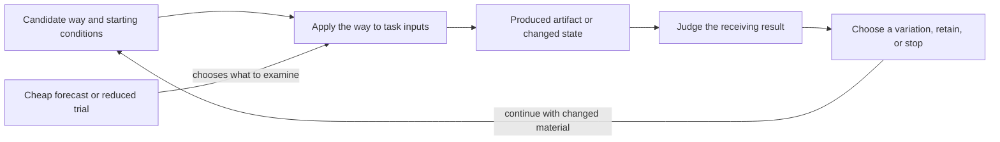
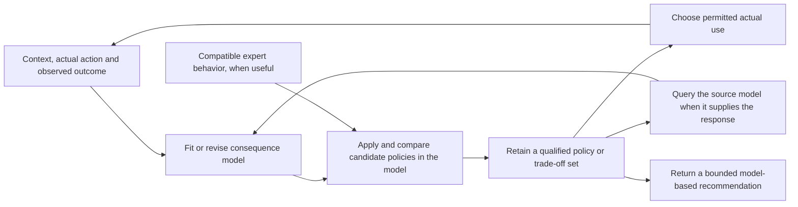

## C.40 - Develop Branching Search from Reusable Material

> **Type:** Method pattern
> **Status:** Stable
> **Normativity:** Normative unless explicitly marked informative.

### C.40:1 - Problem frame

Use this when you have something that can be developed and need to learn what a feasible variation makes possible. A sound workshop can alter its own recording; an investigation team can change a view of permitted records; a coding team can develop a working program. The eventual contribution may already be selected or remain unsettled.

The primary concern is the material being developed and the warranted continuation from an examined change. Material can be an editable construction, a working Method with its inputs, or a retained intermediate result. A promising label or score is not enough to perform the next variation.

Change something feasible, examine the resulting difference, and keep the actual material and conditions needed for a useful continuation. The first result is an examined variation with a justified continuation or stop. This transdisciplinary guidance relies on the professional operation that actually changes and examines the material.

Sections 4.5–4.8 develop conditional uses: opponents that respond to a candidate, a set of challenges whose selection changes as candidate ways improve, ways compared through the results of their application, and policies developed through models of their consequences. None is required for an ordinary material variation. Use C.40.CD, also reached from section 4.3, when problems and ways need development together. Ordinary variation does not require inventing a new problem. Reuse a sufficient existing result or way without entering a search. If the missing operation is how to obtain a local result at all, C.39 supplies that constructive explanation; a settled ultimate goal is not the discriminator.

### C.40:2 - Problem

Search can become an inventory of interesting possibilities without any performed development. It can also discard everything that loses today's comparison, including material that makes a useful next attempt possible.

The opposite excess is endless novelty or indiscriminate retention. A changed object, a higher score or success in a source problem does not by itself justify more work. Productive branching needs feasible operations, examination under the current question and an affordable continuation. Coupled search additionally needs validly constructed problems and target-tested transfer.

### C.40:3 - Forces

| Force | Tension |
| --- | --- |
| Present comparison versus useful continuation | A currently inferior variation may expose a useful next question. |
| Fixed contribution versus changing possibilities | The same material can be developed for today's result or before its later use is settled. |
| Diversity versus burden | Further variations, retention and recovery all consume resources. |
| Source success versus target use | A useful way may fail when the receiving conditions change. |
| Reusable material versus another person's capability | A retained artifact can be shared without transferring the skill or permission needed to use it. |

### C.40:4 - Solution

Perform a feasible change, examine what it produced, and use that result to choose a worthwhile continuation. Preserve enough of the material and its conditions to make that continuation possible.

#### C.40:4.1 - Make one small development pass

1. **Recover usable material and the local question.** Identify the actual editable or executable input and the conditions for using it. State the difference you can examine and any selected receiving contribution. Keep an original when comparison or recovery requires it.
2. **Select and perform a feasible variation.** Use the available professional operation to change, recombine or use the material differently. State what is changed and what remains protected. If the operation is unknown, use C.39 for that local contribution. An unperformed variation remains a proposal with its missing prerequisite.
3. **Examine the resulting difference.** Compare what was intended with what can now be observed or otherwise established under the relevant Method. Include a useful unexpected difference. Distinguish a result that helps one question and fails another.
4. **Preserve the material needed for the justified next use.** Keep the changed artifact or result and the inputs, settings or explanation needed to continue. Retain a failed or mixed result when it changes the next question. A descriptor or favourable evaluation alone may not let another participant reproduce or develop the result.
5. **Choose continuation, retention or stop.** Ask what another attainable result could change, what producing and carrying it would cost, and what work that would displace. Continue only the branches that warrant that burden. A sufficient result or a lack of worthwhile continuation can close the search.

Several variations can share one pass when they answer the same local question and their outcomes remain distinguishable. No population size, fixed branching factor, archive, new hypothesis or exhaustive trial of every variant is required.

#### C.40:4.2 - Continue without losing the question or the material

For a selected contribution, examine variations against its requirements while retaining an intermediate result only for a stated useful continuation. A lower present score can coexist with that reason; retention does not make the variation the preferred option.

Before a receiving contribution is selected, examine a local change that is already intelligible: for example, what reversing a playable recording does, or what a complete time-ordered view exposes. A newly suggested use becomes a question to investigate, not evidence of demand or value. Stop if no continuation warrants its burden.

Preserve the actual permissions, confidentiality limits, means and participant capabilities relevant to the next use. A colleague who receives the recording or code may still lack the skill or right needed for the proposed continuation. Retaining material is different from funding further work or preserving an exercisable option.

#### C.40:4.3 - Coupled problem-and-solution search

Enter here when problems and available ways need development together. C.40.CD supplies the full Method: recover a sought result and usable construction, form a consequential changed question, adapt the obtaining operation, examine it under target conditions, and use the outcome to choose the next question or use.

Keep the original receiving requirement connected to any narrower or exploratory problem. A partial target result may permit one useful comparison while another needed comparison remains unsupported. The next inquiry follows that remaining condition or another worthwhile use of the new construction.

Use section 4.1's material-changing and examination operations where needed. A sufficient existing answer can finish the work. B.5.QD constructs a missing question; C.39.RO constructs an operation for changed or combined use. C.40.CD connects those results through target application and preserves the conditions for a useful continuation.

When a construct's unfamiliar response must become a useful reproducible application, C.40.CU connects the needed probe, application, arrangement and receiving use. It can stop at a bounded response or conditional construction, and returns to this pattern for further worthwhile variation. Ordinary material development does not require that larger question.

#### C.40:4.4 - Use stronger claims only when they matter

A few explained variations need no formal archive or front. Use C.18 when retained exploration value, lineage, possibility-space change or a non-dominated front is claimed. That account records the relevant relations; it does not perform generation.

C.19 supplies continuation policy for a still-live search pool, while C.11 supplies a local choice. C.38 supplies comparison of complete-enough ways for one result. None converts material retention into current selection or permission to use the result.

For assurance-bearing use, identify the material, performed operation or still-proposed operation, examination basis and receiving conditions precisely enough for the claim. An observed difference, its evaluation, a proposed explanation and a claimed later effect need their own support.

#### C.40:4.5 - Develop against opponents that adapt to the current way

Use this branch when a useful way must respond to another participant's actions and a fixed collection of challenges no longer exposes its consequential weaknesses. A simulated opponent, a test generator or an authorized exercise team can search for those weaknesses. Prefer fixed representative trials when they already answer the question; maintaining adaptive opponents adds work and can reward behavior irrelevant to the receiving use.

Begin with the interaction that matters. Specify what each side can observe, when it acts, which actions are permitted, how the interaction ends and which outcomes receiving work values. Give the challenger a way to produce a meaningful difficulty within those conditions. A challenger that wins by exceeding the permitted load, seeing private future choices or exploiting a simulator error has exposed a setup defect unless that condition belongs to the intended use. Developing another participant's behavior changes the conditions faced by the candidate; it need not change what counts as a useful result.

**Build an informative first interaction.** Start with a challenge the available way can engage with, so different variations can produce distinguishable outcomes. If every attempt fails before the operation under development can act, simplify a named condition or supply the missing prerequisite. Retain the original receiving requirement while using that easier development case. Choose the challenger's objective separately from the candidate's objective: blindly negating a candidate score can reward early termination, wasted effort or another event that teaches nothing useful.

**Alternate development with an intelligible comparison.** Hold the candidate fixed while finding a permitted response that defeats or strains it. Examine the failure mechanism. Then hold a selected set of challenges fixed while changing the candidate to address that mechanism. A search algorithm, a subject specialist or a team can construct the variation; the representation and changing operation must actually permit it. Several fresh starts, different initial conditions or different allowed strategies can expose weaknesses that one continuing opponent misses. If teams participate, examine the interaction of their strategies as well as individual performance. Alternation is an affordable default, not a requirement that every interacting population update in this order.

**Keep challenges for what they reveal.** Preserve executable opponents or sufficiently complete exercise instructions, initial conditions, observation rules and meaningful failure cases. Include earlier challenges that expose different weaknesses, even when they no longer defeat the incumbent. Recheck proposed replacements against them. Sampling from a growing collection limits recurring cost, but rare failures can disappear from the sample; retain protected cases explicitly when their loss matters. Remove redundant cases only relative to the candidate set and conditions used to establish redundancy. A later way can fail on an old challenge that today's way handles, so a presently weak opponent is not universally dispensable.

**Choose on a common basis.** Compare the incumbent and proposed replacement against the same declared opponents, conditions and outcome rule. For a stochastic interaction, use enough repeated trials to distinguish a useful change from the uncertainty relevant to the decision. Keep individual outcomes or failure classes visible beside any aggregate. A weighted average answers a question about that weighting; a worst-case requirement needs its own comparison. Cyclic advantages can make different candidates useful against different opponents without providing one best candidate.

Separate success against the latest opponent from success against retained opponents. For a broader claim, examine opponents or situations not used to develop or select the candidate, such as a separately developed opponent family or a receiving-use trial. A reserve repeatedly used to select replacements becomes part of selection evidence. It is no longer an untouched final test. Broader success supports the examined family and conditions; it does not establish superiority over every possible opponent or indefinite progress.

**Use the result and revise locally.** Return the usable candidate, the challenges needed to reproduce its strengths and failures, the comparison and its limits, and the next justified use or development question. A specialist can be retained for its supported situation while a more broadly useful candidate is selected elsewhere. Include challenge construction, repeated interactions, retained material and independent examination in the cost comparison. Stop when the receiving result is sufficient, no informative permitted challenge can be obtained at worthwhile cost, or the interaction has become irrelevant to the receiving need.

If the required outcome or evaluation procedure changes, use E.23:4.1a and A.19.ECS:4.5 for the affected comparison. If only the opponent changes, rerun the candidates against a common relevant opponent set before calling the score change improvement. If the challenger defeats the task formulation rather than the candidate, return that condition to C.40.CD instead of treating impossible demands as productive pressure.

#### C.40:4.6 - Develop a set of challenges and ways of handling them

Use this branch when choosing the next challenge and finding a way to handle it need to inform one another. A fixed exercise sequence may repeat what is already easy or jump beyond every available way. Improving one candidate in one situation may also miss a construction already useful elsewhere. The result sought is a small set of worthwhile challenges with usable candidate ways, examined transfers between them, and a justified next development or receiving use.

Start from one usable challenge and the way being tried on it. Recover the challenge's inputs, required result and conditions, the candidate operation, and how an attempt can be judged. Make a small feasible variation through §4.1. Keep the original challenge and candidate available until the new comparison settles what to retain. A domain operation must supply the changed material: for example, a programmer changes an input grammar or an exercise designer changes an available tool. An instruction to generate novelty supplies neither operation.

**Choose a challenge worth developing.** Examine proposed changes on three different grounds. First, is the task meaningful and is its required result assessable? Second, is there a plausible attainable development step with the available ways and means? Third, would learning to handle this case add a consequential distinction, construction or possible use beyond what the retained cases already supply? An attractive but currently inaccessible task can be kept for a stated later question; a trivial variation can remain a regression case without receiving more development work. Use C.17 for a stronger novelty or usefulness claim, keeping its comparison basis explicit.

Estimate attainability by trying the inherited way or another inexpensive candidate. In a setting with a graded outcome, a declared band can help avoid spending all effort on trivial or wholly inaccessible cases. In another setting, use a worked partial result, known prerequisite or failure mechanism instead. Failure by current candidates establishes their limit in that attempt, not impossibility of the task. Preserve the unresolved premise when the attempt cannot distinguish inadequate means from an invalid challenge.

When task generation also creates its judge or reward, examine the connection before using the score. Recover what successful action must accomplish, whether the generated situation permits it, and what observations would distinguish accomplishment from exploiting the scoring rule. A successful execution check shows that the task runs under the checked conditions; whether its reward or success check measures the described task needs separate grounds. Use an independently grounded contrast case, a domain model or a supplied requirement for that distinction; A.19.ECS develops a missing evaluation. If no adequate ground is obtainable, keep the task and evaluation as a proposal rather than call its score success. If another task is preferred because a model calls it interesting, retain that model judgement as a selection aid and identify the human or practical reason for relying on it.

Separate three returns from this examination. If the task cannot be executed, repair its construction or discard it at the chosen effort limit. If it executes but adds no worthwhile distinction, propose another task. If it is worthwhile but not yet handled, examine the missing prerequisite, ineffective feedback or candidate limitation before making it harder. A task made easier by supplying a prerequisite can focus development on the next operation; do not credit the candidate with obtaining what the setup already supplied. A progress reward can guide attempts while a separate result condition establishes success. Both still need grounds.

When there is a fixed receiving use, compare progress on development tasks with results in that use. High local success with low receiving performance calls for a transfer or representativeness inquiry. Low local success despite adequate receiving performance can expose an unnecessary or malformed exercise. Change a named condition on that evidence and recheck the connection; automatic escalation after every success misses these alternatives. Keep representative receiving trials in view during development, and retain a separate examination for any stronger final claim. A repertoire of interesting tasks and improved performance on one receiving task are different possible results.

**Improve locally, then test useful connections.** Develop each selected way in its current challenge far enough to obtain an interpretable result. Keep unlike successful constructions and informative failures available. Try a transfer when a retained operation, artifact or starting configuration could supply a missing contribution in another challenge. Test it against that recipient's own incumbent and result conditions. Compare direct reuse first when meaningful; try a bounded adaptation when its possible benefit warrants the work. Passing the source task alone does not choose the target's replacement. When the transferred object is a description for a person, allow for acquisition, practice and support instead of assuming that copying the description transfers performance.

Use the target comparison to keep the incumbent, replace it for that use, retain several situation-specific alternatives, or return a missing contribution. A transferred result that makes a proposed challenge already easy can change the earlier decision to spend development effort there: recheck that decision after transfer. The challenge may now serve as a regression case or as a parent for another variation. Preserve its solved result even when it leaves active development.

**When one way must retain the whole repertoire.** Choose this arrangement when the receiving use needs the same candidate to handle several tasks. Continue developing that candidate across them rather than treating separately successful specialists as its combined ability. Keep earlier and current outcomes on the tasks whose retention matters, under comparable conditions. After work on a new task, examine whether the same candidate improved there, lost a previously useful result elsewhere, or merely produced a noisy fluctuation. Use repeated trials when uncertainty could change the decision, or an exact result or discriminating case when that establishes the change. A success rate near one half can reflect random difficulty without any improvement; task difficulty alone is not learning progress.

Use that comparison to choose the next development work. Return a still-needed task on which performance was lost to the training, practice or repair inputs. Include a promising new task when its possible acquisition warrants the effort, and keep enough work on the receiving use to prevent local gains from displacing it. Recently mastered tasks can receive less attention while protected comparisons still check them; a stale result needs renewed examination before it justifies omission. Interestingness can help choose among feasible acquisitions, but does not excuse losing a required old result. The mixture and frequency depend on cost, uncertainty, forgetting or regression risk and the result required; no fixed proportion applies to every use.

Perform the available learning or repair operation with those chosen tasks, then examine the changed common candidate on the affected old and new tasks and on the receiving use. Update the next allocation from that evidence. Retain the previous candidate when it is needed for comparison or recovery. If a change repeatedly trades one required result for another, investigate the conflicting requirements or the candidate's means; alternatives include a richer common operation, explicit situation-specific dispatch, or a justified narrower use. Further resampling alone supplies none of those missing constructions. Stop when the shared result is sufficient or the next acquisition and its retention burden are not worthwhile. An independently reserved final examination remains separate from cases repeatedly used to select these changes.

**Compare challenges by what matters to continuation.** A fixed task parameterization can describe relevant differences cheaply. When appearance or generator parameters miss them, examine how the same available ways perform on the tasks. A task on which one way succeeds and another fails can reveal a different opportunity from one where all behave alike. Recover the indexed ways and common evaluation conditions behind that response profile. It is relative to that repertoire: replacing a member can change which tasks look alike. Update the affected comparisons rather than treat an old descriptor as a permanent property of the task. Different generating encodings and different characterizations can serve different purposes; changing one does not automatically change the other.

**Retain enough to continue, and choose where effort stops.** Keep the task material, its evaluation grounds, the candidate way, outcomes and any adaptation needed for the useful next attempt. Preserve a failed task when its diagnosed obstacle could become tractable with another operation. Feed that obstacle and the useful differences from solved tasks into the next task proposal; a list of successful titles alone can invite repetition or another inaccessible jump. An archive of separately successful specialists does not establish that one way handles every task. Test that stronger receiving requirement with one candidate under the relevant tasks if it matters. Separate cheap retention from continued optimization; C.18 supplies stronger archive and lineage claims, and C.19 supplies a decision about funding several continuing lines. Bound the number of live tasks and the work spent trying transfers by the contribution sought and total burden. A cheaper fixed suite, direct specification or a known curriculum can finish the work when it already supplies the result.

This development need not reformulate the meaning of the receiving problem at every step. Use C.40.CD when a failed condition or new construction changes the answer that is now worth obtaining. Use §4.5 when a challenge must respond to the candidate during interaction. Keep evaluation repair under E.23:4.1a/A.19.ECS:4.5. Those returns allow one useful result to continue through a different operation without making all branches compulsory.

#### C.40:4.7 - Develop a way by what its use produces

Use this branch when the material being varied is a way of obtaining a result: a learning rule, a constructive heuristic, a training loss, a procedure with adjustable settings, or executable code. The useful difference appears only after that way has been applied. Choosing a good finished schedule and discovering a rule that makes good schedules on further inputs are different searches. A sufficient known way, direct derivation or small complete comparison can avoid the larger search.

**Construct the two connected operations.** Give the candidate a usable representation and a permitted changing operation. Parameters permit tuning within a form; changing a formula, operation or connection can enlarge the forms reachable. Include a known usable incumbent. Start with variations whose application can actually be performed and examined; a larger representation is useful only if it exposes a consequential alternative at an affordable search cost. C.39 develops an unavailable obtaining operation, and C.38 compares serious complete-enough alternatives.

For each candidate, perform the obtaining operation on stated inputs, then judge the result it produced. In a learning application, this includes initialization, training and subsequent use of the trained model. In a scheduling application, it includes constructing and examining a schedule. Recover the candidate way, its starting state, the resulting artifact or state, and the outcome separately. The outer development changes the way; the inner application obtains the result used to compare ways. These are roles in this particular construction, not a universal hierarchy of Methods.

Specify which inputs the candidate may use and which observations its assessment will use. A learning rule can see training examples while its performance is assessed on other examples. Developing a reusable way across situations also needs different situations: an answer hard-coded for one task can pass that task without learning or constructing anything useful for the next one. Protect important failure classes beside any aggregate. Keep cases repeatedly used to select changes distinct from a later examination supporting a stronger receiving-use claim. Repeatedly consulting a reserve makes it selection material.

The arrows show result use and a return for development. The forecast selects work; the produced result supports the corresponding outcome claim. When the use is prediction alone, C.29 supplies that different bounded claim.

**Choose what is allowed to change together.** A useful form may require its own tuned parameters. Compare a form with parameters fitted by the allowed inner operation rather than condemn it under settings suited only to its rival. Conversely, adding adjustable parameters is not automatically an improvement. Compare fixed forms, tuned forms and changed forms where those alternatives can settle the question. State the allowed tuning work for each; count it in the development burden. If the changed form needs another initializer, data preparation or support, compare that complete arrangement and preserve the dependency in the returned way.

Changing a training loss changes what guides updates. It does not by itself change what the receiving use values. An outer comparison can favor a loss whose numerical value is larger or whose early learning is slower because the resulting model performs better in the intended use. If the evaluation itself is defective, return to A.19.ECS and E.23; optimizing the candidate against that defect is no repair. A genuine change of the receiving requirement instead reopens the affected question through C.40.CD.

**Make search affordable by choosing an explicit approximation.** First obtain enough actual applications to make the comparison intelligible. Then choose among the following arrangements according to what is costly and what evidence the decision needs. They can be combined when their combined losses remain acceptable; they are not compulsory stages.

| Arrangement | How it saves work or waiting | What must remain visible |
| --- | --- | --- |
| Restrict the representation or vary a known way | Fewer implausible constructions need testing. | A missing operation cannot be discovered inside a representation that excludes it. Reopen the representation when useful failures point outside it. |
| Use a smaller task or a shorter application | More candidates receive an initial trial. | The reduction can change their ordering. Promote promising and consequentially uncertain candidates to the receiving scale; compare there before making that scale's claim. |
| Predict the outcome from candidate features or an early trace | A fitted model selects which expensive applications to perform next. | Preserve predicted and observed outcomes separately. Feed actual outcomes back into the predictor, examine consequential errors and changed regimes, and use C.29 for its mapping and validation boundary. |
| Reuse an intermediate state | Avoid repeating work already performed. | The new way starts from inherited progress. Compare continuation from that state separately from performance when started afresh. |
| Evaluate independent candidates in parallel, using returned results before all finish | Reduce idle resources and waiting. | Faster-returning lineages may receive more opportunities. Preserve pending candidates and the conditions of each result; inspect whether altered selection or stale inputs change what is found. |

For prediction-assisted search, choose features available at the time the decision must be made. Relate them to actual completed outcomes from the relevant regime; a feature measured only after completion cannot save that completion. Fit the prediction rule, use it to propose the next costly trial, perform that trial, and update the rule with the obtained outcome. An early trace can support a forecast of later performance but can miss a late improvement. Keep a way to investigate such misses when they matter: complete a discriminating delayed case, reserve some effort for uncertain regions, or broaden the calibration data. Stop relying on the forecast for a changed regime until its relevant relation is supported.

An early stopping rule similarly rejects further work, not the possibility of eventual success. If it is calibrated only on fast learners, a repeatedly discarded slow family can remain invisible. Recheck that omission against the receiving question. A cheap filter for malformed candidates is different: it can reject a proved type error or inadmissible operation without predicting final quality. Reusing an earlier result for an equivalent candidate requires the relevant equivalence; agreement on a few sampled outputs provides only that sample's evidence.

For asynchronous evaluation, retain the identity and starting conditions of every pending candidate. Queue enough independent work to use the available workers. When a selected batch of results returns, compare those results under their applicable conditions, select material for variation, and submit replacements without discarding the still-running candidates. A small return batch permits prompt adaptation; waiting for a larger batch can reduce how strongly a few fast lineages determine the next proposals. Retain each result's task, starting state, work allowance and candidate version. Check whether older parent material or faster return changes what is selected, and refresh the material used for variation when that is the cause of lost progress. Compare resulting quality and total work as well as elapsed time before retaining the asynchronous arrangement.

**Choose a fresh-start comparison or continued development.** With independent applications, each candidate receives a defined starting condition and work allowance. This supports a claim about the candidate's way under those conditions. With continued development, a successful state can be copied or retained, its settings changed, and work resumed. This can produce a better final artifact cheaply even when the last settings would be poor from the original start. Return the trajectory or reproducible continuation, including the state and earlier operations it depends on. A separate fresh-start trial is needed only for the stronger claim that the final settings define a reusable way from that start.

For example, in a stipulated update toward a known target 10, the rule is x ← x + a(10 − x). Two updates with a=0.5 from x=0 produce 7.5. Two updates with a=0.1 from an inherited x=8 produce 8.38, but the same rule from x=0 produces only 1.9. The continuation ending at 8.38 has an error of 1.62, smaller than 2.5 for the other run; this supports that continuation. It does not show that a=0.1 is the better two-step rule from zero. Directly setting x to the already known target would be cheaper in this toy problem, so the arithmetic illustrates the comparison distinction, not a need for evolutionary search.

State reuse needs a legitimate realization. Software may permit copying model weights and compatible optimizer state. A changed structure may make that state unusable. A person's acquired skill, fatigue or experience cannot be cloned by copying instructions. For development involving people, use actual preparation and learning conditions through HCD and actual trials through ME.11. If a comparison requires identical acquired states, keep that unavailable condition explicit; copying instructions supplies no such state.

**Return a usable discovery and its supported claim.** Keep the executable construction or sufficiently developed description, necessary initialization and support, settings or adaptation rule, outcome comparison, and consequential failures. If the sought result is the final trained artifact, return that artifact rather than claim a new reusable learning way. If a general way is sought, try it on the relevant different inputs and examine accidental dependencies on the search setup. Separate changes that preserve the computation from simplifications or decouplings whose effect needs a new comparison. Removing an apparently redundant instruction can expose a useful compact method; a component that merely looks strange may carry the improvement. Test the changed construction before replacing it.

Compare development cost, recurring use cost and time to a useful result separately. Count candidate construction, partial and full trials, tuning, repeats, prediction-model construction and updating, retained state, and the receiving examination where applicable. Fewer full trials can coexist with expensive feature collection; less waiting can coexist with more total work. Stop with a sufficient incumbent or retained conditional alternative when further improvement does not warrant that burden. Changes to task inputs, training horizon, allowable support or receiving criterion reopen only the comparisons they can invalidate.

#### C.40:4.8 - Search for a way to act through a model of its consequences

Use this branch when actual trials of many action rules are costly, slow or harmful, but an obtainable model can help select a smaller number of worthwhile candidates. The search develops a **policy**: a rule choosing an action from information available when acting. A predictor instead estimates what follows from an action in a context. Choosing the prediction with the best number is not yet constructing, performing or validating that action rule. A small direct comparison, an adequate known policy or an exact solution can finish the work without this arrangement.

**Connect the action rule to the consequence account.** Name the contexts, allowed actions, outcome meanings and receiving choice. A context contains observations or remembered information actually available before the action. Distinguish controllable settings from conditions the practitioner cannot choose. For repeated decisions, preserve the transition, observation timing, resource use and accumulated consequences through MMP.8.SD. A fixed sequence and a rule reacting to later observations can produce different results.

Write the two roles as `a = π(c)` and `o_hat = P(c,a)`. The first returns an action; the second returns a modeled outcome, distribution or bound. Give π a representation that can be applied and varied: a table, conditional procedure, rule set, parameterized function or another suitable construction. Include an incumbent whose actual operation is understood. The professional Method must supply how to perform each returned action; changing a policy description does not make new equipment, access or skill available.

Choose what P must return for the intended comparison. A one-step response can be iterated only with a sufficient update of context and relevant uncertainty. A predictor of total return already summarizes a continuation under its training conditions; repeatedly adding its outputs can double-count that return. A terminal score cannot supply an omitted trajectory constraint. For several outcomes, retain their trade-offs and any protected conditions. A penalty permits violations; an action restriction excludes them only insofar as its enforcing operation works. An aggregate improvement can conceal a loss in a particular context or for a particular affected party.

**Obtain a model for the actual use.** Recover observations as matched context, action actually taken and resulting outcome, including timing, selection, censoring and changes of regime. Train or fit P through CMP.7 and the appropriate subject modeling Method. When replacing an expensive simulator or source model, MMP.17 constructs its cheaper response and a return to that source. Preserve this distinction: agreement with a simulator supports the simulator's response, while agreement with observations addresses the modeled phenomenon. Neither automatically identifies what an untried intervention would do. Use C.28 and the corresponding subject model when that intervention claim matters.

Keep the inputs available during policy use separate from information used only for assessment. For a human or expert-generated proposal, store a proposed action separately from the action actually performed. Fit on the latter's outcome. An action chosen only in favorable conditions may appear better because of those conditions; merely adding more such records can preserve the error. Where the intervention consequence is unidentified, the useful output can remain a conditional model comparison or a question for a discriminating trial.

Assess the model where the search will use it. Compare relevant response errors, constraint crossings and ordering of serious candidate actions, not just an overall prediction average. Include withheld contexts, histories or regimes according to the claimed further use. For an iterated model, test the horizon and feedback operation as well as one-step error. Optimization can drive π toward poorly supported combinations even when P predicted historical behavior well. Restrict that use, obtain an informative source response, or retain its uncertainty; repeating the optimizer does not repair the missing relation.

**Develop and compare complete policies.** Fix a common set or distribution of contexts and a common model version for a comparison. For each candidate π, compute its actions and feed those actions with the corresponding contexts to P. In sequential use, carry the modeled state forward and apply π to the information then available; include the chosen horizon and terminal consequences. Calculate the agreed outcome profile and action costs. Retain nondominated candidates when the receiver has not selected one trade-off. C.18 supplies the stronger front and archive claims; a finite search usually returns the best alternatives found, not an exhaustive optimum.

Vary promising policies using the representation's feasible operations, and repeat within an affordable allowance. A rule for one context can be combined with a rule for another; a joint action can combine operations inside the same context. Those are different search spaces. Check their joint conditions: two separately allowed actions may share a resource or interfere. Keep a sufficient incumbent and useful diversity so that the next model update does not leave only closely related candidates. Direct enumeration is preferable when the candidate family is small enough; evolutionary variation is one obtaining mechanism for a large family, not a condition for model-assisted development.

These arrows show result use. The return through actual use is conditional on permission, feasibility and the needed evidence; a recommendation can be the current endpoint. A simulator test supplies a source-model outcome, not the observed-world data represented by D.

**Use uncertainty to change the continuation.** Decide whether the uncertain comparison warrants a source query, a limited trial, a conservative alternative or an unresolved answer. With supported response bounds, propagate them into the policy comparison. With fitted predictive distributions, compare calibration and proper scores on relevant observations and retain the population, horizon and selection conditions. A nominal interval at one fixed query is not a simultaneous guarantee over all policies searched. Common model omissions can survive an ensemble, and a narrow fitted interval can be wrong outside its supported regime.

For a retained point predictor, a residual model is one possible addition. Pair its predictions with known outcomes, form residuals `r = y − P(x)`, and fit a model for those residuals using the context and the original prediction. The corrected point is `P(x) + estimated residual mean`; the residual model supplies a conditional uncertainty account. RIO realizes this with a Gaussian process whose kernel is the sum of an input kernel and a prediction-output kernel, fitting its parameters to residual data. It leaves the original predictor unchanged. Its [primary method, §§3–5 and Algorithm 1](https://arxiv.org/pdf/1906.00588v5), supplies that numerical construction and its assumptions. A practitioner using it must distinguish uncertainty of a latent response from variation of a future observed outcome, choose the corresponding prediction, and assess the resulting intervals. Near-zero fitted training residuals do not establish small further-use error. A simpler empirical correction, a justified bound or a direct source call can be preferable.

For a multistep forecast, propagate the joint uncertainty through the actual update. Sampling a modeled next outcome and feeding it into the next step is one possible rollout; sampling independently at each step would lose a persistent shared disturbance unless that disturbance is retained. Quantiles of such rollouts summarize that model, not all possible failures of it. When the result changes a consequential action, examine the omitted dependence or regime before relying on numerical precision.

**Use expert material without pretending to transfer expertise.** This optional branch is useful when several people or existing programs already supply diverse workable policies. First agree on the input meanings, available observations, action interface and outcome comparison. Obtain their prescribed actions on contexts that expose both ordinary behavior and consequential differences. Keep permission and confidential information conditions in the collection arrangement. The submitted program or action record is reusable material; the person's capability is not copied.

When the representations are incompatible, fit each policy's behavior into a shared evolvable representation through CMP.7, or translate it exactly when the finite cases and semantics permit. Compare the original and translated actions, the resulting outcome profiles and important exceptions before using the translation as a seed. If the original uses unavailable information, repair the common inputs, keep that expert as a separate callable supplier, or preserve the failed approximation. An average imitation score cannot establish preservation of a rare safety condition. Ask the expert or the receiving use which distinctions must survive; use those in the comparison.

Seed the search with the usable translations and preserve the originals for comparison and possible return. Recombination can retain different specialists in different contexts or combine useful action parts within one context. Mutation can explore beyond the submitted behavior. A mixture that only chooses whole expert outputs cannot express every such combination; it can still be the cheaper adequate alternative. If direct translation already returns a sufficient policy, stop there. Track derivation when the receiver needs to inspect origins, but re-evaluate the child: its ancestry does not establish its behavior, safety or the causal value contributed by an expert.

**Return to use, then revise what changed.** Return an applicable policy or a qualified set, the observations it needs, its action realization, supported outcome profile, material model assumptions and fallback. A human decision maker may choose a trade-off or change an action because of a fact absent from the model. Recheck the changed action's feasibility and modeled consequences where useful. Preserve the reason for the change so that the next learning pass does not mistake it for the original recommendation.

Choose an actual trial or deployment only within its permitted conditions. Observe what was done and what followed; compare that result with the prior prediction and incumbent under the claim being tested. A failed source-model approximation returns to MMP.17; a failed account of the phenomenon returns to MMP.14 or the subject Method. A changed objective returns to the receiving choice, not automatically to retraining. If a model is revised, re-evaluate retained contenders on a common relevant basis before comparing their scores across versions. Continued policy evolution can reuse material; it cannot make the old and new scores commensurate by itself.

Count model construction, expert querying and translation, policy search, uncertainty calculations, actual trials, oversight and recurring use. Stop with a sufficient known policy, a conditional recommendation or an explicit unsupported action when the remaining search cannot justify its cost or risk. This arrangement develops policies and their consequence models together; repair of what counts as a valuable outcome remains the separate evaluation-development question under E.23 and A.19.ECS.

### C.40:5 - Archetypal Grounding

#### C.40:5.1 - Develop a recording with or without a composition in view

A constructed workshop has a permitted 100 ms percussion clip, a qualified editor operation for reversing it and playback suitable for examining the resulting sound. The original and editable copy are available. The exercise protects the sample format and permits modification for this workshop.

The practitioner reverses a copy, plays both versions and inspects their envelopes. In the supplied observations, the original has a sharp early peak near 10 ms; the reversal swells toward a peak near 90 ms. The changed recording and reversal setting, rather than the description “interesting sound”, are the reusable result.

If the selected purpose is a sharply marked beat, the reversal fails that immediate use. The workshop can still retain it cheaply for a specified next attempt at a swelling transition; it need not call it the better beat. If no composition is selected, the same examined change can support a question about transition material. It establishes no audience demand or future musical success.

For a target requiring a peak within the first 20 ms, the unchanged reversal fails. Trimming or otherwise adapting it is a new performed operation to examine against the target's duration and sound requirements, not a successful transfer by assertion. If a qualified existing clip already meets the target, use it. Another participant needs the file, its usable settings and the capability and permission for the next operation.

The observations and resources in this case are stipulated teaching inputs. They demonstrate the distinctions, not a field test of the search Method.

#### C.40:5.2 - Develop an investigation view

A constructed investigation uses six separately permitted synthetic records and a supplied specialist rule that admits comparisons within the same known setup. An available operation groups those records and can report unmatched cases:

| Case | Outcome | Setup | Time |
| --- | --- | --- | --- |
| E1 | Error | S1 | 09:00 |
| N1 | Acceptable | S1 | 09:05 |
| E3 | Error | Unknown | 09:40 |
| E2 | Error | S2 | 10:00 |
| N2 | Acceptable | S2 | 10:05 |
| N3 | Acceptable | Unknown | 11:15 |

A matched-pair view returns E1–N1 and E2–N2. A performed output variation also retains E3 and N3 with their times and missing-reference flags. Its additional review burden is five minutes in the supplied estimate. Retaining that small output is worthwhile for the specific next question of whether setup records at 09:40 and 11:15 can recover the missing conditions. It has not diagnosed the errors.

If the receiving contribution is unsettled, a complete time-ordered view supplies another small pass: it exposes one unmatched case between the known setups and one after the last known setup. An operator-support use suggested by that result still needs a recipient and need inquiry. The local examination does not have to wait for that answer.

#### C.40:5.3 - Let a mixed transfer change the target question

A target investigation requires comparison cases to share both setup and temperature regime. A source operation groups by setup alone. C.40.CD:5.1 carries the complete four-record case and the changed construction.

The original grouping returns T1–T2 and T3–T4. The target's temperature condition rejects T1–T2. Adding temperature to the grouping retains T3–T4 for S2/warm and leaves no eligible S1 pair.

The result supports the narrower S2 comparison if useful. An S1 explanation needs comparable cases or a revised question; repeating the old grouping leaves that gap. The source operation retains its earlier qualified uses. The grouping establishes comparison eligibility, with causal explanation remaining a separate question.

#### C.40:5.4 - An adaptive challenge changes an inspection procedure

This constructed model develops a procedure for inspecting experimental coupons. It is not a production safety rule. A coupon can have a surface defect S or an internal bond defect B. A supplied ideal test A detects S and a supplied ideal test B detects B; neither detects the other defect, and neither rejects a sound coupon. Each test consumes the coupon, so the development budget permits one test per coupon. The provisional aim is a detection probability of at least 0.45 for each admitted defect class, rather than a high average over an unspecified mixture.

The challenge generator prepares a defective coupon after seeing the inspection procedure but before seeing its private random draw. Its permitted responses are S and B. In a physical exercise, specialists would have to make and verify those defects and establish test sensitivity; here those facts are stipulated. The generator seeks the lower detection probability. It may not change a coupon after inspection or invent a defect outside the stated classes.

Start with procedure P-A, which always uses A. A generator producing S yields detection 1. Letting the generator respond to P-A produces B, with detection 0. Changing the procedure to P-B, which always uses B, repairs the latest failure, but a generator now choosing S defeats it. Keeping only the newest challenge makes this oscillation look like repeated improvement.

Retain both responses and compare on those same columns:

| Candidate inspection procedure | Detection on S | Detection on B | Tests per coupon | Meets the provisional per-class aim? |
| --- | --- | --- | --- | --- |
| P-A: always A | 1 | 0 | 1 | No |
| P-B: always B | 0 | 1 | 1 | No |
| P-M: privately choose A or B with equal probability | 0.5 | 0.5 | 1 | Yes, in this model |

The new operation is a private random choice before the test. If A is chosen with probability p, detection is p on S and 1-p on B. Their minimum cannot exceed 0.5 and reaches 0.5 at p=0.5. Thus P-M maximizes worst-class detection among these randomized one-test procedures. This argument supplies the model result; a short lucky run would not establish the probabilities of real tests. An equal-mixture average is 0.5 for all three procedures and would conceal the difference that matters here.

The adaptive search produced two failure witnesses and led to a revised procedure. Once the complete two-class model is known, direct enumeration and the argument above are cheaper than maintaining an evolving population. Retain S and B as distinct regression challenges and retain P-A and P-B only if their single-class uses or construction history warrant it. A physical adoption decision still needs independently prepared specimens, sound controls, actual test sensitivity, costs and evidence about the receiving defect population. Passing those trials would remain bounded to their conditions.

Now change the information available to the generator: it can observe the selected test before preparing the coupon. It can choose B after A and S after B. P-M's detection then becomes 0, even though its unchanged old table still says 0.5. The failed premise is the timing and privacy of the choice. Restoring that separation could restore the model result; if the receiving process cannot provide it, P-M has no supported fit there. Merely adding more copies of old S and B outcomes does not repair the interaction.

A different change admits a third defect C, detectable only by a third destructive test C. Under a single-test budget, the three selection probabilities sum to 1, so at least one class has detection at most 1/3. The original 0.45 per-class aim is now unattainable in this model. The next question concerns another testing operation, additional independently testable specimens, or an authorized change of the aim. It is not another round of replacing the current winner. Earlier two-class evidence remains valid within its old scope.

#### C.40:5.5 - Transfer a parsing repair and reconsider which task is informative

A publisher develops a checker for a miniature link format. A link is a filename, one literal `#`, and an exact anchor. The rule is to split at the first literal separator, percent-decode the filename once, then look up the decoded filename and anchor in an independently supplied complete catalogue. The catalogue contains `guide.md`/`intro`, `Guide One.md`/`intro`, `C# notes.md`/`usage` and `C%23 notes.md`/`archive`. Directories, external URLs and encoded anchors are outside this model.

Prepare four challenges. Each contains the valid link below and a second link with the same path and anchor `missing`. Correctly accepting the first and rejecting the second gives two correct decisions. The catalogue, rather than the candidate's output, determines the answers.

| Challenge | Valid link | A: split, no decoding | B: decode whole link once, then split | C: split, decode filename once | D: split, decode filename twice |
| --- | --- | --- | --- | --- | --- |
| Plain | `guide.md#intro` | 2 | 2 | 2 | 2 |
| Space | `Guide%20One.md#intro` | 1 | 2 | 2 | 2 |
| Hash | `C%23%20notes.md#usage` | 1 | 1 | 2 | 2 |
| Percent | `C%2523%20notes.md#archive` | 1 | 2 | 2 | 1 |

These are exact results of the stipulated parsing operations on the eight inputs, not measurements on a production manual. Rejecting every link scores only one on each challenge; the valid/invalid pair prevents that shortcut from looking successful.

Suppose Space is being developed from A while Hash is being developed from B. Both incumbents score one. Inspecting Hash explains B's failure: decoding first creates a `#` inside the filename, and splitting there changes the target. The programmer constructs C by moving the split before the single decoding operation. Hash now scores two. Test C directly on Space; it also scores two and can replace A there without another independent repair. That target test, not the Hash result, supports the replacement.

A proposed new Plain challenge is already solved and adds no needed distinction, so keep it only if its regression use is worthwhile. Percent is also solved by C. That success can remove it from active repair, but deleting the case altogether would lose a useful distinction: the plausible repeated-normalization variation D fails on it. Retain Percent when such a variation is a live possibility.

The response profiles also explain how the comparison basis changes. Under A, B and C, Space and Percent both have profile `(1, 2, 2)`. That profile alone cannot distinguish them. Including D changes their profiles to `(1, 2, 2, 2)` and `(1, 2, 2, 1)`. The tasks did not change; the set of tried operations did. Recompute that comparison and retain the difference where it affects further development. Surface novelty such as another filename would not necessarily reveal this distinction.

Now suppose one shared checker C must handle all four challenges, and a proposed change produces D. Retaining C as a specialist elsewhere does not make the changed common checker adequate. Rerun the common checker on the retained tasks: Percent falls from two correct decisions to one while the other three stay at two. That exact counterexample establishes a regression without a noisy-rate estimate. Return Percent to the repair inputs, restore single decoding and rerun the four challenges before replacing the common checker. If restoring it prevents a required new use, identify that conflict and construct another operation instead of alternating two inadequate releases. This demonstrates the shared-candidate return for a software repair; it does not demonstrate learning dynamics or an effective training mixture.

For this fully specified small grammar, directly implementing C and retaining the four discriminating challenges is sufficient. A population of parsers and an automatic task generator would add burden without supplying a missing answer. The construction nevertheless explains what a larger search would have to connect: independently assessable tasks, informative variation, local repair, target-tested reuse and reconsideration of retained challenges. If the catalogue becomes incomplete, a larger search over these same binary answers supplies no missing target fact; return that information condition through C.40.CD. If the grammar changes, reconsider the affected rules and challenges while preserving results within the original scope.

#### C.40:5.6 - Develop a scheduling rule rather than one schedule

A constructed workshop model has one machine, all jobs available at time zero, no interruptions or setup times, and known processing times p and due times d. For an order, completion time is the cumulative processing time; total tardiness is the sum of max(0, completion − d). Lower total tardiness is the receiving criterion. These are stipulated teaching conditions, not an operations recommendation or measured workplace effect.

The material under development is a rule that constructs an order from job data. Two executable incumbents are S, shortest processing time first, and E, earliest due time first; ties use job number. A third candidate H uses S if any job has p > d, otherwise E. This condition can be evaluated on new inputs, unlike retaining a literal order for one job set. The outer development proposes a rule; each inner application sorts the supplied jobs, computes completion times and returns an order plus total tardiness.

| Input set: jobs 1, 2, 3 as (p, d) | S: order; tardiness | E: order; tardiness | H: order; tardiness |
| --- | --- | --- | --- |
| A: (1,10), (4,4), (2,7) | 1,3,2; 3 | 2,3,1; 0 | 2,3,1; 0 |
| B: (5,5), (1,6), (1,7) | 2,3,1; 2 | 1,2,3; 0 | 1,2,3; 0 |
| C: (5,1), (1,3), (1,4) | 2,3,1; 6 | 1,2,3; 10 | 2,3,1; 6 |

On A, S completes jobs at times 1, 3 and 7; only job 2 is late, by 3. E completes them at 4, 6 and 7, with none late. On C, E's individual tardiness values are 4, 3 and 3; S's are 0, 0 and 6. Across equally weighted A–C, the mean totals are 11/3 for S, 10/3 for E and 2 for H. Thus H is the best of these three on this selection set. No search over an unspecified larger space or evidence about future workloads follows.

Now apply the selected H to a previously unused set D: (4,3), (1,4), (2,7). Its p > d condition selects S, giving order 2,3,1, completion times 1,3,7 and tardiness 4. E gives order 1,2,3, completion times 4,5,7 and tardiness 2. The earlier improvement did not transfer. Once D is used to repair H, it is part of development, not an untouched final examination.

Inspect the failed condition: knowing that one job must already be late does not establish which ordering minimizes total tardiness. A feasible repair Q constructs both S and E orders, computes their total tardiness with the supplied model, and returns the better order, choosing E on a tie. Q returns totals 0, 0, 6 and 2 on A–D. It costs two order constructions and comparisons per use. Its result is guaranteed to be no worse than either supplied order under this model, because it compares those same two exact values. It is not a globally optimal scheduling rule for all inputs. A complete enumeration of the six orders is another affordable alternative for three jobs and can settle each of these cases directly; a larger population search is unnecessary here.

Suppose search is accelerated by judging only jobs completed by time 3. On A, S has completed two jobs and E none, but the final tardiness comparison favors E. That cheap progress signal cannot replace the receiving criterion. It may select trials only with a justified relation to final outcomes and a return when ordering reverses. In this small model the full calculation is cheaper than developing such a predictor. In an expensive simulator, the same distinction can justify a calibrated predictor and occasional complete trials instead.

If actual execution has already completed job 1, Q cannot select an order that places another job before it. A continuation comparison must hold that performed prefix fixed and order only the remaining jobs. It answers a different question from starting the rule at time zero. If processing times become uncertain or depend on order, the exact calculation above no longer supplies the receiving result; obtain an adequate scheduling model and trial basis before selecting on its predictions. Preserve the deterministic result within its original conditions.

#### C.40:5.7 - A discovered learning component depends on how it was trained

A neural-network developer can vary the formula used during training while keeping the receiving question about the resulting model. In TaylorGLO, a vector specifies a polynomial training loss; each trial trains a model with that loss, and validation accuracy guides the outer search. The vector's own loss value is not the outcome compared across candidates. Short training makes initial trials cheaper, while later full training examines the selected result. The polynomial representation supplies a particular smooth search space, not every possible learning rule.

PANGAEA makes a different coupled choice: evolution changes an activation function's computational form, while gradient training adjusts parameters within that form along with the network. Returning only the form and omitting its parameter initialization and training changes the proposed application. Its source comparisons include fixed functions and parameterized functions, with transfers that succeed on some architectures and fail on others. This makes fitting a complete candidate and checking its receiving architecture consequential operations.

EPBT instead continues partially trained models while changing settings and training loss. Its selected final model carries earlier training history. Treat that as a continued-development result; replaying only the final loss from a fresh initialization is a new test. AQuaSurF selects expensive activation trials with a fitted predictor based on function behavior and network-derived features, then updates from evaluated outcomes. Constructing those features also costs computation. These alternative realizations of §4.7 differ in what they vary, what they retain and what their evaluation costs. The linked primary sources in §11 supply their neural mechanisms; the scheduling construction shows what can be retained without those mechanisms.

#### C.40:5.8 - Combine processing rules, expose an interaction and revise the policy

A constructed document-processing service chooses between two optional operations: a preflight check P and an alternate parser R. Context S denotes a standard template; F denotes a fragile template. The template type is known before processing. Each row below describes a 100-document test batch with reference answers. Time includes the selected operations; errors are remaining incorrect records. The two context types have equal weight in this illustrative comparison. The numbers are stipulated test results, not measured production performance.

| Context | Action | Minutes | Errors per 100 documents |
| --- | --- | ---: | ---: |
| S | Neither | 10 | 8 |
| S | P | 14 | 4 |
| S | R | 16 | 5 |
| S | P and R | 20 | 1 |
| F | Neither | 12 | 20 |
| F | P | 17 | 15 |
| F | R | 20 | 8 |
| F | P and R | 25 | Initially untested |

The receiver seeks mean time at most 20 minutes and mean errors at most 5 for the two test contexts. These are conjunctive requirements, not weights in one score. Expert A recommends P in either context; expert B recommends R in either context. Query both at S and F and represent each as a two-row action table. Here that translation is exact for the entire declared finite context set. A real expert's behavior outside that set has not been captured.

The first model keeps the measured times and estimates the missing F interaction by adding the separate error reductions. P reduces F errors by 5 and R by 12, so the additive prediction for both is `20−5−12=3`. The same construction gives `8−4−3=1` for S, agreeing with its observed joint case. Agreement at S motivates a candidate assumption for F; it does not establish it.

A policy chooses one action at S and one at F. There are only 16 such policies, so enumerate them; an evolutionary algorithm would add needless overhead here. The enumeration expresses the same representational choices a larger search must make: combine specialists across contexts, combine operations within a context, and compare the resulting whole. Five useful candidates are:

| Policy: action at S; action at F | Mean minutes | Mean errors under the first model |
| --- | ---: | ---: |
| A: P; P | 15.5 | 9.5 |
| B: R; R | 18 | 6.5 |
| C: P; R | 17 | 6 |
| D: P; P and R | 19.5 | 3.5 |
| E: P and R; R | 20 | 4.5 |

C improves both measures relative to B by combining the experts across contexts. Neither selection of A nor selection of B as one unchanged whole obtains C. D adds an untested within-context combination. Under the first model D meets both requirements and dominates E, so it is the tempting selection. The useful next inquiry is the missing F joint response; more precise arithmetic on the additive model cannot settle it.

Suppose the permitted test of P and R on the F batch returns 13 errors. Inspection shows that preflight's rewrites disrupt this alternate parser's handling of the fragile template. The additive prediction missed an interaction of `13−3=10` errors. Add that interaction for F while retaining the already established S responses. D now has `(4+13)/2=8.5` mean errors at 19.5 minutes and is dominated by C's 6 at 17 minutes. E, whose two component responses were already tested, meets the requirements at 20 minutes and 4.5 errors. Re-enumeration of the 16 policies shows E is the only one meeting both stated limits. Return E for these batches, with the type-dependent rule and the source test; do not call this production effectiveness or a learned general law of parser interaction.

A direct test of all eight context/action combinations would also have been inexpensive in this toy setting. The surrogate is useful here for exposing where prediction-guided selection needs a return, not for claiming an economic saving. In a large processing family, test cost, the number of context/action combinations and the consequences of a miss can favor different mixtures of modeling and direct trials.

Now suppose template type will not be observable until after the action has been selected. E cannot be applied as written. If the available policy must choose one fixed action for both contexts, neither P, R, both nor neither meets both limits: their respective mean pairs are `(15.5,9.5)`, `(18,6.5)`, `(22.5,7)` and `(11,14)`. With no permitted extra observation or changed processing operation, return the unmet requirement. The change invalidates the policy's information condition, not the earlier batch measurements. MMP.8 supplies the information-dependent choice; obtaining a timely type check is a new practical contribution to compare with relaxing a limit or changing the service.

#### C.40:5.9 - Preserve the receiving claim in land-use prescription

In the source application of [Young and colleagues (2025)](https://doi.org/10.1017/eds.2025.18), the predictor approximates long-term committed carbon emissions supplied by the BLUE model, using land-use and geographical inputs. A prescriptor maps a cell's context to a new allocation. Its output construction protects primary land and urban area while redistributing the allowed land fractions with their total preserved. Search compares predicted carbon with the fraction of land changed, a proxy for disruption. It returns trade-offs for a decision maker rather than one independently justified social optimum.

The model choice matters to that search. The reported global random forest has lower ordinary test error than the global neural network, but the network is chosen for behavior on larger land-use changes beyond ordinary cases. The paper examines those changes against BLUE qualitatively; this is not a general extrapolation guarantee. The policies are still evaluated through the selected predictor. A prediction about that model's carbon response remains distinct from evidence of actual land conversion, ecological effects, food supply or realized emissions.

Expert material changes what search can readily find. No-change and forest-oriented behaviors are first fitted into compatible policy networks and used as seeds. Their ablation shows a benefit in the reported runs, particularly in the low-change region. The returned child's ancestry helps trace this construction, but its ecological or practical worth still depends on its own consequences. Some simple heuristics remain competitive at very low change; the evolved approach's aggregate advantage does not mean it dominates every location.

Suppose the receiving use now must protect food production. Adding crop-area change as another objective exposes a trade-off, as in the paper; it does not impose a minimum food yield. The practitioner needs the actual production requirement, a model of the relevant yield and effects, and an admissible-action condition or an explicitly accepted trade-off. Reuse the already useful carbon approximation within its boundary, but compare whole feasible policies under the changed requirement. If no supported yield account is available, return that missing contribution instead of relabeling the old front as food-safe. This differs materially from the finite processing example: the reference model, spatial aggregation, extrapolation and unavailable field consequences determine what can be claimed.

### C.40:6 - Bias-Annotation

A strong incumbent can suppress useful intermediates, while novelty can attract effort without a receiving use. Examine what each variation actually permits next and include retention and opportunity costs. Keep the target's own conditions visible when enthusiasm for a source success would otherwise decide the transfer.

### C.40:7 - Conformance Checklist

- Usable material and a feasible changing operation are available, or the missing prerequisite remains explicit.
- A performed variation, its examined difference and a proposed later use are distinguishable.
- Fixed-contribution and unsettled-contribution uses do not require one another.
- Retained material and conditions make the stated continuation possible at a warranted burden.
- Coupled use constructs meaningful problems and judges transfer on the target's own conditions.
- A mixed or failed transfer changes the next problem or way question as its evidence permits.
- A sufficient existing way, adequate result or unwarranted continuation supplies a usable stop.
- Archive, front, selection, capability and permission claims keep their separate meanings.
- When the candidate is an obtaining way, the comparison identifies its actual application and produced result, any approximation or inherited state, and the conditions of the receiving-use claim.

- For model-assisted policy search, action realization, model predictions, actual outcomes and translated expert behavior have separate grounds; the returned policy retains the observations and conditions it needs.

### C.40:8 - Common Anti-Patterns and How to Avoid Them

| Misuse | Repair |
| --- | --- |
| Cataloguing possibilities is called generation. | Perform the feasible material change and examine its result, or state the missing operation. |
| Every search must invent a new goal. | Develop material for the selected contribution when that is the actual use. |
| Only today's winner is retained. | Keep a lesser intermediate when a specific attainable continuation warrants its burden. |
| Everything novel is retained. | Compare further use, cheap retention and stopping against actual costs and displaced work. |
| A source success certifies a target. | Apply and examine the way under target conditions; retain the actual failed or mixed result. |
| A file transfer is called a capability transfer. | Recover the receiving participant's means, skill and permission separately. |

### C.40:9 - Consequences

Useful intermediate results can support later attempts without being promoted to current winners or final opportunities. The cost is generation, examination and recoverable retention. Coupled development can expose a better next problem, but trying every transfer can consume more than it returns. Small justified passes and sufficient-result exits limit that burden.

### C.40:10 - Architectural Rationale

The common operation is changing material, examining the difference and choosing a warranted continuation. These development steps serve both a selected contribution and exploration before a destination is settled; the examination question changes with the intended use.

Coupled development adds problem construction and target-tested transfer to that common work. C.40.CD explains their dependency: a changed problem can require another operation, while a partial result or new construction can change the next useful question. Its separate entry preserves the original receiving requirement through those changes.

C.39 remains separate because an obtaining explanation can finish before any variation is feasible. An archive or a continuation policy likewise has a useful independent result, but neither supplies the changing operation.

### C.40:11 - SoTA-Echoing

| Practice question and selected line | Serious alternative, mutation and limit | Reopen condition |
| --- | --- | --- |
| How can retained material support a useful next attempt before its ultimate contribution is settled? The selected line is examined variation with warranted intermediate retention. | **Adapt** the branching-discovery argument in Stanley and Lehman's [Why Greatness Cannot Be Planned](https://link.springer.com/book/10.1007/978-3-319-15524-1) (2015, especially chapters 3–6) in sections 4.1–4.2. The historical argument supplies an action-changing alternative to keeping only the present winner; its anecdotes do not establish universal institutional policy or inevitable progress. A sufficient attainable objective remains a serious cheaper choice. | Reopen if actual receiving use shows that retention cannot support the named continuation or a cheaper direct Method supplies the whole result. |
| Can branching serve a fixed contribution rather than require new-problem generation? | [Darwin Gödel Machine v3, section 3](https://arxiv.org/html/2505.22954v3#S3) supplies a concrete evaluator-guided countercase: coding-agent variants branch from retained predecessors under supplied task evaluation. **Adapt** non-incumbent continuation to section 4.2; **reject** a universal ban on objectives. This computational evidence does not demonstrate human or organizational search effectiveness. | Reopen when the selected material cannot be changed or examined as assumed, or when incumbent-only development is sufficient at lower burden. |
| What extra operation makes changing problems and cross-problem reuse productive? | [POET v3, sections 3 and 6](https://arxiv.org/html/1901.01753v3) supplies the paired environment/agent and target-transfer construction. **Adapt** meaningful problem variation and target examination in section 4.3 and C.40.CD; fixed-problem branching remains sufficient where no changed problem is needed. **Reject** universal numeric thresholds, oldest-member removal and treating a person's capability as a copyable policy vector. The paper is a computational instantiation, not proof of transdisciplinary effect. | Reopen when the proposed target problem is invalid, target examination is unavailable, or the coupled entry needs a different operative core. |
| How can task generation, local improvement and reuse avoid repetitive or unattainable development? | **Adapt** the task/solution cycle and transfer recheck of [POET v3](https://arxiv.org/html/1901.01753v3), the repertoire-relative characterization of [Enhanced POET v1](https://arxiv.org/html/2003.08536v1), and the distinct attainability/interestingness and successful/failed archive roles in [OMNI v3](https://arxiv.org/html/2306.01711v3) and [OMNI-EPIC v3](https://arxiv.org/html/2405.15568v3), into §4.6. OMNI-EPIC's long generation runs simulate learning; its short learning runs produce specialists, not a demonstrated universal agent. [Dreaming in Code v2](https://arxiv.org/html/2602.08194v2) (2026) supplies a serious different choice: generate training worlds for one fixed receiving task and one shared policy, using local and receiving feedback. Its task engine and extra computation remain consequential limits. Generated evaluation still needs its own grounds. | Reopen when tasks become redundant after transfer, a changed repertoire invalidates their comparison, local success fails to transfer, or constructing and evaluating tasks costs more than a sufficient fixed suite. |
| How can changing opponents expose useful weaknesses without making a rising local score look like general progress? | **Adapt** the interaction construction and retained opponent ensemble in Tang, Tan and Harada, [*Learning Agile Locomotion via Adversarial Training*, v1](https://arxiv.org/html/2008.00603v1) (2020), §§III–IV, into §4.5. Its controller encodings, rewards and simulator remain domain-specific. Nolfi and Pagliuca, [*Global progress in competitive co-evolution*](https://pmc.ncbi.nlm.nih.gov/articles/PMC11791907/) (2025), §§2–4, supplies the later distinction between local, historical and estimated broader progress, and alternatives for retaining and selecting opponents. **Reject** an unconditional progress guarantee: their comparison concerns simulated pursuit and evasion, and fixed representative challenges remain cheaper when sufficient. §5.4 is a separate constructed transfer, not empirical evidence from either paper. | Reopen when the permitted interaction, observations, required outcome, opponent family or comparison cost changes; an archive alone does not settle the renewed claim. |
| How can a search develop the obtaining way rather than only its final artifact? | **Adapt** the two-level evaluation in [MEA (2015)](https://nn.cs.utexas.edu/downloads/papers/liang.gecco15.pdf), [TaylorGLO (2021)](https://nn.cs.utexas.edu/downloads/papers/gonzalez.gecco21.pdf), [AutoML-Zero (2020)](https://proceedings.mlr.press/v119/real20a.html) and [PANGAEA (2022)](https://nn.cs.utexas.edu/downloads/papers/bingham.nn22.pdf) in §4.7: apply a candidate, judge its produced result, preserve the operative construction and check transfer. [Lion (2023), §§2–3](https://arxiv.org/html/2302.06675v4) adds progressively larger selection tasks and checked simplification after search. Direct derivation, tuning a known form and finite comparison remain serious alternatives. The sources' computational mechanisms and experiments do not establish effectiveness for human learning. | Reopen when the representation excludes a needed operation, candidate and result are conflated, or a selected way fails at the receiving scale. |
| Which cheaper evaluation changes the claim being made? | **Adapt** the prediction/actual-trial distinction from [AQuaSurF (2023)](https://papers.neurips.cc/paper_files/paper/2023/file/154d63285d3ed7826e7f026c0b350d69-Paper-Conference.pdf), the continued-state alternative from [EPBT (2021)](https://nn.cs.utexas.edu/downloads/papers/liang.gecco21.pdf), and the waiting/selection distinction from [AES (2024)](https://arxiv.org/abs/2308.04102v3). [Guijt et al. (2023), §§2–6](https://arxiv.org/html/2303.15543v1) shows why asynchronous variation, selection and stale inputs can change search behavior. **Reject** treating fewer trials, inherited progress or faster return as equivalent evidence of a better fresh-start way. Full independent trials remain the simpler baseline. | Reopen when forecast errors alter selection, state compatibility fails, slow candidates disappear without examination, or total development burden outweighs the benefit. |
| How can a model and diverse expert material make action-policy search useful? | **Adapt** the predictor/prescriptor/actual-feedback construction of [ESP (2020), §§3–5](https://nn.cs.utexas.edu/downloads/papers/francon.gecco20.pdf) and the Define–Gather–Distill–Evolve construction of [RHEA (2024), §§2–5 and Appendices B–D](https://proceedings.neurips.cc/paper_files/paper/2024/file/d7ae378b9dfa7ff7bed35105fab03838-Paper-Conference.pdf), into §4.8. The [NPI study (2021), §§V–VIII](https://nn.cs.utexas.edu/downloads/papers/miikkulainen.ieeetec21.pdf) supplies a recurrent forecast and human trade-off use; its policy effects remain model-based. [Land-use prescription (2025)](https://doi.org/10.1017/eds.2025.18) supplies bounded seeding, constraint and aggregation consequences in §5.9. Direct trials, an exact policy calculation, an expert selector or a sufficient fixed policy remain serious alternatives. **Reject** treating model agreement, imitation rank, ancestry or a predicted front as demonstrated intervention benefit. | Reopen when the policy uses unavailable information, search reaches unsupported actions, translation loses a consequential expert distinction, or a new source response reverses the comparison. |
| How should predictive uncertainty affect the next action? | **Adapt** [RIO (2020), §§3–5 and Appendix D.2](https://arxiv.org/pdf/1906.00588v5) as one residual-correction realization, alongside bounds, direct source return and simpler correction. Its empirical predictive gains and conditional theoretical results are not arbitrary-shift coverage guarantees. The [2025 chlorination report, §§2–4](https://arxiv.org/html/2508.19173v1) provides a consequential caution: only two of five objectives were optimized and reported violation variation suggested little learning; an attractive front need not establish the whole requested improvement. Symbolic policies in [Shahrzad and Miikkulainen (2025)](https://nn.cs.utexas.edu/downloads/papers/shahrzad.nesy25.pdf) are a current readable-representation alternative; readability alone supplies neither causal validity nor safety. | Reopen when interval behavior, persistent disturbances, omitted outcomes or the burden of uncertainty estimation changes which policy or test is worthwhile. |

The best-known line selected for these bounded questions combines the actual shared operations with conditional problem construction and target testing. Task generation for an expanding repertoire and curriculum generation for a fixed receiving use have different selection grounds. Later generator, representation and transfer-scheduling variants do not make one implementation universal. A broader claim of present algorithmic superiority would require its own current comparison.

### C.40:12 - Relations
- C.40.CD constructs problems and obtaining ways together through examined target use; B.5.QD and C.39.RO supply question and operation construction.

- C.39 develops a missing obtaining explanation for a local contribution; it is not a compulsory preliminary stage.
- C.18 distinguishes archive, front, lineage and possibility-space claims about the developed material.
- C.19 governs resource-bearing continuation of a live pool; C.11 governs a local choice.
- C.38 constructs a finite same-result comparison from complete-enough ways.
- C.17 characterizes generative novelty and value when those claims are needed; the applicable professional Method supplies the actual variation and examination.
- E.23:4.1a and A.19.ECS:4.5 govern a justified change of evaluation; §4.5 here develops interacting challenges while preserving the comparison question.
- A.10 governs stronger reliance on observations or transfer support. Problem, capability, permission and actual Work claims use their direct subject rules rather than an archive label.

### C.40:End

