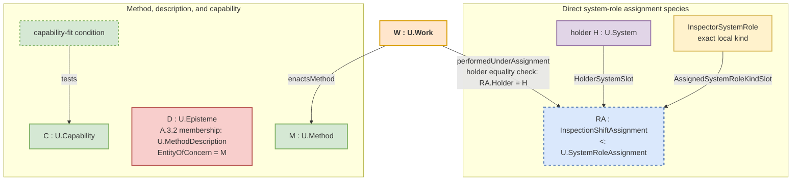

### A.15:4 - Solution

Recover the actual values first, then state only the relations needed by the receiving use. A.15 aligns system-role kind, assignment, Method, MethodDescription, capability, WorkPlan, Work, and separate records; it does not create a universal process object or a universal assignment signature.

When source wording points to changing, producing, selecting, deriving, controlling, or maintaining an `EntityOfConcern`, use `E.10.ARCH` to recover the object. A workflow graph, process calculus, matrix, category, embedding, or neural representation may describe or serve as a lens over a Method relation structure; it is not automatically a Method, assignment, WorkPlan, or Work occurrence.

#### A.15:4.1 - Core entities kept distinct

* **Exact local system-role kind.** A value such as `InspectorSystemRole : U.Kind` is admitted under A.2 with C.3 through its `U.System` candidate domain, operative work-facing membership condition, member/non-member boundary, and continuity rule. It is not a system, assignment, relation slot, capability, Method, Work, responsibility, or authority. A system classification judgment and an assignment occurrence are separate claims.
* **`U.SystemRoleAssignment`.** This is the relation family consumed by A.15 and F.6. It has no permissive root `RelationSignature`. Each direct species declares `HolderSystemSlot : U.System`, a declaration-local `AssignedSystemRoleKindSlot` whose ValueKind is one exact local system-role-kind domain, its predicate and applicability, every real additional participant, and its occurrence-identity rule.
* **`U.Method`.** The run-independent semantic way of doing. A Work occurrence can stand in `enactsMethod(W, M)`; the Method does not act.
* **`U.MethodDescription`.** An already identified `U.Episteme` whose exact `EntityOfConcern` is an admitted Method and whose substantive claims say how that Method is done, as judged by A.3.2. Wording, file form, or publication alone establishes no membership.
* **`U.Capability`.** The A.2.2 holder-dependent ability instance. Capability statements, evidence, currentness assessments, and fit conditions are separate. Capability proves neither assignment nor performance.
* **`U.WorkPlan`.** A `U.Episteme` about possible future Work, including intended windows, dependencies, performers, and budgets. It does not bring a future Work occurrence into existence.
* **`U.Work`.** The admitted kind for concrete dated Work occurrences. One Work individual has its own temporal extent, at least one obtaining A.15.1 `enactsMethod` relation, and at least one obtaining locally declared containing-system relation. It may stand in further enactment, affected-referent, binding, resource-use, production, and result relations when the receiving use needs those independently obtaining facts. Any log, ticket, assertion, description, or performed-work record is a separate episteme.

**Work occurrence and record boundary.** Do not add a universal `primaryTarget` field, a local `kind` field, or an Operational, Communicative, and Epistemic enumeration to Work identity. Recover the exact affected-referent, transformation, speech-act effect, commitment effect, production, delivery, acceptance, or other relation under its direct pattern. Those adjectives can remain recognition cues; they do not define Work subkinds by enumeration.

**Didactic note for managers: the chef analogy.** `ChefSystemRole` is one local system-role kind. A kitchen-assignment species defines the holder and assigned-kind positions and adds shift, station, or commission only when it changes the assignment. A particular assignment fills those positions with the chef System, the kind, and any additional value. A cookbook can be a MethodDescription; the chef's skill can be a capability; a WorkPlan can schedule cooking; and making one souffle on Tuesday is dated Work. Its temporal and resource-use relations can state the 25-minute extent, eggs, butter, and consumed gas, while a kitchen log remains a separate episteme. A restaurant vocabulary or scheme can help interpret the claims without becoming a participant in every assignment. The cookbook, skill, plan, assignment, and log do not cook.

#### A.15:4.2 - Canonical relations

The diagram shows a simple direct assignment species. A stronger appointment can declare a real additional participant such as a review commission; that specialized occurrence itself is the `U.SystemRoleAssignment`. Do not create a weaker generic occurrence beside it.

* **Capability fit.** A MethodDescription, WorkPlan, or work-admission assertion may require a holder capability threshold. The fit condition tests the holder's `U.Capability` instance and may cite declared measures, `U.Characteristic` values, Q-Bundle slots, or architecture-characteristic criteria. It is neither an assignment participant nor a second capability kind.
* **MethodDescription membership.** `D` is a `U.MethodDescription` only when A.3.2 recovers Method `M` as its exact EntityOfConcern and at least one substantive way-of-doing claim. “D describes M” is shorthand for that constitution and membership result, not another binary relation.
* **`enactsMethod(W : U.Work, M : U.Method)`.** This relation states which exact Method the dated Work enacts. A.15.1 defines its participant order, predicate, occurrence identity, and multiplicity. It neither attributes a performer nor turns a description into the Method.
* **`performedUnderAssignment(W : U.Work, RA : U.SystemRoleAssignment)`.** F.6 defines this relation. For a precise actual performer, `RA` is the same obtaining assignment used by A.13 for the exact action, scope, working situation, and window. It must be an occurrence of a declared assignment species, have the A.13-qualified System as holder, and cover the Work while the species predicate obtains. The assignment is the attribution ground, not the actor. A record may state the relation without constituting it. Read an existing `performedBy(W, RA)` claim only through the F.6 compatibility boundary after resolving the holder System; do not author new claims with that spelling.

One assignment occurrence continues through the maximal uninterrupted interval in which its direct species predicate obtains for fixed participants. A declared interval, taxonomy, scheme, KindSignature, assertion, evidence item, or selected model-use structure can describe or interpret the claim but does not create the occurrence or become a generic participant.

For a precise performed occurrence, first recover the A.13 core for the exact actual performer System and action, then admit `W : U.Work` under A.15.1 from its independent occurrence, Method, extent, and containment facts. Only afterward trace `W` to the same `RA` through F.6 `performedUnderAssignment` when the receiving use needs precise assignment-bound attribution, and compare `RA.HolderSystemSlot` with the already recovered performer; F.6 identifies neither. Trace `W` to `M` separately through `enactsMethod`. Cite a characteristic profile only when conditionally consumed; cite a MethodDescription, plan, capability claim, evidence item, taxonomy, or scheme separately only when the receiving use relies on it. The performer System acts; the kind, assignment, capability, Method, description, plan, evidence, and record do not.

#### A.15:4.3 - Bounded specialization scouting and `CheckpointReturn`

When one human-plus-AI pair faces a new task or solution family, identify each participating human or AI service as an admitted System before using this alignment. The pair may use four local system-role kinds for this bounded work: `OutcomeCriterionHolderSystemRole`, `AIScoutSystemRole`, `AISpecialistProbeSystemRole`, and `CommitAuthoritySystemRole`. Claim an assignment only by naming its occurrence and declared species under `U.SystemRoleAssignment`. The `CommitAuthoritySystemRole` name does not supply decision authority; any authority relation must obtain independently.

The pair declares one outcome criterion, explores several different candidate approaches, spends a bounded scouting or probing budget before commitment, and returns one `CheckpointReturn` comparing the tested approaches. Use A.15 only for this dyadic assignment, Method, plan, and Work alignment; use C.24 for checkpoint-record semantics and E.16 for budget and guard enforcement.

Every `CheckpointReturn` carries:

- the declared outcome criterion and current `TaskFamily`;
- the candidate approaches actually tested;
- evidence observed for each tested approach, including progress toward the work-measure threshold and important failure signals;
- burned and residual budget;
- the recommended next use: continue probing, commit to planned Work, narrow the Method or claim, use the direct pattern for another claim, or stop; and
- the commit trigger that would justify leaving the bounded probe.

The return is evidence about candidate approaches, observed results, budget, and the commit trigger. It is not the selected Method, `U.WorkPlan`, actual Work, execution evidence, provenance, or rollout decision. Those claims need their own admitted values and relations before committed rollout.

Low-human-overlap approaches remain admissible here only while they stay tied to the outcome criterion, budget limits, and the exact evidence or provenance relation used by the receiving claim.

#### A.15:4.4 - Boundary to A.15.4 Work-Relevant Appearance-Based Reliance Repair

Use `A.15.4` when an encountered episteme, carrier, display, credential view, generated explanation, copied statement, provenance mark, dashboard tile, schema wording, API wording, or source-relation chain is being relied on by appearance for Work, assignment currentness, assignment state, source currentness, approval, authorization, gate passage, evidence, engineering justification, release, or another reliance-bearing claim.

A.15 itself keeps the exact local system-role kind, holder system, direct assignment occurrence, Method, MethodDescription, WorkPlan, dated Work occurrence, and every separate episteme distinct. A.15.4 recovers the project-side value and relation that must hold before the visible item can warrant the attempted use.

A principle scheme, functional diagram, scenario, screen, or explanation that exposes an `E.18.1` P2W carry-through structure may help a team plan Work or find a source. It does not become the selected Method, plan, Work occurrence, result, evidence, or authority by publication.

#### A.15:4.4a - Inspecting Method–Work Alignment Across an Unfolding Structure

Do not create a linkage record merely because one unfolding structure mentions several Method- and Work-related values. Keep each direct relation under the pattern that defines it. When a receiving use must preserve an inspectable explanation across those relations, write one bounded `C.2.1` episteme whose EntityOfConcern is the exact selected unfolding `U.Structure`. Its ClaimGraph may cite, as separate claims, the selected Method and Method-relation structure, MethodDescription epistemes, relevant local system-role kinds and assignment occurrences, the Work that enacts the Method, Work-part relations, independently identified transformations and their direct Work-to-change claims, intended WorkPlans, readiness results, capability-fit conditions, evidence, assurance, and gate decisions. Include only claims needed by that receiving use.

Call this episteme a *Method–Work alignment account* in ordinary prose. Its identity comes from its EntityOfConcern and ClaimGraph, not from a new `MethodWorkUnfoldingLinkage@Context` kind or a field bundle. Each claim in the account remains defined or tested by its own pattern: A.3 for Method or MethodDescription, A.15.2 for planning, A.15.5 for readiness, A.15.1 for dated Work and Work relations, A.10 for evidence, B.3 for assurance, and A.20 or A.21 for gates. If the useful account would need several unrelated entities of concern, split it instead of using one umbrella record.

Another structure, such as CGUS, P2W, P2S, an improvement-loop slice, or a transformation-flow slice, may cite the exact episteme only when its receiving use needs this alignment explanation. The citation creates none of the cited relations and cannot replace their sources, currentness checks, or criteria.

#### A.15:4.5 - Boundary to A.15.5 Work-Entry Readiness

Use `A.15.5` when the current question is whether intended Work is ready to enter its boundary. A.15 keeps system-role kind, assignment, Method, plan, and Work distinct; A.15.5 carries `WorkEntryReadiness@Context`, `FullKitCondition`, commitment disposition, resource-readiness references, WIP or flow-policy references, planned baselines, and launch-gate references when those values are current.

Readiness is not performed Work, evidence sufficiency, or gate passage. A briefing, dashboard, source bundle, or P2W record may cue A.15.5, but a readiness result needs the WorkPlan being judged, the PlanItem content used by the criterion, missing inputs, any performed preparation Work, the planned baseline, and the stop or degraded-use condition. Address the PlanItem content through that WorkPlan; it is not another readiness target.

