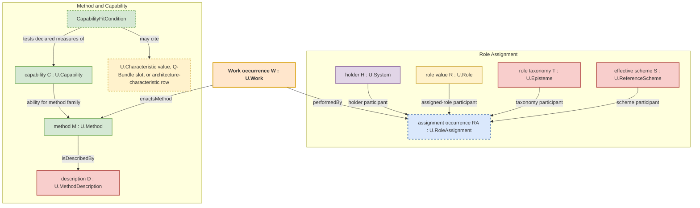

### A.15:4 - Solution

**Method and work governing-pattern cue.**
 When encountered "process", "algorithm", "solver", "workflow", "procedure", or similar wording points to changing, producing, selecting, deriving, controlling, or maintaining an `EntityOfConcern`, use `E.10.ARCH:3.1` to recover the object under wording repair first and then assign separately governed typed values. A.15 carries only the alignment among role, method, method-description, work-plan, and performed-work references. Formal substrate, mathematical-lens use, mechanism declaration or realization, evidence relation, gate relation, source relation, result, publication, and temporal claims are governed by their own patterns.

When methods are related to one another, A.15 keeps only the alignment use of that relation. The method-side object is the exact governed method relation structure under `A.3.1`, `A.3.2`, `G.5`, or a direct method-composition pattern when current. A method algebra, workflow graph, process calculus, matrix, category, embedding, or neural representation is a lens or method description over that structure, not a role relation, work plan, dated work occurrence, or assignment relation.
The solution is a stratified alignment that cleanly separates semantic method, method-description reference, holder-in-role assignment, holder `U.Capability` instances when relied on, separate capability statements or currentness assessments when those are used, separate capability-fit conditions when current, intended work plan, and dated performed work. The work-facing assignment relation is **`U.RoleAssignment`**.

#### A.15:4.1 - The Core Entities: A Strict Distinction

FPF mandates the use of the following distinct, non-overlapping entities to model method, plan, and work enactment. Using them interchangeably is a conformance violation.

**A) Role, Method, Description, Capability, And Plan Values:**

*   **`U.Role`:** A work-facing role value interpreted through one exact role-taxonomy episteme and effective `U.ReferenceScheme`. Expected contribution, responsibility, permission, commitment, obligation, capability-fit, and admission conditions are neighboring relations governed by their direct patterns; the role value is not the holder, assignment occurrence, method, capability, work plan, or work occurrence.
*   **`U.Method`:** The run-independent semantic way of doing a kind of transformation or enactment. It is not a dated performance or its description.
*   **`U.MethodDescription`:** A **`U.Episteme` describing a `U.Method`**; it may be expressed in an SOP, algorithm, proof, recipe, or other method-description publication.
*   **`U.Capability`:** The `A.2.2` admitted dependent durable U-kind for holder-dependent capability instances. A concrete instance is a `U.System` holder's ability to perform a work family or produce a result class within a declared envelope, measure set, qualification window, and currentness condition. A `CapabilityStatement`, evidence relation, source-use relation, or currentness assessment may support relying on that instance; a capability-fit condition may test it. The capability instance is not the method, method description, support record, fit predicate, work plan, or work occurrence.
*   **`U.WorkPlan`:** A **`U.Episteme`** declaring designators and constraints for possible future Work occurrences, including windows, dependencies, intended performers by role, and budgets. A future Work occurrence does not yet exist merely because a plan refers to it - see **A.15.2**.

**B) The Assignment Relation:**

*   **`U.RoleAssignment`:** The typed assignment relation for enactment-facing roles. Its generic signature has exactly four participant slots: holder `U.System`, assigned `U.Role`, exact role-taxonomy episteme, and effective `U.ReferenceScheme`. Its actual occurrence extent is derived as the maximal continuous interval over which those participants stand in the assignment relation. A declared assignment window, rationale, source, or selected `BoundedModelUseStructure` belongs to the receiving assertion, description, or use; none is an optional generic participant.

**C) Performed Occurrence:**

*   **`U.Work`:** The admitted kind for concrete dated work-occurrence holons. One Work individual is a world-side, resource-consuming enactment of a `U.Method` by a holder under a `U.RoleAssignment`; it has its own temporal extent and stands in actual performer, method, containing-system, affected-referent, binding, and resource-use relations when they obtain. Capability-fit checks are evaluated against the holder for that occurrence. Any `methodDescriptionRef`, log, ticket, assertion, description, or performed-work record is a separate `U.Episteme` that may designate the occurrence and state those relations; it is not the occurrence. The assignment occurrence has its own actual extent, derived separately from uninterrupted obtaining.

**Work individual and description boundary**

`U.Work` is the admitted kind for dated work-occurrence holons. One Work individual is a world-side occurrence that stands in actual `performedBy`, `enactsMethod`, temporal, `executedWithin`, affected-referent, binding, and resource-use relations when those relations obtain. An assertion, description, log, ticket, or other record about that occurrence is a separate `U.Episteme`: it may designate the Work individual and state those relations, but it is neither the occurrence nor a Work individual.

Do not add a universal `primaryTarget` field, a local `kind` field, or an Operational/Communicative/Epistemic enumeration to the occurrence. Recover the exact affected-referent, transformation, speech-act or commitment effect, episteme-handling, production, delivery, acceptance, or other relation through its direct governing pattern. The words operational, communicative, and epistemic may remain use cues; they do not define local Work subkinds by enumeration.

**Didactic Note for Managers: The "Chef" Analogy**

This model can be easily understood using the analogy of a chef in a restaurant.

*   **`ChefRole`** is the **Role**. It's a job title with certain expectations.
*   A **Cookbook (`U.MethodDescription`)** contains the **recipe** for a Souffle. It's a piece of knowledge.
*   The chef's **skill** in making souffles is their **`U.Capability`** instance. They have this skill even when they are not cooking, while a certificate or review about the skill is a separate support record.
*   `RestaurantRoles-2026` supplies the vocabulary for `ChefRole`, and `Restaurant-A-Role-Scheme` is the effective reference scheme. The restaurant rulebook is a separate episteme that may declare capability or work-admission conditions before cooking work is admitted; it is not a participant of the generic role assignment.
*   The actual act of **making a souffle** on Tuesday evening is one Work occurrence admitted under **`U.Work`**. Its exact temporal relation and separately obtaining resource-use relations connect that occurrence to the 25-minute extent, eggs, butter, and consumed gas when those facts obtain. A kitchen log that states them is a separate episteme.

Confusing these is like mistaking the cookbook for the souffle. FPF's framework simply makes these common-sense distinctions formal and mandatory.

#### A.15:4.2 - The Canonical Relations: Connecting the Layers

The entities are connected by precise relations that form a traceable alignment. The diagram keeps the four generic `U.RoleAssignment` participants visible and keeps method description, capability fit, and work occurrence outside that assignment signature.



*   **Capability-fit condition:** A method description, work plan, or separately governed work-admission assertion may state that the holder under a `U.RoleAssignment` must satisfy a capability threshold or envelope for a method or work claim. The fit condition tests the holder's `U.Capability` instance and may cite declared capability measures, `U.Characteristic` values, Q-Bundle slots, or architecture-characteristic criteria rows. The role value does not own the capability, the support record does not become the capability, and the fit condition is not a second capability kind.
*   **`isDescribedBy(Method, MethodDescription)`:** A `U.Method` is described by one or more `U.MethodDescription` epistemes. This keeps the run-independent way of doing distinct from the description and any publication that exposes it.
*   **`enactsMethod(W : U.Work, M : U.Method)`:** One exact Work occurrence `W` admitted under `U.Work` stands in `enactsMethod` to method `M` admitted under `U.Method`. A separate `performedBy` relation connects `W` to its role-assignment occurrence when that attribution obtains. Capability-fit checks are evaluated against the holder for that occurrence; the `U.MethodDescription` remains a separate episteme, and any admitted source remains under its separate source-use relation.
*   **`performedBy(W : U.Work, RA : U.RoleAssignment)`:** One Work occurrence `W` admitted under `U.Work` stands in `performedBy` to one exact assignment occurrence `RA` admitted under `U.RoleAssignment`. The assignment's four participants make holder, role meaning, role taxonomy, and effective interpretation scheme recoverable. A record may state this fact but does not carry the relation as a field that constitutes Work.

The assignment occurrence has the maximal continuous extent over which its four-participant relation obtains. A planned or asserted interval does not create that actual extent. A selected `BoundedModelUseStructure`, when it changes interpretation, is named in the receiving assertion or use. Only a genuinely structure-dependent relation species may require that structure as an identity-bearing participant, under its own direct pattern and stronger obtaining and identity law.

For a performed occurrence, this alignment lets the reader trace one Work individual admitted under `U.Work` through exact `enactsMethod` and `performedBy` relations to the `U.Method` it enacts and the exact `U.RoleAssignment`; a separate assertion may cite the `U.MethodDescription` used to identify or constrain that method. It does not turn the role taxonomy, reference scheme, method description, capability fit, plan, or evidence into the work itself.

#### A.15:4.3 - Bounded specialization scouting and `CheckpointReturn`

When one human-plus-AI pair faces a new task family or candidate solution family, the governed work system may temporarily compose four distinct local roles inside the same dyad: a human-held `OutcomeCriterionHolderRole`, an `AIScoutRole`, an `AISpecialistProbeRole`, and a human-held `CommitAuthorityRole`. The payoff of the dyad is faster admissible specialization of the next work-family use, not disappearance of the human decision step.

For this bounded dyadic work question, the pair declares one outcome criterion first, enumerates heterogeneous candidate approaches that may satisfy that target, spends a bounded scouting budget or probing budget before any committed approach is chosen, and returns one `CheckpointReturn` that compares the tested approaches rather than silently treating one successful probe as a committed rollout. `A.15` governs this dyadic alignment use and local role split only; it does not restate the checkpoint-record semantics of `C.24` or the budget and guard enforcement of `E.16`.

Every `CheckpointReturn` carries:
- the declared outcome criterion and current `TaskFamily`
- the candidate approaches actually tested
- the evidence observed on each tested approach, including progress toward the named work-measure threshold and important failure signals
- the budget already burned and the residual budget still available
- the recommended next work-family use or reliance use: continue probing, commit to planned work, narrow the method or claim, apply the direct governing pattern for a non-A.15 claim, or stop
- the commit trigger named by value that would justify leaving the bounded probe

The return is candidate-approach evidence, burned and residual budget amounts, observed result, and commit-trigger condition. It is not the selected method, `U.WorkPlan`, an actual Work occurrence admitted under `U.Work`, an execution-evidence relation, an evidence-provenance relation, or a rollout decision. Those claims need the project-side FPF kind and reference named by value before committed rollout.

Low-human-overlap approaches remain admissible here only while they stay tied to the declared outcome criterion, budget limits, and evidence relation or evidence-provenance relation by value.

#### A.15:4.4 - Boundary to A.15.4 Work-Relevant Appearance-Based Reliance Repair

Use `A.15.4` when an encountered episteme, episteme publication, display, credential view, generated explanation, copied statement, provenance mark, dashboard tile, schema wording, API wording, or composed source-relation chain is being used by appearance for a work claim, reliance claim, role-assignment currentness claim, role-state currentness claim, source-currentness claim, approval, authorization, gate passage, evidence, engineering justification, release reliance, or a claim about an actual Work occurrence.

`A.15` itself keeps the kernel separation: `U.Role`, holder, role-taxonomy episteme, effective reference scheme, `U.Method`, `U.MethodDescription`, `U.WorkPlan`, `U.Work` as the admitted kind, one actual dated Work occurrence, any separate episteme about it, and the `U.RoleAssignment` chain between them. The appearance-based reliance repair recovers the project-side FPF kind and reference named by value before the reliance appearance can carry the work claim, reliance claim, or effect claim being made; that repair belongs to `A.15.4` unless a direct governing pattern is already recoverable.

A principle scheme, functional diagram, scenario, screen, or explanation that makes an `E.18.1` P2W carry-through structure recoverable may help the team plan work or find the needed source.

#### A.15:4.4a - Method-Work Unfolding Linkage

Use `MethodWorkUnfoldingLinkage@Context` only when a constraint-governed unfolding structure depends on a method and work relation that must stay inspectable across A.3 and A.15-family records. The linkage is a dependent relation record owned by this role-method-work alignment family; it is not a root U-kind, not a method, not work, not work authorization, and not evidence or gate passage.

```text
MethodWorkUnfoldingLinkage@Context:
  kind: dependent relation/linkage record under A.15 and adjacent method, evidence, assurance, and gate governing patterns
  unfoldingStructureRef:
  methodRef?:
  methodRelationStructureRef?:
  methodDescriptionRefs[]:
  applicableRoleRefs[]:
  capabilityFitConditionRefs[]:
  transformationKindRefs[]:
  workPlanRefs[]:
  workEntryReadinessRefs[]:
  performedWorkRefs[]:
  evidenceRefs[]:
  assuranceRefs[]:
  gateRefs[]:
  stopOrReturnCondition:
```

`capabilityFitConditionRefs[]` points to A.2.2 capability-fit conditions for the method or work use. It is not a vague ability bucket, not a q-bundle by name, and not a measured characteristic unless `C.25`, `C.16`, or a characteristic or evaluation pattern is current.

When a CGUS, P2W, P2S, improvement-loop, or transformation-flow slice cites `methodWorkLinkageRef?`, the ref means only that this method and work relation needs to remain visible while the direct claims still keep their own authority. If a single direct claim is current, use its direct owner instead: `U.Method` or `U.MethodDescription` under A.3, work planning under `A.15.2`, work-entry readiness under `A.15.5`, an actual dated Work occurrence under `A.15.1`, evidence under `A.10`, assurance under `B.3`, and gate under `A.20` or `A.21`.

#### A.15:4.5 - Boundary to A.15.5 Work-Entry Readiness

Use `A.15.5` when the current question is whether intended work is ready enough to enter a work boundary. `A.15` keeps the role-method-work separation; `A.15.5` carries `WorkEntryReadiness@Context`, `FullKitCondition`, commitment disposition, resource-readiness refs, WIP or flow-policy refs, planned-baseline refs, and launch-gate refs when they are current.

Readiness is not performed work, not evidence sufficiency, and not gate passage by itself. A readiness-looking briefing, dashboard, source bundle, or P2W record may cue `A.15.5`, but the readiness relation is admitted only when the target work plan or plan item, missing inputs, preparation work if performed, planned baseline, and stop or degraded-use condition can be named.

