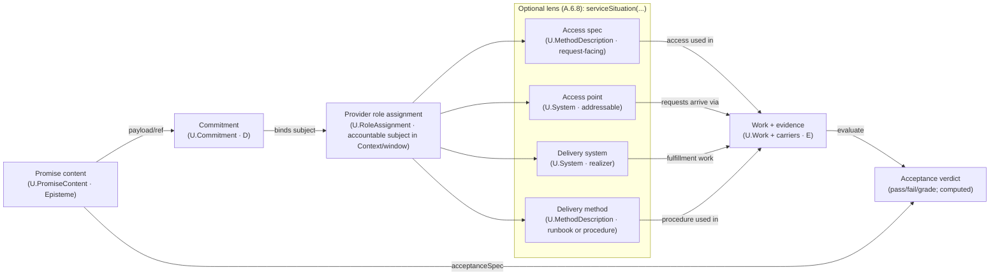

### A.2.3:4 - Solution — The unified concept `U.PromiseContent`

**Definition (normative).**
Within a `U.BoundedContext`, a **`U.PromiseContent`** is an **externally oriented promise clause**: a context‑local statement of (i) a **promised external effect**, (ii) **eligibility + access** (how a consumer may request/use), and (iii) **acceptance criteria** (SLO/SLA‑like targets) by which fulfillment is judged.

`U.PromiseContent` is **promise content** (`U.Episteme`), not a deontic binding. One or more explicit **`U.Commitment`** objects (A.2.8) MAY reference a `U.PromiseContent` as payload to bind an accountable principal/role‑assignment; the clause itself does not “obligate” anyone until such a commitment is represented.

In normative prose, the head phrase for `U.PromiseContent` is **promise content** (or **service offering clause** or **service promise clause**) per A.6.8; the bare noun *service* is not a valid shorthand for this kernel object.

* **Type:** `U.Episteme` (a promise clause on a carrier).
* **Scope:** design‑time concept; judged at run‑time by evidence from `U.Work`.
* **Time stance:** design-time concept; judged at run-time by evidence from `U.Work`.
* **Orientation:** consumer‑facing (“what you can rely on”), as opposed to capability (“what we can do”).
* **Prose head (normative):** *promise content* (Tech) / *service offering clause* (Plain; *service promise clause* acceptable synonym). (Both twins retain an explicit **clause** head‑kind to avoid act/content ambiguity and to comply with A.6.8 headword governance.)

#### A.2.3:4.1 - Core structure (minimal fields)

```
U.PromiseContent {
  context        : U.BoundedContext,   // where the promise is meaningful
  purpose        : Text/Episteme,      // the externally observable effect/value
  providerRole   : U.Role,             // role kind that may provide it (not a person/system)
  consumerRole?  : U.Role,             // optional role kind allowed to consume
  claimScope?    : U.ClaimScope,       // where the promise holds (G) — operating conditions/populations/locales
  accessSpec?    : U.MethodDescription,       // service access spec: request-facing interface/eligibility; not an access point system
  acceptanceSpec : U.Episteme,         // targets: SLO / acceptance targets (quality/throughput/latency/accuracy…); evaluated over same evidence base as promisedOutcomeSpecRef (CC‑A2.3‑18)
  promisedOutcomeSpecRef : OutcomeSpecRef, // promised outcome (work, result, or both) in disambiguated spec form
  unitOfDelivery?: Episteme,           // how delivered units are counted/measured (unit + countingRule; see A.7:5.10)
  version?       : SemVer/Text,
  timespan?      : Interval
}
```

* `promisedOutcomeSpecRef` MUST point to a `U.OutcomeSpec` (A.7:5.10). It is the promise-facing outcome template (work-only, result-only, or composite), not a `U.Work` episode and not an extensional delivered-result referent.
* `providerRole` and `consumerRole` are **role kinds**; the actual performers are **RoleAssignments** at run‑time.
* `acceptanceSpec` defines **what counts as fulfilled** (the test).
* `accessSpec` is **how to ask** (eligibility, protocol, counter, desk, API).
* **Internal delivery methods/runbooks are not part of the promise content.** Model them as `U.MethodDescription` and relate them to the clause via `serviceSituation(…)` (A.6.8) or explicit context relations; providers retain **Method autonomy**.

#### A.2.3:4.1.1 - Promised outcome spec (disambiguation: work vs post-work result)

`promisedOutcomeSpecRef` points to an `U.OutcomeSpec` episteme that makes explicit **what exactly is promised** — in *kind/spec* form — without collapsing it into either:

* the **promise content clause** itself (`U.PromiseContent`),
* the **delivery work** that happens at run‑time (`U.Work`), or
* the **resulting state/object** after the work.

This is a controlled **semantic precision restoration** for the everyday metonymy “outcome/service outcome”, which different communities use to mean (i) the work performed, (ii) the achieved result, or (iii) both.

**Terminology bridge (informative).**
In loose contract talk people say **promiseOutcomeSpec** (the description of what will be delivered) and **promiseOutcome** (what was actually delivered). Those lexical forms are metonymic: sometimes they mean “the work performed”, sometimes “the post‑work result”, and sometimes the pair.

In FPF:

* **promiseOutcomeSpec** → `U.OutcomeSpec` (A.7:5.10), referenced via `promisedOutcomeSpecRef`.
* **promiseOutcome** → an **extensional delivered outcome instance**. It is not a single kernel object; it is the **run‑time reality** that satisfies the outcome spec, understood according to `U.OutcomeSpec.mode`:

  * `WorkOnly` → the **set of delivery `U.Work` episode(s)** that satisfy `workSpec` (and, if present, the promised `methodConstraintRef`).
  * `ResultOnly` → the **post‑work state of the described referent(s)** on the declared `statePlaneRef` that satisfies `resultSpec.postConditionRef` (regardless of how it was achieved).
  * `Composite` → the pair: **(delivery Work episode(s), post‑work state)**.

  FPF points to this extensional delivered outcome instance by citing: (i) the relevant `U.Work` occurrence(s) and (ii) their **Δ anchors** (affected referents + pre/post anchors) on the declared state‑plane (A.15.1:4.2 item 10). Evidence carriers/telemetry are **epistemic witnesses** used to justify those anchors and acceptance verdicts—they are not themselves the delivered outcome.

If a Context needs an explicit handle for the delivered instance (e.g., for bundling, invoicing, or dispute cases), it MAY introduce a local kind such as `OutcomeInstance` with separate slots for: `{workRefs, affectedEntityRefs, postStateAnchors, evidenceRefs}`. Such a local reification MUST keep **(a) the extensional delivered instance**, **(b) the evidence about it**, and **(c) the outcome spec** (`U.OutcomeSpec`) distinct.

A conforming `U.OutcomeSpec` uses the canonical shape from A.7:5.10.2:

```
U.OutcomeSpec ::= {
  mode: WorkOnly | ResultOnly | Composite,

  workSpec?: {
    methodConstraintRef?: MethodDescriptionRef,   // optional: method is part of the promise (not “implementation detail”)
    workPredicateRef: EpistemeRef                 // predicate on `U.Work` facts/evidence
  },

  resultSpec?: {
    describedEntityRef?: EntityRef,               // what thing’s post‑state matters (may be kind‑labelled)
    statePlaneRef?: StatePlaneRef,                // where the predicate lives (A.7:3 pins)
    postConditionRef: EpistemeRef                 // predicate on post‑state (or evidence about it)
  }
}
```

* `workSpec` corresponds to the **work‑as‑promised** facet: it states the consumer‑facing *kind* of work (optionally constraining method) and the work predicate (e.g., duration, method ban, safety bound).
* `resultSpec` corresponds to the **result‑as‑promised** facet: it states the post‑work entity/state kind and the postcondition predicate.
* **Counting is not part of `U.OutcomeSpec`.** Counting lives on `U.PromiseContent.unitOfDelivery` as the `countingRule` mini‑schema (A.7:5.10.3). Outcome specs say *what* counts as delivery; unit‑of‑delivery specs say *how much* to count and how to avoid double counting.

**Examples (informative):**

* “Work 5 minutes” → `mode=WorkOnly`; `workPredicateRef` states duration ≥ 5 min; `methodConstraintRef` may be omitted.
* “Dig a hole” → `mode=ResultOnly`; `postConditionRef` describes the hole’s target state; method choice remains provider‑autonomous.
* “Hairstyle in ≤ 20 min, must be haircut+styling (not a wig)” → `mode=Composite`; `workSpec` expresses time + method constraint; `resultSpec` expresses the target hairstyle state.

**Naming note (normative).**
The head noun **outcome** is intentionally broad. Do **not** replace it with **result** when referring to the combined promise payload. If a passage means the **post‑work entity/state only**, say **result** and bind it to `resultSpec`. If it means the **work episode(s) promised**, say **work as promised** and bind it to `workSpec`.

#### A.2.3:4.1.2 - Recommended `acceptanceSpec` mini‑schema *(informative, non‑kernel)*

`acceptanceSpec : U.Episteme` is intentionally open‑ended in Core. However, to keep acceptance **computable** (and to avoid the legacy “pass verdict separate from delivery” mistake), Contexts are encouraged to express `acceptanceSpec` as a small bundle of references:

```
AcceptanceSpec (recommended) ::= {
  targetOutcomeSpecRef?: OutcomeSpecRef,  // default: SC.promisedOutcomeSpecRef
  criteriaRefs: [EpistemeRef],            // each criterion evaluates the *delivery evidence base* (U.Work facts + Δ anchors + admissible Observations)
  verdictScale: Episteme/ScaleRef,        // pass/fail/graded; MUST state how “non‑delivery” is represented
  Γ_timePolicyRef?: EpistemeRef           // how Γ_time is selected (per‑Work, per calendar window, per batch, per population, …)
}
```

* **`targetOutcomeSpecRef`** makes explicit *which* promised outcome is being judged; if omitted, it is the containing promise content’s `promisedOutcomeSpecRef`.
* **`criteriaRefs`** are the acceptance criteria (SLO targets, quality gates, compliance predicates, etc.). Each criterion is an evaluation over the **same evidence base** used to establish delivery of the targeted `U.OutcomeSpec`: `U.Work` facts/evidence plus the relevant **Δ anchors** (affected referents + pre/post anchors) on the declared state‑plane, and any admissible `U.Observation` witnesses.
* **`verdictScale`** declares the decision scale (boolean, trichotomy, graded). It MUST define what happens when the outcome is **not delivered** (e.g., `fail`, `N/A`, `Inconclusive`, or a dedicated grade).
* **`Γ_timePolicyRef`** keeps windowing explicit and non‑retroactive (F.10/F.12): it states whether judgement is per Work episode, per reporting window, per population, etc.

This mini-schema is a **recommendation only**: it is not a kernel object and may be flattened, encoded in a canonical SLO vocabulary, or carried in local contract records. Its purpose is to keep acceptance **discussable, auditable, and bridge-ready**.

#### A.2.3:4.2 - What `U.PromiseContent` is **not**

* **Not a provider:** use `System#ServiceProviderRole:Context` `U.RoleAssignment`.
* **Not a deontic commitment:** that is `U.Commitment` (A.2.8) referencing the promise content as payload.
* **Not an access point:** addressable “services/servers/desks/endpoints” are `U.System` (see A.6.8: *service access point* / *service delivery system*).
* **Not a method/recipe:** that is `U.Method or U.MethodDescription`.
* **Not a run/incident/ticket:** that is `U.Work`.
* **Not a schedule:** that is `U.WorkPlan`.
* **Not a capability:** capability is **provider‑intrinsic ability**; service is **outward promise**. A service may **require** certain capabilities, but it **is not** the capability.
* **Not a scope label:** do **not** use *applicability*, *envelope*, *generality*, or *validity* as names for **scope objects**; declare **Claim scope (G)** or **Work scope** explicitly where needed (A.2.6).

#### A.2.3:4.3 - Position in the enactment chain

* **Design‑time:**
  The context **declares Claim scope (G)** for acceptance (operating conditions, populations, locales) per A.2.6.
  The context may assert: `bindsCapability(ServiceProviderRole, Capability)`.
  Providers choose `Method or MethodDescription` to realise the promised effect described by the promise content.

* **Run‑time:**
  A **consumer** performs `Work` (e.g., a request/visit) — `performedBy: ConsumerRoleAssigning`.
  The **provider** performs `Work` to fulfil the promise content — `performedBy: ProviderRoleAssigning`.
  Delivered `Work` instances are evaluated against `acceptanceSpec`, **linked** to `promisedOutcomeSpecRef`, and **counted** via `unitOfDelivery`.
  SLA/SLO outcomes are therefore functions over **Work evidence**, not over the promise content object itself.

  (Terminology note: use `…RoleAssignment` consistently for the run‑time enactor relation; avoid the “RoleAssigning” variant unless it is a separately defined kind in the Context.)

> **Memory hook:** *Promise content promises, Method describes, Work proves.*

#### A.2.3:4.4 - Didactic card: The service delivery chain (clause → commitment → situation → work → acceptance)

> **Didactic (non‑normative).** This is a one‑screen “map” that stitches the modular pieces together:
> `U.PromiseContent` (A.2.3) → `U.Commitment` (A.2.8) → provider `U.RoleAssignment` (A.2.1) → *serviceSituation(...)* facet slots (A.6.8 lens) → `U.Work + carriers` (A.15) → acceptance verdict (A.2.3).
>
> This is **not new ontology**. It is a reader‑safety diagram that prevents two common category errors:
> (i) treating `U.PromiseContent` as something addressable (“the service you call”), and
> (ii) treating `serviceSituation(...)` as semantics rather than a *binding lens* over already‑defined kinds.



**Reading guide (one breath).**
* The **promise content** is *what is promised* (promise content).
* The **commitment** is *who is bound* (deontic accountability) and it **references** the clause.
* The **provider role assignment** is the accountable subject *that can act* in a given Context/window.
* `serviceSituation(...)` (A.6.8) is a **facet‑binding lens** that names the common “service talk” participants (access spec / access point / delivery system / delivery method) **without** collapsing them into the clause.
* **Work + evidence** is what happened; the **acceptance verdict** is computed by applying the clause’s `acceptanceSpec` to work evidence (not by reading the clause, and not by “looking at the service” as a system).

**Litmus rule (addressability).**
If you can *call / connect to / visit / restart / scale* it, you are talking about a **service access point** (system facet), not the **promise content** (promise content).


