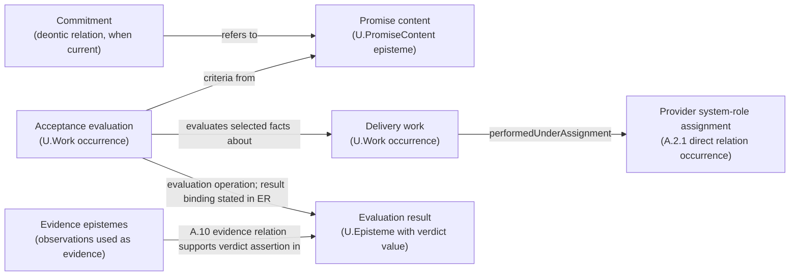

### A.2.3:4 - Solution - Define `U.PromiseContent` as the promise-content episteme

**Definition (normative).**
A **`U.PromiseContent`** is an externally oriented promise-content episteme. Its claim content states a promised consumer-side outcome, any eligibility predicate, and acceptance criteria by which fulfilment is evaluated. Its optional `accessSpec` describes the access method. Interpretation is fixed by its effective `U.ReferenceScheme`; `U.ClaimScope` states where the claims hold.

`U.PromiseContent` is not a deontic commitment relation. One or more explicit `U.Commitment` occurrences under A.2.8 may have the promise content in their referents position; the promise-content episteme does not obligate an actor by itself.

In normative prose, the head phrase is **promise content**. **Service offering clause** and **service promise clause** are admissible Plain twins for that promise-content use; bare *service* does not identify a promise-content episteme.

Species-level identity follows C.2.1:

```text
PromiseContentIdentity = <
  content,
  promisedOutcomeSpecRef,
  effectiveReferenceScheme
>
```

`promisedOutcomeSpecRef` is a `U.EpistemeRef` field that designates the exact A.2.3:4.1.1 `OutcomeSpec` episteme about which the promise claims are made; that episteme is the exact EntityOfConcern of this PromiseContent episteme. The field is not `EntityOfConcernSlot`: that SlotKind names the participant meaning only inside the reusable C.2.1 constitution `RelationSignature`. `OutcomeSpec` is a specification-use episteme form, not a separately admitted U-kind. The exact `claimScope` qualifies where the promise-content claims hold and remains outside the identity tuple.

* **FPF kind:** `U.Episteme`.
* **Time stance:** the promise content can be authored before delivery; later exact delivery-work facts, affected entities, post-work states, and any current delivery or acceptance relations are tested against the declared outcome and acceptance predicates. Evaluation work and the actual operation-result binding remain separate; when a verdict episteme is constituted, C.2.1 and A.15.PROD govern its identity and inception, while A.10 evidence relations support the relied-on assertions.
* **Orientation:** consumer-facing promise claims, not provider capability claims.
* **Publication boundary:** The selected promise-content `U.Episteme` may participate in an exact `EpistemePublicationRelation` for a declared audience and bounded use. `PublicationFormExpressionRelation` relates that selected edition to its publication form, and `PublicationFormBearingRelation` relates a `U.PresentationCarrier` to the form it bears. Promise-content identity follows the C.2.1 episteme identity rule; no publication-relation occurrence, form, or carrier enters that rule.

#### A.2.3:4.1 - Promise-content schema

```text
U.PromiseContent : U.Episteme {
  content                  : U.ClaimGraph,
  promisedOutcomeSpecRef   : U.EpistemeRef, resolving to OutcomeSpec,
  effectiveReferenceScheme: U.ReferenceScheme,
  providerSystemRoleKindRef : U.KindRef,
  consumerSystemRoleKindRef?: U.KindRef,
  claimScope               : U.ClaimScope,
  accessSpec?              : U.MethodDescription,
  acceptanceSpec           : U.Episteme,
  unitOfDelivery?          : U.Episteme
}
```

* `content` carries the promised-outcome, eligibility, and acceptance claims together with the optional `accessSpec` value when an access-method description is current; it is not an untyped text slot.
* `providerSystemRoleKindRef` and `consumerSystemRoleKindRef` are promise-content fields typed by the existing `U.KindRef`; each resolves to one exact local system-role kind. `accessSpec`, `acceptanceSpec`, and `unitOfDelivery` are episteme values carried by value in the claim graph; a publication or other declared representation may express them through `U.EpistemeRef` values that resolve to those same epistemes without changing their kinds. Changing one of these content values or resolved kind references changes `content` and therefore the promise-content identity.
* `promisedOutcomeSpecRef` resolves to the A.2.3:4.1.1 `OutcomeSpec` episteme.
* `effectiveReferenceScheme` makes the claim graph and its references interpretable.
* `providerSystemRoleKindRef` and `consumerSystemRoleKindRef` identify local work-facing kinds; actual providers and consumers enter only through named occurrences of directly declared species under `U.SystemRoleAssignment`.
* `claimScope` is the exact `U.ClaimScope` over which the promise claims hold; it states the applicable operating conditions, populations, locales, and other admitted slices instead of leaving extent implicit.
* `accessSpec` describes the access method enacted when the admitted holder system of an eligible consumer system-role assignment requests access; an access-point system remains separate.
* `acceptanceSpec` states the acceptance criteria and selects the exact evaluation Method. It cites a MethodDescription edition only when the acceptance claim depends on that episteme's claims. Evidence-admissibility conditions may be stated there; actual evidence-use relations remain separate.
* `unitOfDelivery` states how accepted delivery work is counted when counting is current.
* There is no generic `modelUseStructureRef` field. When an independently selected `BoundedModelUseStructure` changes one actually model-local receiving interpretation, the receiving assertion or use designates that structure separately; the structure neither identifies the promise content nor becomes an optional participant of `PromiseContentUse`. A genuinely structure-dependent relation species would require its own direct pattern, mandatory structure participant, stronger predicate, and occurrence-identity rule.
* An internal delivery method remains `U.Method`. An already identified episteme is a `U.MethodDescription` only when its exact `EntityOfConcern` resolves to that Method and at least one claim says how that Method is done. A promise-content or acceptance claim may cite that episteme for one named use; Method-selection work, performed work, and `PromiseContentUse` remain separately governed.

#### A.2.3:4.1.1 - OutcomeSpec - promised Work, post-work result, or both

This section is the authoritative FPF locus for the promise-facing `OutcomeSpec` shape. A.7 supplies the strict distinction among the specification episteme, Work occurrence, affected referent, post-work state, counting rule, and evidence; it does not define another schema.

`promisedOutcomeSpecRef` resolves to an independently identified specification-use episteme that says **what is promised**. `OutcomeSpec` is a specification-use episteme form, not a separately admitted U-kind.

```text
OutcomeSpec : U.Episteme ::= {
  mode: WorkOnly | ResultOnly | Composite,

  workSpec?: {
    methodConstraintRef?: U.MethodRef,            // resolves directly to an admitted U.Method
    methodDescriptionRef?: U.EpistemeRef,         // only when exact claims in one A.3.2-admitted edition are used
    workPredicateRef: U.EpistemeRef                // predicate on selected facts about delivery Work
  },

  resultSpec?: {
    entityOfConcernRef?: U.EntityRef,              // promised affected referent or its declared kind
    statePlaneRef?: StatePlaneRef,                 // where the post-condition is interpreted, when current
    postConditionRef: U.EpistemeRef                // predicate on the required post-work state
  }
}
```

Mode completeness is exact:

* `WorkOnly` requires `workSpec` and omits `resultSpec`;
* `ResultOnly` requires `resultSpec` and omits `workSpec`; and
* `Composite` requires both.

`workSpec` constrains selected facts about delivery Work. A Method constraint resolves directly to the Method; a separate MethodDescription reference is optional and edition-specific. `resultSpec` constrains the exact affected referent selected for the delivery and its required post-work state. At fulfilment time, state any actual-change, production, delivery, acceptance, or receiving-use relation under its own predicate. An optional mathematical Delta expression remains a separate lens only when a named comparison uses it; no `U.Work.Delta` field or universal change record is required.

In ordinary agreement wording, *outcome* may mean Work, achieved state, or both. Recover the intended mode instead of inventing one `OutcomeInstance` kind. A downstream bundling, invoicing, or dispute claim separately references the actual Work occurrences, affected entities, post-work states, direct relations, evidence epistemes, and evidence-use relations it needs.

**Examples.** `Work for at least five minutes` is WorkOnly. `A hole at least one metre deep exists at the stated site` is ResultOnly. `Cut and style the client's hair within twenty minutes, with the resulting hairstyle satisfying the evening-style condition` is Composite. In the last example, the exact Method constraint, delivery Work facts, client or hairstyle referent, post-work state, and evidence-use relations remain separate.

The head noun *outcome* is intentionally broad. When the passage means Work, affected entity, or required post-work state, name that object directly. Counting is not part of OutcomeSpec; A.2.3:4.1.2 governs `unitOfDelivery`.

#### A.2.3:4.1.2 - Unit-of-delivery counting

Use `unitOfDelivery` only when a receiving use counts accepted delivery. It is a specification-use episteme carried in the promise content.

An ordinary rule may say: `Count one accepted delivery per appointment; rework under the same appointment does not add another unit.` When replay or measurement needs a structured representation, use only the fields that rule requires:

```text
UnitOfDeliverySpec : U.Episteme ::= {
  unitDesignator: U.NameToken,
  countingRule: {
    selectorRef: U.EpistemeRef,                   // selects only delivery Work for which fulfilment obtains
    quantityRuleRef: U.EpistemeRef,               // maps selected facts to the count or measured quantity
    aggregationRef?: U.EpistemeRef,
    dedupeKeyRef?: U.EpistemeRef,
    countingPolicyRef?: U.EpistemeRef,
    measurementMethodRef?: U.MethodRef,
    measurementMethodDescriptionRef?: U.EpistemeRef,
    evidenceAdmissibilityRef?: U.EpistemeRef
  }
}
```

The selector admits only Work occurrences for which the promise's delivery and acceptance predicates are satisfied. When one Work occurrence can satisfy several promise contents or rework can repeat one delivery, `dedupeKeyRef` or the cited counting policy states the intended boundary. A measurement Method, its description, evidence-admissibility rule, evidence epistemes, and evidence-use relations appear only when the count depends on a measurement reading or relied-on evidence. Pure counting needs none of that apparatus.

If `unitOfDelivery` is absent, the local default is one unit per obtaining `PromiseContentFulfilmentRelation` occurrence. A separately governed charging relation may consume the resulting quantity but does not define this counting rule.

#### A.2.3:4.1.3 - Recommended `acceptanceSpec` mini-schema *(informative, non-kernel)*

Projects may express `acceptanceSpec` with the following small schema when downstream evaluation work requires replayable criteria and verdict semantics:

```
AcceptanceSpec (recommended) ::= {
  targetOutcomeSpecRef?: U.EpistemeRef,          // resolves to OutcomeSpec; default is SC.promisedOutcomeSpecRef
  criterionRefs: [U.EpistemeRef],                // each resolves to one evaluation-criterion episteme
  evaluationMethodRef: U.MethodRef,               // resolves directly to the evaluation Method
  evaluationMethodDescriptionRef?: U.EpistemeRef, // only when exact claims in one A.3.2-admitted edition are used
  verdictScaleDescriptionRef: U.EpistemeRef,     // resolves to one declared scale description
  GammaTimePolicyRef?: U.EpistemeRef             // resolves to the policy selecting the evaluation window
}
```

* **`targetOutcomeSpecRef`** makes explicit *which* promised outcome is being judged; if omitted, it is the containing promise content’s `promisedOutcomeSpecRef`.
* **`criterionRefs`** resolve to evaluation-criterion epistemes. Their predicates are evaluated over the same selected work facts and post-work state references used for the targeted `OutcomeSpec`; direct evidence relations separately support assertions about those facts and states.
* **`evaluationMethodRef`** resolves directly to the evaluation Method. **`evaluationMethodDescriptionRef`**, when present, cites one A.3.2-admitted episteme edition whose claims constrain or explain that Method; the description is neither the Method nor the evaluation Work.
* **`verdictScaleDescriptionRef`** resolves to one scale-description episteme governed by the characteristic and scale patterns. That description states the admitted verdict values and how non-delivery is represented. Informative examples include Boolean `pass/fail`, trichotomy `pass/partial/fail`, or named graded values, with non-delivery represented as `fail`, `N/A`, or `Inconclusive`; these values are examples, not defaults.
* **`GammaTimePolicyRef`** keeps temporal selection explicit and non-retroactive (F.10 and F.12): it resolves to the policy stating whether judgement is per work occurrence, reporting window, or another named temporal selection. Population and locale remain in `U.ClaimScope`; they are not temporal-policy values.

This mini-schema is a recommendation only: it does not admit another U-kind. An acceptance-specification episteme may contain these declared schema fields by value or refer to their values through the declared RefKinds. The resulting episteme remains inspectable and bridge-ready.

#### A.2.3:4.2 - What `U.PromiseContent` is **not**

* **Not a provider:** use an assignment occurrence and its declared species under `U.SystemRoleAssignment`. The occurrence identifies the provider System and assigned local kind; the species defines those participant meanings and the assigned-kind domain.
* **Not an individual deontic commitment:** that is one obtaining `U.Commitment` under A.2.8 whose actual duty bearer, exact referents, constitutive rule, instituting basis, scope, and validity are established independently.
* **Not an access point or bearer:** addressable *service*, server, desk, endpoint, process, component, application, host, or cluster wording first goes to A.6.P:4.11a. Recover whether it denotes code or another episteme, a Method, a Work occurrence or ordinary run, an exact bearer or access-providing arrangement, or another directly governed object; apply A.1 or A.1.SCR only when a separate repaired claim depends on an exact recovered entity being a system.
* **Not a method or method description:** the semantic way of doing is `U.Method`; a recipe or other episteme describing that way is `U.MethodDescription`.
* **Not delivery work or its description:** performed delivery is `U.Work`; a ticket, case description, or incident description is a separately governed episteme about planned or performed work.
* **Not a schedule:** that is `U.WorkPlan`.
* **Not a capability:** capability is the provider system's admitted ability to perform a declared work family or produce a declared result class within its `U.WorkScope`, measure set, qualification window, and currentness condition. Delivery under a promise may depend on one or more capability instances.
* **Not its scope or use interval:** `U.ClaimScope` states where the promise claims hold, `U.WorkScope` states where a provider capability can deliver work, and `PromiseUseIntervalSlot` states when one `PromiseContentUse` occurrence obtains. These are three different values.

#### A.2.3:4.3 - Promise content, delivery work, and evaluation work

* **Before delivery work:**
  The promise-content episteme declares its effective `U.ReferenceScheme`, named `U.ClaimScope`, promised outcome specification, access specification when current, and acceptance specification. The provider system's ability remains a holder-dependent `U.Capability` instance under A.2.2. A capability-fit predicate tests that instance against the thresholds selected for the planned delivery work, including any threshold stated by the chosen method description. Method-selection work may yield a C.11 `ChoiceResult`; `enactsMethod` obtains between the later delivery-work occurrence and the selected `U.Method`. A relied-on episteme is a `U.MethodDescription` only when it meets A.3.2 membership, and the promise-content or acceptance claim may cite it for the named use.

* **Run‑time:**
  For request or visit Work, use A.13 to identify the actual consumer System `S`, then let A.15.1 admit `requestWork` independently. If the current use must also state under which assignment the request was performed, F.6 checks `performedUnderAssignment(requestWork, consumerRA)` against the same assignment used by A.13 and compares `S` with `consumerRA.HolderSystemSlot`.
  For delivery Work, use A.13 to identify the actual provider System `S`, then let A.15.1 admit `deliveryWork` independently. If the current use must also state under which assignment the delivery was performed, F.6 checks `performedUnderAssignment(deliveryWork, providerRA)` against the same assignment used by A.13 and compares `S` with `providerRA.HolderSystemSlot`.
  For evaluation Work, use A.13 to identify the actual evaluator and let A.15.1 admit the dated occurrence before saying that it enacts the Method selected by `acceptanceSpec`. Add F.6 only if the current use must also state under which assignment the evaluation was performed. Cite the optional MethodDescription only when the evaluation claim depends on that edition. The actual evaluation-operation application carries its argument bindings and result value. When another use needs a durable verdict episteme, C.2.1 governs that episteme and A.15.PROD governs any current identity-inception claim. The counting rule in `unitOfDelivery` maps admitted fulfilment occurrences to unit counts.
  The verdict episteme may assert whether a named service-level objective or another acceptance criterion was satisfied during the declared window. When a separately obtaining `U.Commitment` has the same `U.PromiseContent` in its referents position, the supported assertion concerns fulfilment of content that is also a referent of the obligation. Neither the operation-result binding, verdict episteme, nor commitment is a property of the promise-content episteme.

  When a separate F.6 `performedUnderAssignment(W, RA)` claim is made, `W` is already admitted and `RA` is the same assignment used by A.13. F.6 compares that assignment's holder with the actual performer already identified through A.13 and used by A.15.1. A missing or failed F.6 check leaves the Work intact.

> **Memory hook:** *Promise content states what is promised. A method constrains possible work. A system performs work. Evaluation binds a result value. A verdict episteme states the judgment. Evidence supports that assertion.*

#### A.2.3:4.4 - Didactic card: Relations around one service-delivery evaluation

> **Didactic (non-normative).** This representation keeps each promise-content episteme, access-description episteme, work occurrence, and direct relation in one delivery evaluation visible without prescribing an order of work. Promise content and an access description remain epistemes; an individual commitment and a system-role assignment remain relations; delivery and evaluation remain work occurrences; evidence remains in its A.10 relations. When order matters, describe semantic method order in `U.MethodDescription`, intended dated order in `U.WorkPlan`, and transformation dependencies in the relevant `TransformationFlowStructure`.
>
> `U.PromiseContent` states the promise. An A.2.8 `U.Commitment` relation may refer to that content; its duty-bearer position is filled by one System or separately identified party. The provider-assignment species defines holder and assigned-kind meanings. Delivery and evaluation follow the §4.3 route: A.13 identifies who actually performed the Work, and A.15.1 admits the dated occurrence independently. The diagram shows an F.6 edge only when this case also needs the exact assignment under which that Work was performed. Evidence relations support selected delivery-work facts and post-work states. The evaluation operation carries its result binding, while C.2.1 identifies any verdict episteme and A.15.PROD states any identity-inception claim.
>
> This informative diagram is a publication-side representation, not new ontology. It prevents two category errors: treating `U.PromiseContent` as the addressable access system, and treating a publication-side list or diagram of service senses as a relation occurrence that replaces the direct relations shown here.

**Reading guide (one breath).**
* The **promise content** is the consumer-facing outcome and acceptance statement.
* In the A.2.8 **commitment relation**, the actual duty-bearer position is filled directly and the referents position contains the promise-content clause. The exact constitutive rule and its required instituting basis must obtain before that individual relation is asserted.
* The **provider system-role assignment** is an occurrence of a declared assignment species. The species defines the holder, assigned-kind, and any other identity-bearing participant meanings; the occurrence identifies the provider System, its assigned local kind, and any other participant values. The assertion has exact claim content, EntityOfConcern, and effective ReferenceScheme; its ClaimScope, selected slice, normative-frame edition, qualification window, or operating condition is stated separately when it changes interpretation or validity. None is a world-side assignment participant.
* A.6.P:4.11a recovers the concrete referent or relation denoted by *service* wording. It adds no service-situation participant: provider assignment, access description, access-point system, delivery system, delivery method, promise content, and work occurrence remain distinct and keep their own kinds. Use A.10 for the evidence relations.
* **Delivery Work** is what happened. Follow the §4.3 performer-and-Work route, and add the separate F.6 assignment check only if this use must also say exactly under which assignment the Work was performed. Exact affected referents, pre-work and post-work states, and any actual-change, production, delivery, or acceptance relations remain separately identified. Evidence-use relations support assertions about those facts. Evaluation Work follows the same route before its selected evaluation Method, application result, and any verdict episteme are stated separately.

**Litmus rule (addressability).**
If the current claim is about invocation, connection, visitation, restart, or scaling, first use A.6.P:4.11a to recover the exact process, deployed component, endpoint, application, host, cluster, desk, or other bearer. That cue establishes neither `U.System` nor a whole delivery-system boundary. Apply A.1 or A.1.SCR only when the repaired claim depends on systemhood; after recognition, call the entity a **service access point** or **service delivery system** only when that exact boundary claim is current. Otherwise keep the exact bearer and keep promise content separate.

