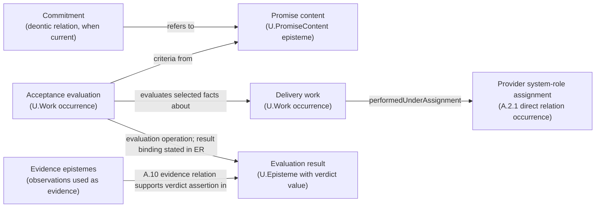

### A.2.3:4 - Solution - Define `U.PromiseContent` as the promise-content episteme

**Definition (normative).**
A **`U.PromiseContent`** is an externally oriented promise-content episteme. Its claim content states a promised consumer-side outcome, any eligibility predicate, and acceptance criteria by which fulfilment is evaluated. Its optional `accessSpec` describes the access method. Interpretation is fixed by its effective `U.ReferenceScheme`; `U.ClaimScope` states where the claims hold.

`U.PromiseContent` is not a deontic commitment relation. One or more explicit `U.Commitment` occurrences under A.2.8 may have the promise content in their referents position; the promise-content episteme does not obligate an actor by itself.

In normative prose, the head phrase is **promise content**. **Service offering clause** and **service promise clause** are admissible Plain twins for that promise-content use; bare *service* does not identify a promise-content episteme.

Species-level identity follows C.2.1:

```text
PromiseContentIdentity = <
  content,
  promisedOutcomeSpecRef,
  effectiveReferenceScheme
>
```

`promisedOutcomeSpecRef` is the species-level realization of `EntityOfConcernSlot`; it is a `U.EpistemeRef` that resolves to the A.7 `OutcomeSpec` episteme about which the promise claims are made. `OutcomeSpec` is a specification-use episteme form, not a separately admitted U-kind. The exact `claimScope` qualifies where the promise-content claims hold and remains outside the identity tuple. A selected model-use structure is not an episteme constituent or generic identity qualifier: it may be designated only by a receiving assertion or use whose interpretation actually depends on that structure. A direct dependent species may strengthen identity only when the pattern that defines that species explicitly adds the discriminator.

* **FPF kind:** `U.Episteme`.
* **Time stance:** the promise content can be authored before delivery; later exact delivery-work facts, affected entities, post-work states, and any current delivery or acceptance relations are tested against the declared outcome and acceptance predicates. Evaluation work and the actual operation-result binding remain separate; when a verdict episteme is constituted, C.2.1 and A.15.PROD govern its identity and inception, while A.10 evidence relations support the relied-on assertions.
* **Orientation:** consumer-facing promise claims, not provider capability claims.
* **Publication boundary:** The selected promise-content `U.Episteme` may participate in an exact `EpistemePublicationRelation` for a declared audience and bounded use. `PublicationFormExpressionRelation` relates that selected edition to its publication form, and `PublicationFormBearingRelation` relates a `U.PresentationCarrier` to the form it bears. Promise-content identity follows the C.2.1 episteme identity rule; no publication-relation occurrence, form, or carrier enters that rule.

#### A.2.3:4.1 - Promise-content schema

```text
U.PromiseContent : U.Episteme {
  content                  : U.ClaimGraph,
  promisedOutcomeSpecRef   : U.EpistemeRef, resolving to OutcomeSpec,
  effectiveReferenceScheme: U.ReferenceScheme,
  providerSystemRoleKindRef : U.KindRef,
  consumerSystemRoleKindRef?: U.KindRef,
  claimScope               : U.ClaimScope,
  accessSpec?              : U.MethodDescription,
  acceptanceSpec           : U.Episteme,
  unitOfDelivery?          : U.Episteme
}
```

* `content` carries the promised-outcome, eligibility, and acceptance claims together with the optional `accessSpec` value when an access-method description is current; it is not an untyped text slot.
* `providerSystemRoleKindRef` and `consumerSystemRoleKindRef` are context fields typed by the existing `U.KindRef`; each resolves to one exact local system-role kind. `accessSpec`, `acceptanceSpec`, and `unitOfDelivery` are episteme values carried by value in the claim graph; a publication or other declared representation may express them through `U.EpistemeRef` values that resolve to those same epistemes without changing their kinds. Changing one of these content values or resolved kind references changes `content` and therefore the promise-content identity.
* `promisedOutcomeSpecRef` resolves to the A.7 `OutcomeSpec` episteme. It is neither a `U.Work` occurrence, an affected or delivered entity, an actual operation-result binding, nor a verdict episteme.
* `effectiveReferenceScheme` makes the claim graph and its references interpretable.
* `providerSystemRoleKindRef` and `consumerSystemRoleKindRef` identify local work-facing kinds; actual providers and consumers enter only through named occurrences of directly declared species under `U.SystemRoleAssignment`. A kind reference neither admits a holder nor creates an assignment or Work.
* `claimScope` is the exact `U.ClaimScope` over which the promise claims hold; it states the applicable operating conditions, populations, locales, and other admitted slices instead of leaving extent implicit.
* `accessSpec` describes the access method enacted when the admitted holder system of an eligible consumer system-role assignment requests access; an access-point system remains separate.
* `acceptanceSpec` states the acceptance criteria, identifies the evaluation method through its `U.MethodDescription`, and states evidence-admissibility conditions for supported assertions; actual evidence relations remain separate.
* `unitOfDelivery` states how accepted delivery work is counted when counting is current.
* There is no generic `modelUseStructureRef` field. When an independently selected `BoundedModelUseStructure` changes one actually model-local receiving interpretation, the receiving assertion or use designates that structure separately; the structure neither identifies the promise content nor becomes an optional participant of `PromiseContentUse`. A genuinely structure-dependent relation species would require its own direct pattern, mandatory structure participant, stronger predicate, and occurrence-identity rule.
* An internal delivery method remains `U.Method`. An already identified episteme is a `U.MethodDescription` only when its exact `EntityOfConcern` resolves to that Method and at least one claim says how that Method is done. A promise-content or acceptance claim may cite that episteme for one named use; Method-selection work, performed work, and `PromiseContentUse` remain separately governed.

#### A.2.3:4.1.1 - Promised outcome spec (disambiguation: work vs post-work result)

`promisedOutcomeSpecRef` points to an A.7 `OutcomeSpec` episteme that makes explicit **what is promised** in kind form and specification form without collapsing it into either:

* the **promise content clause** itself (`U.PromiseContent`),
* the **delivery work** that happens at run‑time (`U.Work`), or
* the **post-work state or affected referent** after the work.

This is a controlled **semantic precision restoration** for the everyday metonymy "outcome" or "service outcome", which different communities use to mean (i) the work performed, (ii) the achieved result, or (iii) both.

**Terminology bridge (informative).**
In loose agreement or SLA wording people say **promiseOutcomeSpec** (the description of what will be delivered) and **promiseOutcome** (what was actually delivered). Those lexical forms are metonymic: sometimes they mean “the work performed”, sometimes “the post-work result”, and sometimes the pair.

In FPF:

* **promiseOutcomeSpec** -> A.7 `OutcomeSpec`, referenced via `promisedOutcomeSpecRef`.
* **promiseOutcome** -> an **extensional delivered outcome instance**. It does not have one kernel kind; it is the run-time reality that satisfies the outcome specification, interpreted according to `OutcomeSpec.mode`:

  * `WorkOnly` → the **set of delivery `U.Work` episode(s)** that satisfy `workSpec` (and, if present, the promised `methodConstraintRef`).
  * `ResultOnly` → the **post‑work state of the described referent(s)** on the declared `statePlaneRef` that satisfies `resultSpec.postConditionRef` (regardless of how it was achieved).
  * `Composite` → the pair: **(delivery Work episode(s), post‑work state)**.

  FPF identifies the extensional delivered outcome by citing the relevant `U.Work` occurrences, exact affected or delivered entities, applicable actual-change and delivery relations, and the selected Delta expression for affected referents together with their pre-work and post-work states on the declared state plane (A.15.1:4.2 item 10). Evidence epistemes derived from telemetry may enter A.10 evidence relations supporting claims about those facts and states and about later evaluation-result epistemes; neither an evidence episteme nor the `U.PresentationCarrier` that bears its publication form through `PublicationFormBearingRelation` is the delivered outcome.

When bundling, invoicing, or dispute handling needs a downstream claim to identify the delivered instance, that claim's episteme separately references the delivery-work occurrences, affected entities, post-work states, evidence epistemes, and A.10 evidence-relation occurrences. Each object or relation keeps its own identity and defining or constraining rule. It does not create a local `OutcomeInstance` kind, collapse the delivered reality into `OutcomeSpec`, or let an invoice, dispute record, other record form, or `U.PresentationCarrier` become either the episteme or the delivered instance.

A conforming `OutcomeSpec` uses this explicit-RefKind reading of the specification-use shape in A.7:5.10.2:

```
OutcomeSpec : U.Episteme ::= {
  mode: WorkOnly | ResultOnly | Composite,

  workSpec?: {
    methodConstraintRef?: U.EpistemeRef,          // resolves to the U.MethodDescription constraining the promised work
    workPredicateRef: U.EpistemeRef               // resolves to a predicate on selected facts about U.Work occurrences
  },

  resultSpec?: {
    entityOfConcernRef?: U.EntityRef,             // affected referent whose declared FPF kind is named
    statePlaneRef?: StatePlaneRef,                // where the predicate lives (A.7:3 pins)
    postConditionRef: U.EpistemeRef               // resolves to the post-state predicate; evidence supports the resulting claim separately
  }
}
```

* `workSpec` corresponds to the **work-as-promised** facet: it states the consumer-facing *kind* of work (optionally constraining method) and the work predicate (e.g., duration, method ban, safety limit).
* `resultSpec` corresponds to the **result-as-promised** facet: `entityOfConcernRef` identifies the affected entity, `statePlaneRef` identifies the state plane when current, and `postConditionRef` identifies the required post-work state predicate.
* **Counting is not part of `OutcomeSpec`.** Counting lives in `U.PromiseContent.unitOfDelivery` as the `countingRule` mini-schema (A.7:5.10.3). Outcome specifications say what counts as delivery; unit-of-delivery specifications say how much to count and how to avoid double counting.

**Examples (informative):**

* “Work 5 minutes” → `mode=WorkOnly`; `workPredicateRef` states duration ≥ 5 min; `methodConstraintRef` may be omitted.
* “Dig a hole” → `mode=ResultOnly`; `postConditionRef` describes the hole’s target state; method choice remains provider‑autonomous.
* “Hairstyle in ≤ 20 min, must be haircut+styling (not a wig)” → `mode=Composite`; `workSpec` expresses time + method constraint; `resultSpec` expresses the target hairstyle state.

**Naming note (normative).**
The head noun **outcome** is intentionally broad. Do **not** replace it with **result** when referring to the combined work-and-result specification. If a passage means the affected entity, name that entity and link it to `resultSpec.entityOfConcernRef`. If it means the required post-work state, name the state predicate and link it to `resultSpec.postConditionRef`. If it means the promised work occurrences, say **work as promised** and link them to `workSpec`.

#### A.2.3:4.1.2 - Recommended `acceptanceSpec` mini‑schema *(informative, non‑kernel)*

Projects may express `acceptanceSpec` with the following small schema when downstream evaluation work requires replayable criteria and verdict semantics:

```
AcceptanceSpec (recommended) ::= {
  targetOutcomeSpecRef?: U.EpistemeRef,          // resolves to OutcomeSpec; default is SC.promisedOutcomeSpecRef
  criterionRefs: [U.EpistemeRef],                // each resolves to one evaluation-criterion episteme
  evaluationMethodDescriptionRef: U.EpistemeRef, // resolves to the U.MethodDescription for evaluation work
  verdictScaleDescriptionRef: U.EpistemeRef,     // resolves to one declared scale description
  GammaTimePolicyRef?: U.EpistemeRef             // resolves to the policy selecting the evaluation window
}
```

* **`targetOutcomeSpecRef`** makes explicit *which* promised outcome is being judged; if omitted, it is the containing promise content’s `promisedOutcomeSpecRef`.
* **`criterionRefs`** resolve to evaluation-criterion epistemes. Their predicates are evaluated over the same selected work facts and post-work state references used for the targeted `OutcomeSpec`; direct evidence relations separately support assertions about those facts and states.
* **`evaluationMethodDescriptionRef`** resolves to the `U.MethodDescription` for the method enacted by evaluation work. The description does not perform the evaluation.
* **`verdictScaleDescriptionRef`** resolves to one scale-description episteme governed by the characteristic and scale patterns. That description states the admitted verdict values and how non-delivery is represented. Informative examples include Boolean `pass/fail`, trichotomy `pass/partial/fail`, or named graded values, with non-delivery represented as `fail`, `N/A`, or `Inconclusive`; these values are examples, not defaults.
* **`GammaTimePolicyRef`** keeps temporal selection explicit and non-retroactive (F.10 and F.12): it resolves to the policy stating whether judgement is per work occurrence, reporting window, or another named temporal selection. Population and locale remain in `U.ClaimScope`; they are not temporal-policy values.

This mini-schema is a recommendation only: it does not admit another U-kind. An acceptance-specification episteme may contain these declared schema fields by value or refer to their values through the declared RefKinds. The resulting episteme remains inspectable and bridge-ready without turning its publication form into identity.

#### A.2.3:4.2 - What `U.PromiseContent` is **not**

* **Not a provider:** use an assignment occurrence and its declared species under `U.SystemRoleAssignment`. The occurrence identifies the provider System and assigned local kind; the species defines those participant meanings and the assigned-kind domain.
* **Not an individual deontic commitment:** that is one obtaining `U.Commitment` under A.2.8 whose actual duty bearer, exact referents, constitutive rule, instituting basis, scope, and validity are established independently.
* **Not an access point or bearer:** addressable *service*, server, desk, endpoint, process, component, application, host, or cluster wording first goes to A.6.P:4.11a. Recover whether it denotes code or another episteme, a Method, a Work occurrence or ordinary run, an exact bearer or access-providing arrangement, or another directly governed object; apply A.1 or A.1.SCR only when a separate repaired claim depends on an exact recovered entity being a system.
* **Not a method or method description:** the semantic way of doing is `U.Method`; a recipe or other episteme describing that way is `U.MethodDescription`.
* **Not delivery work or its description:** performed delivery is `U.Work`; a ticket, case description, or incident description is a separately governed episteme about planned or performed work.
* **Not a schedule:** that is `U.WorkPlan`.
* **Not a capability:** capability is the provider system's admitted ability to perform a declared work family and meet any declared result-class predicate within its `U.WorkScope`, measure set, qualification window, and currentness condition. Delivery under a promise may depend on one or more capability instances, but the promise-content episteme is not a capability.
* **Not its scope or use interval:** `U.ClaimScope` states where the promise claims hold, `U.WorkScope` states where a provider capability can deliver work, and `PromiseUseIntervalSlot` states when one `PromiseContentUse` occurrence obtains. These are three different values.

#### A.2.3:4.3 - Promise content, delivery work, and evaluation work

* **Before delivery work:**
  The promise-content episteme declares its effective `U.ReferenceScheme`, named `U.ClaimScope`, promised outcome specification, access specification when current, and acceptance specification. The provider system's ability remains a holder-dependent `U.Capability` instance under A.2.2. A capability-fit predicate tests that instance against the thresholds selected for the planned delivery work, including any threshold stated by the chosen method description. Method-selection work may yield a C.11 `ChoiceResult`; `enactsMethod` obtains between the later delivery-work occurrence and the selected `U.Method`. A relied-on episteme is a `U.MethodDescription` only when it meets A.3.2 membership, and the promise-content or acceptance claim may cite it for the named use. That citation establishes neither Method selection, later `enactsMethod`, `PromiseContentUse`, evidence, nor acceptance.

* **Run‑time:**
  The admitted holder system `S = consumerRA.HolderSystemSlot` of the named consumer `U.SystemRoleAssignment` performs request or visit `U.Work` under that assignment. When the attribution is stated explicitly, use `performedUnderAssignment(requestWork, consumerRA)`.
  The admitted holder system `S = providerRA.HolderSystemSlot` of the named provider `U.SystemRoleAssignment` performs delivery `U.Work` under that assignment. When the attribution is stated explicitly, use `performedUnderAssignment(deliveryWork, providerRA)`.
  A system performing evaluation work enacts the evaluation method described by `acceptanceSpec`; the actual evaluation-operation application carries its exact argument bindings and evaluation-result value. When another use needs a durable verdict episteme, C.2.1 governs that episteme and A.15.PROD governs any current entity-identity-inception claim. The counting rule stated by `unitOfDelivery` maps admitted fulfilment occurrences to unit counts.
  The verdict episteme may assert whether a named service-level objective or another acceptance criterion was satisfied during the declared window. When a separately obtaining `U.Commitment` has the same `U.PromiseContent` in its referents position, the supported assertion concerns fulfilment of content that is also a referent of the obligation. Neither the operation-result binding, verdict episteme, nor commitment is a property of the promise-content episteme.

  In each `performedUnderAssignment(W, RA)` occurrence, `WorkOccurrenceSlot` is filled by `W` and the declaration-local `SystemRoleAssignmentSlot` by the named A.2.1 assignment occurrence `RA`; the admitted holder system `S = RA.HolderSystemSlot` is the actual performer. The assignment does not act, and no provider-assignment or consumer-assignment pseudo-kind is introduced.

> **Memory hook:** *Promise content states what is promised. A method constrains possible work. A system performs work. Evaluation binds a result value. A verdict episteme states the judgment. Evidence supports that assertion.*

#### A.2.3:4.4 - Didactic card: Relations around one service-delivery evaluation

> **Didactic (non-normative).** This representation keeps each promise-content episteme, access-description episteme, work occurrence, and direct relation in one delivery evaluation visible without prescribing an order of work. Promise content and an access description remain epistemes; an individual commitment and a system-role assignment remain relations; delivery and evaluation remain work occurrences; evidence remains in its A.10 relations. When order matters, describe semantic method order in `U.MethodDescription`, intended dated order in `U.WorkPlan`, and transformation dependencies in the relevant `TransformationFlowStructure`.
>
> `U.PromiseContent` states the promise. An A.2.8 `U.Commitment` relation may refer to that content; its duty-bearer position is filled by one System or separately identified party. The provider-assignment species defines the holder and assigned-kind participant meanings; an occurrence supplies their values for the case. Delivery `U.Work` occurs. Evidence relations support claims about selected delivery-work facts and post-work states. A System performing evaluation Work enacts the evaluation Method; the operation application carries its result binding, while C.2.1 identifies any verdict episteme and A.15.PROD states any identity-inception claim.
>
> This informative diagram is a publication-side representation, not new ontology. It prevents two category errors: treating `U.PromiseContent` as the addressable access system, and treating a publication-side list or diagram of service senses as a relation occurrence that replaces the direct relations shown here.

**Reading guide (one breath).**
* The **promise content** is the consumer-facing outcome and acceptance statement.
* In the A.2.8 **commitment relation**, the actual duty-bearer position is filled directly and the referents position contains the promise-content clause. The exact constitutive rule and its required instituting basis must obtain before that individual relation is asserted.
* The **provider system-role assignment** is an occurrence of a declared assignment species. The species defines the holder, assigned-kind, and any other identity-bearing participant meanings; the occurrence identifies the provider System, its assigned local kind, and any other participant values. Taxonomy, scheme, and generic context may interpret an assertion but are not generic world-side assignment participants.
* A.6.P:4.11a recovers the concrete referent or relation denoted by *service* wording. It adds no service-situation participant: provider assignment, access description, access-point system, delivery system, delivery method, promise content, and work occurrence remain distinct and keep their own kinds. Use A.10 for the evidence relations.
* **Delivery work** is what happened. Evidence relations support claims about selected facts concerning that occurrence and any post-work state expressed by its selected effect Delta. A system performing evaluation work enacts the declared evaluation method over those facts and states; the actual evaluation operation has its own result binding, and a separately constituted evaluation-result episteme may carry the verdict assertion.

**Litmus rule (addressability).**
If the current claim is about invocation, connection, visitation, restart, or scaling, first use A.6.P:4.11a to recover the exact process, deployed component, endpoint, application, host, cluster, desk, or other bearer. That cue establishes neither `U.System` nor a whole delivery-system boundary. Apply A.1 or A.1.SCR only when the repaired claim depends on systemhood; after recognition, call the entity a **service access point** or **service delivery system** only when that exact boundary claim is current. Otherwise keep the exact bearer and keep promise content separate.

