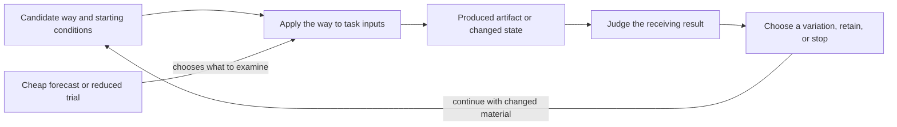
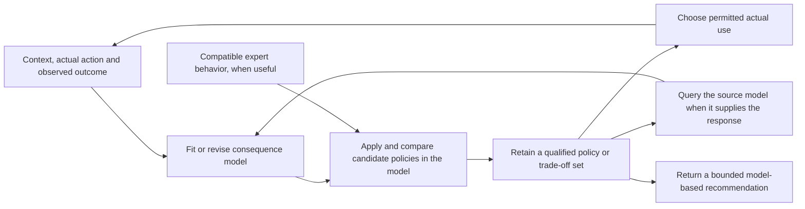

### C.40:4 - Solution

Perform a feasible change, examine what it produced, and use that result to choose a worthwhile continuation. Preserve enough of the material and its conditions to make that continuation possible.

#### C.40:4.1 - Make one small development pass

1. **Recover usable material and the local question.** Identify the actual editable or executable input and the conditions for using it. State the difference you can examine and any selected receiving contribution. Keep an original when comparison or recovery requires it.
2. **Select and perform a feasible variation.** Use the available professional operation to change, recombine or use the material differently. State what is changed and what remains protected. If the operation is unknown, use C.39 for that local contribution. An unperformed variation remains a proposal with its missing prerequisite.
3. **Examine the resulting difference.** Compare what was intended with what can now be observed or otherwise established under the relevant Method. Include a useful unexpected difference. Distinguish a result that helps one question and fails another.
4. **Preserve the material needed for the justified next use.** Keep the changed artifact or result and the inputs, settings or explanation needed to continue. Retain a failed or mixed result when it changes the next question. A descriptor or favourable evaluation alone may not let another participant reproduce or develop the result.
5. **Choose continuation, retention or stop.** Ask what another attainable result could change, what producing and carrying it would cost, and what work that would displace. Continue only the branches that warrant that burden. A sufficient result or a lack of worthwhile continuation can close the search.

Several variations can share one pass when they answer the same local question and their outcomes remain distinguishable. No population size, fixed branching factor, archive, new hypothesis or exhaustive trial of every variant is required.

#### C.40:4.2 - Continue without losing the question or the material

For a selected contribution, examine variations against its requirements while retaining an intermediate result only for a stated useful continuation. A lower present score can coexist with that reason; retention does not make the variation the preferred option.

Before a receiving contribution is selected, examine a local change that is already intelligible: for example, what reversing a playable recording does, or what a complete time-ordered view exposes. A newly suggested use becomes a question to investigate, not evidence of demand or value. Stop if no continuation warrants its burden.

Preserve the actual permissions, confidentiality limits, means and participant capabilities relevant to the next use. A colleague who receives the recording or code may still lack the skill or right needed for the proposed continuation. Retaining material is different from funding further work or preserving an exercisable option.

#### C.40:4.3 - Coupled problem-and-solution search

Enter here when problems and available ways need development together. C.40.CD supplies the full Method: recover a sought result and usable construction, form a consequential changed question, adapt the obtaining operation, examine it under target conditions, and use the outcome to choose the next question or use.

Keep the original receiving requirement connected to any narrower or exploratory problem. A partial target result may permit one useful comparison while another needed comparison remains unsupported. The next inquiry follows that remaining condition or another worthwhile use of the new construction.

Use section 4.1's material-changing and examination operations where needed. A sufficient existing answer can finish the work. B.5.QD constructs a missing question; C.39.RO constructs an operation for changed or combined use. C.40.CD connects those results through target application and preserves the conditions for a useful continuation.

When a construct's unfamiliar response must become a useful reproducible application, C.40.CU connects the needed probe, application, arrangement and receiving use. It can stop at a bounded response or conditional construction, and returns to this pattern for further worthwhile variation. Ordinary material development does not require that larger question.

#### C.40:4.4 - Use stronger claims only when they matter

A few explained variations need no formal archive or front. Use C.18 when retained exploration value, lineage, possibility-space change or a non-dominated front is claimed. That account records the relevant relations; it does not perform generation.

C.19 supplies continuation policy for a still-live search pool, while C.11 supplies a local choice. C.38 supplies comparison of complete-enough ways for one result. None converts material retention into current selection or permission to use the result.

For assurance-bearing use, identify the material, performed operation or still-proposed operation, examination basis and receiving conditions precisely enough for the claim. An observed difference, its evaluation, a proposed explanation and a claimed later effect need their own support.

#### C.40:4.5 - Develop against opponents that adapt to the current way

Use this branch when a useful way must respond to another participant's actions and a fixed collection of challenges no longer exposes its consequential weaknesses. A simulated opponent, a test generator or an authorized exercise team can search for those weaknesses. Prefer fixed representative trials when they already answer the question; maintaining adaptive opponents adds work and can reward behavior irrelevant to the receiving use.

Begin with the interaction that matters. Specify what each side can observe, when it acts, which actions are permitted, how the interaction ends and which outcomes receiving work values. Give the challenger a way to produce a meaningful difficulty within those conditions. A challenger that wins by exceeding the permitted load, seeing private future choices or exploiting a simulator error has exposed a setup defect unless that condition belongs to the intended use. Developing another participant's behavior changes the conditions faced by the candidate; it need not change what counts as a useful result.

**Build an informative first interaction.** Start with a challenge the available way can engage with, so different variations can produce distinguishable outcomes. If every attempt fails before the operation under development can act, simplify a named condition or supply the missing prerequisite. Retain the original receiving requirement while using that easier development case. Choose the challenger's objective separately from the candidate's objective: blindly negating a candidate score can reward early termination, wasted effort or another event that teaches nothing useful.

**Alternate development with an intelligible comparison.** Hold the candidate fixed while finding a permitted response that defeats or strains it. Examine the failure mechanism. Then hold a selected set of challenges fixed while changing the candidate to address that mechanism. A search algorithm, a subject specialist or a team can construct the variation; the representation and changing operation must actually permit it. Several fresh starts, different initial conditions or different allowed strategies can expose weaknesses that one continuing opponent misses. If teams participate, examine the interaction of their strategies as well as individual performance. Alternation is an affordable default, not a requirement that every interacting population update in this order.

**Keep challenges for what they reveal.** Preserve executable opponents or sufficiently complete exercise instructions, initial conditions, observation rules and meaningful failure cases. Include earlier challenges that expose different weaknesses, even when they no longer defeat the incumbent. Recheck proposed replacements against them. Sampling from a growing collection limits recurring cost, but rare failures can disappear from the sample; retain protected cases explicitly when their loss matters. Remove redundant cases only relative to the candidate set and conditions used to establish redundancy. A later way can fail on an old challenge that today's way handles, so a presently weak opponent is not universally dispensable.

**Choose on a common basis.** Compare the incumbent and proposed replacement against the same declared opponents, conditions and outcome rule. For a stochastic interaction, use enough repeated trials to distinguish a useful change from the uncertainty relevant to the decision. Keep individual outcomes or failure classes visible beside any aggregate. A weighted average answers a question about that weighting; a worst-case requirement needs its own comparison. Cyclic advantages can make different candidates useful against different opponents without providing one best candidate.

Separate success against the latest opponent from success against retained opponents. For a broader claim, examine opponents or situations not used to develop or select the candidate, such as a separately developed opponent family or a receiving-use trial. A reserve repeatedly used to select replacements becomes part of selection evidence. It is no longer an untouched final test. Broader success supports the examined family and conditions; it does not establish superiority over every possible opponent or indefinite progress.

**Use the result and revise locally.** Return the usable candidate, the challenges needed to reproduce its strengths and failures, the comparison and its limits, and the next justified use or development question. A specialist can be retained for its supported situation while a more broadly useful candidate is selected elsewhere. Include challenge construction, repeated interactions, retained material and independent examination in the cost comparison. Stop when the receiving result is sufficient, no informative permitted challenge can be obtained at worthwhile cost, or the interaction has become irrelevant to the receiving need.

If the required outcome or evaluation procedure changes, use E.23:4.1a and A.19.ECS:4.5 for the affected comparison. If only the opponent changes, rerun the candidates against a common relevant opponent set before calling the score change improvement. If the challenger defeats the task formulation rather than the candidate, return that condition to C.40.CD instead of treating impossible demands as productive pressure.

#### C.40:4.6 - Develop a set of challenges and ways of handling them

Use this branch when choosing the next challenge and finding a way to handle it need to inform one another. A fixed exercise sequence may repeat what is already easy or jump beyond every available way. Improving one candidate in one situation may also miss a construction already useful elsewhere. The result sought is a small set of worthwhile challenges with usable candidate ways, examined transfers between them, and a justified next development or receiving use.

Start from one usable challenge and the way being tried on it. Recover the challenge's inputs, required result and conditions, the candidate operation, and how an attempt can be judged. Make a small feasible variation through §4.1. Keep the original challenge and candidate available until the new comparison settles what to retain. A domain operation must supply the changed material: for example, a programmer changes an input grammar or an exercise designer changes an available tool. An instruction to generate novelty supplies neither operation.

**Choose a challenge worth developing.** Examine proposed changes on three different grounds. First, is the task meaningful and is its required result assessable? Second, is there a plausible attainable development step with the available ways and means? Third, would learning to handle this case add a consequential distinction, construction or possible use beyond what the retained cases already supply? An attractive but currently inaccessible task can be kept for a stated later question; a trivial variation can remain a regression case without receiving more development work. Use C.17 for a stronger novelty or usefulness claim, keeping its comparison basis explicit.

Estimate attainability by trying the inherited way or another inexpensive candidate. In a setting with a graded outcome, a declared band can help avoid spending all effort on trivial or wholly inaccessible cases. In another setting, use a worked partial result, known prerequisite or failure mechanism instead. Failure by current candidates establishes their limit in that attempt, not impossibility of the task. Preserve the unresolved premise when the attempt cannot distinguish inadequate means from an invalid challenge.

When task generation also creates its judge or reward, examine the connection before using the score. Recover what successful action must accomplish, whether the generated situation permits it, and what observations would distinguish accomplishment from exploiting the scoring rule. A successful execution check shows that the task runs under the checked conditions; whether its reward or success check measures the described task needs separate grounds. Use an independently grounded contrast case, a domain model or a supplied requirement for that distinction; A.19.ECS develops a missing evaluation. If no adequate ground is obtainable, keep the task and evaluation as a proposal rather than call its score success. If another task is preferred because a model calls it interesting, retain that model judgement as a selection aid and identify the human or practical reason for relying on it.

Separate three returns from this examination. If the task cannot be executed, repair its construction or discard it at the chosen effort limit. If it executes but adds no worthwhile distinction, propose another task. If it is worthwhile but not yet handled, examine the missing prerequisite, ineffective feedback or candidate limitation before making it harder. A task made easier by supplying a prerequisite can focus development on the next operation; do not credit the candidate with obtaining what the setup already supplied. A progress reward can guide attempts while a separate result condition establishes success. Both still need grounds.

When there is a fixed receiving use, compare progress on development tasks with results in that use. High local success with low receiving performance calls for a transfer or representativeness inquiry. Low local success despite adequate receiving performance can expose an unnecessary or malformed exercise. Change a named condition on that evidence and recheck the connection; automatic escalation after every success misses these alternatives. Keep representative receiving trials in view during development, and retain a separate examination for any stronger final claim. A repertoire of interesting tasks and improved performance on one receiving task are different possible results.

**Improve locally, then test useful connections.** Develop each selected way in its current challenge far enough to obtain an interpretable result. Keep unlike successful constructions and informative failures available. Try a transfer when a retained operation, artifact or starting configuration could supply a missing contribution in another challenge. Test it against that recipient's own incumbent and result conditions. Compare direct reuse first when meaningful; try a bounded adaptation when its possible benefit warrants the work. Passing the source task alone does not choose the target's replacement. When the transferred object is a description for a person, allow for acquisition, practice and support instead of assuming that copying the description transfers performance.

Use the target comparison to keep the incumbent, replace it for that use, retain several situation-specific alternatives, or return a missing contribution. A transferred result that makes a proposed challenge already easy can change the earlier decision to spend development effort there: recheck that decision after transfer. The challenge may now serve as a regression case or as a parent for another variation. Preserve its solved result even when it leaves active development.

**When one way must retain the whole repertoire.** Choose this arrangement when the receiving use needs the same candidate to handle several tasks. Continue developing that candidate across them rather than treating separately successful specialists as its combined ability. Keep earlier and current outcomes on the tasks whose retention matters, under comparable conditions. After work on a new task, examine whether the same candidate improved there, lost a previously useful result elsewhere, or merely produced a noisy fluctuation. Use repeated trials when uncertainty could change the decision, or an exact result or discriminating case when that establishes the change. A success rate near one half can reflect random difficulty without any improvement; task difficulty alone is not learning progress.

Use that comparison to choose the next development work. Return a still-needed task on which performance was lost to the training, practice or repair inputs. Include a promising new task when its possible acquisition warrants the effort, and keep enough work on the receiving use to prevent local gains from displacing it. Recently mastered tasks can receive less attention while protected comparisons still check them; a stale result needs renewed examination before it justifies omission. Interestingness can help choose among feasible acquisitions, but does not excuse losing a required old result. The mixture and frequency depend on cost, uncertainty, forgetting or regression risk and the result required; no fixed proportion applies to every use.

Perform the available learning or repair operation with those chosen tasks, then examine the changed common candidate on the affected old and new tasks and on the receiving use. Update the next allocation from that evidence. Retain the previous candidate when it is needed for comparison or recovery. If a change repeatedly trades one required result for another, investigate the conflicting requirements or the candidate's means; alternatives include a richer common operation, explicit situation-specific dispatch, or a justified narrower use. Further resampling alone supplies none of those missing constructions. Stop when the shared result is sufficient or the next acquisition and its retention burden are not worthwhile. An independently reserved final examination remains separate from cases repeatedly used to select these changes.

**Compare challenges by what matters to continuation.** A fixed task parameterization can describe relevant differences cheaply. When appearance or generator parameters miss them, examine how the same available ways perform on the tasks. A task on which one way succeeds and another fails can reveal a different opportunity from one where all behave alike. Recover the indexed ways and common evaluation conditions behind that response profile. It is relative to that repertoire: replacing a member can change which tasks look alike. Update the affected comparisons rather than treat an old descriptor as a permanent property of the task. Different generating encodings and different characterizations can serve different purposes; changing one does not automatically change the other.

**Retain enough to continue, and choose where effort stops.** Keep the task material, its evaluation grounds, the candidate way, outcomes and any adaptation needed for the useful next attempt. Preserve a failed task when its diagnosed obstacle could become tractable with another operation. Feed that obstacle and the useful differences from solved tasks into the next task proposal; a list of successful titles alone can invite repetition or another inaccessible jump. An archive of separately successful specialists does not establish that one way handles every task. Test that stronger receiving requirement with one candidate under the relevant tasks if it matters. Separate cheap retention from continued optimization; C.18 supplies stronger archive and lineage claims, and C.19 supplies a decision about funding several continuing lines. Bound the number of live tasks and the work spent trying transfers by the contribution sought and total burden. A cheaper fixed suite, direct specification or a known curriculum can finish the work when it already supplies the result.

This development need not reformulate the meaning of the receiving problem at every step. Use C.40.CD when a failed condition or new construction changes the answer that is now worth obtaining. Use §4.5 when a challenge must respond to the candidate during interaction. Keep evaluation repair under E.23:4.1a/A.19.ECS:4.5. Those returns allow one useful result to continue through a different operation without making all branches compulsory.

#### C.40:4.7 - Develop a way by what its use produces

Use this branch when the material being varied is a way of obtaining a result: a learning rule, a constructive heuristic, a training loss, a procedure with adjustable settings, or executable code. The useful difference appears only after that way has been applied. Choosing a good finished schedule and discovering a rule that makes good schedules on further inputs are different searches. A sufficient known way, direct derivation or small complete comparison can avoid the larger search.

**Construct the two connected operations.** Give the candidate a usable representation and a permitted changing operation. Parameters permit tuning within a form; changing a formula, operation or connection can enlarge the forms reachable. Include a known usable incumbent. Start with variations whose application can actually be performed and examined; a larger representation is useful only if it exposes a consequential alternative at an affordable search cost. C.39 develops an unavailable obtaining operation, and C.38 compares serious complete-enough alternatives.

For each candidate, perform the obtaining operation on stated inputs, then judge the result it produced. In a learning application, this includes initialization, training and subsequent use of the trained model. In a scheduling application, it includes constructing and examining a schedule. Recover the candidate way, its starting state, the resulting artifact or state, and the outcome separately. The outer development changes the way; the inner application obtains the result used to compare ways. These are roles in this particular construction, not a universal hierarchy of Methods.

Specify which inputs the candidate may use and which observations its assessment will use. A learning rule can see training examples while its performance is assessed on other examples. Developing a reusable way across situations also needs different situations: an answer hard-coded for one task can pass that task without learning or constructing anything useful for the next one. Protect important failure classes beside any aggregate. Keep cases repeatedly used to select changes distinct from a later examination supporting a stronger receiving-use claim. Repeatedly consulting a reserve makes it selection material.

The arrows show result use and a return for development. The forecast selects work; the produced result supports the corresponding outcome claim. When the use is prediction alone, C.29 supplies that different bounded claim.

**Choose what is allowed to change together.** A useful form may require its own tuned parameters. Compare a form with parameters fitted by the allowed inner operation rather than condemn it under settings suited only to its rival. Conversely, adding adjustable parameters is not automatically an improvement. Compare fixed forms, tuned forms and changed forms where those alternatives can settle the question. State the allowed tuning work for each; count it in the development burden. If the changed form needs another initializer, data preparation or support, compare that complete arrangement and preserve the dependency in the returned way.

Changing a training loss changes what guides updates. It does not by itself change what the receiving use values. An outer comparison can favor a loss whose numerical value is larger or whose early learning is slower because the resulting model performs better in the intended use. If the evaluation itself is defective, return to A.19.ECS and E.23; optimizing the candidate against that defect is no repair. A genuine change of the receiving requirement instead reopens the affected question through C.40.CD.

**Make search affordable by choosing an explicit approximation.** First obtain enough actual applications to make the comparison intelligible. Then choose among the following arrangements according to what is costly and what evidence the decision needs. They can be combined when their combined losses remain acceptable; they are not compulsory stages.

| Arrangement | How it saves work or waiting | What must remain visible |
| --- | --- | --- |
| Restrict the representation or vary a known way | Fewer implausible constructions need testing. | A missing operation cannot be discovered inside a representation that excludes it. Reopen the representation when useful failures point outside it. |
| Use a smaller task or a shorter application | More candidates receive an initial trial. | The reduction can change their ordering. Promote promising and consequentially uncertain candidates to the receiving scale; compare there before making that scale's claim. |
| Predict the outcome from candidate features or an early trace | A fitted model selects which expensive applications to perform next. | Preserve predicted and observed outcomes separately. Feed actual outcomes back into the predictor, examine consequential errors and changed regimes, and use C.29 for its mapping and validation boundary. |
| Reuse an intermediate state | Avoid repeating work already performed. | The new way starts from inherited progress. Compare continuation from that state separately from performance when started afresh. |
| Evaluate independent candidates in parallel, using returned results before all finish | Reduce idle resources and waiting. | Faster-returning lineages may receive more opportunities. Preserve pending candidates and the conditions of each result; inspect whether altered selection or stale inputs change what is found. |

For prediction-assisted search, choose features available at the time the decision must be made. Relate them to actual completed outcomes from the relevant regime; a feature measured only after completion cannot save that completion. Fit the prediction rule, use it to propose the next costly trial, perform that trial, and update the rule with the obtained outcome. An early trace can support a forecast of later performance but can miss a late improvement. Keep a way to investigate such misses when they matter: complete a discriminating delayed case, reserve some effort for uncertain regions, or broaden the calibration data. Stop relying on the forecast for a changed regime until its relevant relation is supported.

An early stopping rule similarly rejects further work, not the possibility of eventual success. If it is calibrated only on fast learners, a repeatedly discarded slow family can remain invisible. Recheck that omission against the receiving question. A cheap filter for malformed candidates is different: it can reject a proved type error or inadmissible operation without predicting final quality. Reusing an earlier result for an equivalent candidate requires the relevant equivalence; agreement on a few sampled outputs provides only that sample's evidence.

For asynchronous evaluation, retain the identity and starting conditions of every pending candidate. Queue enough independent work to use the available workers. When a selected batch of results returns, compare those results under their applicable conditions, select material for variation, and submit replacements without discarding the still-running candidates. A small return batch permits prompt adaptation; waiting for a larger batch can reduce how strongly a few fast lineages determine the next proposals. Retain each result's task, starting state, work allowance and candidate version. Check whether older parent material or faster return changes what is selected, and refresh the material used for variation when that is the cause of lost progress. Compare resulting quality and total work as well as elapsed time before retaining the asynchronous arrangement.

**Choose a fresh-start comparison or continued development.** With independent applications, each candidate receives a defined starting condition and work allowance. This supports a claim about the candidate's way under those conditions. With continued development, a successful state can be copied or retained, its settings changed, and work resumed. This can produce a better final artifact cheaply even when the last settings would be poor from the original start. Return the trajectory or reproducible continuation, including the state and earlier operations it depends on. A separate fresh-start trial is needed only for the stronger claim that the final settings define a reusable way from that start.

For example, in a stipulated update toward a known target 10, the rule is x ← x + a(10 − x). Two updates with a=0.5 from x=0 produce 7.5. Two updates with a=0.1 from an inherited x=8 produce 8.38, but the same rule from x=0 produces only 1.9. The continuation ending at 8.38 has an error of 1.62, smaller than 2.5 for the other run; this supports that continuation. It does not show that a=0.1 is the better two-step rule from zero. Directly setting x to the already known target would be cheaper in this toy problem, so the arithmetic illustrates the comparison distinction, not a need for evolutionary search.

State reuse needs a legitimate realization. Software may permit copying model weights and compatible optimizer state. A changed structure may make that state unusable. A person's acquired skill, fatigue or experience cannot be cloned by copying instructions. For development involving people, use actual preparation and learning conditions through HCD and actual trials through ME.11. If a comparison requires identical acquired states, keep that unavailable condition explicit; copying instructions supplies no such state.

**Return a usable discovery and its supported claim.** Keep the executable construction or sufficiently developed description, necessary initialization and support, settings or adaptation rule, outcome comparison, and consequential failures. If the sought result is the final trained artifact, return that artifact rather than claim a new reusable learning way. If a general way is sought, try it on the relevant different inputs and examine accidental dependencies on the search setup. Separate changes that preserve the computation from simplifications or decouplings whose effect needs a new comparison. Removing an apparently redundant instruction can expose a useful compact method; a component that merely looks strange may carry the improvement. Test the changed construction before replacing it.

Compare development cost, recurring use cost and time to a useful result separately. Count candidate construction, partial and full trials, tuning, repeats, prediction-model construction and updating, retained state, and the receiving examination where applicable. Fewer full trials can coexist with expensive feature collection; less waiting can coexist with more total work. Stop with a sufficient incumbent or retained conditional alternative when further improvement does not warrant that burden. Changes to task inputs, training horizon, allowable support or receiving criterion reopen only the comparisons they can invalidate.

#### C.40:4.8 - Search for a way to act through a model of its consequences

Use this branch when actual trials of many action rules are costly, slow or harmful, but an obtainable model can help select a smaller number of worthwhile candidates. The search develops a **policy**: a rule choosing an action from information available when acting. A predictor instead estimates what follows from an action in a context. Choosing the prediction with the best number is not yet constructing, performing or validating that action rule. A small direct comparison, an adequate known policy or an exact solution can finish the work without this arrangement.

**Connect the action rule to the consequence account.** Name the contexts, allowed actions, outcome meanings and receiving choice. A context contains observations or remembered information actually available before the action. Distinguish controllable settings from conditions the practitioner cannot choose. For repeated decisions, preserve the transition, observation timing, resource use and accumulated consequences through MMP.8.SD. A fixed sequence and a rule reacting to later observations can produce different results.

Write the two roles as `a = π(c)` and `o_hat = P(c,a)`. The first returns an action; the second returns a modeled outcome, distribution or bound. Give π a representation that can be applied and varied: a table, conditional procedure, rule set, parameterized function or another suitable construction. Include an incumbent whose actual operation is understood. The professional Method must supply how to perform each returned action; changing a policy description does not make new equipment, access or skill available.

Choose what P must return for the intended comparison. A one-step response can be iterated only with a sufficient update of context and relevant uncertainty. A predictor of total return already summarizes a continuation under its training conditions; repeatedly adding its outputs can double-count that return. A terminal score cannot supply an omitted trajectory constraint. For several outcomes, retain their trade-offs and any protected conditions. A penalty permits violations; an action restriction excludes them only insofar as its enforcing operation works. An aggregate improvement can conceal a loss in a particular context or for a particular affected party.

**Obtain a model for the actual use.** Recover observations as matched context, action actually taken and resulting outcome, including timing, selection, censoring and changes of regime. Train or fit P through CMP.7 and the appropriate subject modeling Method. When replacing an expensive simulator or source model, MMP.17 constructs its cheaper response and a return to that source. Preserve this distinction: agreement with a simulator supports the simulator's response, while agreement with observations addresses the modeled phenomenon. Neither automatically identifies what an untried intervention would do. Use C.28 and the corresponding subject model when that intervention claim matters.

Keep the inputs available during policy use separate from information used only for assessment. For a human or expert-generated proposal, store a proposed action separately from the action actually performed. Fit on the latter's outcome. An action chosen only in favorable conditions may appear better because of those conditions; merely adding more such records can preserve the error. Where the intervention consequence is unidentified, the useful output can remain a conditional model comparison or a question for a discriminating trial.

Assess the model where the search will use it. Compare relevant response errors, constraint crossings and ordering of serious candidate actions, not just an overall prediction average. Include withheld contexts, histories or regimes according to the claimed further use. For an iterated model, test the horizon and feedback operation as well as one-step error. Optimization can drive π toward poorly supported combinations even when P predicted historical behavior well. Restrict that use, obtain an informative source response, or retain its uncertainty; repeating the optimizer does not repair the missing relation.

**Develop and compare complete policies.** Fix a common set or distribution of contexts and a common model version for a comparison. For each candidate π, compute its actions and feed those actions with the corresponding contexts to P. In sequential use, carry the modeled state forward and apply π to the information then available; include the chosen horizon and terminal consequences. Calculate the agreed outcome profile and action costs. Retain nondominated candidates when the receiver has not selected one trade-off. C.18 supplies the stronger front and archive claims; a finite search usually returns the best alternatives found, not an exhaustive optimum.

Vary promising policies using the representation's feasible operations, and repeat within an affordable allowance. A rule for one context can be combined with a rule for another; a joint action can combine operations inside the same context. Those are different search spaces. Check their joint conditions: two separately allowed actions may share a resource or interfere. Keep a sufficient incumbent and useful diversity so that the next model update does not leave only closely related candidates. Direct enumeration is preferable when the candidate family is small enough; evolutionary variation is one obtaining mechanism for a large family, not a condition for model-assisted development.

These arrows show result use. The return through actual use is conditional on permission, feasibility and the needed evidence; a recommendation can be the current endpoint. A simulator test supplies a source-model outcome, not the observed-world data represented by D.

**Use uncertainty to change the continuation.** Decide whether the uncertain comparison warrants a source query, a limited trial, a conservative alternative or an unresolved answer. With supported response bounds, propagate them into the policy comparison. With fitted predictive distributions, compare calibration and proper scores on relevant observations and retain the population, horizon and selection conditions. A nominal interval at one fixed query is not a simultaneous guarantee over all policies searched. Common model omissions can survive an ensemble, and a narrow fitted interval can be wrong outside its supported regime.

For a retained point predictor, a residual model is one possible addition. Pair its predictions with known outcomes, form residuals `r = y − P(x)`, and fit a model for those residuals using the context and the original prediction. The corrected point is `P(x) + estimated residual mean`; the residual model supplies a conditional uncertainty account. RIO realizes this with a Gaussian process whose kernel is the sum of an input kernel and a prediction-output kernel, fitting its parameters to residual data. It leaves the original predictor unchanged. Its [primary method, §§3–5 and Algorithm 1](https://arxiv.org/pdf/1906.00588v5), supplies that numerical construction and its assumptions. A practitioner using it must distinguish uncertainty of a latent response from variation of a future observed outcome, choose the corresponding prediction, and assess the resulting intervals. Near-zero fitted training residuals do not establish small further-use error. A simpler empirical correction, a justified bound or a direct source call can be preferable.

For a multistep forecast, propagate the joint uncertainty through the actual update. Sampling a modeled next outcome and feeding it into the next step is one possible rollout; sampling independently at each step would lose a persistent shared disturbance unless that disturbance is retained. Quantiles of such rollouts summarize that model, not all possible failures of it. When the result changes a consequential action, examine the omitted dependence or regime before relying on numerical precision.

**Use expert material without pretending to transfer expertise.** This optional branch is useful when several people or existing programs already supply diverse workable policies. First agree on the input meanings, available observations, action interface and outcome comparison. Obtain their prescribed actions on contexts that expose both ordinary behavior and consequential differences. Keep permission and confidential information conditions in the collection arrangement. The submitted program or action record is reusable material; the person's capability is not copied.

When the representations are incompatible, fit each policy's behavior into a shared evolvable representation through CMP.7, or translate it exactly when the finite cases and semantics permit. Compare the original and translated actions, the resulting outcome profiles and important exceptions before using the translation as a seed. If the original uses unavailable information, repair the common inputs, keep that expert as a separate callable supplier, or preserve the failed approximation. An average imitation score cannot establish preservation of a rare safety condition. Ask the expert or the receiving use which distinctions must survive; use those in the comparison.

Seed the search with the usable translations and preserve the originals for comparison and possible return. Recombination can retain different specialists in different contexts or combine useful action parts within one context. Mutation can explore beyond the submitted behavior. A mixture that only chooses whole expert outputs cannot express every such combination; it can still be the cheaper adequate alternative. If direct translation already returns a sufficient policy, stop there. Track derivation when the receiver needs to inspect origins, but re-evaluate the child: its ancestry does not establish its behavior, safety or the causal value contributed by an expert.

**Return to use, then revise what changed.** Return an applicable policy or a qualified set, the observations it needs, its action realization, supported outcome profile, material model assumptions and fallback. A human decision maker may choose a trade-off or change an action because of a fact absent from the model. Recheck the changed action's feasibility and modeled consequences where useful. Preserve the reason for the change so that the next learning pass does not mistake it for the original recommendation.

Choose an actual trial or deployment only within its permitted conditions. Observe what was done and what followed; compare that result with the prior prediction and incumbent under the claim being tested. A failed source-model approximation returns to MMP.17; a failed account of the phenomenon returns to MMP.14 or the subject Method. A changed objective returns to the receiving choice, not automatically to retraining. If a model is revised, re-evaluate retained contenders on a common relevant basis before comparing their scores across versions. Continued policy evolution can reuse material; it cannot make the old and new scores commensurate by itself.

Count model construction, expert querying and translation, policy search, uncertainty calculations, actual trials, oversight and recurring use. Stop with a sufficient known policy, a conditional recommendation or an explicit unsupported action when the remaining search cannot justify its cost or risk. This arrangement develops policies and their consequence models together; repair of what counts as a valuable outcome remains the separate evaluation-development question under E.23 and A.19.ECS.

